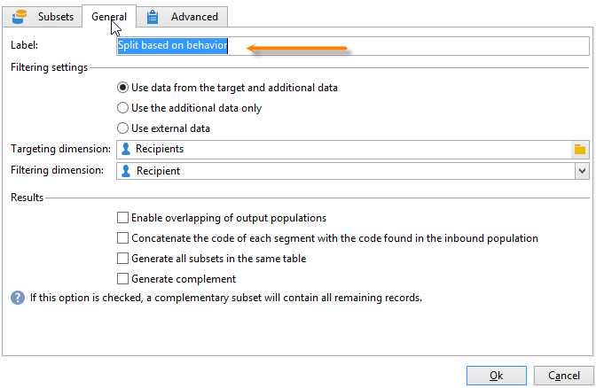

# Consultar informações da entrega {#querying-delivery-information}

## Número de cliques de uma entrega específica {#number-of-clicks-for-a-specific-delivery}

Neste exemplo, estamos procurando coletar o número de cliques de uma entrega específica. Esses cliques são registrados graças aos logs de acompanhamento de destinatários coletados por um determinado período. O destinatário é identificado por meio de seu endereço de e-mail. Esta consulta usa a tabela **[!UICONTROL Recipient tracking logs]**.

* Qual tabela precisa ser selecionada?

  A tabela de rastreamento de log do destinatário (**[!UICONTROL nms:trackingLogRcp]**).

* Campos a serem selecionados para colunas de saída?

  Primary key (with count) e Email.

* Quais critérios serão usados para filtrar as informações?

  Um período específico e um elemento do rótulo da entrega.

Para executar esse exemplo, aplique as seguintes etapas:

1. Abra o **[!UICONTROL Generic query editor]** e selecione o esquema **[!UICONTROL Recipient tracking logs]**.

   

1. Na janela **[!UICONTROL Data to extract]**, queremos criar uma agregação para coletar informações. Para fazer isso, adicione a chave primária (localizada acima do elemento principal de registros **[!UICONTROL Recipient tracking logs]**). A contagem de log de rastreamento é realizada neste campo **[!UICONTROL Primary key]**. A expressão editada será **[!UICONTROL x=count(primary key)]**. Ele vincula a soma de vários logs de rastreamento a um único endereço de e-mail.

   Para fazer isso:

   * Clique no ícone **[!UICONTROL Add]** à direita do campo **[!UICONTROL Output columns]**. Na janela **[!UICONTROL Formula type]**, selecione a opção **[!UICONTROL Edit the formula using an expression]** e clique em **[!UICONTROL Next]**. Na janela **[!UICONTROL Field to select]**, clique em **[!UICONTROL Advanced selection]**.

     

   * Na janela **[!UICONTROL Formula type]**, execute um processo na função agregada. Esse processo será uma contagem de chaves primária.

     Selecione **[!UICONTROL Process on an aggregate function]** na seção **[!UICONTROL Aggregate]** e clique em **[!UICONTROL Count]**.

     

     Clique em **[!UICONTROL Next]**.

   * Selecione o campo **[!UICONTROL Primary key (@id)]**. O output da coluna **[!UICONTROL count (primary key)]** está configurado.

     

1. Selecione o outro campo a ser exibido na coluna de saída. Na coluna **[!UICONTROL Available fields]**, abra o nó **[!UICONTROL Recipient]** e escolha **[!UICONTROL Email]**. Marque a caixa **[!UICONTROL Group]** com **[!UICONTROL Yes]** para agrupar os logs de rastreamento por endereço de email. Este grupo vincula cada log ao respectivo destinatário.

   

1. Configure a classificação de coluna para que os destinatários mais ativos (com os maior número de logs de rastreamento) sejam exibidos primeiro. Verifique **[!UICONTROL Yes]** na coluna **[!UICONTROL Descending sort]**.

   

1. É preciso então, filtrar os logs que interessam, ou seja, aqueles que estão abaixo de 2 semanas e abordam entregas relacionadas às vendas.

   Para fazer isso:

   * Configure o filtro de dados. Para fazer isso, selecione **[!UICONTROL Filter conditions]** e clique em **[!UICONTROL Next]**.

     

   * Recuperar logs de rastreamento em um determinado período de uma entrega específica. São necessárias três condições de filtro: duas condições de data para definir o período de pesquisa entre 2 semanas antes da data atual e o dia antes da data atual; e outra condição para restringir a pesquisa a uma entrega específica.

     Na janela **[!UICONTROL Target element]**, configure a data a partir da qual os logs de rastreamento serão considerados. Clique em **[!UICONTROL Add]**. Uma linha de condição é exibida. Edite a coluna **[!UICONTROL Expression]** ao clicar na função **[!UICONTROL Edit expression]**. Na janela **[!UICONTROL Field to select]**, selecione **[!UICONTROL Date (@logDate)]**.

     

     Selecione o operador **[!UICONTROL greater than]**. Na coluna **[!UICONTROL Value]**, clique em **[!UICONTROL Edit expression]**, e na janela **[!UICONTROL Formula type]**, selecione **[!UICONTROL Process on dates]**. Por fim, em **[!UICONTROL Current date minus n days]**, digite &quot;15&quot;.

     Clique em **[!UICONTROL Finish]**.

     

   * Para selecionar a data de término da pesquisa de log de rastreamento, crie uma segunda condição clicando em **[!UICONTROL Add]**. Na coluna **[!UICONTROL Expression]**, escolha novamente **[!UICONTROL Date (@logDate)]**.

     Selecione o operador **[!UICONTROL less than]**. Na coluna **[!UICONTROL Value]**, clique em **[!UICONTROL Edit expression]**. Para o processamento de datas, vá para a janela **[!UICONTROL Formula type]**, digite &quot;1&quot; em **[!UICONTROL Current date minus n days]**.

     Clique em **[!UICONTROL Finish]**.

     

     Agora, devemos configurar a terceira condição do filtro, ou seja, o rótulo de entrega que nossa query aborda.

   * Clique na função **[!UICONTROL Add]** para criar outra condição de filtro. Na coluna **[!UICONTROL Expression]**, clique em **[!UICONTROL Edit expression]**. Na janela **[!UICONTROL Field to select]**, escolha **[!UICONTROL Label]** no nó **[!UICONTROL Delivery]**.

     Clique em **[!UICONTROL Finish]**.

     

     Procure uma entrega contendo a palavra &quot;sales&quot;. Se você não lembrar o rótulo exato, é possível escolher o operador **[!UICONTROL contains]** e digitar &quot;vendas&quot; na coluna **[!UICONTROL Value]**.

     

1. Clique em **[!UICONTROL Next]** até chegar à janela **[!UICONTROL Data preview]**. Nenhuma formatação é necessária.
1. Na janela **[!UICONTROL Data preview]**, clique em **[!UICONTROL Start the preview of the data]** para ver o número de logs de rastreamento para cada destinatário de entrega.

   O resultado é exibido em ordem decrescente.

   

   O número mais alto de logs para um usuário é de 6 para esta entrega. 5 usuários diferentes abriram o e-mail de entrega ou clicaram em um dos links no e-mail.

## Destinatários que não abriram nenhuma entrega {#recipients-who-did-not-open-any-delivery}

Neste exemplo, devemos filtrar destinatários que não abriram um e-mail nos últimos 7 dias.

Para criar este exemplo, aplique as seguintes etapas:

1. Arraste e solte uma atividade **[!UICONTROL Query]** em um workflow e abra a atividade.
1. Clique em **[!UICONTROL Edit query]** e defina as dimensões do filtro e do direcionamento para **[!UICONTROL Recipients]**.

   

1. Selecione **[!UICONTROL Filtering conditions]** e clique em **[!UICONTROL Next]**.
1. Clique no botão **[!UICONTROL Add]** e selecione **[!UICONTROL Tracking logs]**.
1. Defina o **[!UICONTROL Operator]** da expressão **[!UICONTROL Tracking logs]** para **[!UICONTROL Do not exist such as]**.

   

1. Adicione outra expressão. Selecione **[!UICONTROL Type]** na categoria **[!UICONTROL URL]**.
1. Em seguida, defina seu **[!UICONTROL Operator]** como **[!UICONTROL equal to]** e o **[!UICONTROL Value]** como **[!UICONTROL Open]**.

   

1. Adicione outra expressão e selecione **[!UICONTROL Date]**. O **[!UICONTROL Operator]** deve ser definido como **[!UICONTROL on or after]**.

   

1. Para definir o valor last 7 days, clique em **[!UICONTROL Edit expression]** no campo **[!UICONTROL Value]**.
1. Na categoria **[!UICONTROL Function]**, selecione **[!UICONTROL Current date minus n days]** e adicione o número de dias que deseja segregar. Aqui, devemos selecionar os últimos 7 dias.

   

A transição de saída contém destinatários que não abriram um e-mail nos últimos 7 dias.

Se, caso contrário, quiser filtrar os destinatários que abriram pelo menos um e-mail a sua query deverá ser com mostrado a seguir. Observe que, nesse caso, o **[!UICONTROL Filtering dimension]** deve ser definido como **[!UICONTROL Tracking logs (Recipients)]**.

## Destinatários que abriram uma entrega {#recipients-who-have-opened-a-delivery}

O exemplo a seguir mostra como selecionar perfis que abriram uma entrega nas últimas 2 semanas:

1. Para direcionar perfis que tenham aberto uma entrega, é necessário usar os logs de rastreamento. são armazenados em uma tabela vinculada: comece selecionando essa tabela na lista suspensa do campo **[!UICONTROL Filtering dimension]**, como mostrado abaixo:

   

1. Com relação às condições do filtro, clique no ícone **[!UICONTROL Edit expression]** dos critérios mostrados na estrutura de subárvore dos logs de rastreamento. Selecione o campo **[!UICONTROL Date]**.

   

   Clique em **[!UICONTROL Finish]** para confirmar a seleção.

   Para recuperar somente os logs de rastreamento que tenham menos de duas semanas, selecione o operador **[!UICONTROL Greater than]**.

   

   Em seguida, clique no ícone **[!UICONTROL Edit expression]** na coluna **[!UICONTROL Value]** para definir a fórmula de cálculo a ser aplicada. Selecione a fórmula **[!UICONTROL Current date minus n days]** e insira 15 no campo correspondente.

   

   Clique em **[!UICONTROL Finish]** na janela da fórmula. Na janela do filtro, clique na guia **[!UICONTROL Preview]** para verificar os critérios de direcionamento.

   

## Filtragem do comportamento de destinatários após uma entrega {#filtering-recipients--behavior-folllowing-a-delivery}

Em um workflow, as caixas **[!UICONTROL Query]** e **[!UICONTROL Split]** permitem selecionar um comportamento após uma entrega. Essa seleção é realizada por meio do filtro **[!UICONTROL Delivery recipient]**.

* Objetivo do exemplo

  Em um workflow de entrega, há várias maneiras de dar seguimento a uma primeira comunicação por e-mail. Esse tipo de operação envolve o uso da caixa **[!UICONTROL Split]**.

* Contexto

  Uma entrega &quot;Oferta esportiva de verão&quot; é enviada. Quatro dias após a entrega, duas outras entregas são enviadas. Uma delas é &quot;oferta de artigos de esportes aquáticos&quot;, o outro é uma continuidade da primeira entrega &quot;oferta esportiva de verão&quot;.

  A entrega &quot;oferta de artigos de esportes aquáticos&quot; é enviada aos destinatários que clicaram no link &quot;esportes aquáticos&quot; na primeira entrega. Estes cliques mostram que o destinatário está interessado no tópico. Faz sentido orientá-los para ofertas semelhantes. No entanto, os destinatários que não clicaram na &quot;oferta de esportes de verão&quot; devem receber o mesmo conteúdo novamente.

As etapas a seguir mostram como configurar a caixa **[!UICONTROL Split]** ao integrar dois comportamentos diferentes:

1. Insira a caixa **[!UICONTROL Split]** no workflow. Esta caixa separa os destinatários da primeira entrega em duas entregas subsequentes. A separação ocorre com base nas condições de filtragem vinculadas ao comportamento do destinatário durante a primeira entrega.

   

1. Abra a caixa **[!UICONTROL Split]**. Na guia **[!UICONTROL General]**, digite um rótulo: **Split based on behavior** por exemplo.

   

1. Na guia **[!UICONTROL Subsets]**, defina a primeira ramificação. Por exemplo, insira o rótulo **Clicked** para esta ramificação.
1. Selecione a opção **[!UICONTROL Add a filtering condition on the incoming population]**. Clique em **[!UICONTROL Edit]**.
1. Na janela **[!UICONTROL Targeting and filtering dimension]**, clique duas vezes no filtro **[!UICONTROL Recipients of a delivery]**.

   

1. Na janela **[!UICONTROL Target element]**, selecione o comportamento que deseja aplicar a essa ramificação: **[!UICONTROL Recipients having clicked (email)]**.

   Selecione a opção **[!UICONTROL Delivery specified by the transition]** abaixo. Essa funcionalidade recupera automaticamente as pessoas selecionadas durante a primeira entrega.

   Esta é a entrega &quot;oferta de artigos de esportes aquáticos&quot;.

   

1. Defina a segunda ramificação. Esta ramificação incluirá o e-mail de acompanhamento com o mesmo conteúdo da primeira entrega. Acesse a guia **[!UICONTROL Subsets]** e clique em **[!UICONTROL Add]** para criá-la.

   

1. Outra sub-guia é exibida. Nomeie de &quot;**Não clicou**&quot;.
1. Clique em **[!UICONTROL Add a filtering condition for the incoming population]**. Em seguida, clique em **[!UICONTROL Edit...]**.

   

1. Clique em **[!UICONTROL Delivery recipients]** na janela **[!UICONTROL Targeting and filtering dimension]**.
1. Na janela **[!UICONTROL Target element]**, selecione a comportamento **[!UICONTROL Recipients who did not click (email)]**. Selecione a opção **[!UICONTROL Delivery specified by the transition]** como mostrado na última ramificação.

   A caixa **[!UICONTROL Split]** está totalmente configurada.

   

Abaixo está a lista dos vários componentes configurados por padrão:

* **[!UICONTROL All recipients]**
* **[!UICONTROL Recipients of successfully sent messages,]**
* **[!UICONTROL Recipients who opened or clicked (email),]**
* **[!UICONTROL Recipients who clicked (email),]**
* **[!UICONTROL Recipients of a failed message,]**
* **[!UICONTROL Recipients who didn't open or click (email),]**
* **[!UICONTROL Recipients who didn't click (email).]**

  
