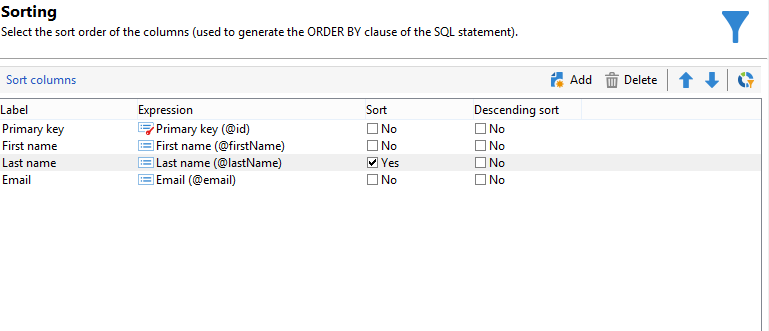
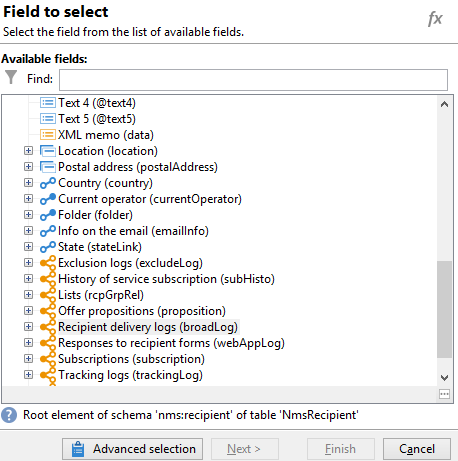
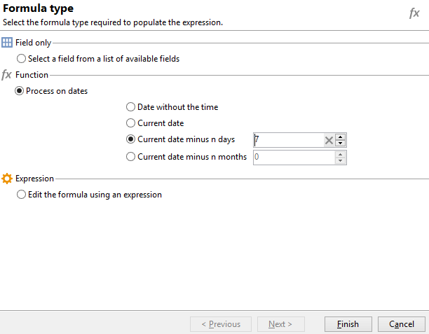

# Consultar usando uma relação muitos-para-muitos {#querying-using-a-many-to-many-relationship}


Neste exemplo, queremos recuperar recipients não foram contatados durante os últimos 7 dias. Esta query aborda todas as deliveries.

Este exemplo também mostra como configurar um filtro relacionado à escolha de um elemento de coleção (ou nó laranja). Os elementos de coleção estão disponíveis na janela **[!UICONTROL Field to select]**.

* Qual tabela precisa ser selecionada?

   A tabela de recipient (**nms:recipient**)

* Campos a serem selecionados para a coluna de saída

   Primary key, Last name, First name e Email.

* Com base em quais critérios as informações são filtradas?

   Com base nos registros de delivery de recipients, 7 dias antes de hoje.

Siga as etapas abaixo:

1. Abra o editor de query genérico e selecione a tabela Recipient **[!UICONTROL (nms:recipient)]**.
1. Na janela **[!UICONTROL Data to extract]**, selecione **[!UICONTROL Primary key]**, **[!UICONTROL First name]**, **[!UICONTROL Last name]** e **[!UICONTROL Email]**.

   

1. Na janela de classificação, classifique os nomes em ordem alfabética.

   

1. Na janela **[!UICONTROL Data filtering]**, selecione **[!UICONTROL Filtering conditions]**.
1. Na janela **[!UICONTROL Target element]**, a condição do filtro para extrair perfis sem log de rastreamento nos últimos 7 dias envolve duas etapas. O elemento precisa selecionar um link muitos-para-muitos.

   * Comece selecionando o elemento de coleção **[!UICONTROL Recipient delivery logs (broadlog)]** (nó laranja) da primeira coluna **[!UICONTROL Value]**.

      

      Escolha o operador **[!UICONTROL do not exist as]**. Não há necessidade de selecionar um segundo valor nesta linha.

   * O conteúdo da segunda condição do filtro depende da primeira. Aqui, o campo **[!UICONTROL Event date]** é oferecido diretamente na tabela **[!UICONTROL Recipient delivery logs]**, já que há um link para essa tabela.

      

      Selecione **[!UICONTROL Event date]** com o operador **[!UICONTROL greater than or equal to]**. Selecione o valor **[!UICONTROL DaysAgo (7)]**. Para fazer isso, clique em **[!UICONTROL Edit expression]** no campo **[!UICONTROL Value]**. Na janela **[!UICONTROL Formula type]**, selecione **[!UICONTROL Process on dates]** e **[!UICONTROL Current date minus n days]**, atribuindo &quot;7&quot; como um valor.

      

      A condição de filtro é configurada.

      

1. Na janela **[!UICONTROL Data formatting]**, alterne os últimos nomes para caixa alta. Clique na linha **[!UICONTROL Last name]** na coluna **[!UICONTROL Transformation]** e selecione **[!UICONTROL Switch to upper case]** no menu suspenso.

   

1. Use a função **[!UICONTROL Add a calculated field]** para inserir uma coluna na janela de visualização de dados.

   Neste exemplo, adicione um campo calculado com o nome e o sobrenome dos recipients em uma única coluna. Clique na função **[!UICONTROL Add a calculated field]**. Na janela **[!UICONTROL Export calculated field definition]**, digite um rótulo e um nome interno e escolha o tipo **[!UICONTROL JavaScript Expression]**. Em seguida, insira a seguinte expressão:

   ```
   var rep = source._firstName+" - "+source._lastName
   return rep
   ```

   

   Clique em **[!UICONTROL OK]**. A janela **[!UICONTROL Data formatting]** está configurada.

   Para obter mais informações sobre adição de campos calculados, consulte esta seção.

1. O resultado é mostrado na janela **[!UICONTROL Data preview]**. Os recipients que não tiverem sido contatados nos últimos 7 dias serão exibidos em ordem alfabética. Os nomes são exibidos em caixa alta e a coluna com nome e sobrenome é criada.

   
