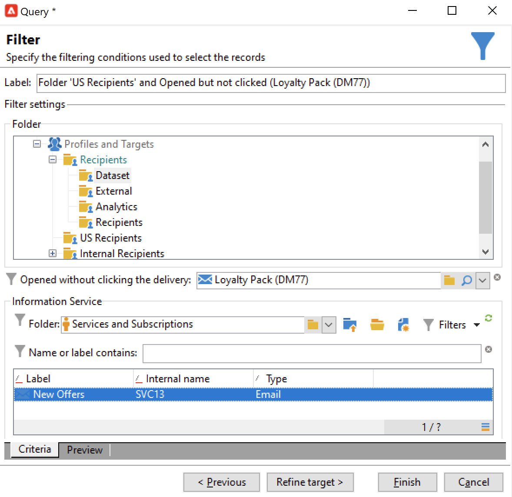
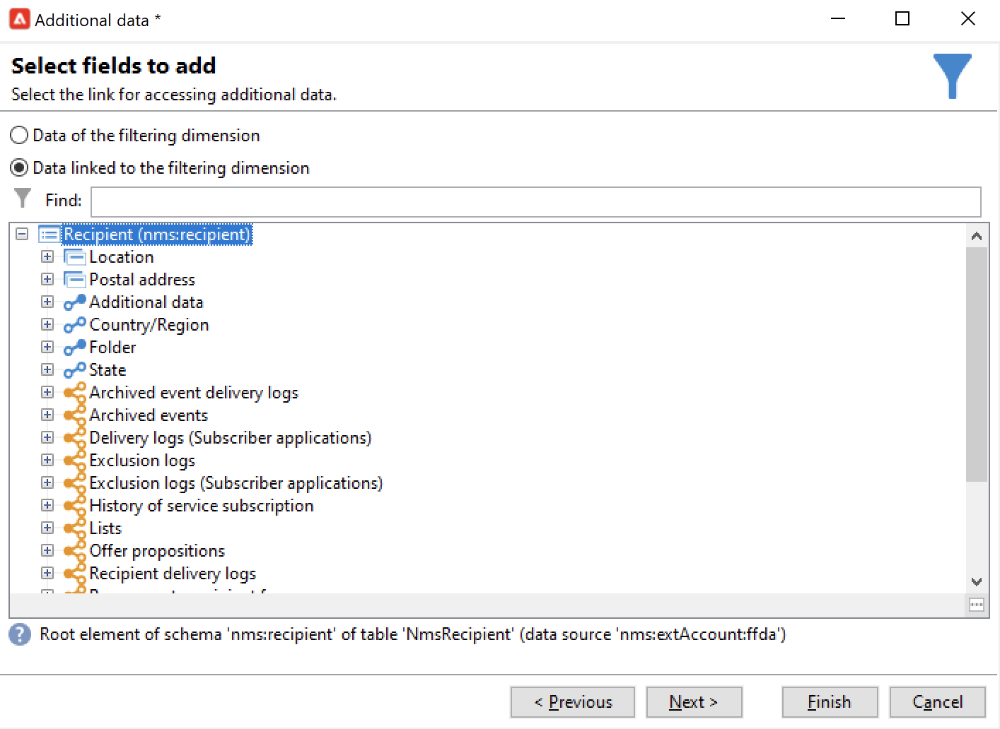
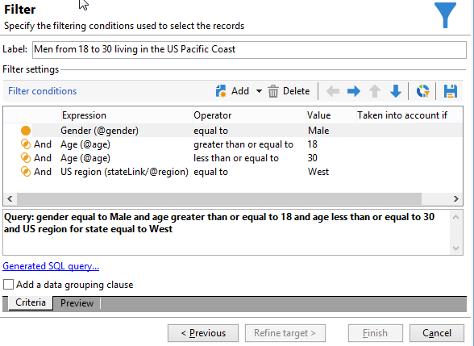

# Consulta{#query}

## Criar uma consulta {#creating-a-query}

Uma consulta permite selecionar um target de acordo com critérios. Você pode associar um código de segmento ao resultado do query e inserir dados adicionais nele.
Para obter mais informações sobre amostras de query, consulte [esta seção](querying-recipient-table.md).

{width="70%" align="center" zoomable="yes"}

Para mais informações sobre como usar e gerenciar dados adicionais, consulte [Adicionar dados](#adding-data).

O link **[!UICONTROL Edit query...]** permite definir o tipo de direcionamento, as restrições e os critérios de seleção do público da seguinte maneira:

1. Selecione a targeting dimension e a dimensão de filtro. Por padrão, o target é selecionado dos destinatários. A lista de filtros de restrição é igual àquelas usadas para o target de entrega.

   O targeting dimension coincide com o tipo de elemento que iremos trabalhar, por exemplo, o público alvo da operação.

   A dimensão do filtro permite coletar esses elementos, por exemplo, informações relacionadas à pessoa alvo (contratos, liquidações completas e finais etc.).

   Para obter mais informações, consulte [Direcionamento e dimensões de filtragem](targeting-workflows.md#targeting-and-filtering-dimensions).

   {width="70%" align="center" zoomable="yes"}

   Um query pode ser baseado em dados a partir da transição de entrada, se necessário, selecionando **[!UICONTROL Temporary schema]** ao escolher o targeting e a dimensão de filtro.

   {width="70%" align="center" zoomable="yes"}

1. Defina os públicos usando o assistente. Os campos a serem inseridos podem variar de acordo com o tipo de target. Você pode visualizar o público-alvo com seus critérios atuais usando a guia **[!UICONTROL Preview]**.

   {width="70%" align="center" zoomable="yes"}

1. Se você selecionou **[!UICONTROL Filtering conditions]** na etapa 1 ou usou a opção **[!UICONTROL Filters]** > **[!UICONTROL Advanced filter...]**, será necessário adicionar manualmente os critérios de filtragem posteriormente.

   Você também pode adicionar condições de agrupamento de dados marcando a caixa correspondente. Para fazer isso, a dimensão de filtro deve ser diferente do targeting dimension do query. Para obter mais informações sobre agrupamento, consulte esta [seção](query-grouping-management.md).

   Você também pode adicionar mais critérios usando o Construtor de Expressões e combinando com as opções lógicas AND, OR e EXCEPT.

   Salve seu filtro se quiser reutilizá-lo posteriormente.

## Adicionar dados {#adding-data}

As colunas adicionais permitem coletar informações adicionais sobre o público alvo, como, por exemplo, números de contrato, assinaturas de boletins informativos ou origem. Esses dados podem ser armazenados no banco de dados do Adobe Campaign ou em um banco de dados externo.

O link **[!UICONTROL Add data...]** permite selecionar os dados adicionais a serem coletados.

{width="70%" align="center" zoomable="yes"}

Comece selecionando o tipo de dado a ser adicionado:

{width="70%" align="center" zoomable="yes"}

* Selecione **[!UICONTROL Data linked to the filtering dimension]** para selecionar os dados no banco de dados do Adobe Campaign.
* Selecione **[!UICONTROL External data]** para adicionar dados de um banco de dados externo. Essa opção só estará disponível se você tiver adquirido a opção **Federated Data Access**. Para obter mais informações, consulte [Acessar um banco de dados externo (FDA)](accessing-an-external-database-fda.md).
* Selecione a opção **[!UICONTROL An offer proposition]** para adicionar um conjunto de colunas que permitem armazenar a melhor apresentação gerada pelo mecanismo de oferta. Essa opção só estará disponível se você tiver adquirido o módulo **Interaction** .

Se nenhum módulo opcional estiver instalado na plataforma, esse estágio não será exibido. Você será direcionado ao próximo estágio.

Para adicionar dados do banco de dados do Adobe Campaign:

1. Selecione o tipo de dado que deseja adicionar. Isso pode ser dados pertencentes à dimensão de filtro ou dados armazenados em tabelas vinculadas.

   {width="70%" align="center" zoomable="yes"}

1. Se os dados pertencerem à dimensão de filtro do query, basta selecioná-lo na lista de campos disponíveis para exibi-lo nas colunas de output.

   {width="70%" align="center" zoomable="yes"}

   Você pode adicionar:

   * Um campo calculado com base nos dados obtidos do público alvo ou em um agregado (número de compras pendentes no último mês, quantidade média de um recibo, etc.). Para obter um exemplo, acesse [Selecionar dados](targeting-workflows.md#selecting-data).
   * Um novo campo, criado por meio do botão **[!UICONTROL Add]** à direita da lista de colunas de output.

     Também é possível adicionar uma coleção de informações, por exemplo, uma lista de contratos, as últimas 5 entregas etc. As coleções coincidem com os campos que podem ter múltiplos valores para o mesmo perfil (relação 1-N). Para obter mais informações, consulte [Editar dados adicionais](targeting-workflows.md#editing-additional-data).

Para adicionar uma coleção de informações vinculadas a uma população direcionada:

1. Na primeira etapa do assistente, selecione a opção **[!UICONTROL Data linked to the filtering dimension]**:
1. Selecione a tabela que contém as informações que você deseja coletar e clique em **[!UICONTROL Next]**.

   {width="70%" align="center" zoomable="yes"}

1. Se necessário, especifique o número de elementos da coleção que você deseja manter ao selecionar um dos valores no campo **[!UICONTROL Data collected]**. Por padrão, todas as linhas da coleção são recuperadas e filtradas de acordo com as condições especificadas na etapa a seguir.

   * Se um único elemento da coleção coincide com as condições de filtragem desta coleção, selecione **[!UICONTROL Single row]** no campo **[!UICONTROL Data collected]**.

     >[!IMPORTANT]
     >
     >Esse modo otimiza o query SQL gerada graças a uma junção direta dos elementos de coleção.
     >
     >Se a condição inicial não for respeitada, o resultado pode ser falho (linhas ausentes ou sobrepostas).

   * Se você optar por recuperar várias linhas (**[!UICONTROL Limit the line count]**), será possível especificar o número de linhas a serem coletadas.
   * Se as colunas coletadas contiverem agregados, por exemplo, o número de falhas declaradas, a despesa média em um site, etc. você poderá usar o valor **[!UICONTROL Aggregates]**.

   {width="70%" align="center" zoomable="yes"}

1. Especifique a subseleção da coleção.

   {width="70%" align="center" zoomable="yes"}

1. Se você selecionou a opção **[!UICONTROL Limit the line count]**, defina a ordem na qual os dados coletados serão filtrados. Quando o número de linhas coletadas for maior que o número de linhas especificado a ser mantido, a ordem de filtragem permite que você especifique quais linhas manter.

## Exemplo: direcionamento em atributos de destinatários simples {#example--targeting-on-simple-recipient-attributes}

No exemplo a seguir, o query busca identificar homens que moram na França com idades entre 18 e 30. Este query será usado em um workflow que visa fazer uma oferta exclusiva, por exemplo.

>[!NOTE]
>
>Os exemplos de query são apresentados [nesta seção](querying-recipient-table.md).

1. Nomeie o query e selecione o link **[!UICONTROL Edit query...]**.
1. Selecione **[!UICONTROL Filtering conditions]** na lista de tipos de filtros disponíveis.
1. Insira os diferentes critérios para o target proposto. Os critérios são combinados usando a opção AND. Para ser incluído na seleção, os destinatários terão de cumprir as quatro condições seguintes:

   * Destinatários cujo título é &quot;Sr.&quot; (também é possível encontrar pelo campo **Sexo** e selecionar **Masculino** como valor).
   * Destinatários abaixo de 30 anos.
   * Destinatários acima de 18 anos.
   * Destinatários que vivem na França.

   {width="70%" align="center" zoomable="yes"}

   Você pode exibir o SQL correspondente com sua combinação de critérios:

   {width="70%" align="center" zoomable="yes"}

1. Você pode verificar se os seus critérios estão corretos visualizando os destinatários que correspondam ao seu query na guia relevante:

   {width="70%" align="center" zoomable="yes"}

1. Salve os filtros para usá-los posteriormente clicando em **[!UICONTROL Finish]** > **[!UICONTROL OK]**.
1. Continue editando seu workflow adicionando outras atividades a ele. Depois de iniciado e após o término da etapa de query anterior, o número de destinatários encontrados será exibido. Você pode exibir mais detalhes usando o menu pop-up do mouse (clique com o botão direito do mouse na transição > **[!UICONTROL Display the target...]**).

   {width="70%" align="center" zoomable="yes"}

## Parâmetros de saída {#output-parameters}

* tableName
* schema
* recCount

Esse conjunto de três valores identifica o público alvo do query. **[!UICONTROL tableName]** é o nome da tabela que registra os identificadores de target, **[!UICONTROL schema]** é o schema do público (normalmente nms:recipient) e **[!UICONTROL recCount]** é o número de elementos na tabela.

Este valor é o schema da tabela de trabalho. Esse parâmetro é válido para todas as transições com **[!UICONTROL tableName]** e **[!UICONTROL schema]**.

## Otimização das queries {#optimizing-queries}

A seção abaixo fornece as práticas recomendadas para otimizar as queries executadas no Adobe Campaign, a fim de limitar a carga de trabalho no banco de dados e melhorar a experiência do usuário.

### Associações e índices {#joins-and-indexes}

* Consultas eficientes dependem de índices.
* Use um índice para todas as associações.
* A definição de links no esquema determinará as condições da associação. A tabela vinculada deve ter um índice exclusivo na chave primária e a associação deve estar nesse campo.
* Realize associações definindo chaves em campos numéricos em vez de campos de string.
* Evite realizar associações externas. Sempre que possível, use o registro Zero ID para obter a funcionalidade de associação externa.
* Use o tipo de dados correto para associações.

  Certifique-se de que a `where` cláusula tenha o mesmo tipo do campo.

  Um erro comum é: `iBlacklist='3'` where `iBlacklist` é um campo numérico e `3` significa um valor de texto.

  Verifique se você sabe qual será o plano de execução da consulta. Evite varreduras completas de tabelas, especialmente para consultas em tempo real ou consultas quase em tempo real em execução a cada minuto.

### Funções {#functions}

* Cuidado com funções como `Lower(...)`. Quando a função Lower é usada, o Index não é usado.
* Verifique cuidadosamente as consultas usando a instrução &quot;like&quot; ou as instruções &quot;upper&quot; ou &quot;lower&quot;. Aplique &quot;Upper&quot; na entrada do usuário, não no campo do banco de dados.

### Dimensões de filtro {#filtering-dimensions}

Use a dimensão do filtro da consulta em vez de usar o operador &quot;exists such as&quot;.

{width="70%" align="center" zoomable="yes"}

Em consultas, as condições &quot;exists such as&quot; em filtros não são eficientes. Elas são o equivalente de uma subconsulta no SQL:

`select iRecipientId from nmsRecipient where iRecipientId IN (select iRecipientId from nmsBroadLog where (...))`

A prática recomendada é usar a dimensão do filtro da consulta:

{width="70%" align="center" zoomable="yes"}

O equivalente da dimensão do filtro no SQL é a associação interna:

`select iRecipientId from nmsRecipient INNER JOIN nmsBroadLog ON (...)`

Para saber mais sobre as dimensões do filtro, consulte [esta seção](build-a-workflow.md#targeting-and-filtering-dimensions).

### Arquitetura {#architecture}

* Crie uma plataforma de desenvolvimento com volumes, parâmetros e arquitetura semelhantes à plataforma de produção.
* Use os mesmos valores para os ambientes de desenvolvimento e produção. Na medida do possível, use as mesmas opções de:

   * sistema operacional,
   * versão,
   * data,
   * aplicação,
   * volumes.

  >[!NOTE]
  >
  >Um recurso que funciona em um ambiente de desenvolvimento pode não funcionar em um ambiente de produção onde os dados podem ser diferentes. Tente identificar as principais diferenças para antecipar os riscos e preparar soluções.

* Faça configurações que correspondam aos volumes de target. Grandes volumes exigem configurações específicas. Uma configuração que funcionou para 100.000 destinatários pode não funcionar para 10.000.000 destinatários.

  Considere como o sistema será dimensionado quando ele for acionado. Só porque algo funciona em pequena escala não significa que seja adequado com volumes maiores. Os testes devem ser feitos com volumes semelhantes aos da produção. Você também deve avaliar o efeito das alterações nos volumes (número de chamadas, tamanho do banco de dados) nas horas de pico, dias de pico e ao longo da vida útil do projeto.
