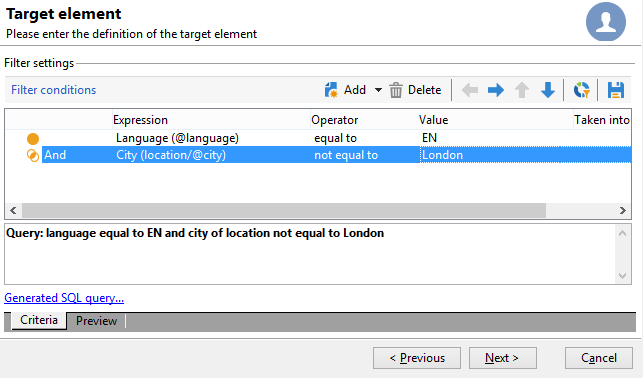

# Consultar a tabela de recipients {#querying-recipient-table}

Neste exemplo, queremos recuperar os nomes e e-mails dos recipients cujos domínios de e-mail são &quot;orange.co.uk&quot; e que não estão em Londres.

* Qual tabela devemos selecionar?

  A tabela de recipient (nms:recipient)

* Campos a serem selecionados como colunas de saída

  E-mail, nome, cidade e número da conta

* Quais são as condições do filtro dos recipients?

  domínio de e-mail e cidade

* É configurada uma classificação?

  Sim, com base em **[!UICONTROL Account number]** e **[!UICONTROL Last name]**.

Para criar este exemplo, aplique as seguintes etapas:

1. Clique em **[!UICONTROL Tools > Generic query editor...]** e escolha a tabela **Recipients** (**nms:recipient**). Em seguida, clique em **[!UICONTROL Next]**.
1. Escolha: **[!UICONTROL Last name]**, **[!UICONTROL First name]**, **[!UICONTROL Email]**, **[!UICONTROL City]** e **[!UICONTROL Account number]**. Esses campos são adicionados em **[!UICONTROL Output columns]**. Em seguida, clique em **[!UICONTROL Next]**.

   

1. Classifique as colunas para exibi-las na ordem correta. Aqui, devemos classificar números de conta em ordem decrescente e nomes em ordem alfabética. Em seguida, clique em **[!UICONTROL Next]**.

   

1. Na janela **[!UICONTROL Data filtering]**, refine sua pesquisa: escolha **[!UICONTROL Filtering conditions]** e clique em **[!UICONTROL Next]**.
1. A janela **[!UICONTROL Target element]** permite inserir as configurações de filtro.

   Defina a seguinte condição de filtro: recipients com um domínio de e-mail igual a &quot;orange.co.uk&quot;. Para fazer isso, escolha **Email domain (@email)** na coluna **[!UICONTROL Expression]**, escolha **equal to** na coluna **[!UICONTROL Operator]** e digite &quot;orange.co.uk&quot; na coluna **[!UICONTROL Value]**.

   

1. Se necessário, clique no botão **[!UICONTROL Distribution of values]** para visualizar uma distribuição baseada no domínio de email de prospectos. Uma porcentagem está disponível para cada domínio de e-mail no banco de dados. Domínios diferentes de &quot;orange.co.uk&quot; são exibidos até o filtro ser aplicado.

   Um resumo da consulta é exibido na parte inferior da janela: **Email domain equal to &#39;orange.co.uk&#39;**.

1. Clique em **[!UICONTROL Preview]** para obter visualização do resultado da consulta: somente os domínios de email &quot;orange.co.uk&quot; são exibidos.

   

1. Agora, vamos alterar a query para localizar os contatos que não moram em Londres.

   Selecione **[!UICONTROL City (location/@city)]** na coluna **[!UICONTROL Expression]**, **[!UICONTROL different from]** como operador e insira **[!UICONTROL London]** na coluna **[!UICONTROL Value]**.

   

1. Isso abrirá a janela **[!UICONTROL Data formatting]**. Verifique a ordem da coluna. Mova a coluna &quot;City&quot; logo ao lado da coluna &quot;Account number&quot;.

   Desmarque a coluna &quot;First name&quot; para removê-la da lista.

   

1. Na janela **[!UICONTROL Data preview]**, clique em **[!UICONTROL Start the preview of the data]**. Essa função calcula o resultado da query.

   A guia **[!UICONTROL Column results]** mostra o resultado da consulta em colunas.

   O resultado mostra todos os recipients com um domínio de e-mail &quot;orange.co.uk&quot; que não vivem em Londres. A coluna &quot;First name&quot; não é mostrada porque foi desmarcada durante o estágio anterior. Os números de conta são classificados em ordem decrescente.

   

   A guia **[!UICONTROL XML result]** mostra o resultado no formato XML.

   

   A guia **[!UICONTROL Generated QSL queries]** mostra o resultado da consulta no formato SQL.

   
