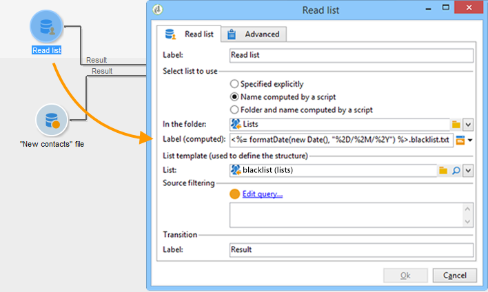

# Lista de leitura{#read-list}

Os dados processados em um fluxo de trabalho podem vir de listas em que os dados foram preparados ou estruturados antecipadamente (após uma segmentação ou carregamento de arquivo anterior).

A atividade **[!UICONTROL Read list]** permite copiar os dados de uma lista na tabela de trabalho do workflow, como dados de uma consulta. Ele é então acessível através do workflow.

A lista a ser processada pode ser especificada explicitamente, calculada por um script ou localizada dinamicamente de acordo com as opções selecionadas e parâmetros definidos em uma atividade **[!UICONTROL Read list]**.

Se a lista não for especificada explicitamente, você deve fornecer uma lista para ser usada como template para descobrir sua estrutura.

Após configurar a seleção da lista, é possível adicionar um filtro utilizando a opção **[!UICONTROL Edit query]** para manter uma parte da população para o próximo workflow.

>[!CAUTION]
>
>Para poder criar um filtro em uma atividade de lista de leitura, a lista relevante deve ser um tipo de &quot;arquivo&quot;.

As listas podem ser criadas diretamente no Adobe Campaign através do link **[!UICONTROL Profiles and Targets > Lists]** da página inicial. Também é possível criá-los em um workflow usando a atividade **[!UICONTROL List update]**.

**Exemplo: exclusão de uma lista de endereços enviados**

O exemplo a seguir permite usar uma lista de endereços de email para excluir do target de entrega de email.

Os perfis contidos na pasta **Novos Contatos** devem ser target de uma ação de entrega. Os endereços de email a serem excluídos do target são armazenados em uma lista externa. Em nosso exemplo, somente as informações sobre endereços de email são necessárias para exclusão.

1. O query de seleção da pasta **Novos Contatos** permite carregar os endereços de email dos perfis selecionados para habilitar o alinhamento com as informações na lista.

   

1. Aqui, a lista é armazenada na pasta **Listas** e seu rótulo é calculado.

   

1. Para excluir os endereços de email da lista externa do target principal, você deve configurar a atividade de exclusão e especificar que a pasta **New Contacts** contém os dados a serem mantidos. Os dados conjuntos entre esse conjunto e qualquer outro conjunto de entrada da atividade de exclusão serão excluídos do target.

   

   As regras de exclusão são configuradas na seção central da ferramenta de edição. Clique em **[!UICONTROL Add]** para definir o tipo de exclusão a ser aplicada.

   Você pode definir várias exclusões dependendo do número de transições de entrada da atividade.

1. No campo **[!UICONTROL Exclusion set]**, selecione a atividade **[!UICONTROL Read list]**: os dados desta atividade devem ser excluídos do conjunto principal.

   No nosso exemplo, temos uma exclusão em junções: os dados contidos na lista serão reconciliados com os dados do conjunto principal através do campo com o endereço de email. Para configurar a associação, selecione **[!UICONTROL Joins]** no campo **[!UICONTROL Change dimension]**.

   

1. Em seguida, selecione o campo correspondente ao endereço de email nos dois conjuntos (Origem e Destino). As colunas serão vinculadas e os destinatários cujo endereço de email estiver na lista de endereços importados serão excluídos do target.
