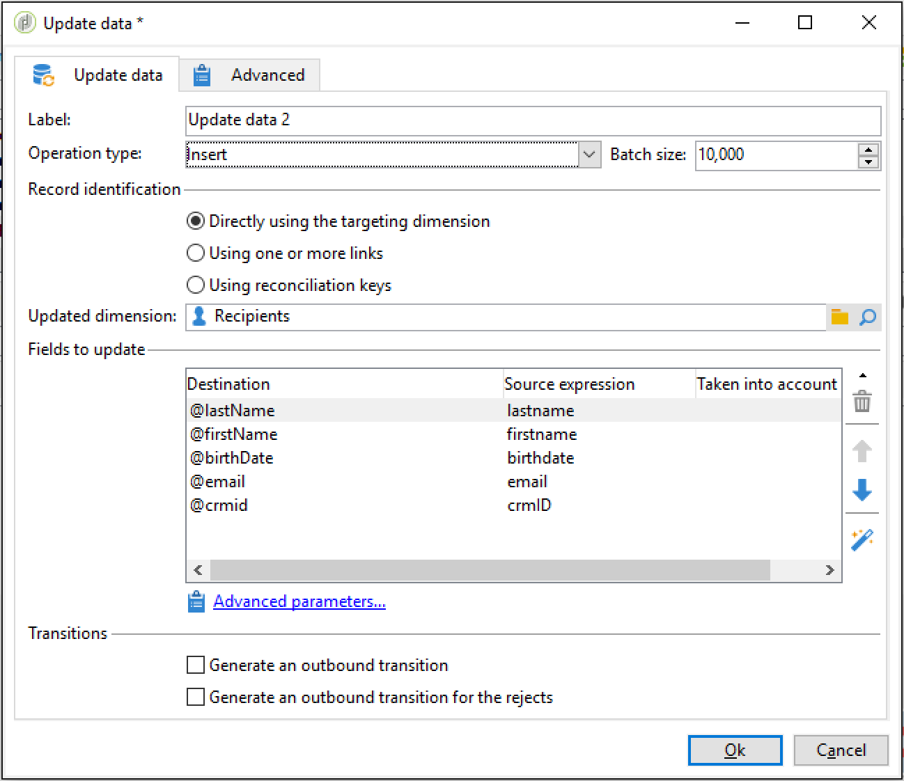

# Configurar um fluxo de trabalho de importação recorrente {#setting-up-a-recurring-import}


Usar um modelo de fluxo de trabalho é uma prática recomendada se você precisar importar arquivos regularmente com a mesma estrutura.

Esse exemplo mostra como predefinir um workflow que pode ser reutilizado para importar perfis provenientes de um CRM no banco de dados do Adobe Campaign. Para obter mais informações sobre todas as configurações possíveis para cada atividade, consulte esta [seção](activities.md).

1. Crie um novo modelo de workflow a partir de **[!UICONTROL Resources > Templates > Workflow templates]**.
1. Adicione as seguintes atividades:

   * **[!UICONTROL Data loading (file)]**: defina a estrutura esperada do arquivo que contém os dados que serão importados.
   * **[!UICONTROL Enrichment]**: reconcilie os dados importados com os dados do banco de dados.
   * **[!UICONTROL Split]**: crie filtros para processar registros de forma diferente, sejam eles reconciliados ou não.
   * **[!UICONTROL Deduplication]**: elimine a duplicação dos dados do arquivo de entrada antes de ele ser inserido no banco de dados.
   * **[!UICONTROL Update data]**: atualize o banco de dados com os perfis importados.

   

1. Configure a atividade **[!UICONTROL Data Loading (file)]**:

   * Definir a estrutura esperada fazendo upload de um arquivo de amostra. O arquivo de amostra deve conter apenas algumas linhas, mas todas as colunas necessárias para a importação. Verifique e edite o formato de arquivo para verificar se o tipo de cada coluna está definido corretamente: texto, data, inteiro, etc. Por exemplo:

     ```
     lastname;firstname;birthdate;email;crmID
     Smith;Hayden;23/05/1989;hayden.smith@mailtest.com;123456
     ```

   * Na seção **[!UICONTROL Name of the file to load]**, selecione **[!UICONTROL Upload a file from the local machine]** e deixe o campo em branco. Toda vez que um novo workflow for criado a partir desse modelo, você pode especificar aqui o arquivo desejado, desde que ele corresponda à estrutura definida.

     Você pode usar qualquer uma das opções, mas precisa modificar o template adequadamente. Por exemplo, se você selecionar **[!UICONTROL Specified in the transition]**, será possível adicionar uma atividade **[!UICONTROL File Transfer]** antes de recuperar o arquivo para importar de um servidor FTP/SFTP. Com a conexão S3 ou SFTP, também será possível importar dados de segmento para o Adobe Campaign com a Adobe Real-time Customer Data Platform. Para obter mais informações, consulte a [documentação do Adobe Experience Platform](https://experienceleague.adobe.com/docs/experience-platform/destinations/catalog/email-marketing/adobe-campaign.html?lang=pt-BR){target="_blank"}.

     

1. Configure a atividade **[!UICONTROL Enrichment]**. A finalidade dessa atividade nesse contexto é identificar os dados de entrada.

   * Na guia **[!UICONTROL Enrichment]**, selecione **[!UICONTROL Add data]** e defina um vínculo entre os dados importados e o targeting dimension do destinatário. Neste exemplo, o campo personalizado **ID do CRM** é usado para criar a condição de associação. Use o campo ou uma combinação de campos que você precisa, desde que isso permita identificar registros únicos.
   * Na guia **[!UICONTROL Reconciliation]**, deixe a opção **[!UICONTROL Identify the document from the working data]** desmarcada.

   

1. Configure a atividade **[!UICONTROL Split]** para recuperar os destinatários reconciliados em uma transição e destinatários que não puderam ser reconciliados, mas que tenham dados suficientes em uma segunda transição.

   A transição com destinatários reconciliados pode ser usada para atualizar o banco de dados. A transição com destinatários desconhecidos pode ser usada para criar novas entradas de destinatários no banco de dados se um conjunto mínimo de informações estiver disponível no arquivo.

   Os destinatários que não podem ser reconciliados e não têm dados suficientes estão selecionados em uma transição de saída de complemento e podem ser exportados em um arquivo separado ou simplesmente ignorado.

   * Na guia **[!UICONTROL General]** da atividade, selecione **[!UICONTROL Use the additional data only]** como configuração de filtragem e verifique se o **[!UICONTROL Targeting dimension]** é configurado automaticamente como **[!UICONTROL Enrichment]**.

     Marque a opção **[!UICONTROL Generate complement]** para ver se algum registro não pode ser inserido no banco de dados. Se for necessário, você pode aplicar processamento adicional aos dados complementares: exportação de arquivos, atualização de lista etc.

   * No primeiro subconjunto da guia **[!UICONTROL Subsets]**, adicione uma condição de filtragem no público de entrada para selecionar apenas registros para os quais a chave primária do destinatário não for igual a 0. Dessa forma, os dados do arquivo reconciliado com destinatários do banco de dados são selecionados nesse subconjunto.

     

   * Adicione um segundo subconjunto que seleciona registros não reconciliados que tenham dados suficientes para serem inseridos no banco de dados. Por exemplo: endereço de email, nome e sobrenome.

     Os subconjuntos são processados na ordem de criação, isso significa que quando esse segundo subconjunto é processado, todos os registros que já existem no banco de dados já estão selecionados no primeiro subconjunto.

     

   * Todos os registros que não estão selecionados nos dois primeiros subconjuntos são selecionados no **[!UICONTROL Complement]**.

1. Configure a atividade **[!UICONTROL Update data]** localizada após a primeira transição de saída da atividade **[!UICONTROL Split]** configurada anteriormente.

   * Selecione **[!UICONTROL Update]** como **[!UICONTROL Operation type]** desde que a transição de entrada contenha apenas os destinatários já presentes no banco de dados.
   * Na seção **[!UICONTROL Record identification]**, selecione **[!UICONTROL Using reconciliation keys]** e defina uma chave entre o targeting dimension e o link criado no **[!UICONTROL Enrichment]**. Neste exemplo, o campo personalizado **ID do CRM** é usado.
   * Na guia **[!UICONTROL Fields to update]**, indique os campos da dimensão de destinatários que serão atualizados com o valor da coluna correspondente no arquivo. Se os nomes das colunas de arquivo forem idênticos ou quase idênticos aos dos campos de dimensão dos destinatários, você poderá usar o botão de varinha mágica para combinar os diferentes campos automaticamente.

     

1. Configure a atividade **[!UICONTROL Deduplication]** localizada após a transição que contém os destinatários não reconciliados:

   * Selecione **[!UICONTROL Edit configuration]** e defina o targeting dimension para o schema temporário gerado pela atividade **[!UICONTROL Enrichment]** do workflow.

     

   * Nesse exemplo, o campo de email é usado para localizar perfis únicos. Você pode usar qualquer campo que você tem certeza que está preenchido e é parte de uma combinação única.
   * Na tela **[!UICONTROL Deduplication method]**, selecione **[!UICONTROL Advanced parameters]** e marque a opção **[!UICONTROL Disable automatic filtering of 0 ID records]** para garantir que os registros com uma chave primária igual a 0 (que deve ser todos os registros desta transição) não serão excluídos.

   

1. Configure a atividade **[!UICONTROL Update data]**, localizada após a atividade **[!UICONTROL Deduplication]**, configurada anteriormente.

   * Selecione **[!UICONTROL Insert]** como **[!UICONTROL Operation type]** desde que a transição de entrada contenha apenas destinatários não presentes no banco de dados.
   * Na seção **[!UICONTROL Record identification]**, selecione **[!UICONTROL Directly using the targeting dimension]** e escolha a dimensão **[!UICONTROL Recipients]**.
   * Na guia **[!UICONTROL Fields to update]**, indique os campos da dimensão de destinatários que serão atualizados com o valor da coluna correspondente no arquivo. Se os nomes das colunas de arquivo forem idênticos ou quase idênticos aos dos campos de dimensão dos destinatários, você poderá usar o botão de varinha mágica para combinar os diferentes campos automaticamente.

     

1. Após a terceira transição da atividade **[!UICONTROL Split]**, adicione uma atividade **[!UICONTROL Data extraction (file)]** e uma atividade **[!UICONTROL File transfer]** se desejar acompanhar os dados não inseridos no banco de dados. Configure essas atividades para exportar a coluna necessária e transferir o arquivo em um servidor FTP ou SFTP, onde você pode recuperá-la.
1. Adicione uma atividade **[!UICONTROL End]** e salve o template do workflow.

Agora o template pode ser usado e está disponível para cada novo workflow. Basta especificar o arquivo que contém os dados que serão importados na atividade **[!UICONTROL Data loading (file)]**.


