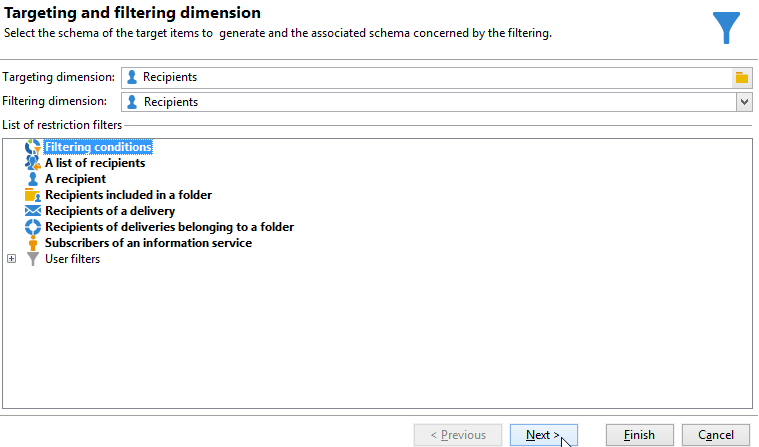
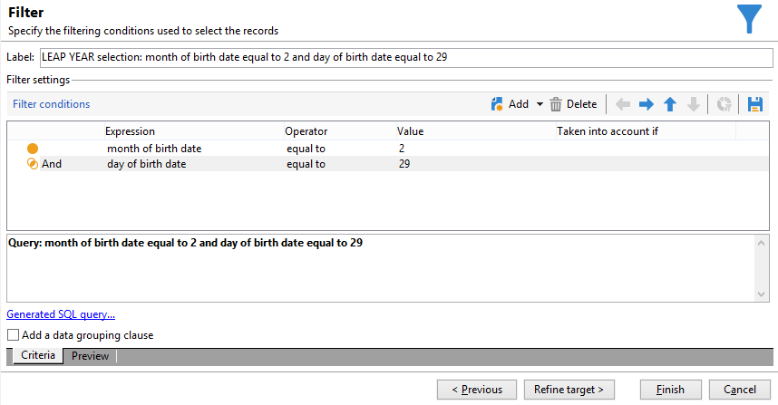

# Enviar email de aniversário{#sending-a-birthday-email}

Este caso de uso apresenta como planejar o envio de um e-mail recorrente para uma lista de recipients no dia de seus aniversários.

Para configurar esse caso de uso, criamos o seguinte workflow para construção do target:


Esse workflow (execução diária) seleciona todos os recipients que fazem aniversário na data atual.

Para fazer isso, crie uma campanha e adicione uma [workflow da campanha](campaign-workflows.md).

Siga as etapas detalhadas abaixo.

## Identificar destinatários cujo aniversário é {#identifying-recipients-whose-birthday-it-is}

Após configurar a atividade **[!UICONTROL Scheduler]** para que o workflow inicie todos os dias, identifique todos os recipients cuja data de nascimento for igual à data atual.

Para fazer isso, siga as etapas abaixo:

1. Arraste e solte uma atividade **[!UICONTROL Query]** no workflow e clique duas vezes nela.
1. Clique no link **Editar query** e selecione **[!UICONTROL Filtering conditions]**.

   

1. Clique na primeira célula da coluna **[!UICONTROL Expression]** e clique em **[!UICONTROL Edit expression]** para abrir o editor de expressão.

   

1. Clique em **[!UICONTROL Advanced selection]** para selecionar o modo do filtro.

   

1. Selecione **[!UICONTROL Edit the formula using an expression]** e clique em **[!UICONTROL Next]** para exibir o editor de expressão.
1. Na lista de funções, clique duas vezes em **[!UICONTROL Day]**, que é acessível no nó **[!UICONTROL Date]**. Essa função retorna o número que representa o dia correspondente à data passada como parâmetro.

   

1. Na lista de campos disponíveis, clique duas vezes em **[!UICONTROL Birth date]**. A seção superior do editor exibe a seguinte fórmula:

   ```
   Day(@birthDate)
   ```

   Clique em **[!UICONTROL Finish]** para confirmar.

1. No editor de consultas, na primeira célula da coluna **[!UICONTROL Operator]**, selecione **[!UICONTROL equal to]**.

   

1. Em seguida, clique na primeira célula da segunda coluna (**[!UICONTROL Value]**) e clique em **[!UICONTROL Edit expression]** para abrir o editor de expressão.
1. Na lista de funções, clique duas vezes em **[!UICONTROL Day]**, que é acessível no nó **[!UICONTROL Date]**.
1. Clique duas vezes na função **[!UICONTROL GetDate]** para recuperar a data atual.

   

   A seção superior do editor exibe a seguinte fórmula:

   ```
   Day(GetDate())
   ```

   Clique em **[!UICONTROL Finish]** para confirmar.

1. Repita este procedimento para recuperar o mês de nascimento correspondendo ao mês atual. Para fazer isso, clique no botão **[!UICONTROL Add]** e repita as etapas de 3 a 10, substituindo **[!UICONTROL Day]** por **[!UICONTROL Month]**.

   A query completa é a seguinte:

   

Vincule o resultado da atividade **[!UICONTROL Query]** a uma atividade **[!UICONTROL Email delivery]** para enviar um email para a lista de todos os recipients aniversariantes.

## Incluir recipients nascidos em 29 de fevereiro (opcional) {#including-recipients-born-on-february-29th--optional-}

Se desejar incluir todos os recipients que nasceram em 29 de fevereiro, este caso de uso apresentará como planejar o envio de um e-mail recorrente para uma lista de recipients em seus aniversários, seja um ano bissexto ou não.

As principais etapas de implementação para este caso de uso são:

* Seleção de recipients
* Seleção se é um ano bissexto ou não
* Seleção de todos os recipients nascidos em 29 de fevereiro

Para configurar esse caso de uso, criamos o seguinte workflow para construção do target:


Se o ano atual **não for um ano bissexto** e o workflow for executado em 1º de março, precisamos selecionar todos os recipients que teriam seu aniversário no dia anterior (29 de fevereiro) e adicioná-los à lista de recipients. Em qualquer outro caso, nenhuma ação adicional é necessária.

### Etapa 1: Selecionar os recipients {#step-1--selecting-the-recipients}

Após configurar a atividade **[!UICONTROL Scheduler]** para que o workflow inicie todos os dias, identifique todos os recipients cujos aniversários são no dia atual.

>[!NOTE]
>
>Se o ano atual for um ano bissexto, todos os recipients nascidos no 29 de fevereiro serão incluídos automaticamente.


Selecionar destinatários cujo aniversário corresponde à data atual é apresentado na seção [Identifying recipients whose birthday it is](#identifying-recipients-whose-birthday-it-is).

### Etapa 2: Selecionar se é um ano bissexto ou não {#step-2--select-whether-or-not-it-is-a-leap-year}

A atividade **[!UICONTROL Test]** permite verificar se é um ano bissexto e se a data atual é 1º de março.

Se o teste for verificado (o ano não é um ano bissexto, não há 29 de fevereiro e a data atual é de fato 1º de março), a transição **[!UICONTROL True]** é habilitada e os recipients nascidos em 29 de fevereiro serão adicionados ao delivery de 1º de março. Caso contrário, a transição **[!UICONTROL False]** será ativada e somente os recipients nascidos na data atual receberão o delivery.

Copie e cole o código abaixo na seção **[!UICONTROL Initialization script]** da guia **[!UICONTROL Advanced]**.

```
function isLeapYear(iYear)
{
    if(iYear/4 == Math.floor(iYear/4))
    {
        if(iYear/100 != Math.floor(iYear/100))
        {
            // Divisible by 4 only -> Leap Year
            return 1;
        }
        else
        {
            if(iYear/400 == Math.floor(iYear/400))
            {
                // Divisible by 4, 100 and 400 -> Leap year
                return 1;
            }
        }
    }
    // all others: no leap year
    return 0;
}

// Return today's date and time
var currentTime = new Date()
// returns the month (from 0 to 11)
var month = currentTime.getMonth() + 1
// returns the day of the month (from 1 to 31)
var day = currentTime.getDate()
// returns the year (four digits)
var year = currentTime.getFullYear()

// is current year a leap year?
vars.currentIsALeapYear = isLeapYear(year);

// is current date the first of march?
if(month == 3 && day == 1) {
  // today is 1st of march
vars.firstOfMarch = 1;
}
```


Adicione a seguinte condição na seção **[!UICONTROL Conditional forks]**:

```
vars.currentIsALeapYear == 0 && vars.firstOfMarch == 1
```


### Etapa 3: Selecionar todos os recipients nascidos em 29 de fevereiro {#step-3--select-any-recipients-born-on-february-29th}

Crie uma atividade **[!UICONTROL Fork]** e vincule uma das transições de saída a uma atividade **[!UICONTROL Query]**.

Nesta query, selecione todos os recipients cujas datas de nascimento são 29 de fevereiro.



Combine os resultados com uma atividade **[!UICONTROL Union]**.

Vincule os resultados das duas ramificações de atividade **[!UICONTROL Test]** a uma atividade **[!UICONTROL Email delivery]** para enviar um email para a lista de todos os seus recipients aniversariantes, até mesmo àqueles que nasceram em 29 de fevereiro durante um ano não bissexto.

## Criar uma entrega recorrente {#creating-a-recurring-delivery-in-a-targeting-workflow}

Adicione uma atividade de **Entrega recorrente** com base no modelo de email de aniversário que você deseja enviar.

>[!CAUTION]
>
>Para que os fluxos de trabalho sejam executados, os fluxos de trabalho técnicos relacionados ao pacote do Campaign devem ser iniciados. Para obter mais informações, consulte a seção [Lista de fluxos de trabalho técnicos](technical-workflows.md).
>
>Se as etapas de aprovação estiverem habilitadas para a campanha, as remessas serão enviadas apenas quando essas etapas tiverem sido confirmadas. Para obter mais informações, consulte a seção .


