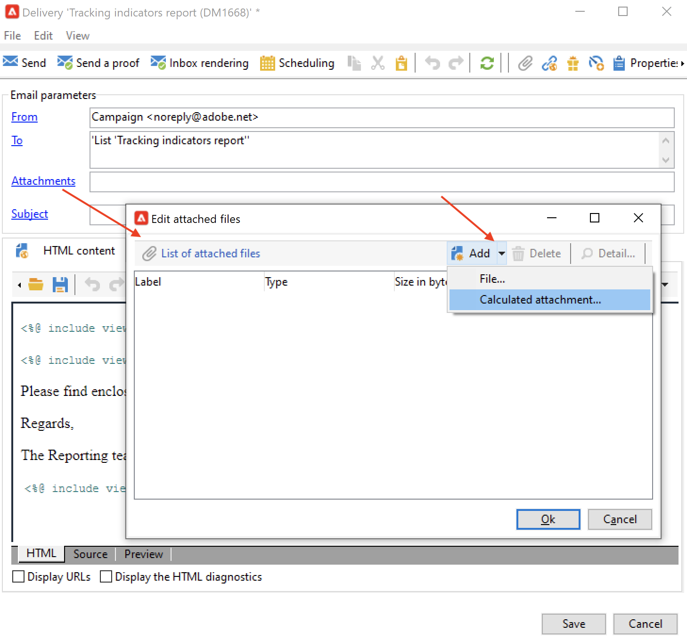

# Enviar um relatório a uma lista{#send-a-report-to-a-list}

Esse caso de uso detalha como gerar um relatório mensal imediato **[!UICONTROL Tracking indicators]** em formato PDF e como enviá-lo para uma lista de recipients.


As principais etapas de implementação para este caso de uso são:

* Crie uma lista de recipients para este relatório. [Saiba mais](#step-1--create-the-recipient-list).
* Crie um template do delivery que cria um novo delivery toda vez que o workflow for executado. [Saiba mais](#step-2--create-the-delivery-template).
* Crie um workflow que gera o relatório no formato PDF e o envia para a lista de recipients. [Saiba mais](#step-3--create-the-workflow)).

## Etapa 1: Criar a lista de recipients {#step-1--create-the-recipient-list}

Para criar a lista de recipients alvos, siga as etapas abaixo:

1. Navegue até o **[!UICONTROL Profiles and targets]** clique no botão **[!UICONTROL Lists]** link .
1. Clique no botão **[!UICONTROL Create]**.
1. Selecione **[!UICONTROL New list]** e crie uma nova lista de recipients para a qual o relatório será enviado.

Para obter mais informações sobre criação de listas, consulte [esta seção](../../v8/audiences/create-audiences.md).

## Etapa 2: Criar o template do delivery {#step-2--create-the-delivery-template}

Para criar o template do delivery, siga as etapas abaixo:

1. Navegue até o **[!UICONTROL Resources > Templates > Delivery templates]** nó do explorador do Adobe Campaign e duplique o **[!UICONTROL Email delivery]** modelo integrado.

   Para obter mais informações sobre criação de template de delivery, consulte [esta seção](../../v8/send/create-templates.md).

1. Insira os parâmetros do template: rótulo, target (a lista de recipients criados anteriormente), assunto e conteúdo.

   Cada vez que o workflow é executado, a variável **[!UICONTROL Tracking indicators]** é atualizado como explicado em [Etapa 3: Criar o workflow](#step-3--creating-the-workflow)).

1. Para incluir a versão mais recente do relatório no delivery é necessário adicionar um **[!UICONTROL Calculated attachment]**:

   * Clique no botão **[!UICONTROL Attachments]** e clique na seta ao lado do **[!UICONTROL Add]** botão. Selecione **[!UICONTROL Calculated attachment...]**.

      

   * No **[!UICONTROL Type]** selecione a opção mais recente na lista suspensa: **[!UICONTROL File name is computed during delivery of each message (it may then depend on the recipient profile)]**.

      

      O valor inserido no campo **[!UICONTROL Label]** não aparecerá no delivery final.

   * Na zona de texto, insira o caminho de acesso e o nome do arquivo.

      

      >[!CAUTION]
      >
      >O caminho e o nome devem ser idênticos aos inseridos no **[!UICONTROL JavaScript code]** atividade do tipo do workflow, conforme explicado em [Etapa 3: Criar o workflow](#step-3--creating-the-workflow).

   * Selecione a guia **[!UICONTROL Advanced]** e marque **[!UICONTROL Script the name of the file name displayed in the mails sent]**. Na zona de texto, digite o nome do anexo no delivery final.

      

## Etapa 3: Criar o workflow {#step-3--creating-the-workflow}

Crie o seguinte workflow para este caso de uso.


Ele usa três atividades:

* A **[!UICONTROL Scheduler]** atividade que executa o workflow uma vez por mês,
* A **[!UICONTROL JavaScript code]** atividade que gera o relatório no formato PDF,
* A **[!UICONTROL Delivery]** atividade que faz referência ao template de delivery criado anteriormente.

Para criar esse workflow, siga as etapas abaixo:

1. Navegue até o **[!UICONTROL Administration > Production > Technical workflows]** nó do Campaign explode e crie uma nova pasta para armazenar seus workflows.
1. Criar um novo fluxo de trabalho.

   

1. Comece adicionando uma atividade do tipo **[!UICONTROL Scheduler]** e a configure para que o workflow seja executado na primeira segunda-feira do mês.

   

   Para obter mais informações sobre a configuração do scheduler, consulte [Scheduler](scheduler.md).

1. Em seguida, adicione uma atividade tipo **[!UICONTROL JavaScript code]**.

   

   Insira o seguinte código na zona de edição:

   ```sql
   var reportName = "indicators";
   var path = "/tmp/indicators.pdf";
   var exportFormat = "PDF";
   var reportURL = "<PUT THE URL OF THE REPORT HERE>";
   var _ctx = <ctx _context="global" _reportContext="deliveryFeedback" />
   var isAdhoc = 0;
   
   xtk.report.export(reportName, _ctx, exportFormat, path, isAdhoc);
   ```


   com as seguintes variáveis:

   * **var reportName**: insira o nome interno do relatório em aspas duplas. Nesse caso, o nome interno do relatório **Tracking indicator** é &quot;deliveryFeedback&quot;.
   * **caminho var**: insira o caminho de salvamento do arquivo (&quot;tmp&quot;), o nome que deseja dar ao arquivo (&quot;deliveryFeedback&quot;) e a extensão de arquivo (&quot;.pdf&quot;). Nesse caso, usamos o nome interno como o nome do arquivo. Os valores precisam estar entre aspas duplas e separados pelo caractere &quot;+&quot;.

      >[!CAUTION]
      >
      >O arquivo deve ser salvo no servidor. Você deve inserir o mesmo caminho e o mesmo nome do **[!UICONTROL General]** guia da janela de edição do anexo calculado, conforme detalhado [here](#step-2--create-the-delivery-template)).

   * **var exportFormat**: insira o formato de exportação do arquivo (&quot;PDF&quot;).
   * **var _ctx** (contexto): neste caso, estamos usando o relatório **[!UICONTROL Tracking indicators]** em seu contexto global.

1. Termine adicionando um **[!UICONTROL Delivery]** com as seguintes opções:

   

   * **[!UICONTROL Delivery]**: selecione **[!UICONTROL New, created from a template]** e selecione o template de delivery criado anteriormente.
   * Para os campos **[!UICONTROL Recipients]** e **[!UICONTROL Content]**, selecione **[!UICONTROL Specified in the delivery]**.
   * **[!UICONTROL Action to perform]** : selecione **[!UICONTROL Prepare and start]**.
   * Desmarque a opção **[!UICONTROL Generate an outbound transition]** e **[!UICONTROL Process errors]** opções.

1. Salve as alterações e inicie o workflow. A mensagem é enviada à lista de recipients todas as primeiras segundas do mês, com o relatório anexado.