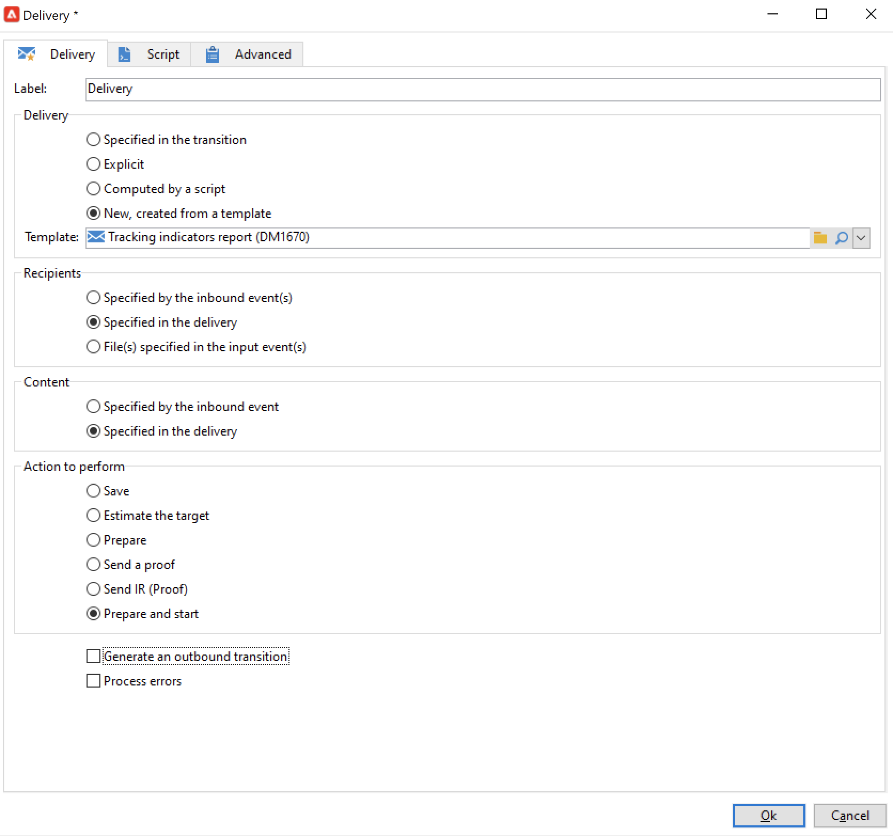

# Enviar um relatório a uma lista{#sending-a-report-to-a-list}


Esse caso de uso detalha como gerar um relatório mensal imediato **[!UICONTROL Tracking indicators]** em formato PDF e como enviá-lo para uma lista de recipients.


As principais etapas de implementação para este caso de uso são:

* Criar uma lista de recipients que receberão o delivery (consulte [Etapa 1 – Criação da lista de recipients](#step-1--creating-the-recipient-list))
* Criar um template de delivery que permitirá gerar um novo delivery toda vez que o workflow for executado (consulte [Etapa 2 – Criação do template de delivery](#step-2--creating-the-delivery-template)).
* Criar um workflow que permitirá gerar o relatório em formato PDF e enviá-lo à lista de recipients (consulte [Etapa 3 – Criação do workflow](#step-3--creating-the-workflow)).

## Etapa 1: Criação da lista de recipients {#step-1--creating-the-recipient-list}

Acesse a guia **[!UICONTROL Profiles and targets]**, clique no link **[!UICONTROL Lists]** e depois no botão **[!UICONTROL Create]**. Selecione **[!UICONTROL New list]** e crie uma nova lista de recipients para a qual o relatório será enviado.


Para obter mais informações sobre criação de listas, consulte esta seção .

## Etapa 2: Criação do template do delivery {#step-2--creating-the-delivery-template}

1. Vá para o nó **[!UICONTROL Resources > Templates > Delivery templates]** do explorador do Adobe Campaign e duplique o template pronto para uso **[!UICONTROL Email delivery]**.

   

   Para obter mais informações sobre criação de template de delivery, consulte esta .

1. Insira os vários parâmetros do template: rótulo, target (a lista de recipients criados anteriormente), assunto e conteúdo.

   

1. Cada vez que o workflow é executado, o relatório **[!UICONTROL Tracking indicators]** é atualizado (consulte [Etapa 3 – Criação do workflow](#step-3--creating-the-workflow)). Para incluir a versão mais recente do relatório no delivery é necessário adicionar um **[!UICONTROL Calculated attachment]**:

   Para obter mais informações sobre um anexo calculado, consulte este .

   * Clique no link **[!UICONTROL Attachments]**, clique em **[!UICONTROL Add]** e selecione **[!UICONTROL Calculated attachment]**.

      

   * Acesse o campo **[!UICONTROL Type]** e selecione a quarta opção: **[!UICONTROL File name is computed during delivery of each message (it may then depend on the recipient profile)]**.

      

      O valor inserido no campo **[!UICONTROL Label]** não aparecerá no delivery final.

   * Vá para a zona de edição e digite o caminho de acesso e o nome do arquivo.

      

      >[!CAUTION]
      >
      >O arquivo deve estar presente no servidor. Seu caminho e nome devem ser idênticos aos inseridos na atividade tipo **[!UICONTROL JavaScript code]** do workflow (consulte [Etapa 3 – Criação do workflow](#step-3--creating-the-workflow)).

   * Selecione a guia **[!UICONTROL Advanced]** e marque **[!UICONTROL Script the name of the file name displayed in the mails sent]**. Vá para a zona de edição e insira o nome que deseja dar ao anexo na entrega final.

      

## Etapa 3: Criação do fluxo de trabalho {#step-3--creating-the-workflow}

O seguinte workflow foi criado para este caso de uso. Ele tem três atividades:

* Uma atividade do tipo **[!UICONTROL Scheduler]** que permite executar o workflow uma vez por mês;
* Uma atividade do tipo **[!UICONTROL JavaScript code]** que permite gerar o relatório em formato PDF; e
* Uma atividade do tipo **[!UICONTROL Delivery]** que usa o template de delivery criado anteriormente.


1. Agora vá para o nó **[!UICONTROL Administration > Production > Technical workflows]** e crie um novo workflow.

   

1. Comece adicionando uma atividade do tipo **[!UICONTROL Scheduler]** e a configure para que o workflow seja executado na primeira segunda-feira do mês.

   

   Para obter mais informações sobre a configuração do scheduler, consulte [Scheduler](scheduler.md).

1. Em seguida, adicione uma atividade tipo **[!UICONTROL JavaScript code]**.

   

   Insira o seguinte código na zona de edição:

   ```
   var reportName = "deliveryFeedback";
   var path = "/tmp/deliveryFeedback.pdf";
   var exportFormat = "PDF";
   var reportURL = "<PUT THE URL OF THE REPORT HERE>";
   var _ctx = <ctx _context="global" _reportContext="deliveryFeedback" />
   var isAdhoc = 0;
   
   xtk.report.export(reportName, _ctx, exportFormat, path, isAdhoc);
   ```

   As seguintes variáveis são utilizadas:

   * **var reportName**: insira o nome interno do relatório em aspas duplas. Nesse caso, o nome interno do relatório **Tracking indicator** é &quot;deliveryFeedback&quot;.
   * **caminho var**: insira o caminho de salvamento do arquivo (&quot;tmp/files/&quot;), o nome que deseja dar ao arquivo (&quot;deliveryFeedback&quot;) e a extensão de arquivo (&quot;.pdf&quot;). Nesse caso, usamos o nome interno como o nome do arquivo. Os valores precisam estar entre aspas duplas e separados pelo caractere &quot;+&quot;.

      >[!CAUTION]
      >
      >O arquivo deve ser salvo no servidor. É necessário inserir o mesmo caminho e o mesmo nome na guia **[!UICONTROL General]** da janela de edição do anexo calculado (consulte [Etapa 2 – Criação do template de delivery](#step-2--creating-the-delivery-template)).

   * **var exportFormat**: insira o formato de exportação do arquivo (&quot;PDF&quot;).
   * **var _ctx** (contexto): neste caso, estamos usando o relatório **[!UICONTROL Tracking indicators]** em seu contexto global.

1. Conclua adicionando uma atividade do tipo **[!UICONTROL Delivery]** com as seguintes opções:

   * **[!UICONTROL Delivery]**: selecione **[!UICONTROL New, created from a template]** e selecione o template de delivery criado anteriormente.
   * Para os campos **[!UICONTROL Recipients]** e **[!UICONTROL Content]**, selecione **[!UICONTROL Specified in the delivery]**.
   * **[!UICONTROL Action to execute]** : selecione **[!UICONTROL Prepare and start]**.
   * Desmarque **[!UICONTROL Generate an outbound transition]** e **[!UICONTROL Process errors]**.
   
