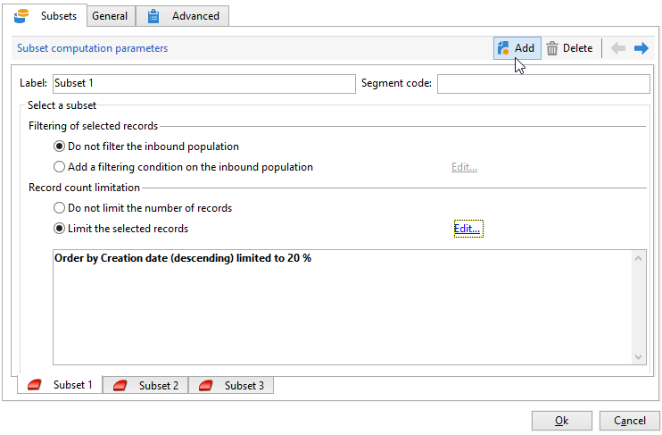
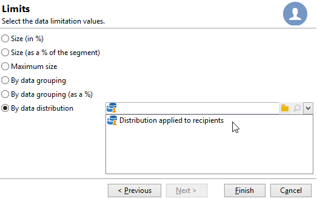

# Divisão{#split}

Uma atividade do tipo **Split** permite dividir um target em vários subconjuntos. O target é construído com todos os resultados recebidos: todas as atividades anteriores devem ter sido concluídas para que essa atividade seja executada.

Essa atividade não aciona uma união de públicos de entrada. Se várias transições acabarem em uma atividade de Split, é recomendado inserir uma atividade de **[!UICONTROL Union]** na frente.

Para obter um exemplo da atividade de split que está sendo usada, consulte [nesta seção](targeting-workflows.md#create-subsets-using-the-split-activity).

Um exemplo ilustrando como usar a atividade de Split para segmentar o target em diferentes públicos usando condições de filtragem é descrito [nesta seção](cross-channel-delivery-workflow.md).

Um exemplo mostrando como usar uma variável de instância em uma atividade de Split está disponível [nesta seção](javascript-scripts-and-templates.md).

Para configurar essa atividade, defina o conteúdo do subconjunto e o rótulo na guia **[!UICONTROL Subsets]** e escolha o targeting dimension na guia **[!UICONTROL General]**.

## Criar subconjuntos {#create-subsets}

Para criar um subconjunto:

1. Clique no rótulo no campo correspondente e selecione o filtro a ser aplicado.
1. Para filtrar o público de entrada, selecione a **[!UICONTROL Add a filtering condition]** opção e clique no **[!UICONTROL Edit...]** link.

   Selecione o tipo de filtro a ser aplicado aos dados para incluí-lo neste conjunto.

   O processo é o mesmo de uma atividade do tipo **Query**.

   >[!NOTE]
   >
   >É possível filtrar os dados em um máximo de dois bancos de dados externos (FDA).

1. É possível especificar o número máximo de registros para extrair a partir do target para criar o subconjunto. Para fazer isso, marque a **[!UICONTROL Limit the selected records]** opção e clique no **[!UICONTROL Edit...]** link.

   Um assistente permite escolher o modo de seleção para os registros deste subconjunto. [Saiba mais](#limit-the-number-of-subset-records).

   

1. Se desejar, é possível **adicionar outros subconjuntos** usando o botão **[!UICONTROL Add]**.

   

   >[!NOTE]
   >
   >Se a opção **[!UICONTROL Enable overlapping of output populations]** não estiver marcada, os subconjuntos serão criados na ordem das guias. Use as setas na seção superior direita desta janela para movê-las. Se o primeiro subconjunto recupera 70% da população inicial, por exemplo, o próximo subconjunto aplica seus critérios de seleção em apenas nos 30% restantes e assim por diante.

   Para cada subconjunto criado, uma transição de saída será adicionada à atividade dividida.

   

   É possível optar por gerar uma única transição de saída (e identificar conjuntos usando o código do segmento, por exemplo): para fazer isso, selecione a opção **[!UICONTROL Generate subsets in the same table]** na guia **[!UICONTROL General]**.

   Se estiver concluído, o código do segmento de cada subconjunto será armazenado automaticamente em uma coluna adicional. Essa coluna estará acessível nos campos de personalização no nível de delivery.

## Limitar o número de registros do subconjunto {#limit-the-number-of-subset-records}

Se não quiser usar toda a população contida em um subconjunto, é possível limitar o número de registros que ele conterá.

1. Na janela de edição do subconjunto, marque a opção **[!UICONTROL Limit the selected records]** e clique no **[!UICONTROL Edit...]** link.
1. Selecione o tipo de limite escolhido:

   * **[!UICONTROL Activate random sampling]**: essa opção obtém uma amostra aleatória dos registros. O tipo de amostragem aleatória aplicada depende do mecanismo do banco de dados.
   * **[!UICONTROL Keep only the first records after sorting]**: esta opção permite definir uma limitação baseada em uma ou mais ordens de classificação. Ao selecionar o campo **[!UICONTROL Age]** como um critério de classificação e 100 como o limite, somente os 100 recipients mais jovens serão mantidos.
   * **[!UICONTROL Keep the first ones after sorting (criteria, random)]**: esta opção combina as duas opções anteriores. Ele permite definir uma limitação com base em uma ou mais ordens de classificação e, então, aplicar uma seleção aleatória nos primeiros registros se alguns dos registros tiverem os mesmos valores que os critérios definidos.

     Por exemplo, ao selecionar o campo **[!UICONTROL Age]** como critério de classificação e definir um limite de 100, mas os 2000 recipients mais jovens no banco de dados todos têm 18, então 100 recipients serão aleatoriamente selecionados desses 2000.

   

1. Se desejar definir critérios de classificação, uma etapa adicional permite definir as colunas e a ordem de classificação.

   

1. Em seguida, escolha o método de limitação de dados.

   

   Há várias maneiras de fazer isso:

   * **[!UICONTROL Size (in %)]**: uma porcentagem de registros. Por exemplo, a configuração abaixo extrai 10% da população total.

     A porcentagem se aplica à população inicial, não ao resultado da atividade.

   * **[!UICONTROL Size (as a % of the segment)]**: uma porcentagem dos registros relacionados somente aos subconjuntos e não à população inicial.
   * **[!UICONTROL Maximum size]**: um número máximo de registros.
   * **[!UICONTROL By data grouping]**: é possível definir um limite no número de registros dependendo dos valores em um campo especificado da população de entrada. [Saiba mais](#limit-the-number-of-subset-records-by-data-grouping).
   * **[!UICONTROL By data grouping (in %)]**: é possível definir um limite no número de registros dependendo dos valores em um campo especificado da população de entrada usando uma porcentagem. [Saiba mais](#limit-the-number-of-subset-records-by-data-grouping).
   * **[!UICONTROL By data distribution]**: se os campos de agrupamento tiverem muitos valores ou se você não quiser inserir os valores novamente para cada nova atividade de split, o Adobe Campaign permite configurar uma limitação **[!UICONTROL By data distribution]** (módulo opcional Marketing Distribuído). [Saiba mais](#limit-the-number-of-subset-records-per-data-distribution).

1. Clique em **[!UICONTROL Finish]** para aprovar o critério de seleção de registro. A configuração selecionada é então exibida na janela do meio do editor.

## Limitar o número de registros de subconjunto por agrupamento de dados {#limit-the-number-of-subset-records-by-data-grouping}

É possível limitar o número de registros por agrupamento de dados. Esse limite pode ser executado usando um valor fixo ou uma porcentagem.

Por exemplo, se você selecionar o campo **[!UICONTROL Language]** como um campo de grupo, será possível definir uma lista de registros para cada idioma.

1. Depois de selecionar os valores de limitação de dados, selecione **[!UICONTROL By data grouping]** ou **[!UICONTROL By data grouping (as a %)]** e clique em **[!UICONTROL Next]**.

   

1. Então, selecione os campos de agrupamentos (o campo **[!UICONTROL Language]** por exemplo) e clique em **[!UICONTROL Next]**.

   

1. Finalmente, especifique os limites de agrupamento de dados (usando valores fixos ou porcentagens, dependendo do método de agrupamento selecionado anteriormente). Para definir o mesmo limite para cada valor, por exemplo, se desejar definir o número de registros para cada idioma como 10, selecione a opção **[!UICONTROL All data groupings are the same size]**. Para definir um limite diferente para cada valor, selecione a opção **[!UICONTROL Limitations by grouping value]**. Isso permitirá escolher uma limitação diferente para inglês, francês etc.

   

1. Clique em **[!UICONTROL Finish]** para aprovar a limitação e retornar à edição da atividade de split.

## Limitar o número de registros de subconjunto por distribuição de dados {#limit-the-number-of-subset-records-per-data-distribution}

Se os campos de agrupamento contiverem um número muito grande de valores ou se quiser evitar redefinir os valores para cada nova atividade dividida, o Adobe Campaign permitirá criar uma limitação por distribuição de dados. Ao selecionar [valores de limitação de dados](#create-subsets) ), selecione o **[!UICONTROL By data distribution]** e selecione um template no menu suspenso. A criação de um template de distribuição de dados é demonstrada abaixo.

Para obter um exemplo do **[!UICONTROL Local approval]** atividade com um template de distribuição, consulte [esta página](local-approval-activity.md).

>[!CAUTION]
>
>Essa função só está disponível com o [Complemento de marketing distribuído](../distributed-marketing/about-distributed-marketing.md). Verifique o contrato de licença.

O template de distribuição de dados permite limitar o número de registros de uma lista de valores de agrupamento. Aplique as seguintes etapas para criar um template de distribuição de dados:

1. Para criar o template de distribuição de dados, vá para o nó **[!UICONTROL Resources > Campaign management > Data distribution]** e clique em **[!UICONTROL New]**.

   

1. A guia **[!UICONTROL General]** permite inserir o rótulo e o contexto de execução da distribuição (targeting dimension, campo de distribuição).

   

   Os seguintes campos precisam ser inseridos:

   * **[!UICONTROL Label]**: rótulo para o template de distribuição.
   * **[!UICONTROL Targeting dimension]**: digite a targeting dimension à qual a distribuição de dados será aplicada, **[!UICONTROL Recipient]** por exemplo. Esse schema deve sempre ser compatível com os dados usados no workflow para construção do target.
   * **[!UICONTROL Distribution field]**: selecione um campo por meio da targeting dimension. Por exemplo, se selecionar o campo **[!UICONTROL Email domain]**, a lista de recipients será dividida por domínio.
   * **[!UICONTROL Distribution type]**: selecione a forma como o valor de limitação do target será detalhado na guia **[!UICONTROL Distribution]**: **[!UICONTROL Percentage]** ou **[!UICONTROL Set]**.
   * **[!UICONTROL Approval storage]**: se você usar um [Aprovação local](local-approval.md) atividade no workflow para construção do target, insira o schema no qual os resultados da aprovação serão armazenados. É necessário especificar um schema de armazenamento por schema de target. Se usar o schema de target **[!UICONTROL Recipients]**, insira o schema de armazenamento padrão **[!UICONTROL Local approval of recipients]**.

     No caso de uma limitação simples por agrupamento de dados sem aprovação local, não é necessário inserir o campo **[!UICONTROL Approvals storage]**.

1. Se você estiver usando um [Aprovação local](local-approval.md) atividade, insira o **[!UICONTROL Advanced settings]** para o template de distribuição:

   

   Os seguintes campos precisam ser inseridos:

   * **[!UICONTROL Approve targeted messages]**: marque esta opção se quiser que todos os recipients sejam pré-selecionados da lista de recipients a serem aprovados. Se esta opção estiver desmarcada, nenhum recipient será pré-selecionado.

     >[!NOTE]
     >
     >Essa opção é selecionada por padrão.

     

   * **[!UICONTROL Delivery label]**: permite definir uma expressão para exibir o rótulo de delivery na notificação de retorno. A expressão padrão fornece informações sobre o rótulo padrão da distribuição (string de computação). É possível modificar essa expressão.

     

   * **[!UICONTROL Grouping field]**: este campo permite definir o agrupamento usado para exibir recipients na aprovação e notificações de retorno.

     

   * **[!UICONTROL Web Interface]**: permite vincular um aplicação web à lista de recipients. Na notificação de aprovação e retorno, cada recipient é clicável e é vinculado ao aplicativo da Web selecionado. O campo **[!UICONTROL Parameters]** (por exemplo **[!UICONTROL recipientId]**) permite configurar o parâmetro adicional a ser utilizado no URL e no aplicativo da web.

1. A guia **[!UICONTROL Breakdown]** permite definir a lista de valores de distribuição.

   

   * **[!UICONTROL Value]**: digite os valores de distribuição.
   * **[!UICONTROL Percentage / Set]**: digite o limite de registro (fixo ou porcentagem) vinculado a cada valor.

     Essa coluna é definida pelo campo **[!UICONTROL Distribution type]** dentro da guia **[!UICONTROL General]**.

   * **[!UICONTROL Label]**: digite o rótulo vinculado a cada valor.
   * **[!UICONTROL Group or operator]**: se estiver usando um[Aprovação local](local-approval.md) selecione o operador ou grupo de operadores atribuídos a cada valor de distribuição.

     No caso de uma limitação simples por agrupamento de dados sem aprovação local, não é necessário inserir o campo **[!UICONTROL Group or operator]**.

     >[!CAUTION]
     >
     >Verifique se os operadores receberam as permissões apropriadas.

## Filtragem de parâmetros {#filtering-parameters}

Clique na guia **[!UICONTROL General]** para acessar o rótulo de atividade. Selecione o target e o filtro de dimensões para essa divisão. Se necessário, é possível alterar essas dimensões para um determinado subconjunto.

Marque a opção **[!UICONTROL Generate complement]** se desejar explorar a população restante. O complemento é o target de entrada menos a união dos subconjuntos. Uma transição de saída adicional será adicionada à atividade, da seguinte maneira:

Para que essa opção funcione corretamente, os dados de entrada devem ter uma chave primária.

Por exemplo, se os dados são lidos diretamente de um banco de dados externo, como o Netezza (que não suporta a noção de um índice) por meio de uma **[!UICONTROL Data loading (RDBMS)]** atividade, o complemento gerado pela **[!UICONTROL Split]** atividade estará incorreto.

Para evitar isso, é possível arrastar e soltar uma atividade de **[!UICONTROL Enrichment]** antes da atividade de **[!UICONTROL Split]**. Na atividade de **[!UICONTROL Enrichment]**, marque a opção **[!UICONTROL Keep all additional data from the main set]** e especifique nos dados adicionais as colunas que deseja usar para configurar os filtros da atividade de **[!UICONTROL Split]**. Os dados da transição de entrada da atividade de **[!UICONTROL Split]** são armazenados localmente em uma tabela temporária no servidor do Adobe Campaign e o complemento pode ser gerado corretamente.

A opção **[!UICONTROL Enable overlapping of output populations]** permite gerenciar populações pertencentes a vários subconjuntos:

* Quando a caixa não estiver marcada, a atividade dividida garante que um recipient não esteja presente em várias transições de saída, mesmo que ele atenda aos critérios de vários subconjuntos. Eles estarão no target da primeira guia com critérios correspondentes.
* Quando a caixa for marcada, os recipients poderão ser encontrados em vários subconjuntos se atenderem aos critérios de filtro. O Adobe Campaign recomenda usar critérios exclusivos.

## Parâmetros de entrada {#input-parameters}

* tableName
* schema

Cada evento de entrada deve especificar um target definido por esses parâmetros.

## Parâmetros de saída {#output-parameters}

* tableName
* schema
* recCount

Esse conjunto de três valores identifica o target resultante da exclusão. **[!UICONTROL tableName]** é o nome da tabela que registra os identificadores de target, **[!UICONTROL schema]** é o schema do público (normalmente nms:recipient) e **[!UICONTROL recCount]** é o número de elementos na tabela.

A transição associada ao complemento tem os mesmos parâmetros.
