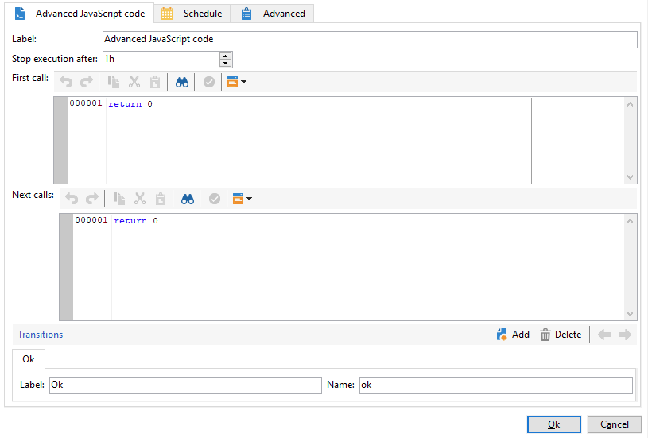

# Código SQL e código JavaScript{#sql-code-and-javascript-code}

## Código SQL {#sql-code}

Uma atividade **[!UICONTROL SQL code]** executa um script SQL. O script é um modelo JST.


* **[!UICONTROL Script]**

  A área central do editor contém o script a ser executado. Este script é um modelo JST e, portanto, pode ser configurado de acordo com o contexto do fluxo de trabalho.

* **[!UICONTROL Processing errors]**

  Consulte [Processamento de erros](monitor-workflow-execution.md#processing-errors).

### Observações importantes {#important-notes}

A partir da versão 8.9.1, as atividades de fluxo de trabalho do **[!UICONTROL SQL code]** e do **[!UICONTROL SQL Data Management]** foram aprimoradas para proteger melhor os bancos de dados PostgreSQL e manter seus fluxos de trabalho em execução sem problemas quando o SQL personalizado for executado do Campaign. Estas são algumas das práticas recomendadas a serem seguidas em caso de erros.

Opções disponíveis em **[!UICONTROL Administration]** > **[!UICONTROL Platform]** > **[!UICONTROL Options]**. Duas soluções estão disponíveis em caso de erros:

**Solução 1**

Defina `XtkSecurity_FeatureFlag_SqlSensitive` como `0`. O recurso está desativado.

**Solução 2**

Modificar `XtkSecurity_SqlSensitive_Methods`. Você pode alterar `<method name="TRUNCATE" action="block"/>` para `<method name="TRUNCATE" action="warn"/>`

Outros métodos, como VACUUM FULL, REINDEX, CREATE INDEX e DROP INDEX também são bloqueados por padrão para proteger a integridade do banco de dados. Tenha cuidado se quiser defini-los como avisar em vez de bloquear. Esses métodos podem ter um impacto grave no desempenho do banco de dados durante a execução.

## Código JavaScript e código JavaScript avançado {#javascript-code}

As atividades **[!UICONTROL JavaScript code]** e **[!UICONTROL Advanced JavaScript code]** executam um script JavaScript no contexto de um fluxo de trabalho. Para obter mais informações sobre scripts, consulte essas seções:

* [Modelos e scripts JavaScript](javascript-scripts-and-templates.md)
* [Exemplos de código JavaScript em fluxos de trabalho](javascript-in-workflows.md)

### Atraso de execução {#exec-delay}

A partir da versão 20.2, um atraso de execução foi adicionado às atividades **[!UICONTROL JavaScript code]** e **[!UICONTROL Advanced JavaScript code]**. Por padrão, a fase de execução não pode exceder 1 hora. Após esse atraso, o processo será interrompido com uma mensagem de erro e a execução da atividade falhará.

É possível alterar esse atraso no campo **[!UICONTROL Stop execution after]**, disponível nestas atividade.

Para ignorar esse limite, é necessário definir o valor como **0**.

### Código JavaScript {#js-code-desc}


* **[!UICONTROL Script]**: A área central do editor contém o script a ser executado.

* **[!UICONTROL Process errors]**: Consulte [Processamento de erros](monitor-workflow-execution.md#processing-errors).

### Código JavaScript avançado {#adv-js-code-desc}



* **[!UICONTROL First call]**: A primeira zona do editor contém o script a ser executado durante a primeira chamada.
* **[!UICONTROL Next calls]**: A segunda zona do editor contém o script a ser executado durante as próximas chamadas.
* **[!UICONTROL Transitions]**: Você pode definir várias transições de atividade de output.
* **[!UICONTROL Schedule]**: A guia **[!UICONTROL Schedule]** permite agendar quando acionar a atividade.

O JavaScript avançado é uma tarefa persistente e será retomado periodicamente se não for marcado como concluído. Para encerrar a tarefa e evitar futuras recuperações, você deve usar o método **task.setCompleted()** na seção **[!UICONTROL Next calls]**:

```
task.postEvent(task.transitionByName("ok")); // to transition to Ok branch
task.setCompleted();

return 0;
```
