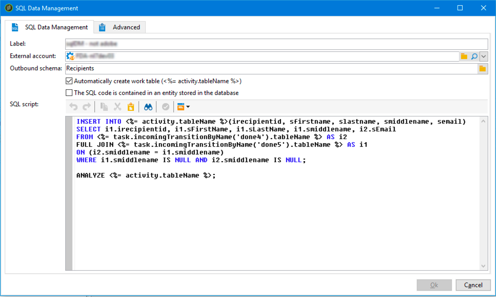

# Gerenciamento de dados SQL{#sql-data-management}

A atividade de **Gestão de dados SQL** permite escrever seus próprios scripts SQL para criar e preencher tabelas de trabalho.

## Pré-requisitos {#prerequisites}

Antes de configurar a atividade, verifique se os pré-requisitos a seguir estão sendo cumpridos:

* A atividade está disponível somente para fontes de dados remotas.
* O esquema de saída deve existir no banco de dados e estar vinculado a um banco de dados do FDA.

## Observações importantes {#important-notes}

A partir da versão 8.9.1, as atividades de fluxo de trabalho do **[!UICONTROL SQL code]** e do **[!UICONTROL SQL Data Management]** foram aprimoradas para proteger melhor os bancos de dados PostgreSQL e manter seus fluxos de trabalho em execução sem problemas quando o SQL personalizado for executado do Campaign.

No caso de erros, duas soluções estão disponíveis:

* Solução 1 — `XtkSecurity_FeatureFlag_SqlSensitive`
* Solução 2 — `XtkSecurity_SqlSensitive_Methods`

Consulte [Código SQL](sql-code-and-javascript-code.md#important-notes) para obter mais detalhes e práticas recomendadas.

## Configurar a atividade de gestão de dados SQL {#configuring-the-sql-data-management-activity}

1. Especifique a atividade **[!UICONTROL Label]**.
1. Selecione a **[!UICONTROL External account]** a ser utilizada e selecione o **[!UICONTROL Outbound schema]** vinculado a esta conta externa.

   >[!CAUTION]
   >
   >O esquema de saída está fixo e não pode ser editado.

1. Adicione o script SQL.

   >[!CAUTION]
   >
   >É responsabilidade do autor do script SQL garantir que o script esteja funcional e que suas referências (nomes de campos e outros elementos) estejam em conformidade com o esquema de saída.

   Para carregar um código SQL existente, selecione a opção **[!UICONTROL The SQL script is contained in an entity stored in the database]**. Os scripts SQL devem ser criados e armazenados no menu **[!UICONTROL Administration]** / **[!UICONTROL Configuration]** / **[!UICONTROL SQL scripts]**.

   Caso contrário, digite ou copie e cole o script SQL na área dedicada.

   

   A atividade permite usar as seguintes variáveis no script:

   * **activity.tableName**: nome SQL da tabela de trabalho de saída
   * **task.incomingTransitionByName(&#39;name&#39;).tableName**: nome SQL da tabela de trabalho transmitida pela transição recebida a ser utilizada (a transição é identificada pelo próprio nome).

     >[!NOTE]
     >
     >O valor (&#39;name&#39;) corresponde ao **[!UICONTROL Name]** campo das propriedades de transição.

1. Se o script SQL já tiver comandos para criar uma tabela de trabalho de saída, desmarque a opção **[!UICONTROL Automatically create work table]**. Caso contrário, uma tabela de trabalho será criada automaticamente quando o fluxo de trabalho for executado.
1. Clique em **[!UICONTROL Ok]** para confirmar a configuração da atividade.

A atividade está configurada agora. Ela está pronta para ser executada no fluxo de trabalho

>[!CAUTION]
>
>Ao executar a atividade, os registros de transição de saída são somente indicativos. Pode variar de acordo com o nível de complexidade do script SQL.
>  
>Se a atividade for reiniciada, todo o script será executado desde o seu início, independentemente do status de execução.

## Exemplos de script SQL {#sql-script-samples}

>[!NOTE]
>
>Os exemplos de script nesta seção dever ser executados em PostgreSQL.

O script abaixo permite criar uma tabela de trabalho e inserir dados nesta mesma tabela de trabalho:

```
CREATE UNLOGGED TABLE <%= activity.tableName %> (
  iRecipientId INTEGER DEFAULT 0,
  sFirstName VARCHAR(100),
  sMiddleName VARCHAR(100),
  sLastName VARCHAR(100),
  sEmail VARCHAR(100)
);

INSERT INTO <%= activity.tableName %>
SELECT iRecipientId, sFirstName, sMiddleName, sLastName, sEmail
FROM nmsRecipient
GROUP BY iRecipientId, sFirstName, sMiddleName, sLastName, sEmail;
```

O script abaixo permite executar uma operação CTAS (CREATE TABLE AS SELECT) e criar um índice de tabela de trabalho:

```
CREATE TABLE <%= activity.tableName %>
AS SELECT iRecipientId, sEmail, sFirstName, sLastName, sMiddleName
FROM nmsRecipient
WHERE sEmail IS NOT NULL
GROUP BY iRecipientId, sEmail, sFirstName, sLastName, sMiddleName;

CREATE INDEX ON <%= activity.tableName %> (sEmail);

ANALYZE <%= activity.tableName %> (sEmail);
```

O script abaixo permite mesclar duas tabelas de trabalho:

```
CREATE TABLE <%= activity.tableName %>
AS SELECT i1.sFirstName, i1.sLastName, i2.sEmail
FROM <%= task.incomingTransitionByName('input1').tableName %> i1
JOIN <%= task.incomingTransitionByName('input2').tableName %> i2 ON (i1.id = i2.id)
```
