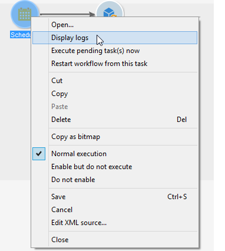

# Iniciar, pausar, parar um fluxo de trabalho {#starting-a-workflow}

Um fluxo de trabalho é sempre iniciado manualmente. Ao ser iniciado, ele pode permanecer inativo dependendo das informações especificadas por meio de um scheduler (consulte [Scheduler](scheduler.md)) ou de um agendamento de atividade.

Ações relacionadas à execução do workflow para construção do target (iniciar, parar, pausar etc.) são processos **assíncronos**: a ordem é registrada e entrará em vigor assim que o servidor estiver disponível para aplicá-la.

A barra de ferramentas permite iniciar e controlar a execução do fluxo de trabalho.

A lista de opções disponíveis no menu **[!UICONTROL Actions]** e no menu do botão direito do mouse estão detalhadas abaixo.

>[!IMPORTANT]
>
>Lembre-se que, quando um operador executa uma ação em um workflow (iniciar, parar, pausar, etc.), a ação não é imediatamente executada, mas colocada em uma fila para ser processada pelo módulo de workflow.

## Barra de ferramentas Ações {#actions-toolbar}

O botão **[!UICONTROL Actions]** da barra de ferramentas permite acessar opções de execução adicionais em fluxos de trabalho selecionados. Você também pode usar o menu **[!UICONTROL File > Actions]** ou clicar com o botão direito do mouse em um fluxo de trabalho e selecionar **[!UICONTROL Actions]**.


* **[!UICONTROL Start]**

  Essa ação permite iniciar a execução de um fluxo de trabalho: um fluxo de trabalho **Concluído**, **Em edição** ou **Pausado** altera o status para **Iniciado**. Em seguida, o motor de fluxo de trabalho manipula a execução desse fluxo de trabalho. Se o fluxo de trabalho tiver sido pausado, ele será retomado, caso contrário, o fluxo de trabalho será iniciado desde o início e as atividades iniciais serão ativadas.

  Iniciar é um processo assíncrono: a solicitação é salva e processada o mais rápido possível por um servidor de fluxo de trabalho.

* **[!UICONTROL Pause]**

  Esta ação define o status do fluxo de trabalho como **Pausado**. Nenhuma atividade é ativada até que o fluxo de trabalho seja retomado. No entanto, as operações em andamento não são interrompidas.

* **[!UICONTROL Stop]**

  Esta ação interrompe um fluxo de trabalho sendo executado no momento. O status da instância é definido como **Concluído**. Se possível, as operações em andamento são interrompidas. Importações e queries SQL são canceladas imediatamente.

  >[!IMPORTANT]
  >
  >A interrupção de um fluxo de trabalho é um processo assíncrono: a solicitação é registrada e, em seguida, o servidor ou servidores de fluxo de trabalho cancelam as operações em andamento. A interrupção de uma instância de fluxo de trabalho pode demorar, especialmente se o fluxo de trabalho estiver em execução em vários servidores, em que cada um deles deve assumir o controle para cancelar as tarefas em andamento. Para evitar problemas, aguarde a conclusão da operação de interrupção e não execute várias solicitações de interrupção no mesmo fluxo de trabalho.

* **[!UICONTROL Unconditional stop]**

  Essa opção altera o status do fluxo de trabalho para **[!UICONTROL Finished]**. Essa ação só deve ser usada como último recurso se o processo de interrupção normal falhar após alguns minutos. Use apenas a interrupção incondicional se tiver certeza de que não há processos de fluxo de trabalho em andamento.

  >[!CAUTION]
  >
  >A interrupção incondicional é restrita aos usuários administradores.

* **[!UICONTROL Restart]**

  Essa ação para e depois retoma o fluxo de trabalho. Na maioria dos casos, é possível reiniciar mais rápido. Também é útil automatizar a reinicialização quando a interrupção leva um determinado tempo: isso ocorre porque o comando &#39;Parar&#39; não está disponível quando o fluxo de trabalho está sendo interrompido.

  Observe que a ação **Reiniciar** não limpa as variáveis da instância do fluxo de trabalho como as ações **Execução**, **Parar** e **Iniciar** (a limpeza das variáveis da instância ocorre a partir da ação Iniciar). Ao reiniciar um fluxo de trabalho, as variáveis da instância ainda estão disponíveis para uso com valores preservados. Para configurá-las, você pode:
   * Executar as ações **Parar** e **Iniciar**.
   * Adicionar o código Javascript abaixo no final da execução do fluxo de trabalho:

     ```
     var wkf = xtk.workflow.load(instance.id)
     wkf.variables='<variables/>'
     wkf.save()
     ```

* **[!UICONTROL Purge history]**

  Essa ação permite limpar o histórico do fluxo de trabalho. Para obter mais informações, consulte [Limpeza de logs](monitor-workflow-execution.md#purging-the-logs).

* **[!UICONTROL Start in simulation mode]**

  Essa opção permite iniciar o fluxo de trabalho no modo de simulação em vez do modo real. Isso significa que ao habilitar esse modo, somente as atividades que não afetam o banco de dados ou o sistema de arquivos serão executadas (por exemplo, **[!UICONTROL Query]**, **[!UICONTROL Union]**, **[!UICONTROL Intersection]**, etc.). Atividades que têm impacto (por exemplo, **[!UICONTROL Export]**, **[!UICONTROL Import]**, etc.) assim como as posteriores (na mesma ramificação) não são executadas.

* **[!UICONTROL Execute pending tasks now]**

  Essa ação permite iniciar todas as tarefas pendentes assim que possível. Para iniciar uma tarefa específica, clique com o botão direito do mouse na atividade e selecione **[!UICONTROL Execute pending task(s) now]**.


* **[!UICONTROL Save as template]**

  Essa ação cria um novo modelo de fluxo de trabalho com base no fluxo de trabalho selecionado. Você precisa especificar a pasta onde ele será salvo (no campo **[!UICONTROL Folder]**).


## Práticas recomendadas de execução de fluxos de trabalho {#workflow-execution-best-practices}

Melhore a estabilidade da instância implementando as seguintes práticas recomendadas:

* **É recomendável não agendar um fluxo de trabalho para execução por mais de 15 minutos**, pois isso pode atrapalhar o desempenho geral do sistema e criar bloqueios no banco de dados.

* **Evite deixar os fluxos de trabalho no estado pausado.** Se criar um fluxo de trabalho temporário, certifique-se de que ele será concluído corretamente e não permanecerá no estado **[!UICONTROL paused]**. Se estiver pausado, isso significa que é preciso manter as tabelas temporárias e, portanto, aumentar o tamanho do banco de dados. Atribua supervisores de fluxo de trabalho nas propriedades do fluxo de trabalho para enviar um alerta quando um fluxo de trabalho falhar ou for pausado pelo sistema.

  Para evitar fluxos de trabalho no estado pausado:

   * Verifique seus fluxos de trabalho regularmente para garantir que não haja erros inesperados.
   * Mantenha seus fluxos de trabalho o mais simples possível, por exemplo, dividindo grandes fluxos de trabalho em vários fluxos de trabalho diferentes. É possível usar as atividades **[!UICONTROL External signal]** para acionar a execução com base na execução de outros fluxos de trabalho.
   * Evite desabilitar atividades com fluxos nos fluxos de trabalho, deixando threads abertos e levando a muitas tabelas temporárias que podem consumir muito espaço. Não mantenha as atividades nos estados **[!UICONTROL Do not enable]** ou **[!UICONTROL Enable but do not execute]** em seus fluxos de trabalho.

* **Interromper fluxos de trabalho não utilizados**. Os fluxos de trabalho que continuam em execução mantêm conexões com o banco de dados.

* **Use a interrupção incondicional apenas nos casos mais raros**. Esta opção é restrita aos usuários administradores. Não utilize esta ação regularmente. Não executar um encerramento limpo nas conexões geradas pelos fluxos de trabalho com o banco de dados afeta o desempenho.

* **Não execute várias solicitações de interrupção no mesmo fluxo de trabalho**. A interrupção de um fluxo de trabalho é um processo assíncrono: a solicitação é registrada e, em seguida, o servidor ou servidores de fluxo de trabalho cancelam as operações em andamento. A interrupção de uma instância de fluxo de trabalho pode demorar, especialmente se o fluxo de trabalho estiver em execução em vários servidores, em que cada um deles deve assumir o controle para cancelar as tarefas em andamento. Para evitar problemas, aguarde a conclusão da operação de interrupção e evite interromper um fluxo de trabalho várias vezes.

## Menu do botão direito do mouse {#right-click-menu}

Quando uma ou mais atividades de fluxo de trabalho forem selecionadas, você pode clicar com o botão direito do mouse para agir em sua seleção.



As seguintes opções estão disponíveis no menu do botão direito do mouse:

**[!UICONTROL Open]**: esta opção permite acessar as propriedades da atividade.

**[!UICONTROL Display logs:]** essa opção permite exibir o log de execução da tarefa para a atividade selecionada. Consulte [Exibir logs](monitor-workflow-execution.md#displaying-logs).

**[!UICONTROL Execute pending task(s) now:]** essa ação permite iniciar tarefas pendentes assim que possível.

**[!UICONTROL Workflow restart from a task:]** essa opção permite reiniciar o fluxo de trabalho usando os resultados armazenados anteriormente para essa atividade.

**[!UICONTROL Cut/Copy/Paste/Delete:]** essas opções permitem recortar, copiar, colar e excluir atividades.

**[!UICONTROL Copy as bitmap:]** essa opção permite capturar a tela de todas as atividades.

**[!UICONTROL Normal execution / Enable but do not execute / Do not enable:]** essas opções também estão disponíveis na guia **[!UICONTROL Advanced]** das propriedades da atividade. Maiores detalhes em [Execution](advanced-parameters.md#execution).

**[!UICONTROL Save / Cancel:]** permite salvar ou cancelar as alterações feitas em um fluxo de trabalho.

>[!NOTE]
>
>Você pode selecionar um grupo de atividades e aplicar um desses comandos a eles.

