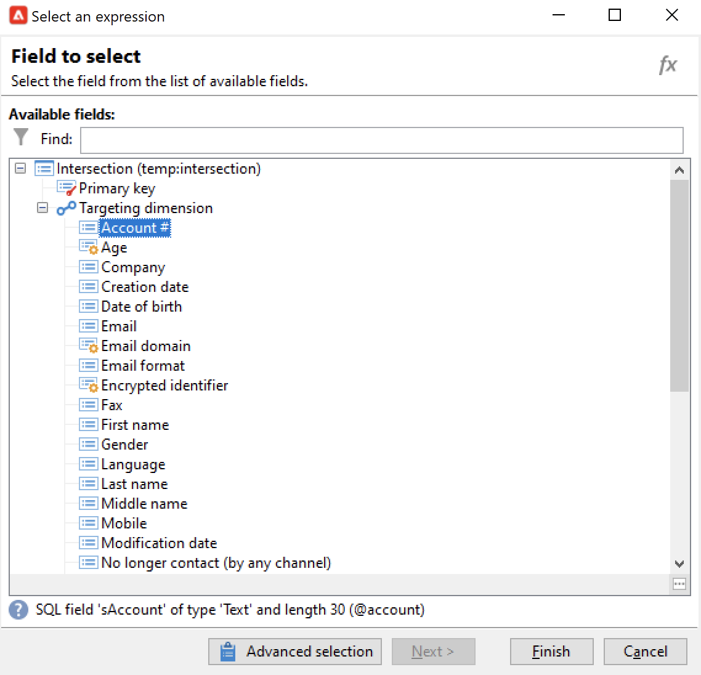

# Criar um fluxo de trabalho de direcionamento{#target-data}

O fluxo de trabalho pode ser usado para consultar o banco de dados e segmentar seus dados. O módulo de fluxo de trabalho do Campaign é uma ferramenta poderosa para executar atividades de gerenciamento de dados, extrair, enriquecer e transformar dados, gerenciar públicos e refinar populações.

Os workflows para construção do target permitem que você crie vários targets de entrega. Você pode criar queries, definir uniões ou exclusões com base em critérios específicos, adicionar agendamento, graças às atividades do workflow. O resultado desse target pode ser transferido automaticamente para uma lista que pode servir como target das ações de entrega

Além dessas atividades, as opções de Gestão de Dados permitem manipular dados e acessar funções avançadas para solucionar problemas complexos de target. Para obter mais informações, consulte [Gerenciamento de dados](targeting-workflows.md#data-management).

Todas essas atividades podem ser encontradas na primeira guia do workflow.

>[!NOTE]
>
>As atividades de target são detalhadas [nesta seção](activities.md).

Os fluxos de trabalho para construção do target podem ser criados e editados por meio do nó **[!UICONTROL Profiles and Targets > Jobs > Targeting workflows]** da árvore do Adobe Campaign ou através do menu **[!UICONTROL Profiles and Targets > Targeting workflows]** da página inicial.

Os workflows para construção do target dentro da estrutura de uma campanha são armazenados com todos os workflows da campanha.

## Etapas principais para criar um fluxo de trabalho para construção do target {#implementation-steps-}

As etapas para a criação de um fluxo de trabalho de direcionamento estão detalhadas nestas seções:

1. **Identificar** dados no banco de dados – Consulte [Criar consultas](#create-queries)
1. **Preparar** dados para atender às necessidades da entrega – Consulte [Enriquecer e modificar dados](#enrich-and-modify-data)
1. **Usar** dados para executar atualizações ou dentro de uma entrega – Consulte [Atualizar o banco de dados](use-workflow-data.md#update-the-database)

Os resultados de todos os enriquecimentos e todos tratamentos realizados no target são armazenados e acessíveis em campos de personalização, principalmente para usar criação de mensagens personalizadas. Para obter mais informações, consulte [Dados de target](use-workflow-data.md#target-data).

## Dimensões de filtragem e direcionamento {#targeting-and-filtering-dimensions}

Durante as operações de segmentação de dados, a chave de direcionamento é mapeada para uma dimensão de filtro. O targeting dimension permite definir o público alvo da operação: destinatários, beneficiários de contrato, operadores, assinantes etc. A dimensão de filtro permite selecionar o público com base em determinados critérios: titulares de contratos, assinantes de boletins informativos, etc.

Por exemplo, para selecionar clientes que têm uma apólice de seguro de vida por mais de 5 anos, selecione a seguinte targeting dimension: **Clients** e a seguinte dimensão do filtro: **Contract holder**. Você pode definir as condições de filtragem na atividade de query

Durante o estágio de seleção de targeting dimensioning dimension, somente as dimensões de filtro compatíveis são apresentadas na interface.

Essas duas dimensões devem estar relacionadas. Assim, o conteúdo da lista **[!UICONTROL Filtering dimension]** depende do target dimension especificado no primeiro campo.

Por exemplo, para destinatários (**destinatários**), as seguintes dimensões de filtro estarão disponíveis:

Enquanto para **Visitors**, a lista conterá as seguintes dimensões de filtro:

## Criar consultas {#create-queries}

### Trabalhar com dados adicionais {#select-data}

Uma atividade **[!UICONTROL Query]** permite que você selecione dados básicos para criar o público-alvo. Para obter mais informações, consulte [esta seção](query.md#create-a-query).

Também é possível usar as seguintes atividades para consultar e refinar dados do banco de dados: [Incremental query](incremental-query.md) e [Read list](read-list.md).

É possível coletar dados adicionais para serem encaminhados e processados durante o ciclo de vida do workflow. Para obter mais informações, consulte [Adicionar dados](query.md#add-data) e [Editar dados adicionais](#edit-additional-data).

### Editar dados adicionais {#edit-additional-data}

Após adicionar os dados adicionais, você pode editá-los ou utilizá-los para refinar o target definido na atividade de query.

O link **[!UICONTROL Edit additional data...]** permite visualizar os dados adicionados e modificá-los ou adicioná-los.

Para adicionar dados às colunas de output definidas anteriormente, selecione-os na lista de campos disponíveis. Para criar uma nova coluna de output, clique no ícone **[!UICONTROL Add]** e, em seguida, selecione o campo e clique em **[!UICONTROL Edit expression]**.

Clique no botão **Seleção avançada**.

Defina um modo de cálculo para que o campo seja adicionado, como, por exemplo, uma agregação.

A opção **[!UICONTROL Add a sub-item]** permite anexar dados calculados à coleção. Isso permite selecionar os dados adicionais da coleção ou definir cálculos agregados em elementos de coleção.

O subelementos será representado na subárvore da coleção em que são mapeados.

As coleções são mostradas na subguia **[!UICONTROL Collections]**. Você pode filtrar os elementos coletados clicando no ícone **[!UICONTROL Detail]** da coleção selecionada. O assistente de filtro permite selecionar os dados coletados e especificar as condições de filtragem a serem aplicadas aos dados na coleção.

### Refinar um público alvo usando dados adicionais {#refine-the-target-using-additional-data}

Os dados adicionais coletados podem capacitá-lo a refinar a filtragem de dados no banco de dados. Para fazer isso, clique no link **[!UICONTROL Refine the target using additional data...]**: isso permite filtrar os dados adicionados.

### Uniformizar dados {#homogenize-data}

Em **[!UICONTROL Union]** ou **[!UICONTROL Intersection]** digite atividades, é possível escolher manter apenas os dados adicionais compartilhados para manter a consistência dos dados. Nesse caso, a mesa de trabalho de saída temporária dessa atividade conterá apenas os dados adicionais encontrados em todos os conjuntos de entradas.

### Reconciliar com dados adicionais {#reconciliation-with-additional-data}

Durante as fases de reconciliação de dados (**[!UICONTROL Union]**, **[!UICONTROL Intersection]**, etc. você pode selecionar as colunas a serem usadas para reconciliação de dados das colunas adicionais. Para fazer isso, configure uma reconciliação em uma seleção de colunas e especifique o conjunto principal. Em seguida, selecione as colunas na coluna inferior da janela, como mostrado no exemplo a seguir:

Selecione uma expressão e confirme.

### Criar subconjuntos {#create-subsets}

A atividade **[!UICONTROL Split]** permite criar subconjuntos em critérios definidos por consultas de extração. Para cada subconjunto, ao editar uma condição de filtro no público, você acessará a atividade de query padrão que permite definir as condições de segmentação de target.

Você pode dividir um target em vários subconjuntos usando apenas dados adicionais como condições de filtragem ou como complemento aos dados de target. Você também pode usar dados externos se tiver comprado a opção **Federated Data Access**.

Para obter mais informações, consulte [esta seção](#create-subsets-using-the-split-activity).

## Segmentar dados {#segment-data}

### Combinar vários públicos alvos (União) {#combine-several-targets--union-}

A atividade de união permite combinar o resultado de várias atividades em uma transição. Os conjuntos não precisam ser necessariamente homogêneos.

As seguintes opções de reconciliação de dados estão disponíveis:

* **[!UICONTROL Keys only]**

  Essa opção pode ser usada se os públicos de entrada forem homogêneos.

* **[!UICONTROL All columns in common]**

  Esta opção permite reconciliar dados baseado em todas as colunas comuns para os vários públicos do target.

  O Adobe Campaign identifica colunas com base em seu nome. Um limite de tolerância é aceito: uma coluna &#39;Email&#39; pode ser reconhecida como idêntica a uma coluna &#39;@email&#39;, por exemplo.

* **[!UICONTROL A selection of columns]**

  Selecione essa opção para definir a lista de colunas na qual a reconciliação de dados será aplicada.

  Comece selecionando o conjunto principal (aquele que contém os dados de origem) e as colunas a serem usadas na associação.

  

  >[!CAUTION]
  >
  >Durante a reconciliação de dados, não haverá a eliminação da duplicação dos públicos.

  Você pode restringir o tamanho do público a um determinado número de registros. Para fazer isso, clique na opção adequada e especifique o número de registros a serem mantidos.

  Além disso, especifique a prioridade dos públicos de entrada: a seção inferior da janela lista as transições de entrada da atividade de união e permite organizá-las com as setas azuis à direita da janela.

  Os registros serão retirados primeiro do público da primeira transição de entrada na lista, e, se o máximo não tiver sido atingido, eles serão retirados do público da segunda transição de entrada e etc.

  

### Extrair dados conjuntos (Intersecção) {#extract-joint-data--intersection-}

A intersecção permite recuperar apenas as linhas compartilhadas pelos públicos de transições de entrada. Essa atividade deve ser configurada como a atividade de união.

Além disso, é possível manter apenas uma seleção de colunas ou apenas as colunas compartilhadas pelo público de entrada.

A atividade de intersecção é detalhada na seção [Intersection](intersection.md).

### Excluir uma população (Exclusão) {#exclude-a-population--exclusion-}

A atividade de exclusão permite excluir os elementos de um target de um público alvo diferente. O targeting dimension de output dessa atividade será do conjunto principal.

Quando necessário, é possível manipular as tabelas de entrada. De fato, para excluir um target de outra dimensão, esse target deve ser devolvido ao mesmo targeting dimension como o target principal. Para fazer isso, clique no botão **[!UICONTROL Add]** e especifique as condições de alteração da dimensão.

A reconciliação de dados é realizada por meio de um identificador, alterando o eixo ou uma junção.

### Criar subconjuntos usando a atividade de Split {#create-subsets-using-the-split-activity}

A atividade **[!UICONTROL Split]** é uma atividade padrão que permite criar os conjuntos necessários por meio de uma ou várias dimensões de filtro, bem como gerar uma transição de output por subconjunto ou uma transição exclusiva.

Os dados adicionais transmitidos pela transição de entrada podem ser usados nos critérios de filtragem.

Para configurá-lo, primeiro é necessário selecionar os critérios:

1. No workflow, arraste e solte uma atividade **[!UICONTROL Split]**.
1. Na guia **[!UICONTROL General]**, selecione a opção desejada: **[!UICONTROL Use data from the target and additional data]**, **[!UICONTROL Use the additional data only]** ou **[!UICONTROL Use external data]**.
1. Se a opção **[!UICONTROL Use data from the target and additional data]** for selecionada, o targeting dimension permitirá o uso de todos os dados transmitidos pela transição de entrada.

   

   Quando subconjuntos são criados, os parâmetros de filtragem mencionados anteriormente são usados.

   Para definir condições de filtragem, escolha a opção **[!UICONTROL Add a filtering condition on the inbound population]** e clique no link **[!UICONTROL Edit...]**. Em seguida, especifique as condições de filtragem para criar esse subconjunto.

   

   Um exemplo de uso das condições de filtragem na atividade **[!UICONTROL Split]** para segmentar o target em diferentes públicos é descrito [nesta seção](cross-channel-delivery-workflow.md).

   O campo **[!UICONTROL Label]** permite que você dê um nome ao subconjunto recém-criado, que corresponderá à transição de saída.

   Você também pode atribuir um código de segmento ao subconjunto para identificá-lo e usá-lo para o target do seu público.

   Se necessário, você pode alterar o targeting dimension e a dimensão de filtro individualmente para cada subconjunto que deseja criar. Para fazer isso, edite a condição de filtragem do subconjunto e verifique a opção **[!UICONTROL Use a specific filtering dimension]**.

   

1. Se a opção **[!UICONTROL Use the additional data only]** for selecionada, somente os dados adicionais serão oferecidos para a filtragem do subconjunto.

1. Se a opção **Federated Data Access** estiver habilitada, o campo **[!UICONTROL Use external data]** permitirá processar dados em um banco de dados externo já configurado ou criar uma nova conexão com um banco de dados.

Em seguida, precisamos adicionar novos subconjuntos:

1. Clique no botão **[!UICONTROL Add]** para definir as condições de filtragem.

   

1. Defina a dimensão do filtro na guia **[!UICONTROL General]** da atividade (veja acima). Ela se aplica a todos os subconjuntos por padrão.

   

1. Se necessário, você pode alterar a dimensão de filtro para cada subconjunto individualmente. Isso permite criar um conjunto para todos os titulares de cartões Gold, um para todos os destinatários que clicaram no boletim informativo mais recente e um terceiro para pessoas entre 18 e 25 anos que fizeram uma compra na loja nos últimos 30 dias, tudo usando a mesma atividade de Split. Para fazer isso, selecione a opção **[!UICONTROL Use a specific filtering dimension]** e selecione o contexto da filtragem de dados.

Após a criação dos subconjuntos, por padrão, a atividade de split mostrará tantas transições de output quanto houver subconjuntos:

Você pode agrupar todos esses subconjuntos em uma única transição de output. Nesse caso, o link para os respectivos subconjuntos será visível no código do segmento, por exemplo. Para fazer isso, selecione a opção **[!UICONTROL Generate all subsets in the same table]**.

Por exemplo, você pode colocar uma única atividade de delivery e personalizar o conteúdo do delivery com base no código do segmento de cada conjunto de recipients.

Subconjuntos também podem ser criados usando a atividade **[!UICONTROL Cells]**. Para obter mais informações, consulte a seção [Cells](cells.md).

### Usar dados direcionados {#using-targeted-data}

Depois que os dados forem identificados e preparados, eles poderão ser usados nos seguintes contextos:

* Você pode atualizar os dados no banco de dados após a manipulação de dados nos vários estágios do workflow.

  Para obter mais informações, consulte [Atualizar dados](update-data.md).

* Você também pode atualizar o conteúdo de listas existentes.

  Para obter mais informações, consulte [Atualizar lista](list-update.md).

* Você pode preparar ou iniciar entregas no workflow diretamente.

  Para obter mais informações, consulte [Entrega](delivery.md), [Controle de entrega](delivery-control.md) e [Entrega contínua](continuous-delivery.md).

## Gerenciamento de dados {#data-management}

No Adobe Campaign, a Gestão de Dados combina um conjunto de atividades para resolver problemas complexos de target oferecendo ferramentas mais eficientes e flexíveis. Isso permite implementar uma gestão consistente de todas as comunicações com um contato usando informações relacionadas a seus contratos, assinaturas, reatividade a entregas, etc. A Gestão de Dados permite acompanhar o ciclo de vida dos dados durante as operações de segmentação, especificamente:

* Simplificação e otimização de processos de target, ao incluir dados que não são modelados no datamart (criando novas tabelas: extensão local para todo workflow para construção do target, dependendo da configuração).
* Manutenção e transmissão de cálculos de buffer, especialmente durante as fases de construção do target ou para administração de banco de dados.
* Acesso a bases externas (opcional): bancos de dados heterogêneos considerados durante o processo de segmentação.

Para implementar essas operações, o Adobe Campaign oferece:

* Atividades de coleção de dados: [File transfer](file-transfer.md), [Data loading (file)](data-loading-file.md), [Data loading (RDBMS)](data-loading-rdbms.md) e [Update data](update-data.md). Essa primeira etapa de coleta de dados prepara os dados para que ele seja processado em outras atividades. Vários parâmetros precisam ser monitorados para garantir que o workflow seja executado corretamente e forneça os resultados esperados. Por exemplo, ao importar os dados, a chave primária (Pkey) para esses dados deve ser única para cada registro.
* As atividades de direcionamento foram aprimoradas com as opções de gerenciamento de dados: [Query](query.md), [Union](union.md), [Intersection](intersection.md) e [Split](split.md). Isso permite configurar uma união ou uma intersecção entre dados de diferentes targeting dimensions, desde que a reconciliação dos dados seja possível.
* Atividades de transformação de dados: [Enrichment](enrichment.md) e [Change dimension](change-dimension.md).

>[!CAUTION]
>
>Quando dois workflows são vinculados, a exclusão de um elemento de tabela de origem não significa que todos os dados vinculados a ele serão excluídos.
>  
>Por exemplo, excluir um destinatário por meio de um workflow não resultará na exclusão de todo o histórico de entrega. No entanto, excluir um destinatário diretamente na pasta &#39;Recipients&#39; resultará na exclusão de todos os dados vinculados a este destinatário.

### Enriquecer e modificar dados {#enrich-and-modify-data}

Além do targeting dimension, a dimensão de filtro permite especificar a natureza dos dados coletados. Consulte [esta seção](targeting-workflows.md#targeting-and-filtering-dimensions).

Os dados identificados e coletados podem ser enriquecidos, agregados e manipulados para otimizar a construção de target. Para fazer isso, além das atividades de manipulação de dados detalhadas em [esta seção](#segmen-data), use o seguinte:

* A atividade **[!UICONTROL Enrichment]** permite adicionar colunas momentaneamente a um schema, bem como adicionar informações a determinados elementos. Ela é detalhada na seção [Enrichment](enrichment.md) do repositório de atividades.
* A atividade **[!UICONTROL Edit schema]** permite modificar a estrutura de um schema. Ela é detalhada na seção [Edit schema](edit-schema.md) do repositório de atividades.
* A atividade **[!UICONTROL Change dimension]** permite alterar o targeting dimension durante o ciclo de construção do target. Ela é detalhada na seção [Change dimension](change-dimension.md).
