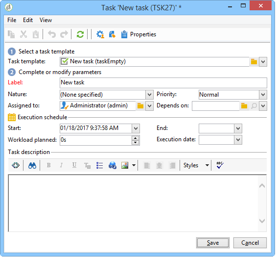

# Tarefa{#task}

>[!AVAILABILITY]
>
>:warning: Esse recurso só está disponível no Campaign Classic v7.

Em um workflow de campanha, a atividade **[!UICONTROL Task]** permite especificar dois cenários: o primeiro se a tarefa for concluída e um segundo se a tarefa não for concluída (se estiver marcada manualmente como incompleta ou se ela expirar).

Como configurar e operar uma tarefa é detalhada em .

A opção **[!UICONTROL Resources]** permite definir vários operadores, bem como um agendamento de aprovação para a tarefa. Se a pessoa que aprova rejeitar, isso não leva à tarefa em si a ser rejeitada.
