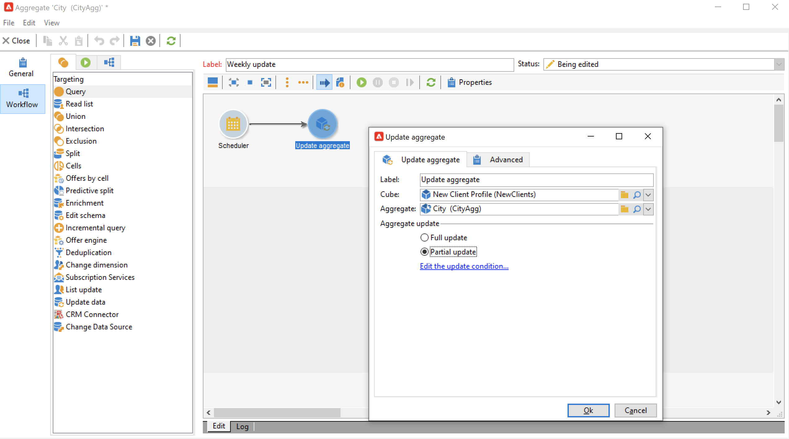

# Atualizar agregado{#update-aggregate}

As agregações definidas em [cubos](../../v8/reporting/gs-cubes.md) para fins de relatório podem ser atualizadas com uma atividade específica. Uma guia **[!UICONTROL Workflow]** está disponível ao configurar a agregação.

Saiba mais sobre cubos e agregações em [esta seção](../../v8/reporting/customize-cubes.md#calculate-and-use-aggregates).

Para atualizar uma agregação, edite a atividade **[!UICONTROL Update aggregate]** e selecione o cubo e a agregação a serem atualizados.

Você pode configurar uma **atualização completa** ou uma **atualização parcial**.

Por padrão, uma atualização completa é executada durante cada cálculo. Para habilitar uma atualização parcial, selecione a opção e defina as condições de atualização.

Uma prática recomendada é adicionar uma atividade **[!UICONTROL Scheduler]** para configurar a frequência das atualizações de cálculo.
