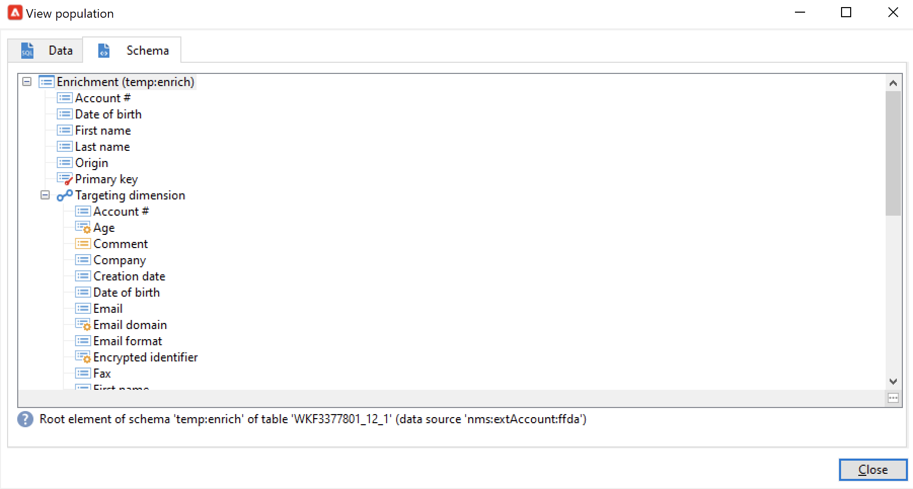
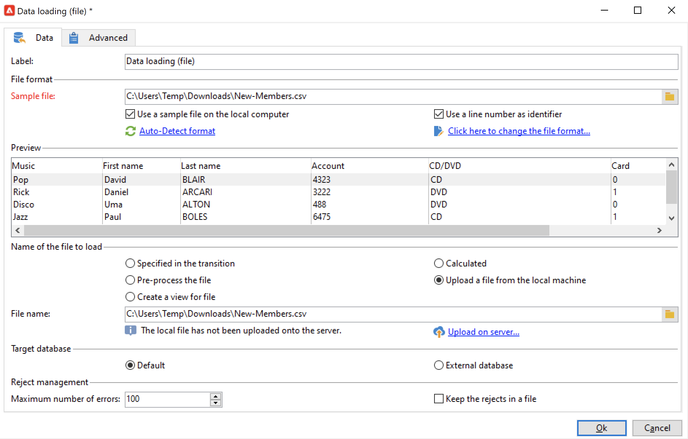

# Usar dados de fluxo de trabalho{#how-to-use-workflow-data}

Você pode usar atividades de workflow para executar várias tarefas. Encontre abaixo exemplos de uso para atualizar o banco de dados criando listas, gerenciar assinaturas, enviar mensagens por meio de um fluxo de trabalho ou enriquecer seus deliveries e seus públicos.

Um conjunto de casos de uso de fluxo de trabalho está disponível em [nesta seção](workflow-use-cases.md).

## Ciclo de vida dos dados {#data-life-cycle}

### Tabela de trabalho temporário do fluxo de trabalho {#work-table}

Nos workflows, os dados transportados de uma atividade para outra são armazenados em uma tabela de trabalho temporária.

Esses dados podem ser exibidos e analisados clicando com o botão direito do mouse na transição apropriada.


Para fazer isso, selecione o menu relevante:

* **[!UICONTROL Display the target...]**

   Esse menu exibe os dados disponíveis sobre o público-alvo.

   

   É possível acessar a estrutura da tabela de trabalho no **[!UICONTROL Schema]** guia.

   

   Para obter mais informações, consulte [esta seção](monitor-workflow-execution.md#worktables-and-workflow-schema).

* **[!UICONTROL Analyze target...]**

   Esse menu permite acessar o assistente de análise descritiva que produz estatísticas e relatórios sobre os dados de transição.

   Para obter mais informações, consulte a [documentação do Campaign Classic v7](https://experienceleague.adobe.com/docs/campaign-classic/using/reporting/analyzing-populations/about-descriptive-analysis.html){target="_blank"}.

Os dados do target são descartados na execução do workflow Somente a última tabela de trabalho está acessível. Você pode configurar o fluxo de trabalho para que todas as tabelas de trabalho permaneçam acessíveis: marque a opção **[!UICONTROL Keep the result of interim populations between two executions]** nas propriedades do fluxo de trabalho.


>[!CAUTION]
>
>Essa opção **nunca** deve ser selecionada em um fluxo de trabalho de **produção**. Essa opção é usada para analisar os resultados e é projetada apenas para fins de teste e, portanto, deve ser usada apenas em ambientes de desenvolvimento ou de preparo.


### Aproveitar os dados de destino {#target-data}

Os dados armazenados na tabela de trabalho temporária do workflow estão disponíveis para tarefas de personalização. Os dados podem ser utilizados na [campos de personalização](../../v8/send/personalization-fields.md).

Isso permite usar dados coletados por uma lista em um delivery, por exemplo. Para fazer isso, use a seguinte sintaxe:

```
%= targetData.FIELD %
```

Os elementos de personalização do tipo **[!UICONTROL Target extension]** (targetData) não estão disponíveis para fluxos de trabalho para construção do target. O target do delivery deve ser construído no fluxo de trabalho e especificado na transição de entrada do delivery.

No exemplo a seguir, você está coletando uma lista de informações sobre clientes, para serem usadas em um email personalizado. Siga as etapas abaixo:

1. Crie um workflow para coletar informações, reconcilie com os dados já existentes no banco de dados, e depois inicie um delivery.

   

1. No nosso exemplo, o conteúdo do arquivo é o seguinte:

   ```
   Music,First name,Last name,Account,CD/DVD,Card
   Pop,David,BLAIR,4323,CD,0
   Rock,Daniel,ARCARI,3222,DVD,1
   Disco,Uma,ALTON,0488,DVD,0
   Jazz,Paul,BOLES,6475,CD,1
   Jazz,David,BOUKHARI,0841,DVD,1
   [...]
   ```

   Para carregar o arquivo, configure o **[!UICONTROL Data loading (file)]** atividade conforme abaixo:

   

1. Configure o **[!UICONTROL Enrichment]** atividade para reconciliar os dados coletados com os existentes no banco de dados do Adobe Campaign. Aqui, a chave de conciliação é o número da conta:

   

1. Em seguida, configure o **[!UICONTROL Delivery]**: ele é criado com base em um template e os recipients são especificados pela transição de entrada.

   

   >[!CAUTION]
   >
   >Somente os dados contidos na transição podem ser usados para personalizar o delivery. Os campos de personalização do tipo **targetData** só estão disponíveis para a população de entrada da atividade de **[!UICONTROL Delivery]**.

1. No template de delivery, use os campos coletados no fluxo de trabalho.

   Para fazer isso, insira os campos de personalização do tipo **[!UICONTROL Target extension]**.

   

   Nesse exemplo, queremos inserir o gênero de música e o tipo de mídia favoritos do cliente (CD ou DVD), conforme declarado no arquivo coletado pelo workflow.

   Como um diferencial, vamos adicionar um cupom para os titulares de cartões de fidelidade, ou seja, recipients para os quais o valor &#39;Cartão&#39; for igual a 1.

   

   Os dados do tipo **[!UICONTROL Target extension]** (targetData) são inseridos em deliveries usando as mesmas características de todos os campos de personalização. Eles também podem ser usados no assunto, rótulos de link ou nos próprios links.


## Atualizar o banco de dados {#update-the-database}

Todos os dados coletados podem ser usados para atualizar o banco de dados ou nos deliveries. Por exemplo, você pode enriquecer as possibilidades de personalização do conteúdo da mensagem (incluir o número de contratos na mensagem, especificar o carrinho de compras comum do ano passado, etc.) ou detalhar o público alvo (enviar uma mensagem aos cotitulares do contrato, ter como target os mil melhores assinantes dos serviços online e etc.). Esses dados também podem ser exportados ou arquivados em uma lista.

### Atualizar listas  {#list-updates}

Os dados do banco de dados do Adobe Campaign e as listas existentes podem ser atualizados usando duas atividades dedicadas:

* A atividade de **[!UICONTROL List update]** permite armazenar worktables em um DataList.

   Você pode selecionar uma lista existente ou criar uma. Nesse caso, o nome e possivelmente a pasta de registro são calculados.

   

   Consulte [Atualização da lista](list-update.md).

* A atividade **[!UICONTROL Update data]** realiza uma atualização em massa dos campos no banco de dados.

   Para mais informações, consulte [Atualização de dados](update-data.md).

### Gerenciar subscrições {#subscription-management}

Para saber mais sobre assinatura e cancelamento de assinatura de recipients em um serviço de informação por meio de um workflow, consulte [Serviços de assinatura](subscription-services.md).
