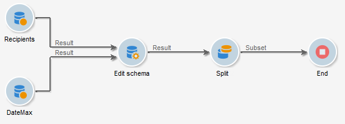
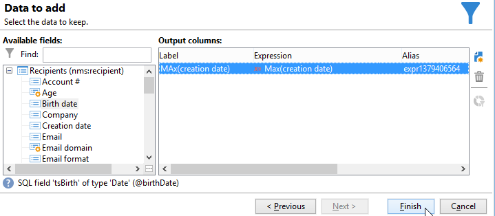
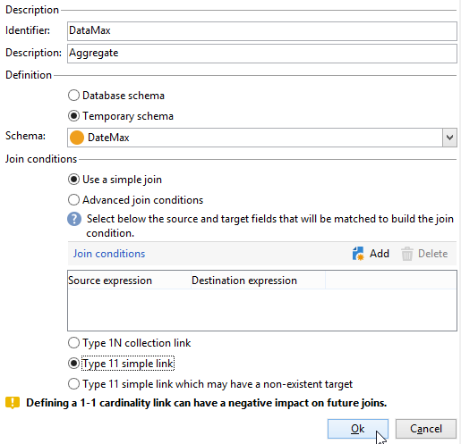
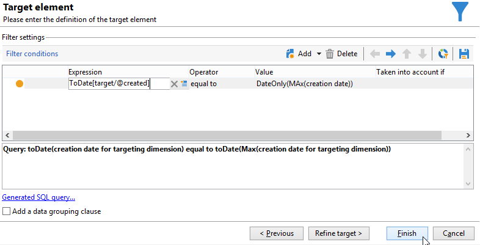

# Usar agregações{#using-aggregates}

Esse caso de uso detalha como identificar automaticamente os últimos destinatários adicionados ao banco de dados.

Usando o processo a seguir, a data de criação dos destinatários no banco de dados é comparada com a última data conhecida em que um destinatário foi criado usando um agregado. Todos os destinatários criados no mesmo dia também serão selecionados.

Para executar um filtro de tipo **Creation date = max (Creation date)** nos destinatários, execute um fluxo de trabalho para seguir estas etapas:

1. Colete destinatários do banco de dados usando uma consulta básica. Para obter mais informações, consulte [Criação de consulta](query.md#creating-a-query).
1. Calcule a última data conhecida que um destinatário foi criado usando o resultado gerado pela função de agregação **max (Creation date)**.
1. Vincule cada destinatário ao resultado da função de agregação no mesmo esquema.
1. Filtre destinatários usando o agregado através do esquema editado.

## Etapa 1: Cálculo do resultado agregado {#step-1--calculating-the-aggregate-result}

1. Criar uma consulta. Aqui, o objetivo é calcular a última data de criação conhecida de todos os destinatários no banco de dados. A consulta portanto não contém um filtro.
1. Selecione **[!UICONTROL Add data]**.
1. Nas janelas que abrirem, selecione **[!UICONTROL Data linked to the filtering dimension]** e depois **[!UICONTROL Filtering dimension data]**.
1. Na janela **[!UICONTROL Data to add]**, adicione uma coluna que calcula o valor máximo do campo **Creation date** na tabela de destinatários. É possível usar o editor de expressão ou inserir **max(@created)** diretamente em um campo na coluna **[!UICONTROL Expression]**. Clique no botão **[!UICONTROL Finish]**

   

1. Clique em **[!UICONTROL Edit additional data]** e em **[!UICONTROL Advanced parameters...]**. Marque a opção **[!UICONTROL Disable automatic adding of the primary keys of the targeting dimension]**.

   Essa opção garante que todos os destinatários não sejam exibidos como resultado e que os dados adicionados explicitamente não sejam mantidos. Nesse caso, ele se refere à última data em que um destinatário foi criado.

   Deixe marcada a opção **[!UICONTROL Remove duplicate rows (DISTINCT)]**.

## Etapa 2: Vincular os destinatários e o resultado da função de agregação {#step-2--linking-the-recipients-and-the-aggregation-function-result}

Para vincular a consulta de destinatários à consulta que realiza o cálculo da função de agregação, é necessário usar uma atividade de edição de esquema.

1. Defina a consulta de destinatários como um conjunto principal.
1. Na guia **[!UICONTROL Links]**, adicione um novo link e insira as informações na janela que aparece da seguinte maneira:

   * Selecione o esquema temporário relacionado ao agregado. Os dados desse esquema serão adicionados aos membros do conjunto principal.
   * Selecione **[!UICONTROL Use a simple join]** para vincular o resultado agregado a cada destinatário do conjunto principal.
   * Finalmente, especifique que o link é um **[!UICONTROL Type 11 simple link]**.

   

Portanto, o resultado de agregação é vinculado a cada destinatário.

## Etapa 3: Filtrar destinatários usando o agregado. {#step-3--filtering-recipients-using-the-aggregate-}

Depois que o link tiver sido estabelecido, o resultado agregado e os destinatários farão parte do mesmo esquema temporário. Portanto, é possível criar um filtro no esquema para comparar a data de criação dos destinatários e a última data de criação conhecida, representada pela função de agregação. Esse filtro é realizado usando uma atividade Split.

1. Na guia **[!UICONTROL General]**, selecione **Recipients** como dimensão de direcionamento e **Edit schema** como dimensão do filtro (para filtrar na atividade de esquema de transição de entrada).
1. Na guia **[!UICONTROL subsets]**, selecione **[!UICONTROL Add a filtering condition on the inbound population]** e clique em **[!UICONTROL Edit...]**.
1. Usando o editor de expressão, adicione um critério de igualdade entre a data de criação dos destinatários e a data de criação calculada pelo agregado.

   Os campos de tipo de data no banco de dados geralmente são salvos em milissegundos. Portanto, é necessário estender esses itens para um dia inteiro para evitar a recuperação dos destinatários criados apenas com os mesmos milissegundos.

   Para fazer isso, use a função **ToDate**, disponível no editor de expressão, que converte datas e horas em datas simples.

   As expressões a serem usadas para os critérios são:

   * **[!UICONTROL Expression]**: `toDate([target/@created])`.
   * **[!UICONTROL Value]**: `toDate([datemax/expr####])`, onde expr#### está relacionado ao agregado especificado na consulta de função de agregação.

   

O resultado da atividade split refere-se aos destinatários criados no mesmo dia da última data de criação conhecida.

É possível então adicionar outras atividades, como uma atualização de lista ou uma entrega para enriquecer seu fluxo de trabalho.
