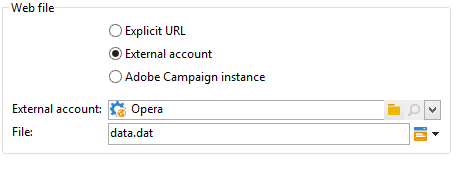

# Download da Web{#web-download}

A atividade de **download da Web** inicia o download de um arquivo em uma URL explícita, uma conta externa ou uma instância do Adobe Campaign. O protocolo HTTP é usado. Isso pode ser um download GET ou POST.

## Propriedades {#properties}

1. **Seleção do arquivo Web**

   Para especificar o arquivo a ser baixado, você pode inserir a URL do arquivo, usar a conta HTTP externa onde o arquivo está armazenado ou carregar o arquivo por meio de uma instância do Adobe Campaign. Os parâmetros disponíveis são detalhados abaixo:

   * Para inserir diretamente o URL do arquivo a ser baixado, selecione a opção **[!UICONTROL Explicit URL]** e especifique o URL no campo apropriado. Este URL pode ser construído com dados variáveis.

     

   * Para usar uma **[!UICONTROL External account]**, selecione a conta na lista suspensa e especifique o arquivo a ser baixado.

     Contas externas são configuradas no nó **[!UICONTROL Administration > Platform > External accounts]** da árvore do Adobe Campaign. Os parâmetros da conta podem ser editados por meio do ícone **[!UICONTROL Edit link]**.

     

   * Para baixar o arquivo da instância do Adobe Campaign, selecione a opção **[!UICONTROL Adobe Campaign Instance]**.

     

1. **Historização de arquivo**

   O link **[!UICONTROL File historization settings...]** possibilita especificar o diretório de armazenamento de arquivos e a frequência de limpeza desse diretório.

   

   As seguintes opções estão disponíveis:

   * **[!UICONTROL Use a default storage directory]**: o arquivo é sempre movido antes de ser processado. Se essa opção estiver marcada, o arquivo será movido para o diretório de armazenamento padrão (o diretório **vars** da pasta de instalação do Adobe Campaign). Para especificar um diretório de armazenamento, desmarque a caixa e digite seu caminho no campo **[!UICONTROL Storage directory]**
   * **[!UICONTROL Number of files]**: digite o número máximo de arquivos a serem mantidos no diretório de armazenamento.
   * **[!UICONTROL Maximum size (in Mb)]**: digite a capacidade máxima do diretório de armazenamento (em megabytes).

   Todo arquivo é mantido por 24 horas antes de ser sujeito às regras de limpeza definidas. A limpeza ocorre antes do início da atividade e, portanto, não leva em consideração o arquivo do fluxo de trabalho em andamento.

   Os arquivos são excluídos em função de sua data de criação (mais antiga a mais recente). Os arquivos mais antigos são limpos até que ambas as regras de limpeza sejam verificadas. Portanto, se um limite 100 arquivos for definido, isso significa que o diretório de armazenamento sempre conterá os 100 arquivos mais recentes antes do início do fluxo de trabalho, bem como aqueles que estão sendo processados no fluxo de trabalho em andamento.

   Se você não quiser mais definir um limite para as opções **[!UICONTROL Number of files]** e **[!UICONTROL Maximum size (in Mb)]**, digite 0 como um valor.

1. **Parâmetros avançados**

   O link **[!UICONTROL Advanced parameters...]** possibilita especificar as opções adicionais exibidas abaixo:

   * **[!UICONTROL Follow redirections]**: o redirecionamento de arquivo permite usar substituições para direcionar a entrada ou saída de dados para um dispositivo de um tipo diferente.
   * **[!UICONTROL Add the HTTP headers to the file]**: em alguns casos, talvez você queira adicionar outros cabeçalhos HTTP a um arquivo. Normalmente, esses cabeçalhos serão usados para fornecer informações adicionais para fins de solução de problemas, para [Compartilhamento de recursos entre origens (CORS)](https://developer.mozilla.org/docs/Web/HTTP/CORS) ou para definir diretivas específicas de armazenamento em cache.
   * **[!UICONTROL Ignore the HTTP return code]**: os códigos de retorno HTTP, também conhecidos como códigos de status HTTP, indicam o resultado de uma solicitação HTTP.

   

   A opção **[!UICONTROL Process errors]** é detalhada em [Processamento de erros](monitor-workflow-execution.md#processing-errors).

## Parâmetros de saída {#output-parameters}

* filename: nome completo do arquivo baixado.
