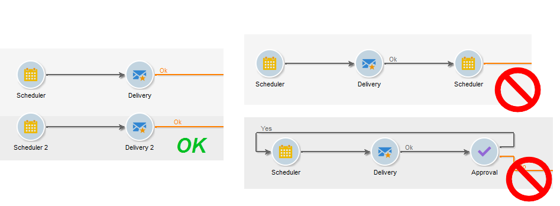

# Práticas recomendadas de workflow{#workflow-best-practices}

Abaixo estão listadas as diretrizes gerais para otimizar o desempenho do fluxo de trabalho do Campaign, melhorar o design do fluxo de trabalho e selecionar as configurações corretas.

## Pastas de workflow {#workflow-folders}

A Adobe recomenda criar seus workflows em uma pasta dedicada.

Se o fluxo de trabalho afetar toda a plataforma (processos de limpeza, por exemplo), é possível considerar adicionar uma subpasta à pasta interna **[!UICONTROL Technical Workflows]**.

## Nomeação do workflow {#workflow-naming}

Como facilita a localização e a solução de problemas se não estiverem executando da forma esperada, a Adobe recomenda que os workflows tenham nomes e rótulos adequados: preencha o campo de descrição do workflow para resumir o processo para que o operador possa entender facilmente.

Se o workflow fizer parte de um processo envolvendo vários workflows, você pode ser explícito ao inserir um rótulo. Usar números é uma ótima maneira de organizar os workflows (por Rótulo).

Por exemplo:

* 001 – Importar – Importação de recipientes
* 002 – Importar – Importação de vendas
* 003 – Importar – Importação de detalhes de vendas
* 010 – Exportar – Exportação de logs de entregas
* 011 – Exportar – Exportação de logs de rastreamento

## Severidade do workflow {#workflow-severity}

É possível configurar a severidade nas propriedades do fluxo de trabalho, na guia **[!UICONTROL Execution]**:

* Normal
* Produção
* Crítico

Fornecer essas informações ao criar um workflow ajudará a entender a severidade do processo configurado.

Essa opção tem impacto funcional somente nos workflows da campanha.

Workflows da campanha (workflows criados como parte de uma campanha/operação) com uma severidade mais alta são executados com prioridade caso a campanha tenha muitos processos executados simultaneamente. Por padrão, apenas dez processos podem ser executados simultaneamente em uma campanha, de acordo com a opção NmsOperation_LimitConcurrency. Por exemplo, se uma campanha contêm 25 workflows, os workflows com uma severidade mais alta serão executados no primeiro pool de dez processos.

## Monitoramento do workflow {#workflow-monitoring}

Todos os workflows agendados que estão sendo executados em ambientes de produção devem ser monitorados para que um alerta seja enviado em caso de erro.

Nas propriedades do fluxo de trabalho, selecione um grupo supervisor, seja o grupo **[!UICONTROL Workflow supervisors]** padrão ou um grupo personalizado. Certifique-se de que pelo menos um operador participe desse grupo, com um email definido.

Antes de começar a construir um workflow, lembre-se de definir supervisores de workflow. Eles serão notificados por email em caso de erro. Para obter mais informações, consulte [Gerenciando erros](monitor-workflow-execution.md#managing-errors).

Verifique regularmente a guia **[!UICONTROL Monitoring]** para visualizar o status geral dos workflows ativos. Para obter mais informações, consulte [Supervisão de instância](monitor-workflow-execution.md#instance-supervision).

O Workflow HeatMap permite aos administradores da plataforma Adobe Campaign monitorarem a carga na instância e planejarem os workflows correspondentes. Para obter mais informações, consulte [Monitoramento de workflow](heatmap.md).

## Atividades {#using-activities}

>[!CAUTION]
>
>É possível copiar e colar atividades dentro de um mesmo workflow. No entanto, não recomendamos atividades de copiar e colar em workflows diferentes. Algumas configurações anexadas a atividades como Delivery e Scheduler podem gerar conflitos e erros ao executar o workflow de destino. Em vez disso, recomendamos usar **Duplicate** nos workflows. Para obter mais informações, consulte [Duplicação de workflows](build-a-workflow.md#duplicate-workflows).

### Nome da atividade {#name-of-the-activity}

Ao desenvolver seu workflow, todas as atividades terão um nome, como todos os objetos do Adobe Campaign. Embora o nome seja gerado pela ferramenta, recomendamos que você renomeie com um nome explícito ao configurá-lo. O risco de fazer isso depois é que pode interromper o workflow com atividades usando o nome de outra atividade anterior. Portanto, seria um trabalho difícil atualizar os nomes depois.

O nome da atividade pode ser encontrado na guia **[!UICONTROL Advanced]**. Não os deixe nomeados **[!UICONTROL query]**, **[!UICONTROL query1]**, **[!UICONTROL query11]**, mas forneça nomes explícitos como **[!UICONTROL querySubscribedRecipients]**. Esse nome aparecerá no diário e, se aplicável, nos logs SQL, e isso ajudará a depurar o fluxo de trabalho ao configurá-lo.

### Primeira e última atividades {#first-and-last-activities}

* Sempre inicie o fluxo de trabalho com uma atividade **[!UICONTROL Start]** ou atividade **[!UICONTROL Scheduler]** . Quando pertinente, também é possível usar uma atividade **[!UICONTROL External signal]**.
* Ao criar o fluxo de trabalho, use apenas uma atividade **[!UICONTROL Scheduler]** por ramificação. Se a mesma ramificação de um fluxo de trabalho tiver vários schedulers (vinculados uns aos outros), o número de tarefas a serem executadas será multiplicado exponencialmente, o que irá sobrecarregar consideravelmente o banco de dados. Essa regra também se aplica a todas as atividades com uma guia **[!UICONTROL Scheduling & History]**. Saiba mais em [Agendamento](scheduler.md).

  

* Use atividades **[!UICONTROL End]** para cada fluxo de trabalho. Isso permite que o Adobe Campaign libere espaço temporário usado para cálculos dentro de workflows. Para obter mais informações, consulte [início e fim](start-and-end.md).

### Javascript em uma atividade {#javascript-within-an-activity}

Você pode adicionar JavaScript ao inicializar uma atividade do fluxo de trabalho. Isso pode ser feito na guia **[!UICONTROL Advanced]** da atividade.

Para facilitar a identificação do fluxo de trabalho, recomendamos usar traços duplos no início e no fim do rótulo da atividade da seguinte maneira: -- Meu rótulo --.

### Sinal {#signal}

Na maior parte do tempo, você não saberá de onde o sinal é chamado. Para evitar esse problema, use o campo **[!UICONTROL Comment]** dentro da guia **[!UICONTROL Advanced]** da atividade do sinal para documentar a origem esperada de um sinal para essa atividade.

## Atualizações do fluxo de trabalho {#workflow-update}

Um workflow de produção não deve ser atualizado diretamente. A menos que o processo consista na criação de uma campanha com templates de workflows, os processos devem ser testados primeiro em um ambiente de desenvolvimento. Após essa validação, o workflow pode ser implantado e iniciado na produção.

Realize todos os testes em ambientes de desenvolvimento ou de preparo, não em ambientes de produção. O desempenho não pode ser assegurado em tais casos.

Os workflows arquivados podem ser mantidos em plataformas de desenvolvimento ou teste, em uma pasta Arquivada, mas o ambiente de produção deve permanecer o mais limpo possível. Os workflows antigos devem ser removidos do ambiente de produção se estiverem inativos.

## Execução e desempenho {#execution-and-performance}

### Logs {#logs}

O método JavaScript **[!UICONTROL logInfo()]** O é uma solução para depurar um workflow. No entanto, ele deve ser usado com cuidado, especialmente para atividades executadas com frequência: pode sobrecarregar os logs e aumentar significativamente o tamanho da tabela de log.

### Manter populações interinas

A variável **Manter o resultado de públicos provisórios entre duas execuções** A opção mantém tabelas temporárias entre duas execuções de um workflow.

Está disponível na guia **[!UICONTROL General]** das propriedades do fluxo de trabalho e pode ser usado para desenvolvimento e testes para monitorar dados e verificar resultados. Você pode usar essa opção em ambientes de desenvolvimento, mas nunca usá-la em ambientes de produção. Manter tabelas temporárias pode resultar no aumento significativo do tamanho de banco de dados e, por fim, atingir o limite de tamanho. Além disso, o backup ficará lento.

Somente as tabelas de trabalho da última execução do workflow são mantidas. As tabelas de trabalho das execuções anteriores são removidas pelo fluxo de trabalho **[!UICONTROL cleanup]**, executado diariamente.

>[!CAUTION]
>
>Essa opção **nunca** deve ser selecionada em um fluxo de trabalho de **produção**. Essa opção é usada para analisar os resultados e é projetada apenas para fins de teste e, portanto, deve ser usada apenas em ambientes de desenvolvimento ou de preparo.

### Registrar consultas SQL

A variável **Registrar consultas SQL no journal** está disponível na **[!UICONTROL Execution]** das propriedades do fluxo de trabalho. Essa opção registra todas as consultas SQL das diferentes atividades e fornece uma maneira de ver o que é realmente executado pela plataforma. No entanto, essa opção só deve ser usada **temporariamente** durante o desenvolvimento e **não ativado na produção**.

A prática recomendada é limpar os logs quando eles não forem mais necessários. O histórico do fluxo de trabalho não é removido automaticamente: todas as mensagens são mantidas por padrão. O histórico pode ser eliminado por meio do menu **[!UICONTROL File > Actions]** ou clicando no botão Ações localizado na barra de ferramentas acima da lista. Selecione Purge history.
Para saber como limpar seus registros, consulte esta [documentação](start-a-workflow.md).

### Planejamento de workflow {#workflow-planning}

Práticas recomendadas adicionais devem ser aplicadas ao planejamento de execução dos workflows para evitar problemas:

* Mantenha um nível estável de atividade ao longo do dia e evite picos para evitar que a instância fique sobrecarregada. Para fazer isso, distribua os horários de início do workflow uniformemente ao longo do dia.
* Agende a carga de dados durante a noite para reduzir o a contenção de recurso.
* Workflows longos podem ter impacto no servidor e nos recursos do banco de dados. Divida os workflows mais longos para reduzir o tempo de processamento.
* Para reduzir os tempos de execução gerais, substitua atividades demoradas por atividades simplificadas e mais rápidas.
* Evite executar mais de 20 workflows simultaneamente. Quando muitos workflows são executados ao mesmo tempo, sua plataforma pode ficar sobrecarregada e se tornar instável.

### Opção de Executar no mecanismo {#execute-in-the-engine-option}

Em um ambiente de produção, evite executar workflows no mecanismo. Quando a variável **[!UICONTROL Execute in the engine]** estiver marcada na caixa **[!UICONTROL Workflow properties]**, o workflow tem prioridade e todos os outros workflows são interrompidos pelo mecanismo do workflow até que este seja concluído.

