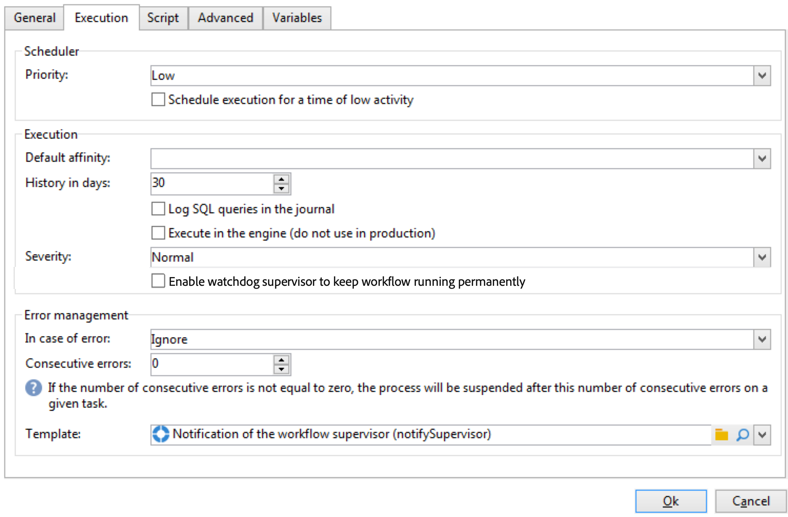
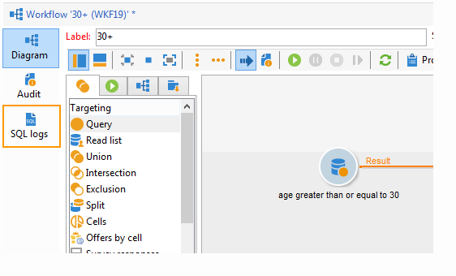

# Propriedades do fluxo de trabalho{#workflow-properties}

## Guia Execution {#execution-tab}

A guia **[!UICONTROL Execution]** da janela **[!UICONTROL Properties]** em um fluxo de trabalho está dividida em três seções:

### Scheduler {#scheduler}

Esta seção só é exibida nos fluxos de trabalho da campanha.

* **[!UICONTROL Priority]**

  O mecanismo de fluxo de trabalho processa os fluxos de trabalho a serem executados com base no critério de prioridade definido neste campo. Por exemplo, todos os fluxos de trabalho com uma prioridade **[!UICONTROL Average]** serão executados antes daqueles com prioridade **[!UICONTROL Low]**.

* **[!UICONTROL Schedule execution for a time of low activity]**

  Essa opção adia o início do fluxo de trabalho para um período menos ocupado. Alguns fluxos de trabalho podem custar caro em termos de recursos para o motor do banco de dados. Recomendamos o agendamento da execução para uma hora de baixa atividade (à noite, por exemplo). Os períodos de baixa atividade são definidos no fluxo de trabalho técnico em **[!UICONTROL Processes on campaigns]**.

### Execução {#execution}

* **[!UICONTROL Default affinity]**

  Se a sua instalação incluir vários servidores de fluxo de trabalho, utilize este campo para escolher a máquina em que o fluxo de trabalho será executado. Se o valor definido nesse campo não existir em nenhum servidor, o fluxo de trabalho permanecerá pendente.

* **[!UICONTROL History in days]**

  As tabelas de trabalho do banco de dados mantêm um histórico de execuções (tarefas, eventos, log). Aqui você pode definir a quantidade de dias para o arquivamento deste fluxo de trabalho: o processo de limpeza excluirá os arquivos mais antigos uma vez por dia. Se o valor nesse campo for zero, o arquivo nunca será excluído.

* **[!UICONTROL Log SQL queries in the journal]**

  Essa operação é reservada para usuários avançados. Refere-se a fluxos de trabalho que contêm atividades de segmentação (consulta, união, intersecção, etc.). Quando essa opção é marcada, as queries SQL enviadas ao banco de dados durante a execução do fluxo de trabalho são exibidas na Adobe Campaign: isso significa que você pode analisá-las para otimizar as queries ou diagnosticar problemas.

  Os queries são exibidos em uma guia **[!UICONTROL SQL logs]** adicionada ao fluxo de trabalho (exceto fluxos de trabalho da campanha) e à atividade **[!UICONTROL Properties]** quando a opção está habilitada. A aba **[!UICONTROL Audit]** também inclui queries SQL.

  

* **[!UICONTROL Execute in the engine]**

  Essa opção só pode ser usada para depuração e nunca em produção. Quando estiver habilitado, o fluxo de trabalho terá prioridade e todos os outros fluxos serão interrompidos até a conclusão deste.

* **[!UICONTROL Enable watchdog supervisor to keep workflow running permanently]**

  Essa opção força os workflows a serem reiniciados automaticamente após um erro. Quando habilitado, a reinicialização verificará o status do workflow a cada 30 segundos e o reiniciará quando necessário. Para ajustar o intervalo de 30 segundos, você pode criar a opção técnica `XtkWorkflow_WatchdogRestartTimerTimeout` e usar um tipo de dados integer para especificar o atraso desejado.

  >[!NOTE]
  >
  >* Esta opção está disponível a partir da v8.6.4.
  >
  >* Esta opção destina-se a usuários avançados e deve ser habilitada somente para **workflows técnicos**.
  >
  >* Esta opção é habilitada por padrão para o contexto disponível de fluxos de trabalho de replicação centralizados de uma [implantação corporativa (FFDA)](../../v8/architecture/enterprise-deployment.md). [Saiba mais](../../v8/architecture/replication.md)

### Gerenciamento de erros {#error-management}

* **[!UICONTROL Troubleshooting]**

  Este campo permite a definição das ações a serem tomadas se uma tarefa de fluxo de trabalho tiver erros. Há duas opções possíveis:

   * **[!UICONTROL Stop the process]**: o fluxo de trabalho é pausado automaticamente. O status do fluxo de trabalho muda para **[!UICONTROL Failed]**. Quando o problema for resolvido, reinicie o fluxo de trabalho usando os botões **[!UICONTROL Start]** ou **[!UICONTROL Restart]**.
   * **[!UICONTROL Ignore]**: o status da tarefa que provocou o erro muda para **[!UICONTROL Failed]**, mas o fluxo de trabalho mantém o status de **[!UICONTROL Started]**. Essa configuração é relevante para tarefas recorrentes: se a ramificação incluir um programador, ela iniciará normalmente na próxima vez que o fluxo de trabalho for executado.

* **[!UICONTROL Consecutive errors]**

  Este campo fica disponível quando o valor **[!UICONTROL Ignore]** for selecionado no campo **[!UICONTROL In case of errors]**. Você pode especificar quantos erros podem ser ignorados antes que o processo seja interrompido. Após esse número ser alcançado, o status do fluxo de trabalho será alterado para **[!UICONTROL Failed]**. Se o valor desse campo for 0, o fluxo de trabalho nunca será interrompido independentemente do número de erros.

* **[!UICONTROL Template]**

  Este campo permite que você selecione o modelo de notificação a ser enviado aos supervisores do fluxo de trabalho quando seu status for alterado para **[!UICONTROL Failed]**.

  Os operadores envolvidos serão notificados por e-mail, se houver um endereço de e-mail em seu perfil. Para definir supervisores de fluxo de trabalho, vá até o campo **[!UICONTROL Supervisor(s)]** das propriedades (guia **[!UICONTROL General]**).

  

  O modelo padrão **[!UICONTROL Notification to a workflow supervisor]** inclui um link para acessar o Console do Cliente do Adobe Campaign pela Web para que o recipient possa trabalhar no problema quando estiver conectado.

  Para criar um modelo personalizado, vá para **[!UICONTROL Administration>Campaign management>Technical deliveries and templates]**.
