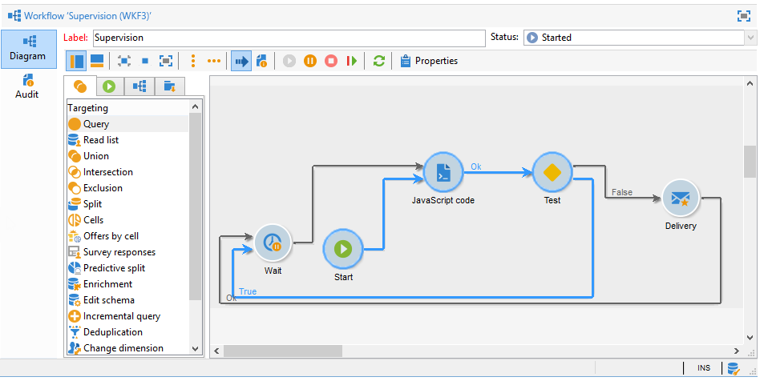
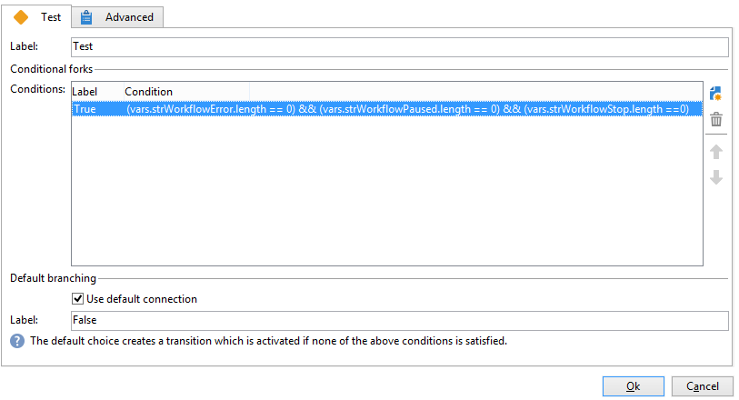
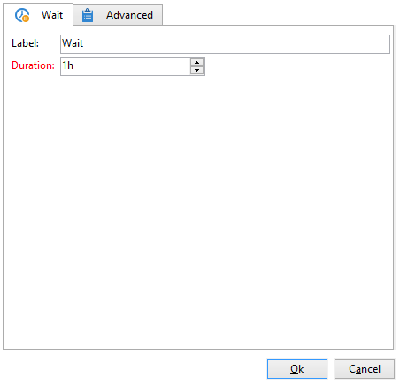
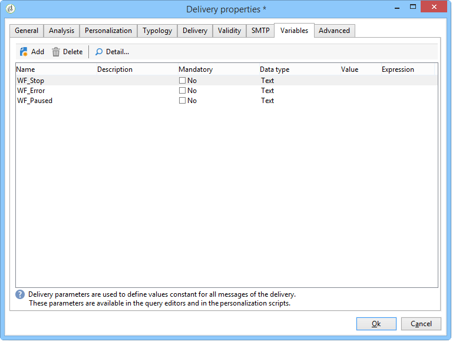
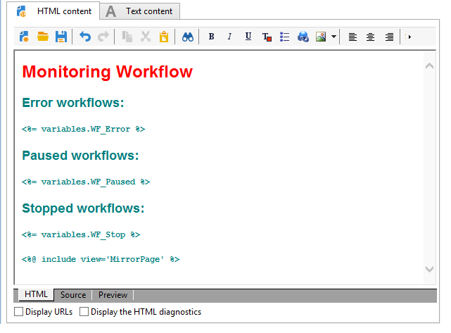
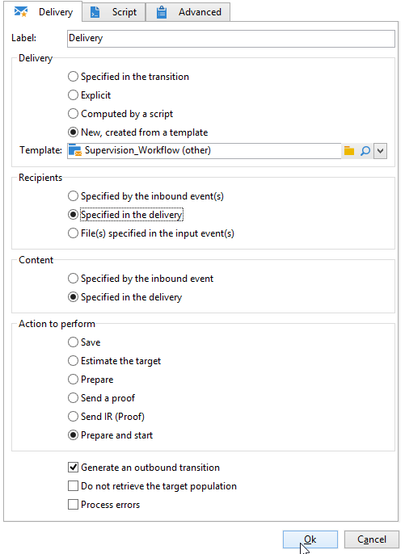
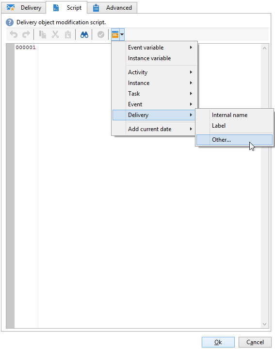
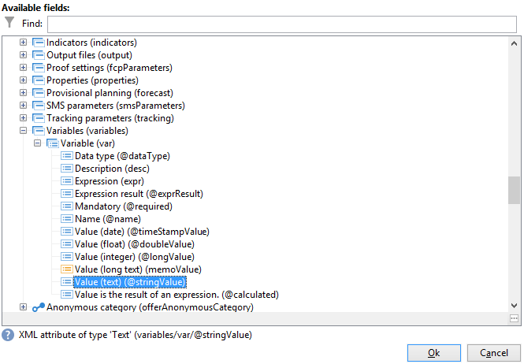

# Caso de uso: supervisionar fluxos de trabalho{#supervising-workflows}

Esse caso de uso detalha a criação de um fluxo de trabalho que permite monitorar o status de um conjunto de fluxos de trabalho que são &quot;pausados&quot;, &quot;interrompido&quot; ou &quot;com erros&quot;.

Seu objetivo é:

* Usar um fluxo de trabalho para monitorar um grupo de fluxos de trabalho de negócios.
* Enviar uma mensagem para um supervisor por meio de uma atividade &quot;entrega&quot;.

Para monitorar o status de um conjunto de fluxos de trabalho, siga estas etapas:

1. Crie o fluxo de trabalho de sincronização.
1. Escreva o JavaScript para determinar se os fluxos de trabalho estão pausados, interrompidos ou com erros.
1. Crie a atividade **[!UICONTROL Test]**.
1. Prepare o modelo de entrega.

>[!NOTE]
>
>Além do fluxos de trabalho, o **Workflow Heatmap** do Campaign permite analisar os detalhes dos fluxos de trabalho executados no momento. Para obter mais informações, consulte a [seção dedicada](heatmap.md).
>
>Para obter mais informações sobre como **monitorar a execução dos fluxos de trabalho**, consulte [esta seção](monitor-workflow-execution.md).

## Etapa 1: Criação do fluxo de trabalho de monitoramento {#step-1--creating-the-monitoring-workflow}

A pasta de fluxos de trabalho que vamos monitorar é a pasta **&quot;CustomWorkflows&quot;** armazenada no nó **Administration > Production > Technical workflows.** Esta pasta contém um conjunto de fluxos de trabalho de negócios.

O **Fluxo de trabalho de monitoramento** é armazenado na raiz da pasta Technical Workflows. O rótulo usado é **&quot;Monitoring&quot;**.

O esquema a seguir mostra a sequência de atividades:



Este fluxo de trabalho é composto por:

* uma atividade **&quot;Start&quot;** .
* uma atividade **&quot;JavaScript code&quot;** responsável pela análise da pasta de fluxos de trabalho corporativos.
* uma atividade **&quot;Test&quot;** para enviar uma entrega ao supervisor ou reiniciar o fluxo de trabalho.
* uma atividade **&quot;Entrega&quot;** responsável pelo layout da mensagem.
* uma atividade **&quot;Wait&quot;** que controla os tempos de lead entre as iterações do fluxo de trabalho.

## Etapa 2: Gravação do JavaScript {#step-2--writing-the-javascript}

A primeira parte do código JavaScript coincides com um **query (queryDef)** que permite identificar os fluxos de trabalho com status &quot;pause&quot; (@state == 13), &quot;error&quot; (@failed == 1) ou &quot;stopped&quot; (@state == 20).

O **nome interno** da pasta de fluxo de trabalho a monitorar é fornecido na seguinte condição:

```
<condition boolOperator="AND" expr="[folder/@name] = 'Folder20'" internalId="1"/>
```

```
var strError = "";
var strPaused = "";
var strStop = "";

var queryWkfError = xtk.queryDef.create(
  <queryDef schema="xtk:workflow" operation="select">
    <select>
      <node expr="@internalName"/>
      <node expr="@state"/>
      <node expr="@label"/>
      <node expr="@failed"/>
      <node expr="@state"/>   
    </select>
    <where id="12837805386">
      <condition boolOperator="AND" expr="[folder/@name] = 'Folder20'" internalId="1"/>
        <condition boolOperator="AND" internalId="2">
          <condition boolOperator="OR" expr="@state = 20" internalId="3"/>
          <condition expr="@state = 13" internalId="4"/>
        </condition>  
    </where>
  </queryDef>
);
var ndWkfError = queryWkfError.ExecuteQuery(); 
```

A segunda parte do código JavaScript permite **exibir uma mensagem para cada fluxo de trabalho** com base no status recuperado durante a consulta.

>[!NOTE]
>
>As strings criadas devem ser carregadas nas variáveis de evento do fluxo de trabalho.

```
for each ( var wkf in ndWkfError.workflow ) 
{
  if ( wkf.@state == 13 )  // Status 13 = paused
  {
    if ( wkf.@failed == 1 )
      strError += "<li>Workflow '" + wkf.@internalName + "' with the label '" + wkf.@label + "'</li>";
    else
      strPaused += "<li>Workflow '" + wkf.@internalName + "' with the label '" + wkf.@label + "'</li>";
  }
  
  if ( wkf.@state == 20 )  // Status 20 = stop
    strStop += "<li>Workflow '" + wkf.@internalName + "' with the label '" + wkf.@label + "'</li>";
}

vars.strWorkflowError = strError;
vars.strWorkflowPaused = strPaused;
vars.strWorkflowStop = strStop;
```

## Etapa 3: Criação da atividade &quot;Test&quot; {#step-3--creating-the--test--activity}

A atividade &quot;Test&quot; permite determinar se uma entrega precisa ser enviada ou se o fluxo de trabalho de monitoramento precisa executar outro ciclo com base na atividade &quot;Wait&quot;.

Uma entrega é realizada ao supervisor **se pelo menos uma das três variáveis de evento &quot;vars.strWorkflowError&quot;, &quot;vars.strWorkflowPaused&quot; ou &quot;vars.strWorkflowStop&quot; for não nulas.**



A atividade &quot;Wait&quot; pode ser configurada para reiniciar o fluxo de trabalho de monitoramento em intervalos regulares. Para esse caso de uso, **o tempo de espera é definido como uma hora**.



## Etapa 4: Preparação da entrega {#step-4--preparing-the-delivery}

A atividade &quot;Entrega&quot; baseia-se em um **template de entrega** armazenado no nó **Resources > Templates > Templates de entrega**.

Este modelo deve incluir:

* **o endereço de e-mail do supervisor**.
* **Conteúdo HTML** para inserir texto personalizado.

  

  As três variáveis declaradas (WF_Stop, WF_Paused, WF_Error) correspondem às três variáveis de evento do fluxo de trabalho.

  Essas variáveis devem ser declaradas na guia **Variables** das propriedades do modelo de entrega.

  Para recuperar **o conteúdo das variáveis de evento do fluxo de trabalho**, é preciso declarar as variáveis específicas para a entrega que será inicializada com valores retornados pelo código JavaScript.

  O modelo de entrega tem o seguinte conteúdo:

  

Depois que o modelo tiver sido criado e aprovado, é necessário configurar a atividade **Entrega** para:

* vincular a atividade &quot;Entrega&quot; ao modelo de entrega criado anteriormente.
* vincular as variáveis de evento do fluxo de trabalho àquelas específicas do modelo de entrega.

Clique duas vezes na atividade **Entrega** e selecione as seguintes opções:

* Entrega: selecione **New, created from a template** e selecione o modelo de entrega criado anteriormente.
* Para os campos **Destinatários e Conteúdo**, selecione **Especificado na entrega**.
* Ação para executar: selecione **Prepare and start**.
* Desmarque a opção **Process errors**.

  

* Acesse a guia **Script** da atividade **Delivery**, adicione três variáveis de tipo de **character string** por meio do menu de campo de personalização.

  

  

  As três variáveis declaradas são:

  ```
  delivery.variables._var[0].stringValue = vars.strWorkflowError;
  delivery.variables._var[1].stringValue = vars.strWorkflowPaused;
  delivery.variables._var[2].stringValue = vars.strWorkflowStop; 
  ```

Depois que esse workflow de monitoramento for iniciado, ele enviará um resumo para os recipients.
