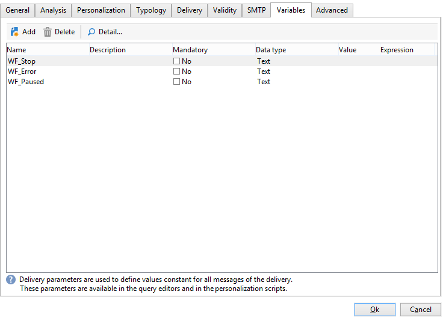
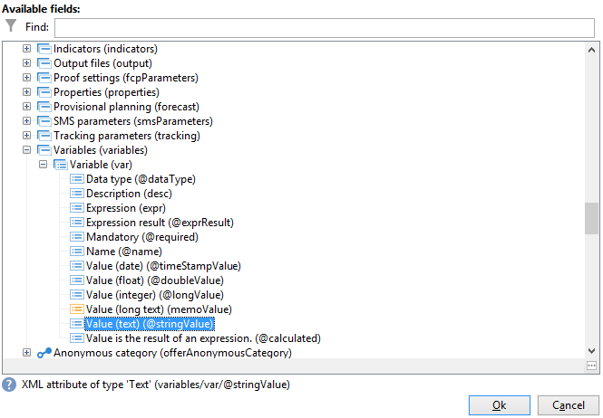

# Caso de uso: supervisionar workflows{#supervising-workflows}

Esse caso de uso detalha a criação de um workflow que permite monitorar o status de um conjunto de workflows que são &quot;pausados&quot;, &quot;interrompido&quot; ou &quot;com erros&quot;.

Seu objetivo é:

* Usar um workflow para monitorar um grupo de workflows de negócios.
* Enviar uma mensagem para um supervisor por meio de uma atividade &quot;delivery&quot;.

Para monitorar o status de um conjunto de workflows, siga estas etapas:

1. Crie o workflow de sincronização.
1. Escreva o JavaScript para determinar se os workflows estão pausados, interrompidos ou com erros.
1. Crie a atividade **[!UICONTROL Test]**.
1. Prepare o template de delivery.

>[!NOTE]
>
>Além do workflow, o **Workflow Heatmap** do Campaign permite analisar os detalhes dos workflows executados no momento. Para obter mais informações, consulte a [seção dedicada](heatmap.md).
>
>Para obter mais informações sobre como **monitorar a execução dos workflows**, consulte [esta seção](monitor-workflow-execution.md).

## Etapa 1: Criação do workflow de monitoramento {#step-1--creating-the-monitoring-workflow}

A pasta de workflow que vamos monitorar é a pasta **&quot;CustomWorkflows&quot;** armazenada no nó **Administration > Production > Technical workflows.** Esta pasta contém um conjunto de workflows de negócios.

O **Monitoring workflow** é armazenado na raiz da pasta Technical Workflows. O rótulo usado é **&quot;Monitoring&quot;**.

O schema a seguir mostra a sequência de atividades:


Este workflow é composto por:

* uma atividade **&quot;Start&quot;** .
* uma atividade **&quot;JavaScript code&quot;** responsável pela análise da pasta de workflows corporativos.
* uma atividade **&quot;Test&quot;** para enviar uma delivery ao supervisor ou reiniciar o workflow.
* uma atividade **&quot;Delivery&quot;** responsável pelo layout da mensagem.
* uma atividade **&quot;Wait&quot;** que controla os tempos de lead entre as iterações do workflow.

## Etapa 2: Gravação do JavaScript {#step-2--writing-the-javascript}

A primeira parte do código JavaScript coincides com um **query (queryDef)** que permite identificar os workflows com status &quot;pause&quot; (@state == 13), &quot;error&quot; (@failed == 1) ou &quot;stopped&quot; (@state == 20).

O **nome interno** da pasta de workflow a monitorar é fornecido na seguinte condição:

```
<condition boolOperator="AND" expr="[folder/@name] = 'Folder20'" internalId="1"/>
```

```
var strError = "";
var strPaused = "";
var strStop = "";

var queryWkfError = xtk.queryDef.create(
  <queryDef schema="xtk:workflow" operation="select">
    <select>
      <node expr="@internalName"/>
      <node expr="@state"/>
      <node expr="@label"/>
      <node expr="@failed"/>
      <node expr="@state"/>   
    </select>
    <where id="12837805386">
      <condition boolOperator="AND" expr="[folder/@name] = 'Folder20'" internalId="1"/>
        <condition boolOperator="AND" internalId="2">
          <condition boolOperator="OR" expr="@state = 20" internalId="3"/>
          <condition expr="@state = 13" internalId="4"/>
        </condition>  
    </where>
  </queryDef>
);
var ndWkfError = queryWkfError.ExecuteQuery(); 
```

A segunda parte do código JavaScript permite **exibir uma mensagem para cada workflow** com base no status recuperado durante a query.

>[!NOTE]
>
>As cadeias de caracteres criadas devem ser carregadas nas variáveis de evento do workflow.

```
for each ( var wkf in ndWkfError.workflow ) 
{
  if ( wkf.@state == 13 )  // Status 13 = paused
  {
    if ( wkf.@failed == 1 )
      strError += "<li>Workflow '" + wkf.@internalName + "' with the label '" + wkf.@label + "'</li>";
    else
      strPaused += "<li>Workflow '" + wkf.@internalName + "' with the label '" + wkf.@label + "'</li>";
  }
  
  if ( wkf.@state == 20 )  // Status 20 = stop
    strStop += "<li>Workflow '" + wkf.@internalName + "' with the label '" + wkf.@label + "'</li>";
}

vars.strWorkflowError = strError;
vars.strWorkflowPaused = strPaused;
vars.strWorkflowStop = strStop;
```

## Etapa 3: Criação da atividade &quot;Test&quot; {#step-3--creating-the--test--activity}

A atividade &quot;Test&quot; permite determinar se um fornecimento precisa ser enviado ou se o workflow de monitoramento precisa executar outro ciclo com base na atividade &quot;Wait&quot;.

Uma delivery é realizada ao supervisor **se pelo menos uma das três variáveis de evento &quot;vars.strWorkflowError&quot;, &quot;vars.strWorkflowPaused&quot; ou &quot;vars.strWorkflowStop&quot; for não nulas.**


A atividade &quot;Wait&quot; pode ser configurada para reiniciar o workflow de monitoramento em intervalos regulares. Para esse caso de uso, **o tempo de espera é definido como uma hora**.


## Etapa 4: Preparação do delivery {#step-4--preparing-the-delivery}

A atividade &quot;Delivery&quot; baseia-se em um **template de delivery** armazenado no nó **Resources > Templates >Delivery templates**.

Este template deve incluir:

* **o endereço de e-mail do supervisor**.
* **Conteúdo HTML** para inserir texto personalizado.

   

   As três variáveis declaradas (WF_Stop, WF_Paused, WF_Error) correspondem às três variáveis de evento do workflow.

   Essas variáveis devem ser declaradas na guia **Variables** das propriedades do template de delivery.

   Para recuperar **o conteúdo das variáveis de evento do workflow**, é preciso declarar as variáveis específicas para a delivery que será inicializada com valores retornados pelo código JavaScript.

   O template de delivery tem o seguinte conteúdo:

   

Depois que o template tiver sido criado e aprovado, é necessário configurar a atividade **Delivery** para:

* vincular a atividade &quot;Delivery&quot; ao template de delivery criado anteriormente.
* vincular as variáveis de evento do workflow àquelas específicas do template de delivery.

Clique duas vezes na atividade **Delivery** e selecione as seguintes opções:

* Delivery: selecione **New, created from a template** e selecione o template de delivery criado anteriormente.
* Para os campos **Recipientes e Content** , selecione **Specified in the delivery**.
* Ação para executar: selecione **Prepare and start**.
* Desmarque a opção **Process errors**.

   

* Acesse a guia **Script** da atividade **Delivery**, adicione três variáveis de tipo de **character string** por meio do menu de campo de personalização.

   

   

   As três variáveis declaradas são:

   ```
   delivery.variables._var[0].stringValue = vars.strWorkflowError;
   delivery.variables._var[1].stringValue = vars.strWorkflowPaused;
   delivery.variables._var[2].stringValue = vars.strWorkflowStop; 
   ```

Depois que esse workflow de monitoramento for iniciado, ele enviará um resumo para os recipients.
