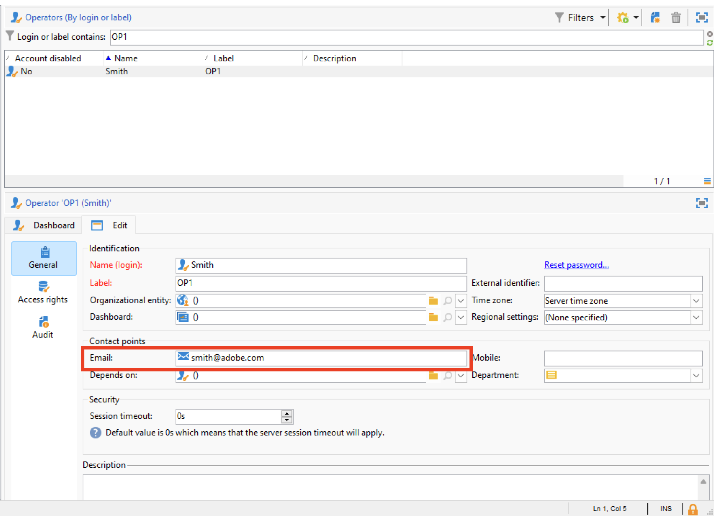

# Migrar operadores do Campaign para o Adobe Identity Management System (IMS) {#migrate-users-to-ims}

A partir do Campaign v8.6, o processo de autenticação para o Campaign v8 está sendo aprimorado. Todos os operadores usarão o [Adobe Identity Management System (IMS)](https://helpx.adobe.com/br/enterprise/using/identity.html){target="_blank"} **only** para se conectar ao Campaign. A conexão com usuário/senha (também conhecida como autenticação nativa) não será mais permitida. A Adobe recomenda executar essa migração no Campaign v8.5.2 para migrar sem problemas para o Campaign v8.6.

Como cliente de serviços gerenciados do Campaign Classic v7, se estiver migrando para o Campaign v8, este procedimento também se aplica a você.

Este artigo detalha as etapas necessárias para migrar um operador técnico para uma conta técnica no console do Adobe Developer.

## O que mudou?{#move-to-ims-changes}

Com o Campaign v8, todos os usuários regulares já devem se conectar ao console do cliente do Adobe Campaign usando sua Adobe ID, por meio do Adobe Identity Management System (IMS). No entanto, com algumas configurações mais antigas, as conexões de usuário/senha ainda estavam disponíveis. **Não é mais permitido iniciar o Campaign v8.6.**

Além disso, como parte do esforço para reforçar a segurança e o processo de autenticação, o aplicativo cliente do Adobe Campaign agora chama as APIs do Campaign diretamente usando o token de conta técnica do IMS. A migração para operadores técnicos é detalhada em um artigo dedicado, disponível em [esta página](ims-migration.md).

Essa alteração é aplicável a partir do Campaign v8.5.2, e é **obrigatória** a partir do Campaign v8.6.

## Você será afetado?{#migrate-ims-impacts}

Se os operadores em sua organização estiverem se conectando ao console do cliente do Campaign usando seu logon/senha (também conhecido como. autenticação nativa), você será afetado e deverá migrar esse(s) operador(es) para o Adobe IMS conforme detalhado abaixo.

A migração para o [Adobe Identity Management System (IMS)](https://helpx.adobe.com/br/enterprise/using/identity.html){target="_blank"} é uma obrigação de segurança para tornar seus ambientes seguros e padronizados, pois a maioria das outras soluções e aplicativos da Adobe Experience Cloud já está no IMS.

>[!IMPORTANT]
>
>**Impacto do acesso ao Painel de Controle**
>
>Depois de migrar os usuários para o IMS, esteja ciente de que qualquer Perfil de produto no Adobe Admin Console que contenha a palavra &quot;administrador&quot; no nome (como &quot;Administradores&quot;, &quot;administrador&quot;, &quot;administradores&quot;, &quot;administrador de aprovação&quot; etc.) concederá acesso automaticamente ao Painel de controle do Campaign. O Painel de controle do Campaign é uma ferramenta de autoatendimento que permite fazer alterações significativas em instâncias do Campaign.
>
>Analise cuidadosamente suas convenções de nomenclatura de perfil de produto para garantir que somente usuários autorizados tenham acesso ao Painel de controle do Campaign. Saiba mais sobre como gerenciar permissões do Painel de Controle na [documentação do Painel de Controle](https://experienceleague.adobe.com/docs/control-panel/using/discover-control-panel/managing-permissions.html?lang=pt-BR){target="_blank"}.

## Como migrar?{#ims-migration-procedure}

### Pré-requisitos{#ims-migration-prerequisites}

Antes de iniciar o processo de migração, entre em contato com o representante da Adobe (Gerenciador de transição) para que as equipes técnicas da Adobe possam migrar seus grupos de operadores e direitos nomeados existentes para o Adobe Identity Management System (IMS).

### Principais etapas {#ims-migration-steps}

As principais etapas dessa migração estão listadas abaixo:

1. O Adobe atualiza seus ambientes para o Campaign v8.5.2.
1. Após a atualização, ainda será possível criar novos usuários com ambos os métodos, como usuário nativo ou com IMS.
1. O administrador interno do Campaign deve adicionar emails exclusivos a todos os usuários nativos no console do cliente do Campaign e confirmar para o Adobe Transition Manager depois de concluído. Esta etapa está detalhada em [esta seção](#ims-migration-id).
1. Trabalhe com a Adobe para garantir uma data para que o Adobe execute a migração automatizada para seus usuários (operadores) e perfis de produto não técnicos. Essa etapa requer uma janela de uma hora sem tempo de inatividade para nenhuma de suas instâncias.
1. O administrador interno do Campaign valida essas alterações e fornece aprovação. Após essa migração, não será mais necessário criar nenhum outro operador autenticado com este logon e senha.

Agora você pode migrar seu(s) operador(es) técnico(s) para o Adobe Developer Console conforme detalhado em [esta nota técnica](ims-migration.md). Essa etapa é obrigatória se estiver usando APIs do Campaign.

Depois que a migração for concluída, confirme no Gerenciador de transição do Adobe: o Adobe marca a migração como concluída e bloqueia a criação de novos usuários nativos e o logon de usuários nativos. Seu ambiente é então protegido e padronizado.

## Perguntas frequentes {#ims-migration-faq}

### Quando posso iniciar a migração? {#ims-migration-start}

Um pré-requisito para a migração para o [Adobe Identity Management System (IMS)](https://helpx.adobe.com/br/enterprise/using/identity.html){target="_blank"} é atualizar seu ambiente para o Campaign v8.5.2.

Você pode iniciar a migração do IMS no ambiente de preparo depois que ele for atualizado para o Campaign v8.5.2 e planejar adequadamente o ambiente de produção.

### O que acontece após a atualização de build para o Campaign v8.5.2? {#ims-migration-after-upgrade}

Depois que seus ambientes forem atualizados para o Campaign v8.5.2, você poderá iniciar sua transição para o [Adobe Identity Management System (IMS)](https://helpx.adobe.com/br/enterprise/using/identity.html){target="_blank"}.

A criação de novos usuários nativos ainda é permitida até que a migração do IMS seja concluída.

### Quando a migração é concluída? {#ims-migration-end}

Depois que a migração do usuário final e a migração técnica do usuário para o Adobe Identity Management System (IMS) forem concluídas, você deverá entrar em contato com o Gerenciador de transição do Adobe para que o Adobe possa marcar sua migração como concluída, bloquear a criação de usuários no console do cliente e desativar o logon do usuário nativo.

### Como criar usuários após a migração? {#ims-migration-native}

Quando a migração completa do IMS for concluída, a Adobe aplicará as restrições que bloquearão a criação de novos usuários nativos. Essas restrições não são aplicadas até que a migração do IMS seja concluída.

Para novos clientes - a criação de novos usuários nativos não é permitida desde o início.

Como administrador do Campaign, você pode conceder permissões aos usuários da organização por meio do console do cliente do Adobe Admin Console e do Campaign. Os usuários fazem logon no Adobe Campaign com a Adobe ID. Saiba mais em [esta documentação](../../v8/start/gs-permissions.md).

### Como adicionar emails para usuários nativos atuais? {#ims-migration-id}

Como administrador do Campaign, você deve adicionar IDs de email para todos os usuários nativos do console do cliente. Para fazer isso, siga as etapas abaixo:

1. Conecte-se ao console do cliente e navegue até **Administração > Gerenciamento de Acesso > Operadores**.
1. Selecione o operador a ser atualizado na lista de operadores.
1. Insira o email do operador na seção **Pontos de contato** do formulário do operador.
1. Salve as alterações.

Como supervisor do fluxo de trabalho ou administrador do Campaign, também é possível executar uma atualização em massa dos operadores com um fluxo de trabalho.

+++Etapas principais para atualizar seus operadores com um fluxo de trabalho

Para executar uma atualização em massa dos operadores nativos, siga estas etapas:

1. Crie um fluxo de trabalho para extrair em um arquivo CSV todos os operadores que estão se conectando ao Campaign com o modo de autenticação nativo. Use uma atividade **Query** e uma atividade **Data extraction (file)** para criar o arquivo CSV. Para cada operador, com base nos dados de perfil, você pode exportar as seguintes colunas: `Name, Label`.

   Saiba mais sobre a atividade de **Consulta** em [esta página](../../automation/workflow/query.md)

   Saiba mais sobre a **atividade de extração de dados (arquivo)** em [esta página](../../automation/workflow/extraction-file.md)

1. Atualize o arquivo CSV com uma nova coluna que contém os emails dos operadores.

1. Crie um fluxo de trabalho para importar dados atualizados, com uma atividade **Data loading (file)** e uma atividade **Update data** no fluxo de trabalho.

   {width="70%"}

1. Edite a atividade de carregamento de **dados (arquivo)** e defina as configurações para carregar o arquivo CSV atualizado, de acordo com a amostra abaixo.

   {width="70%"}

   Saiba mais sobre a atividade de **carregamento de dados (arquivo)** em [esta página](../../automation/workflow/data-loading-file.md)

1. Edite a atividade **Update data** e defina as configurações de acordo com a amostra abaixo. Observe que a **Dimensão atualizada** foi alterada para `Operators (xtk)`.

   {width="70%"}

   Saiba mais sobre a atividade **Atualizar dados** em [esta página](../../automation/workflow/update-data.md)

1. Execute o workflow e verifique os resultados. O endereço de email foi adicionado ao perfil do operador.

   {width="70%"}

+++

### Como fazer logon no Campaign via IMS? {#ims-migration-log}

Saiba como se conectar ao Campaign com sua Adobe ID em [esta seção](../../v8/start/connect.md).

### Haverá um tempo de inatividade durante essa migração? {#ims-migration-downtime}

Para finalizar a migração (migrar usuários e perfis de produtos), o Adobe requer uma janela de uma hora sem tempo de inatividade para nenhuma de suas instâncias (workflows etc.).

Durante esse período, todos os usuários do Campaign precisam fazer logoff e fazer logon novamente com sua Adobe ID após a conclusão da migração para o IMS.

### O que acontece com os usuários conectados durante a migração de usuário do IMS? {#ims-migration-log-off}

A Adobe recomenda que todos os usuários sejam desconectados durante a janela de migração.

### Os usuários em minha organização já estão usando o IMS. Ainda preciso executar a Migração do IMS?{#ims-migration-needed}

Há dois aspectos nesta migração: migração de usuários finais e migração de usuários técnicos (usada em APIs do no código personalizado).

Se todos os usuários (operadores do Campaign) estiverem no IMS, não será necessário executar essa migração. No entanto, ainda é necessário migrar Usuários técnicos que podem ter sido usados no código personalizado. Saiba mais [nesta página](ims-migration.md).

Quando essa migração for concluída, você deverá entrar em contato com o Gerenciador de transição do Adobe para que o Adobe conclua a migração.

### Como visualizar o tipo de autenticação de seus Operadores?

Saiba como visualizar o tipo de autenticação de seus Operadores no Campaign:

1. No **Explorer**, acesse **Administration** `>` **Access Management** `>` **Operators**.

1. Clique com o botão direito na linha de cabeçalho e selecione o menu **Configurar lista**.

   

1. Adicionar **Conta Desabilitada** e **Tipo de Autenticação** como **Colunas de saída**.

   

Agora você pode ver a lista de **Operadores** e seu **Tipo de Autenticação**.

## Links úteis {#ims-useful-links}

* [Migração de usuários técnicos para o console do Adobe Developer](ims-migration.md)
* [Como se conectar ao Adobe Campaign v8](../../v8/start/connect.md)
* [Acesso e permissões no Adobe Campaign v8](../../v8/start/gs-permissions.md)
* [Notas de versão do Adobe Campaign v8](../../v8/start/release-notes.md)
* [O que é o Adobe Identity Management System (IMS)](https://helpx.adobe.com/br/enterprise/using/identity.html){target="_blank"}
