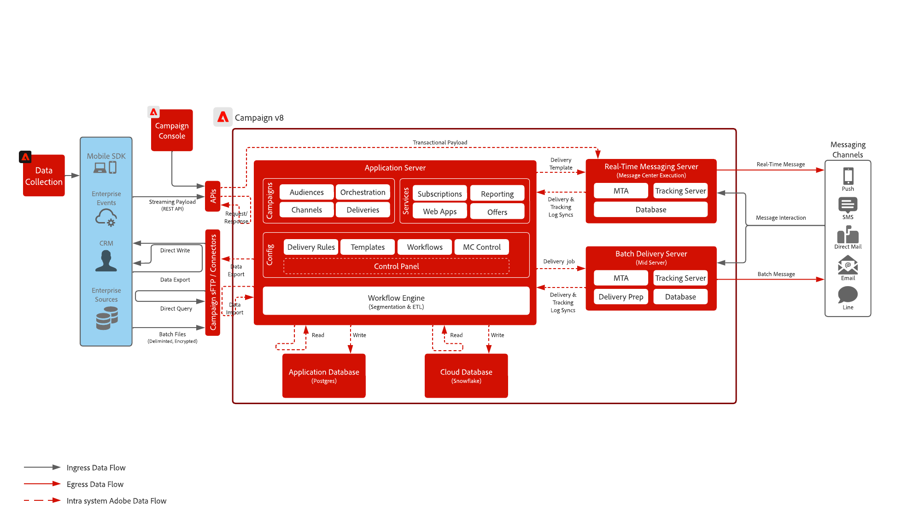

# Introdução à arquitetura do Campaign{#gs-ac-archi}

## Ambientes {#environments}

O Campaign é disponibilizado como instâncias individuais e cada instância representa um ambiente completo do Campaign.

Dois tipos de ambientes estão disponíveis:

* **Ambiente de produção**: hospeda os aplicativos para os profissionais de negócios.

* **Ambiente de não produção**: usado para vários testes de desempenho e qualidade antes que as alterações no aplicativo sejam enviadas para o ambiente de produção.

É possível exportar e importar pacotes de um ambiente para outro.

Saiba mais sobre pacotes na [documentação do Campaign Classic v7](https://experienceleague.adobe.com/docs/campaign-classic/using/getting-started/administration-basics/working-with-data-packages.html?lang=pt-BR){target="_blank"}

## Modelos de implantação {#ac-deployment}

Dois modelos de implantação estão disponíveis: **Implantação FDA do Campaign** (P1-P3) e **Implantação corporativa do Campaign (FFDA)** (P4).

### Implantação de FDA no Campaign {#ac-deployment-fda}

Em sua [implantação FDA](fda-deployment.md), o [!DNL Adobe Campaign] v8 pode ser conectado ao [!DNL Snowflake] para acessar dados por meio do recurso Federated Data Access: você pode acessar e processar dados externos e informações armazenados no banco de dados do [!DNL Snowflake] sem alterar a estrutura dos dados do Adobe Campaign. O PostgreSQL é o banco de dados principal e você pode usar o Snowflake como o banco de dados secundário para estender e armazenar seus dados no Snowflake. Posteriormente, é possível executar ETL, segmentação e relatórios em um grande conjunto de dados com desempenhos excelentes.

{zoomable="yes"}

>[!NOTE]
>
>Neste modelo de implantação, o banco de dados secundário [!DNL Snowflake] está disponível somente mediante solicitação. Para atualizar sua implantação com o [!DNL Snowflake], contate o Adobe Transition Manager.
>

### Implantação do Campaign Enterprise (FFDA) {#ac-deployment-ffda}

No contexto de uma implantação [Corporativa (FFDA)](enterprise-deployment.md), o [!DNL Adobe Campaign] v8 funciona com dois bancos de dados: um banco de dados [!DNL Campaign] local para a interface de mensagens em tempo real, consultas unitárias e gravações por meio de APIs, e um banco de dados [!DNL Snowflake] da Nuvem para execução de campanha, consultas em lote e execução de fluxo de trabalho.

O Campaign v8 Enterprise traz o conceito de **Full Federated Data Access** (FFDA): agora, todos os dados estão disponíveis remotamente no banco de dados da nuvem. Com essa nova arquitetura, a implantação corporativa (FFDA) do Campaign v8 simplifica o gerenciamento de dados: nenhum índice é necessário no banco de dados da nuvem. Basta criar as tabelas, copiar os dados e iniciar. A tecnologia de banco de dados da nuvem não requer manutenção específica para garantir o nível de desempenho.

{zoomable="yes"}

## Dividir execução de entrega {#split}

>[!AVAILABILITY]
>
>Esse recurso está disponível somente para clientes com várias configurações de instâncias mid-sourcing (MID).

Dependendo do pacote do Campaign v8, você recebe um número específico de instâncias de mid-sourcing responsáveis pela execução dos deliveries.

Por padrão, as contas externas de todos os canais usam um modo de roteamento **[!UICONTROL Alternate]**, o que significa que uma entrega é enviada de cada instância de mid-sourcing (MID) de cada vez de forma alternada.

Para garantir melhores desempenhos em termos de velocidade e escala, você pode permitir que os deliveries sejam divididos automaticamente em suas instâncias de mid-sourcing para serem entregues mais rapidamente aos recipients. Essa operação é transparente ao executar o delivery da instância de marketing: depois que o delivery é enviado, todos os logs são consolidados antes de serem enviados de volta para a instância de marketing em um único objeto de delivery.

Para fazer isso, contas externas adicionais com o modo de roteamento **[!UICONTROL Split]** são criadas no provisionamento para cada canal:

* Dividir entrega - Email (splitDeliveryEmail)
* Dividir entrega - SMS (splitDeliverySMS)
* Entrega dividida - iOS (splitDeliveryIOS)
* Entrega dividida - Android (splitDeliveryAndroid)

>[!IMPORTANT]
>
>O modo de roteamento dividido é ativado por padrão para a conta &quot;Split Delivery - Email&quot;. Para todas as outras contas externas de canais, entre em contato com o Gerenciador de transição do Adobe para ativar a opção.
>
>Por padrão, o valor de tamanho limite para dividir um delivery entre várias instâncias mid-sourcing (MID) é de 100K. Você pode alterar esse valor na opção &quot;NmsDelivery_MultiMidSplitThreshold&quot; no menu **[!UICONTROL Administration]** / **[!UICONTROL Platform]** / **[!UICONTROL Options]**.

Para dividir contas externas como a conta padrão para enviar deliveries, é necessário alterar o provedor de roteamento em seus templates de delivery. Para fazer isso, siga estes passos:

1. Navegue até a pasta **[!UICONTROL Resources]** / **[!UICONTROL Templates]** / **[!UICONTROL Delivery templates]** e abra o modelo de entrega desejado. Neste exemplo, queremos editar o template do delivery de email.

   

1. Clique no botão **[!UICONTROL Properties]** e altere o provedor de roteamento para a conta externa de entrega dividida correspondente.

   

1. Salve as alterações. Todos os deliveries enviados usando o template agora usarão o modo de roteamento dividido por padrão.

<!--In addition, you can select split external accounts as the default routing provider for all future delivery templates. To do this, change the value of the **[!UICONTROL xtkoption NmsBroadcast_DefaultProvider]** option to the name of the split account.

 -->

## Arquitetura do Centro de mensagens{#transac-msg-archi}

O envio de mensagens transacionais (Centro de mensagens) é o módulo do Campaign criado para gerenciar mensagens por acionador.

Saiba como enviar mensagens transacionais em [esta seção](../send/transactional.md).

Em resposta a uma ação de um cliente em um site, um evento é enviado ao Campaign por meio de uma API REST e o modelo de mensagem é preenchido com as informações ou os dados fornecidos por meio da chamada de API, e uma mensagem transacional é enviada em tempo real ao cliente. Essas mensagens podem ser enviadas individualmente ou em lotes por email, SMS ou notificações por push.

Nessa arquitetura específica, a célula de execução é separada da instância de controle para garantir alta disponibilidade e gerenciamento de carga.

* A **Instância de controle** (ou Instância de marketing) é usada por profissionais de marketing e equipes de TI para criar, configurar e publicar modelos de mensagem. Essa instância também centraliza o monitoramento e o histórico de eventos.

  Saiba como criar e publicar modelos de mensagem em [esta seção](../send/transactional.md).

* A **Instância de execução** recupera eventos de entrada (redefinição de senha ou pedidos de um site, por exemplo) e envia mensagens personalizadas. Pode haver mais de uma instância de execução para processar mensagens por meio do balanceador de carga e dimensionar o número de eventos a serem continuados para disponibilidade máxima.

>[!CAUTION]
>
>A instância de controle e a instância de execução devem ser instaladas em máquinas diferentes. Elas não podem compartilhar a mesma instância do Campaign.

### Autenticação

Para usar esses recursos, os usuários do Adobe Campaign fazem logon na instância de controle para criar templates de mensagem transacional, gerar a pré-visualização da mensagem usando uma lista de propagação, exibir relatórios e monitorar a(s) instância(s) de execução.

* Instância de execução única
Ao interagir com uma instância de execução do Centro de mensagens hospedada pela Adobe, um sistema externo pode primeiro recuperar um token de sessão (que, por padrão, expira em 24 horas), fazendo uma chamada de api para o método de logon da sessão, usando um logon e uma senha de conta fornecidos.
Em seguida, com o sessionToken fornecido pela instância de execução em resposta à chamada acima, o aplicativo externo pode fazer invocações da API do SOAP (rtEvents ou batchEvents) para enviar comunicações, sem a necessidade de incluir em cada chamada do SOAP o logon e a senha da conta.

* Várias instâncias de execução
Em uma arquitetura de execução de várias células com várias instâncias de execução por trás de um balanceador de carga, o método de logon chamado pelo aplicativo externo passa pelo balanceador de carga: por esse motivo, uma autenticação baseada em token não pode ser usada. É necessária uma autenticação baseada em usuário/senha.

Saiba mais sobre eventos de mensagens transacionais em [esta página](../send/event-processing.md).
