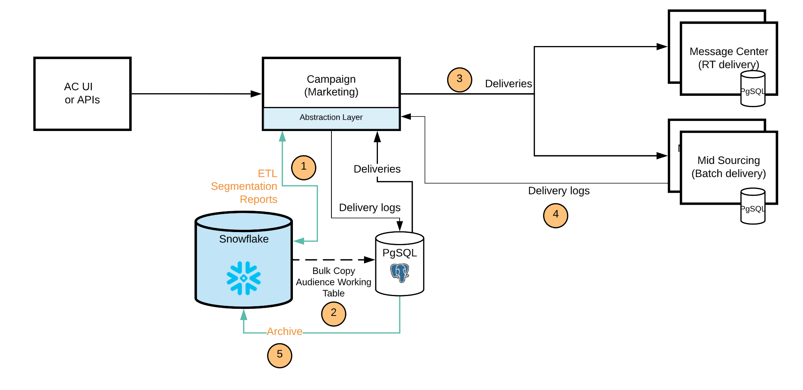

# Implantação do FDA do [!DNL Campaign]{#gs-fda}

Em sua implantação FDA (padrão) do Campaign, o [!DNL Adobe Campaign] v8 pode ser conectado ao [!DNL Snowflake] para acessar dados por meio do recurso [Federated Data Access](../connect/fda.md): você pode acessar e processar dados externos e informações armazenados no banco de dados do [!DNL Snowflake] sem alterar a estrutura dos dados do Adobe Campaign.

>[!NOTE]
>
>Neste modelo de implantação, o banco de dados secundário [!DNL Snowflake] está disponível somente mediante solicitação. Para atualizar sua implantação com o [!DNL Snowflake], contate o Adobe Transition Manager.
>

## Benefícios{#fda-benefits}

Esse modelo de implantação vem com os seguintes benefícios:

* **Armazenamento e desempenhos**
Você pode mover seus dados históricos para [!DNL Snowflake] e reduzir dependências para o limite de Adobe Campaign IDs. Essa arquitetura também reduz sua dependência do armazenamento PostgreSQL e limites de desempenho. À medida que menos dados são armazenados no banco de dados do Campaign, o desempenho é melhor e as tarefas de manutenção são executadas mais rapidamente.

* **Extensão do modelo de dados e gerenciamento de dados**
Você pode criar tabelas em [!DNL Snowflake] e vinculá-las ao Adobe Campaign, por exemplo, para usar dados arquivados por períodos de retenção ou executar processos de segmentação com desempenhos pendentes.

  Essa arquitetura também permite usar os recursos de fluxo de trabalho de gerenciamento de dados no [!DNL Snowflake]. Somente agregações e tabelas temporárias são movidas para o Campaign para fins de personalização e delivery.

## Arquitetura{#fda-archi}

Com esse modelo de implantação, os usuários do Adobe Campaign podem estender seus dados para o [!DNL Snowflake] e aproveitar os benefícios de uma plataforma de dados única e integrada para obter insights avançados de dados de campanhas de marketing em tempo real. Ele oferece aos usuários a capacidade de desbloquear grandes valores de seus dados, oferecendo uma plataforma única, unificada e fácil de usar para análise de dados. A plataforma de dados em nuvem não requer gerenciamento, pois é dimensionada infinitamente para suportar qualquer volume de dados de marketing do Adobe Campaign.

A comunicação geral entre servidores e processos é realizada de acordo com o seguinte esquema:

O PostgreSQL é o banco de dados principal e o Snowflake pode ser usado como o banco de dados secundário. Você pode estender seu modelo de dados e armazenar seus dados no Snowflake. Posteriormente, é possível executar ETL, segmentação e relatórios em um grande conjunto de dados com desempenhos excelentes.
