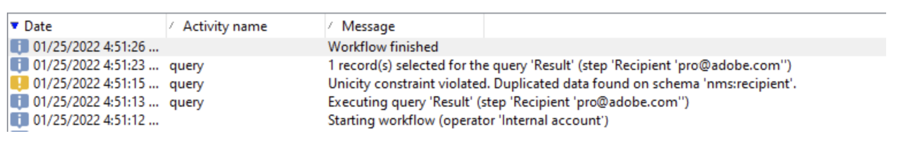

# Gerenciamento de chaves e unicidade {#key-management}

No contexto de uma [implantação corporativa (FFDA)](enterprise-deployment.md), a chave primária é um Identificador exclusivo universal (UUID), que é uma cadeia de caracteres. Para criar esta UUID, o elemento principal do esquema deve conter os atributos **autouuid** e **autopk** definidos como **true**.

O Adobe Campaign v8 usa [!DNL Snowflake] como o banco de dados principal. A arquitetura distribuída do banco de dados [!DNL Snowflake] não fornece um mecanismo para garantir a unicidade de uma chave em uma tabela: os usuários finais são responsáveis pela consistência da chave no banco de dados do Adobe Campaign.

Evitar duplicatas em chaves e, especialmente, em chaves primárias é obrigatório para preservar a consistência do banco de dados relacional. Duplicatas em chaves primárias levam a problemas com atividades de fluxo de trabalho de gerenciamento de dados, como **Consulta**, **Reconciliação**, **Atualização de dados** e muito mais. Isso é crítico para definir os critérios de reconciliação adequados ao atualizar as tabelas [!DNL Snowflake].

>[!CAUTION]
>
>Chaves duplicadas não estão restritas aos UUIDs. Isso pode acontecer com IDs, incluindo chaves personalizadas criadas em tabelas personalizadas.

## Unicity Service{#unicity-service}

O Unicity Service é um componente do Cloud Database Manager que ajuda os usuários a preservar e monitorar a integridade das restrições de chaves exclusivas nas tabelas do Cloud Database. Isso permite reduzir o risco de inserir chaves duplicadas.

Como o Cloud Database não impõe restrições de unicidade, o Unicity Service reduz o risco de inserir duplicatas ao gerenciar os dados com o Adobe Campaign.

### Fluxo de trabalho de unicidade{#unicity-wf}

O Unicity Service vem com um fluxo de trabalho interno **[!UICONTROL Unicity alerting]** dedicado, para monitorar restrições de unicidade e alertar quando duplicatas são detectadas.

Esse fluxo de trabalho técnico está disponível no nó **[!UICONTROL Administration > Production > Technical workflows > Full FFDA Unicity]** do explorador do Campaign. **Não deve ser modificado**.

Este fluxo de trabalho verifica todos os esquemas personalizados e integrados para detectar linhas duplicadas.

Se o fluxo de trabalho **[!UICONTROL Unicity alerting]** (ffdaUnicity) detectar algumas chaves duplicadas, elas serão adicionadas a uma tabela **Unicidade de auditoria** específica, que inclui o nome do esquema, o tipo de chave, o número de linhas afetadas e a data. Você pode acessar chaves duplicadas do nó **[!UICONTROL Administration > Audit > Key Unicity]**.

Como Administrador de Banco de Dados, você pode usar uma atividade SQL para remover as duplicatas ou entrar em contato com o Atendimento ao Cliente da Adobe para obter mais orientação.

### Alertas{#unicity-wf-alerting}

Uma notificação específica é enviada ao grupo de operadores **[!UICONTROL Workflow Supervisors]** quando chaves duplicadas são detectadas. O conteúdo e o público deste alerta podem ser alterados na atividade **Alert** do fluxo de trabalho **[!UICONTROL Unicity alerting]**.

## Medidas de proteção adicionais {#duplicates-guardrails}

O Campaign vem com um conjunto de novas medidas de proteção para impedir a inserção de chave duplicada no banco de dados [!DNL Snowflake].

>[!NOTE]
>
>Essas medidas de proteção estão disponíveis a partir do Campaign v8.3. Para verificar sua versão, consulte [esta seção](../start/compatibility-matrix.md#how-to-check-your-campaign-version-and-buildversion)

### Preparação da entrega {#remove-duplicates-delivery-preparation}

O Adobe Campaign remove automaticamente qualquer UUID duplicado de um público-alvo durante a preparação do delivery. Esse mecanismo impede que qualquer erro ocorra durante a preparação de um delivery. Como usuário final, você pode verificar essas informações nos logs do delivery: alguns recipients podem ser excluídos do público-alvo principal devido à duplicação de chaves. Nesse caso, o seguinte aviso será exibido: `Exclusion of duplicates (based on the primary key or targeted records)`.

### Atualizar dados em um fluxo de trabalho {#duplicates-update-data}

No contexto de uma [implantação corporativa (FFDA)](enterprise-deployment.md), não é possível selecionar uma chave interna (UUID) como campo para atualizar dados em um fluxo de trabalho.

### Consultar um esquema com duplicatas {#query-with-duplicates}

Quando um fluxo de trabalho inicia a execução da consulta em um esquema, o Adobe Campaign verifica se há algum registro duplicado relatado na [tabela Unicidade de auditoria](#unicity-wf). Em caso positivo, o workflow registra um aviso como a operação subsequente nos dados duplicados deve afetar potencialmente o resultado do workflow.

Essa verificação é executada nas seguintes atividades de workflow:

* Consulta
* Query incremental
* Lista de leitura

>[!NOTE]
>
>Se estiver fazendo a transição de outra versão do Campaign, é fundamental remover duplicatas, solucionar problemas e limpar dados para evitar impacto na transição.
