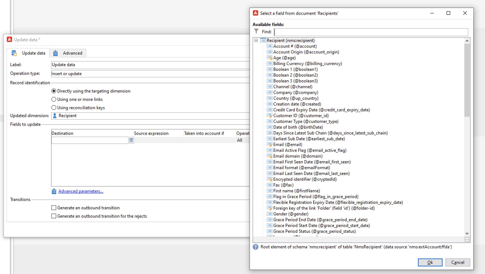

# Gerenciamento de chaves e unicidade {#key-management}

No contexto de um [Implantação empresarial (FDA)](enterprise-deployment.md), a chave primária é um UUID (Universally Unique IDentifier), que é uma string em caracteres. Para criar esse UUID, o elemento principal do schema deve conter a variável **autouuid** e **autopk** atributos definidos como **true**.

Adobe Campaign v8 uses [!DNL Snowflake] as the core Database. The distributed architecture of the [!DNL Snowflake] database does not provide mechanism to ensure the unicity of a key within a table: end-users are responsible for key consistency within the Adobe Campaign database.

Evitar duplicatas em chaves e, especialmente, em chaves primárias, é obrigatório para preservar a consistência do banco de dados relacional. Duplicates on primary keys lead to issues with data management workflow activities such as **Query**, **Reconciliation**, **Update data**, and more. This critical to define proper reconciliation criteria when updating [!DNL Snowflake] tables.

>[!CAUTION]
>
>Duplicated keys is not restricted to UUIDs. It can happen in with IDs, including custom keys created in custom tables.

## Unicity Service{#unicity-service}

O Unicity Service é um componente do Cloud Database Manager que ajuda os usuários a preservar e monitorar a integridade de restrições de chave exclusivas nas tabelas do Cloud Database. Isso permite reduzir o risco de inserir chaves duplicadas.

Como o Banco de Dados da Nuvem não impõe restrições de unicidade, o Unicity Service reduz o risco de inserir duplicatas ao gerenciar os dados com o Adobe Campaign.

### Fluxo de trabalho de Unicidade{#unicity-wf}

O Unicity Service vem com um **[!UICONTROL Unicity alerting]** fluxo de trabalho integrado, para monitorar as restrições de unicidade e alertar quando duplicatas são detectadas.

Esse workflow técnico está disponível no **[!UICONTROL Administration > Production > Technical workflows > Full FFDA Unicity]** nó do explorador do Campaign. **It must not be modified**.

Esse workflow verifica todos os esquemas personalizados e incorporados para detectar linhas duplicadas.

Se a variável **[!UICONTROL Unicity alerting]** O workflow (ffdaUnicity) detecta algumas chaves duplicadas, elas são adicionadas a um **Unicidade de auditoria** tabela, que inclui o nome do schema, o tipo de chave, o número de linhas afetadas e a data. You can access duplicated keys from the **[!UICONTROL Administration > Audit > Key Unicity]** node.

Como Administrador de Banco de Dados, você pode usar uma atividade SQL para remover as duplicatas ou entrar em contato com o Atendimento ao Cliente do Adobe para obter mais orientações.

### Alerta{#unicity-wf-alerting}

Uma notificação específica é enviada ao **[!UICONTROL Workflow Supervisors]** grupo de operadores quando chaves duplicadas forem detectadas. O conteúdo e o público-alvo desse alerta podem ser alterados no **Alerta** da **[!UICONTROL Unicity alerting]** fluxo de trabalho.

## Medidas de proteção adicionais{#duplicates-guardrails}

O Campaign vem com um conjunto de novas grades de proteção para evitar a inserção de chave duplicada em [!DNL Snowflake] banco de dados.

>[!NOTE]
>
>Essas grades de proteção estão disponíveis a partir do Campaign v8.3. Para verificar sua versão, consulte [esta seção](../start/compatibility-matrix.md#how-to-check-your-campaign-version-and-buildversion)

### Preparação do delivery{#remove-duplicates-delivery-preparation}

Adobe Campaign removes automatically any duplicated UUID from an audience during delivery preparation. This mechanism prevents any error from happening while preparing a delivery. Como usuário final, você pode verificar essas informações nos logs do delivery: alguns recipients podem ser excluídos do target principal devido à chave duplicada. In that case, the following warning is displayed: `Exclusion of duplicates (based on the primary key or targeted records)`.

### Atualizar dados em um fluxo de trabalho{#duplicates-update-data}

No contexto de um [Implantação empresarial (FDA)](enterprise-deployment.md), não é possível selecionar uma chave interna (UUID) como campo para atualizar dados em um fluxo de trabalho.

Ao usar a chave de reconciliação explícita, a variável **Atualizar dados** A atividade garante automaticamente a unicidade do schema de destino com base nessa chave ao:

1. Desduplicação de dados de entrada (da transição)
1. Desduplicação de dados com tabela de destino (mesclagem)

>[!CAUTION]
>
>Essa garantia só se aplica com a opção **[!UICONTROL Using reconciliation keys]**.

### Consultar um schema com duplicatas{#query-with-duplicates}

Quando um workflow inicia a execução da query em um schema, o Adobe Campaign verifica se qualquer registro duplicado é relatado na variável [Tabela de Unicidade de auditoria](#unicity-wf). Nesse caso, o workflow registra um aviso, pois a operação subsequente nos dados duplicados deve afetar potencialmente o resultado do workflow.

Essa verificação é realizada nas seguintes atividades de workflow:

* Consulta
* Incremental Query
* Lista de leitura