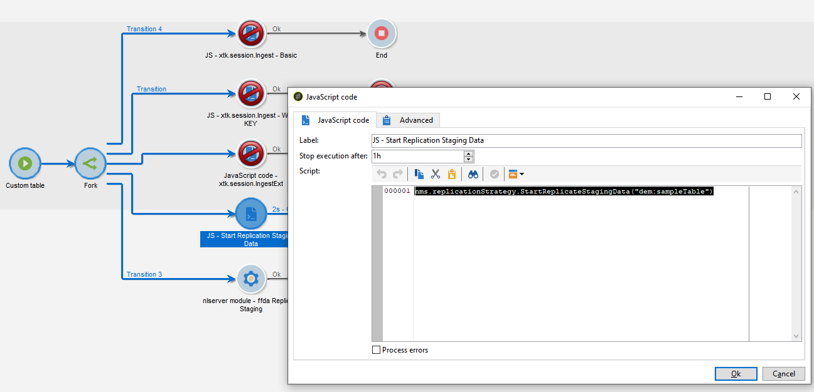
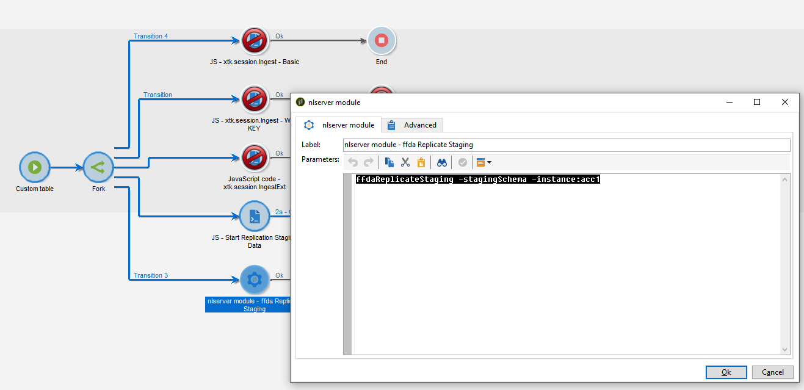

# Replicação de dados {#wf-data-replication}

## Princípio

No contexto de uma [implantação corporativa (FFDA)](enterprise-deployment.md), a replicação de dados garante que os dois bancos de dados, o banco de dados local do Campaign (PostgreSQL) e o banco de dados da nuvem ([!DNL Snowflake]), estejam operacionais em paralelo e permaneçam sincronizados em tempo real.

O banco de dados na nuvem ([!DNL Snowflake]) é otimizado para manipular grandes lotes de dados, como a atualização de 1 milhão de endereços. Enquanto isso, o banco de dados local do Campaign (PostgreSQL) é mais adequado para operações individuais ou de pequeno volume, como a atualização de um único seed address. A sincronização ocorre de forma automática e transparente em segundo plano, garantindo que os dados no banco de dados local do Campaign (PostgreSQL) sejam duplicados no banco de dados da nuvem ([!DNL Snowflake]) em tempo real, mantendo ambos os bancos de dados sincronizados. A sincronização de dados envolve esquemas e tabelas, e dados.

➡️ [Descubra como funciona a replicação de dados em vídeo](#video)

## Modos de replicação {#modes}

A replicação de dados pode ocorrer em diferentes modos, dependendo do caso de uso.

* A **replicação instantânea** lida com casos em que a duplicação em tempo real é essencial. Ele depende de threads técnicos específicos para replicar dados imediatamente para casos de uso como criação de uma difusão ou atualização de um seed address.
* **A replicação agendada** é usada quando a sincronização imediata não é necessária. A replicação agendada usa [fluxos de trabalho técnicos](#workflows) específicos que são executados a cada hora para sincronizar dados, como regras de tipologia.

## Políticas de replicação

As políticas de replicação definem quantos dados são replicados de uma tabela de banco de dados local do Campaign (PostgreSQL). Essas políticas dependem do tamanho da tabela e do caso de uso específico. Algumas tabelas terão atualizações incrementais quando outras serão totalmente replicadas. Há três tipos principais de políticas de replicação:

* **XS**: esta política é usada para tabelas com tamanhos relativamente pequenos. A tabela inteira é replicada de uma só vez. A replicação incremental evita replicar repetidamente os mesmos dados usando um ponteiro de carimbo de data e hora para replicar somente alterações recentes.
* **SingleRow**: esta diretiva replica apenas uma linha por vez. Normalmente, é usada para replicação instantânea envolvendo objetos atuais do Campaign e objetos relacionados.
* **AlgumasLinhas**: esta política foi criada para replicar um subconjunto limitado de dados usando definições ou filtros de consulta. Ele é usado para tabelas maiores em que a replicação seletiva é necessária.

## Fluxos de trabalho de replicação {#workflows}

O Campaign v8 depende de workflows técnicos específicos para gerenciar a replicação de dados agendada. Esses fluxos de trabalho técnicos estão disponíveis no nó **[!UICONTROL Administration > Production > Technical workflows > Full FFDA Replication]** do explorador do Campaign. **Eles não devem ser modificados.**

Os workflows técnicos executam processos ou trabalhos, agendados regularmente no servidor. A lista completa de fluxos de trabalho técnicos está detalhada em [esta página](https://experienceleague.adobe.com/docs/campaign/automation/workflows/introduction/wf-type/technical-workflows.html){target="_blank"}.

Os workflows técnicos que garantem a replicação de dados são os seguintes:

| Fluxo de trabalho técnico | Descrição |
|------|-----------|
| **[!UICONTROL Replicate Reference tables]** (ffdaReplicateReferenceTables) | Executa a replicação automática de tabelas internas que precisam estar presentes no banco de dados local do Campaign (PostgreSQL) e no banco de dados da nuvem ([!DNL Snowflake]). Ele é programado para ser executado a cada hora, diariamente. Se o campo **lastModified** existir, a replicação ocorrerá de forma incremental, caso contrário, a tabela inteira será replicada. |
| **[!UICONTROL Replicate Staging data]** (ffdaReplicateStagingData) | Replica dados de preparo para chamadas unitárias. Ele é programado para ser executado a cada hora, diariamente. |
| **[!UICONTROL Deploy FFDA immediately]** (ffdaDeploy) | Executa uma implantação imediata no banco de dados em nuvem. |
| **[!UICONTROL Replicate FFDA data immediately]** (ffdaReplicate) | Replica os dados XS de uma determinada conta externa. |

Se necessário, é possível iniciar a sincronização de dados manualmente. Para fazer isso, clique com o botão direito do mouse na atividade **Scheduler** e selecione **Executar tarefa(s) pendente(s) agora**.

Além do fluxo de trabalho técnico interno **Replicar tabelas de referência**, você pode forçar a replicação de dados em seus fluxos de trabalho usando um destes métodos

+++Como forçar a replicação de dados

* Adicione uma atividade **JavaScript code** específica com o seguinte código:

  ```
  nms.replicationStrategy.StartReplicateStagingData("dem:sampleTable")
  ```

  

* Adicione uma atividade **nlmodule** específica com o seguinte comando:

  ```
  nlserver ffdaReplicateStaging -stagingSchema -instance:acc1
  ```

  

+++

<br/>

>[!NOTE]
>
>A replicação instantânea é tratada por processos técnicos específicos, em vez de workflows. A configuração desse modo é gerenciada no arquivo serverConf.xml. Você pode configurar o serverConf.xml para corresponder a casos de uso específicos, como solicitar que as tabelas XS sejam replicadas de forma incremental em vez de inteiramente. Para mais informações, entre em contato com o seu representante da Adobe.

## APIs

As APIs permitem a replicação de dados personalizados e prontos para uso do banco de dados local do Campaign (PostgreSQL) para o banco de dados da nuvem ([!DNL Snowflake]). Essas APIs permitem ignorar workflows predefinidos e personalizar a replicação para requisitos específicos, como a replicação de tabelas personalizadas.

Exemplo:

```
var dataSource = "nms:extAccount:ffda";
var xml = xtk.builder.CopyXxlData(
    <params dataSource={dataSource} policy="xs">
        <srcSchema name="cus:recipient"/>
    </params>
);
```

## Filas de replicação

Quando grandes volumes de solicitações de replicação ocorrem simultaneamente, podem ocorrer problemas de desempenho no banco de dados em nuvem ([!DNL Snowflake]) devido a bloqueios em nível de tabela durante operações MERGE. Para atenuar isso, os workflows de replicação centralizada agrupam solicitações em filas.

Cada fila é tratada por um workflow técnico, que gerencia a replicação de uma tabela específica, executando solicitações pendentes como uma única operação MESCLAR. Esses workflows são acionados a cada 20 segundos para processar novas solicitações de replicação:

| Fluxo de trabalho técnico | Descrição |
|------|-----------|
| **Replicar fila nmsDelivery** (ffdaReplicateQueueDelivery) | Fila para a tabela `nms:delivery`. |
| **Replicar fila nmsDlvExclusion** (ffdaReplicateQueueDlvExclusion) | Fila para a tabela `nms:dlvExclusion`. |
| **Replicar a fila nmsDlvMidRemoteIdRel** (ffdaReplicateQueueDlvMidRemoteIdRel) | Fila para a tabela `nms:dlvRemoteIdRel`. |
| **Replicar fila nmsTrackingUrl** (ffdaReplicateQueueTrackingUrl)<br/>**Replicar fila nmsTrackingUrl em simultaneidade** (ffdaReplicateQueueTrackingUrl_2) | Filas em simultaneidade para a tabela `nms:trackingUrl`, utilizando dois fluxos de trabalho para melhorar a eficiência, processando solicitações com base em prioridades diferentes. |

## Tutorial {#video}

Este vídeo apresenta os principais conceitos de quais bancos de dados o Adobe Campaign v8 usa, por que os dados estão sendo replicados, quais dados estão sendo replicados e como o processo de replicação funciona.

>[!VIDEO](https://video.tv.adobe.com/v/334460?quality=12)

Os tutoriais adicionais do Console do Cliente do Campaign v8 estão disponíveis [aqui](https://experienceleague.adobe.com/en/docs/campaign-learn/tutorials/overview).
