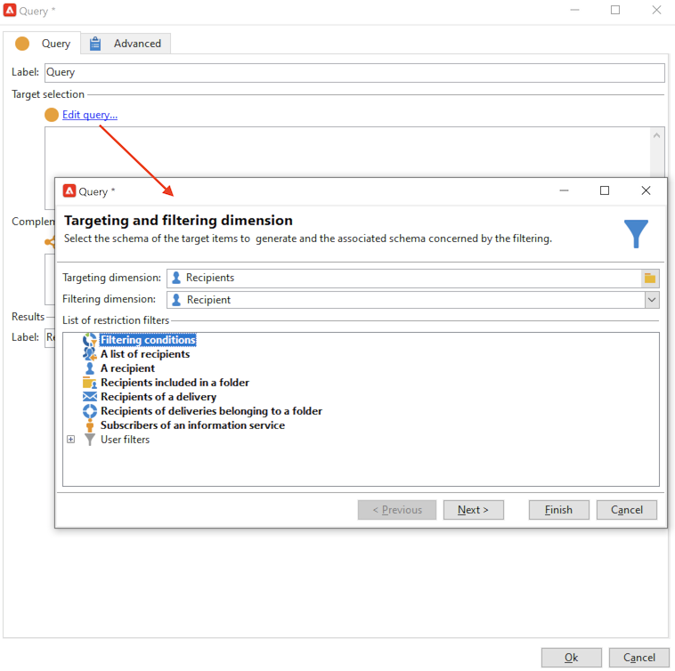

# Criar um público-alvo em uma lista{#create-segments}

Use listas do Campaign para criar e organizar seus públicos-alvo.

Uma lista é um conjunto estático de contatos que pode ser direcionado em ações de delivery ou atualizado durante uma importação ou outra ação de workflow. Por exemplo, uma população extraída do banco de dados por um query pode ser armazenada como uma lista.

As listas são criadas e gerenciadas pelo link **[!UICONTROL Lists]** na guia **[!UICONTROL Profiles and targets]**. Essas listas são baseadas na tabela de perfil padrão do Adobe Campaign (nms:recipient). [Saiba mais](../dev/datamodel.md#ootb-profiles.md)

É possível criar uma lista usando a variável **Atualizar lista** em um workflow. Essa atividade armazena a população resultante em uma lista. Use-o para criar uma nova lista ou atualizar uma lista existente. Para criar listas contendo outros tipos de dados além da tabela de perfil incorporada, é necessário executar um workflow. Por exemplo, consulte a tabela visitante e atualize a lista para criar uma lista de visitantes. [Saiba mais](#create-a-list-wf).

Assista a este vídeo para saber mais sobre o Gerenciamento de listas no Adobe Campaign.

>[!VIDEO](https://video.tv.adobe.com/v/334909?quality=12)

## Criar uma lista de contatos {#create-a-list-of-contacts}

Para criar uma lista de contatos, siga as etapas abaixo:

1. Clique no botão **[!UICONTROL Create]** e selecione **[!UICONTROL New list]**.

   

1. Insira as informações na guia **[!UICONTROL Edit]** da janela de criação da lista.

   

   * Insira o nome da lista no campo **[!UICONTROL Label]** e, se necessário, altere o nome interno.
   * Adicione uma descrição para esta lista.
   * É possível especificar uma data de expiração: quando essa data é atingida, a lista é removida e excluída automaticamente.

1. Na guia **[!UICONTROL Content]**, clique em **[!UICONTROL Add]** para selecionar os perfis que pertencem à lista.

   

   Você pode criar um novo perfil e adicioná-lo à lista diretamente desta janela usando o **[!UICONTROL Create]** ícone . O perfil será adicionado ao banco de dados.

1. Clique em **[!UICONTROL Save]** para salvar a lista. Ela é então adicionada à visão geral das listas.

## Converter contatos filtrados numa lista {#convert-data-to-a-list}

Você pode selecionar perfis e adicioná-los a uma lista. Para fazer isso, siga as etapas abaixo:

1. No explorador do Campaign, selecione perfis e clique com o botão direito do mouse.

   Esses perfis podem ser filtrados para atender a critérios específicos.

1. Selecione **[!UICONTROL Actions > Associate selection with a list...]**.

   

1. Selecione uma lista existente ou crie uma nova lista e clique em **[!UICONTROL Next]**.

   

1. Clique no botão **[!UICONTROL Start]**.

   

Selecione o **[!UICONTROL Recreate the list]** para excluir o conteúdo existente da lista e otimizar a criação da lista (nenhuma query é necessária para verificar se os perfis já estão vinculados à lista).

Se você desmarcar a opção **[!UICONTROL No trace of this job is saved in the database]**, será possível selecionar (ou criar) a pasta de execução onde as informações vinculadas a esse processo serão armazenadas.

A seção superior da janela permite monitorar a execução. O botão **[!UICONTROL Stop]** permite interromper o processo. Os contatos já processados são vinculados à lista.

Depois que a execução for concluída, acesse o **[!UICONTROL Profiles and Targets > Lists]** e selecione a lista: o **[!UICONTROL Content]** mostra os perfis vinculados a esta lista.

## Criar uma lista com um workflow  {#create-a-list-wf}

Você pode usar o **[!UICONTROL List update]** para criar uma lista ou adicionar uma população a uma lista de recipients.

No exemplo abaixo, você cria uma lista de todos os recipients entre 25 e 40.

1. Selecionar **[!UICONTROL Profiles and targets]** e **[!UICONTROL Targeting workflows]**, em seguida, crie um novo workflow a partir do **[!UICONTROL Create]** botão.
1. Insira um rótulo para este workflow, por exemplo, &quot;25-40 contatos&quot;, adicione uma descrição e clique em **[!UICONTROL Next]**.

   

1. Insira um **[!UICONTROL Query]** para definir o público-alvo e editar o query.

   

1. Defina as condições do filtro, conforme abaixo:

   

   Saiba como criar um query em um workflow em [esta seção](https://experienceleague.adobe.com/docs/campaign/automation/workflows/wf-activities/targeting-activities/query.html).

1. Adicione um rótulo para esta consulta e salve as alterações.
1. Adicione um **[!UICONTROL List update]** e edite-a.

   

1. Insira um rótulo para a atividade.
1. Selecione a opção **[!UICONTROL Create the list if necessary (Computed name)]** para mostrar que a lista é criada quando o primeiro workflow é executado e, em seguida, atualizada com as execuções seguintes.
1. Selecione uma pasta e insira um rótulo para a lista.
1. Selecione o **[!UICONTROL Database of the targeting dimension]** para armazenar a tabela.
1. Deixe o **[!UICONTROL Purge the list if it exists (otherwise add to the list)]** opção marcada para excluir recipients que não correspondem aos critérios de direcionamento e para inserir os novos na lista.
1. Deixe a opção **[!UICONTROL Create or use a list with its own table]** também marcada.
1. Deixe a opção **[!UICONTROL Generate an outbound transition]** desmarcada.
1. Clique em **[!UICONTROL Ok]** e salve o workflow.
1. Inicie o fluxo de trabalho.

   A lista de recipients correspondentes é então criada. É possível acessar essa lista na **[!UICONTROL Lists]** entrada da página inicial.

   

   Você pode tornar esse workflow recorrente adicionando um scheduler ao workflow. [Saiba mais](https://experienceleague.adobe.com/docs/campaign/automation/workflows/wf-activities/flow-control-activities/scheduler.html).

## Remover um perfil de uma lista {#remove-a-profile-from-a-list}

Para remover um perfil de uma lista, edite a lista, selecione o perfil no **[!UICONTROL Content]** e clique no botão **[!UICONTROL Delete]** ícone .

## Excluir uma lista de perfis {#delete-a-list-of-profiles}

Para excluir uma lista, navegue até ela no explorador do Campaign, selecione-a e clique com o botão direito do mouse. Escolha **[!UICONTROL Delete]**. Uma mensagem de aviso solicita que você confirme a exclusão.

>[!NOTE]
>
>Quando você exclui uma lista, os perfis na lista não são afetados, mas os dados nesses perfis são atualizados.
