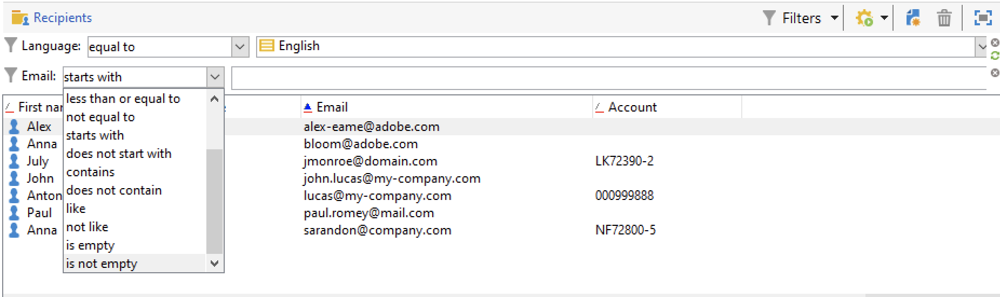
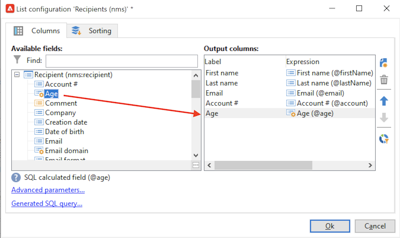

# Trabalhar com filtros{#create-filters}

A filtragem de dados é o processo de restringir um conjunto de dados somente aos registros que correspondem a critérios específicos. Esse subconjunto pode ser usado para ações direcionadas (como atualizações ou criação de público-alvo) ou para análise.

Ao navegar pela Campanha, os dados são exibidos em listas. Aplique filtros incorporados para acessar rapidamente um subconjunto definido, como endereços em quarentena, destinatários não direcionados ou registros em um intervalo de idade ou data de criação específico.

Além disso, você pode criar filtros personalizados, salvá-los para uso futuro e compartilhá-los com outros usuários do Campaign.

Os filtros são aplicados **dinamicamente**: sempre que os dados são alterados, os resultados filtrados são atualizados automaticamente.

>[!NOTE]
>
>As configurações da interface do usuário são definidas localmente no nível do dispositivo. Às vezes, poderá ser necessário limpar esses dados, principalmente se surgirem problemas ao atualizar dados. Para fazer isso, use o menu **[!UICONTROL File > Clear the local cache]**.

Os seguintes tipos de filtros estão disponíveis no Adobe Campaign:

* [Filtros predefinidos](#predefined-filters)
* [Filtros rápidos](#quick-filters)
* [Filtros personalizados avançados](#advanced-filters)

## Filtros predefinidos{#predefined-filters}

### Filtros predefinidos nos painéis

Por padrão, o Adobe Campaign exibe todos os registros do banco de dados que o operador tem permissão para ler. É possível filtrar esses dados usando as opções disponíveis na seção superior da janela do navegador.

Há várias maneiras de filtrar os dados a serem exibidos. Se necessário, eles podem ser usados juntos. Navegue pelas guias abaixo para saber mais sobre as opções de filtragem.

>[!BEGINTABS]

>[!TAB Filtrar por pasta]

Para filtrar dados com base em sua pasta, clique no ícone **[!UICONTROL Folder]** e selecione a pasta que contém os dados a serem exibidos.

Somente os perfis na pasta são exibidos:

Utilize o xis à direita do campo de seleção da pasta para retornar ao modo de visualização padrão.

>[!TAB Filtrar por status]

Dependendo do tipo de informação exibida, é possível aplicar um filtro por status ou por estado.

Por exemplo, para deliveries, você pode optar por exibir somente deliveries concluídos como mostrado abaixo:

>[!TAB Solicitar por]

É possível selecionar a ordem de classificação dos dados oferecidos nas páginas por meio da lista suspensa à direita do campo de filtragem &#39;por pasta&#39;. O conteúdo desse campo depende do tipo de dados na página.

Por exemplo, você pode classificar tarefas por prioridade, data de criação ou ordem alfabética.

>[!TAB Pesquisa rápida]

Use o campo de pesquisa para acessar rapidamente o item que procura: insira os caracteres incluídos no rótulo ou nome interno do item que deseja exibir e, em seguida, confirme para aplicar um filtro automático aos dados na página.

Para exibir todos os itens novamente, clique no xis para excluir o conteúdo do campo de pesquisa.

>[!ENDTABS]

### Filtros predefinidos no Explorer

Filtros predefinidos estão disponíveis no botão **Filtros** acima de cada lista.

Por exemplo, para os perfis, os seguintes filtros integrados estão disponíveis:

Você pode acessar os detalhes dos filtros no nó **[!UICONTROL Profiles and Targets > Pre-defined filters]** do Explorer.

>[!NOTE]
>
>Para todas as outras listas de dados, os filtros predefinidos são armazenados no nó **[!UICONTROL Administration > Configuration > Predefined filters]**.

Selecione um filtro para exibir sua definição.

Use a última guia para visualizar os dados filtrados.

+++  Filtros predefinidos embutidos para perfis

<table> 
 <tbody> 
  <tr> 
   <td> <strong>Rótulo</strong>  </td> 
   <td> <strong>Query</strong>  </td> 
  </tr> 
  <tr> 
   <td> Aberto  </td> 
   <td> Seleciona destinatários que abriram uma entrega.  </td> 
  </tr> 
  <tr> 
   <td> Aberto, mas não clicado  </td> 
   <td> Seleciona destinatários que abriram uma entrega, mas não clicaram em um link.  </td> 
  </tr> 
  <tr> 
   <td> Destinatários inativos  </td> 
   <td> Seleciona destinatários que não abriram uma entrega em X meses.  </td> 
  </tr> 
  <tr> 
   <td> Última atividade por tipo de dispositivo  </td> 
   <td> Seleciona destinatários que clicaram em ou abriram a entrega Y usando o dispositivo X nos últimos Z dias.  </td> 
  </tr> 
  <tr> 
   <td> Última atividade por tipo de dispositivo (rastreamento)  </td> 
   <td> Seleciona destinatários que clicaram em ou abriram a entrega Y usando o dispositivo X nos últimos Z dias.  </td> 
  </tr> 
  <tr> 
   <td> Destinatários não direcionados  </td> 
   <td> Seleciona destinatários que nunca foram direcionados por canal Y em X meses.  </td> 
  </tr> 
  <tr> 
   <td> Destinatários muito ativos  </td> 
   <td> Seleciona destinatários que clicaram em uma entrega pelo menos X vezes nos últimos Y meses.  </td> 
  </tr> 
  <tr> 
 <td> Incluir endereço de email na lista de bloqueios  </td> 
    <td> Seleciona os destinatários cujo endereço de email está na lista de bloqueios.  </td>
  </tr> 
  <tr> 
   <td> Endereço de email na quarentena  </td> 
   <td> Seleciona destinatários cujo endereço de email está em quarentena.  </td> 
  </tr> 
  <tr> 
   <td> Endereços de email duplicados na pasta  </td> 
   <td> Seleciona destinatários cujo endereço de email está duplicado na pasta.  </td> 
  </tr> 
  <tr> 
   <td> Não aberto nem clicado  </td> 
   <td> Seleciona destinatários que não abriram ou não clicaram em uma entrega.  </td> 
  </tr> 
  <tr> 
   <td> Novos destinatários (dias)  </td> 
   <td> Seleciona destinatários que foram criados nos últimos X dias.  </td> 
  </tr> 
  <tr> 
   <td> Novos destinatários (minutos)  </td> 
   <td> Seleciona destinatários que foram criados nos últimos X minutos.  </td> 
  </tr> 
  <tr> 
   <td> Novos destinatários (meses)  </td> 
   <td> Seleciona destinatários que foram criados nos últimos X meses.  </td> 
  </tr> 
  <tr> 
   <td> Por assinatura  </td> 
   <td> Seleciona destinatários por assinatura.  </td> 
  </tr> 
  <tr> 
   <td> Ao clicar em um link específico  </td> 
   <td> Seleciona destinatários que clicaram em um determinado URL em uma entrega.  </td> 
  </tr> 
  <tr> 
   <td> Por comportamento pós-entrega  </td> 
   <td> Seleciona destinatários de acordo com seu comportamento após receber uma entrega.  </td> 
  </tr> 
  <tr> 
   <td> Por data de criação  </td> 
   <td> Seleciona destinatários por data de criação, por um período variando de X meses (data atual menos n meses) para Y meses (data atual menos n meses).  </td> 
  </tr> 
  <tr> 
   <td> Por lista  </td> 
   <td> Seleciona destinatários por lista.  </td> 
  </tr> 
  <tr> 
   <td> Por número de cliques  </td> 
   <td> Seleciona destinatários que clicaram em uma entrega nos últimos X meses.  </td> 
  </tr> 
  <tr> 
   <td> Por número de mensagens recebidas  </td> 
   <td> Seleciona destinatários de acordo com o número de mensagens recebidas.  </td> 
  </tr> 
  <tr> 
   <td> Por número de aberturas  </td> 
   <td> Seleciona destinatários que abriram entregas entre X e Y ao longo da quantidade Z de tempo.  </td> 
  </tr> 
  <tr> 
   <td> Por nome ou email  </td> 
   <td> Seleciona destinatários de acordo com seu nome ou email.  </td> 
  </tr> 
  <tr> 
   <td> Por faixa etária  </td> 
   <td> Seleciona destinatários de acordo com sua idade.  </td> 
  </tr> 
 </tbody> 
</table>

+++

#### Filtros padrão{#default-filters}

Os campos acima de cada lista permitem usar o **filtro padrão predefinido** para esta lista. Para a lista de recipients, você pode filtrar pelo nome e endereço de email por padrão.

>[!NOTE]
>
>O caractere **%** substitui qualquer cadeia de caracteres. Por exemplo, digite `%@gmail.com` no campo Email para exibir todos os perfis com um endereço do Gmail. Digite `%@L` no campo Sobrenome para exibir todos os perfis com um L no sobrenome.

Para alterar o filtro padrão de uma lista de destinatários, navegue até o nó **[!UICONTROL Profiles and Targets > Predefined filters]**.

Para todos os outros tipos de dados, configure o filtro padrão por meio do nó **[!UICONTROL Administration > Configuration > Predefined filters]**.

Siga as etapas abaixo:

1. Selecione o filtro que deseja usar como padrão.
1. Clique na guia **[!UICONTROL Parameters]** e selecione **[!UICONTROL Default filter for the associated document type]**.

   

1. Desmarque essa mesma opção para o filtro predefinido padrão atual.
1. Clique em **[!UICONTROL Save]** para aplicar o filtro.
1. Navegue até a pasta Recipient e clique no ícone **[!UICONTROL Remove this filter]** à direita do filtro atual: o novo filtro padrão está disponível.
   

## Filtros rápidos{#quick-filters}

Você pode definir e combinar **Filtros rápidos** para criar filtros personalizados em campos específicos.

Depois de adicionados, os campos de filtro rápido são exibidos acima da lista de dados, um após o outro. Eles podem ser excluídos de maneira independente.

Os filtros rápidos são específicos para cada operador e são reiniciados sempre que o operador limpa o cache do console do cliente.

Se precisar reutilizar um filtro, crie um **filtro avançado** e salve-o. [Saiba mais](#advanced-filters).

Para criar um **filtro rápido**, siga estas etapas:

1. Clique com o botão direito do mouse no campo que deseja filtrar e selecione **[!UICONTROL Filter on this field]**.

   

   Os campos de filtro padrão são exibidos acima da lista.

   

1. Selecione as opções de filtro.
1. Se necessário, use o ícone cinza no lado direito de um filtro para removê-lo.
1. É possível combinar filtros para refiná-los.

   

Se você precisar filtrar em um campo que não está disponível no formulário, mas nas colunas, e filtrar nessa coluna. Para fazer isso,

1. Clique no ícone **[!UICONTROL Configure list]**.

   

1. Selecione a coluna a ser exibida, por exemplo, a idade dos destinatários, e clique em **Ok**.

   

1. Clique com o botão direito do mouse na coluna **Age** na lista de destinatários, e depois selecione **[!UICONTROL Filter on this column]**.

   

   Em seguida, é possível selecionar as opções de filtragem por idade. Adicione outro filtro na página para definir um intervalo.

   

## Filtros avançados{#advanced-filters}

Combine critérios complexos em **Filtros avançados** personalizados. Use esses filtros para criar uma consulta complexa ou uma combinação de consultas sobre seus dados. Esses filtros podem ser salvos e compartilhados com outros usuários do Campaign.

### Criar um filtro avançado{#create-adv-filters}

Para criar um **filtro avançado**, clique no botão **[!UICONTROL Filters]** e selecione **[!UICONTROL Advanced filter...]**.

Você também pode clicar com o botão direito do mouse na lista de dados e selecionar **[!UICONTROL Advanced filter...]**.

Defina as condições de filtragem. No exemplo abaixo, você filtrará por recipients cujo número de conta não começa com NL e que vivem em Paris ou Los Angeles.

1. Clique no ícone **[!UICONTROL Edit expression]** da coluna **[!UICONTROL Expression]**.

   

1. Selecione o campo para filtrar.
1. Selecione o operador a ser aplicado na lista suspensa.

   

1. Selecione um valor esperado na coluna **[!UICONTROL Value]**. Você pode combinar vários filtros para refinar seu query. Para adicionar uma condição de filtro, clique em **[!UICONTROL Add]**.

   

   >[!NOTE]
   >
   >É possível atribuir uma hierarquia para as expressões ou alterar a ordem das expressões de query utilizando as setas da barra de ferramentas.

1. Três operadores estão disponíveis para combinar expressões: **And**, **Or**, **Except**. Clique na seta para alternar para **Ou**.

   

1. Clique em **[!UICONTROL Ok]** para criar o filtro e aplicá-lo à lista atual.

O filtro aplicado é exibido acima da lista.

Para editar ou modificar esse filtro, clique no link de descrição em azul, acima da lista.

### Salvar um filtro avançado{#save-adv-filters}

Você pode salvar um filtro avançado como um [filtro predefinido](#predefined-filters), para poder reutilizá-lo e compartilhá-lo com outros usuários do Campaign.

Para salvar um filtro avançado, siga as etapas abaixo:

1. Clique na descrição do filtro para editá-lo.
1. Clique no ícone **[!UICONTROL Save as filter]** na seção superior direita da janela.

   

1. Insira um nome para este filtro e salve-o.

   

O filtro foi adicionado aos [filtros predefinidos](#predefined-filters). Ela pode ser atualizada a partir desse nó.

>[!NOTE]
>
>Você pode adicionar um atalho para o filtro ativá-lo no teclado.

Esse filtro também está disponível nos filtros predefinidos da lista de recipients.

### Usar um filtro para definir um segmento {#filter-as-segment}

Você pode usar e combinar filtros para criar um segmento de população do target.

Depois de salvos, os filtros avançados ficam disponíveis ao selecionar a população de destino de uma mensagem, na seção **[!UICONTROL User filters]**.

>[!NOTE]
>
>Use o **[!UICONTROL Exclude recipients from this segment]** para direcionar somente contatos que não correspondam aos critérios do filtro.

### Usar funções para criar filtros avançados{#use-functions-adv-filters}

Para executar recursos avançados de filtragem, use funções para definir o conteúdo do filtro. O editor de filtro Avançado aproveita todos os recursos do editor de consulta do Campaign.

Saiba como criar consultas avançadas nestes exemplos completos:

* Saiba como segmentar em atributos de destinatários simples [nesta página](https://experienceleague.adobe.com/docs/campaign/automation/workflows/wf-activities/targeting-activities/query.html){target="_blank"}.
* Saiba como filtrar destinatários não contatados nos últimos 7 dias nesta [página](https://experienceleague.adobe.com/docs/campaign/automation/workflows/use-cases/designing-queries/query-many-to-many-relationship.html){target="_blank"}.
* Saiba como recuperar a lista de operadores que podem ser filtrados por Contas ativas em [esta página](https://experienceleague.adobe.com/docs/campaign/automation/workflows/use-cases/designing-queries/create-a-filter.html){target="_blank"}.
* Saiba como criar um público-alvo de email de aniversário na [esta página](https://experienceleague.adobe.com/docs/campaign/automation/workflows/use-cases/deliveries/send-a-birthday-email.html?lang=pt-BR){target="_blank"}.

### Parâmetros avançados para filtros predefinidos {#param-for-data-filters}

Parâmetros avançados estão disponíveis para filtros predefinidos. Para acessá-las, navegue até a guia **[!UICONTROL Parameters]** do filtro.

* Para exibir o filtro por padrão para todas as listas baseadas neste tipo de Documento, selecione a opção **[!UICONTROL Default filter for the associated document type]**.

  Por exemplo, o filtro **[!UICONTROL By name or login]** é aplicado aos operadores. Essa opção é selecionada, de modo que o filtro é sempre exibido em todas as listas de operadores.

* Para disponibilizar um filtro para todos os operadores de campanha, selecione a opção **[!UICONTROL Filter shared with other operators]**.

* Para definir um formulário para selecionar os critérios de filtragem, selecione a opção **[!UICONTROL Use parameter entry form]**. Este formulário deve ser inserido no formato XML na guia **[!UICONTROL Form]**. Por exemplo, o filtro predefinido interno **[!UICONTROL Recipients who have opened]**, disponível na lista de destinatários, exibe um campo de filtro que permite selecionar a entrega à qual o filtro se aplica.

* O link **[!UICONTROL Advanced parameters]** permite definir configurações adicionais.

   * Você pode associar uma tabela SQL ao filtro para torná-la comum a todos os editores que a compartilham.
   * Para impedir que qualquer usuário substitua o filtro, selecione a opção **[!UICONTROL Do not restrict the filter]**. Por exemplo, essa opção está ativa para os filtros &quot;Destinatários de um delivery&quot; e &quot;Destinatários de deliveries pertencentes a uma pasta&quot; que estão disponíveis no assistente de delivery. Esses filtros não podem ser sobrecarregados.

