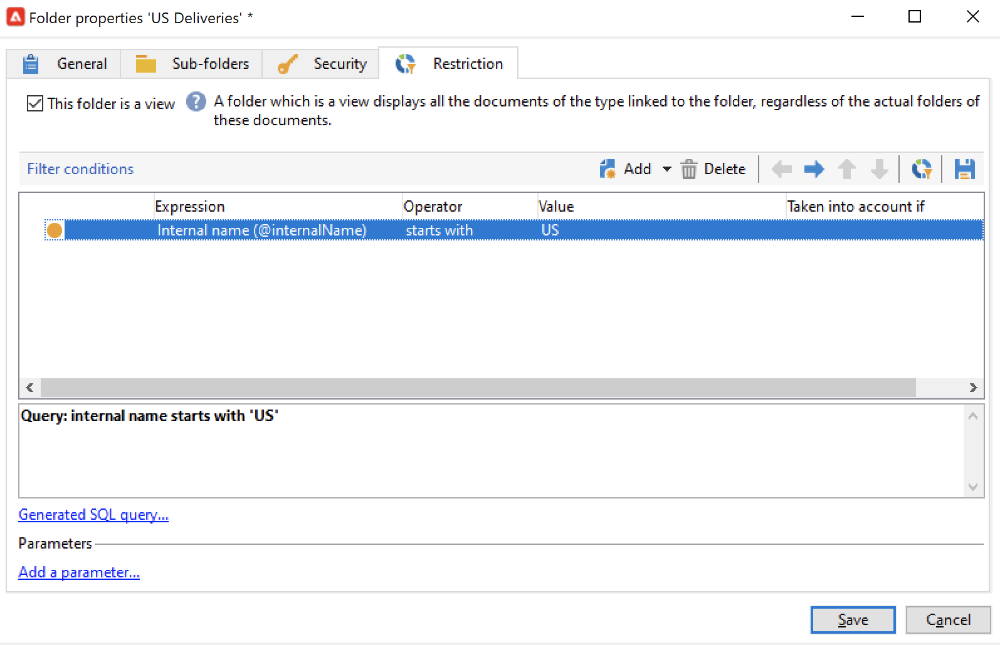

# Gerenciar pastas e visualizações {#folders-and-views}

As pastas do Campaign são nós na árvore do explorador. Com base no tipo, eles contêm determinados tipos de dados.

Uma exibição é uma pasta específica que não contém dados, mas exibe dados fisicamente armazenados em outras pastas do mesmo tipo. Por exemplo, se você transformar uma pasta de delivery em uma visualização, essa pasta mostrará todos os deliveries. Esses dados podem ser filtrados.

>[!NOTE]
>Para distinguir visualizações de pastas padrão, seu nome é exibido em azul claro em vez de preto.

Observe que é possível atribuir permissões a pastas para restringir o acesso a determinados dados. [Saiba mais](#restrict-access-to-a-folder)

## Práticas recomendadas para trabalhar com pastas{#best-practices-folders}

* **Usar pastas integradas** para facilitar o uso, a manutenção e a solução de problemas do aplicativo para todas as pessoas envolvidas no projeto. Evite criar estruturas de pastas personalizadas para recipients, listas, deliveries etc., mas use as pastas padrão, como **Administração**, **Perfis e destinos**, **Gerenciamento de campanhas**.

* **Criar subpastas**, por exemplo, salve seus workflows técnicos na pasta interna: **[!UICONTROL Administration > Production > Technical Workflows]** e crie subpastas por tipo de fluxo de trabalho.

* **Definir e aplicar uma convenção de nomenclatura**, por exemplo, é possível nomear os workflows em ordem alfabética, para que apareçam classificados na ordem de execução, como:

   A1 - importar recipients, começa às 10h; A2 - importar tíquetes, começa às 11h.

## Criar uma pasta{#create-a-folder}

Para criar uma pasta, clique com o botão direito do mouse em uma pasta existente e use o menu contextual.

Para criar o mesmo tipo de pasta que a pasta selecionada, escolha a primeira opção no menu contextual. Por exemplo, em uma pasta Recipients, selecione **[!UICONTROL Create a new 'Recipients' folder]**.

Você pode arrastar e soltar a nova pasta para organizar a árvore do explorador do Campaign conforme necessário.

Para criar outro tipo de pasta, clique com o botão direito em uma pasta existente e selecione **[!UICONTROL Add new folder]**. É possível criar todos os tipos de pastas, dependendo dos dados a serem armazenados.

>[!CAUTION]
>Essas alterações se aplicam a todos os usuários do Campaign.

## Transformar uma pasta em um modo de exibição{#turn-a-folder-to-a-view}

Uma exibição é uma pasta específica que não contém dados, mas exibe dados fisicamente armazenados em outras pastas do mesmo tipo.

Você pode transformar qualquer pasta em uma visualização, mas a pasta deve estar vazia. Todos os dados armazenados na pasta são excluídos quando você transforma a pasta em uma visualização.

>[!CAUTION]
>
>Uma visualização exibe dados e fornece acesso a eles, mesmo se os dados não estiverem fisicamente armazenados na pasta de visualização. Para ter acesso ao conteúdo, o operador deve ter as permissões apropriadas nas pastas de origem, pelo menos, acesso de Leitura.
>
>Para conceder acesso a uma visualização sem conceder acesso à pasta de origem, não conceda acesso de leitura ao nó pai da pasta de origem.

No exemplo abaixo, criaremos uma nova pasta para exibir apenas deliveries dos EUA, com base no nome interno.

1. Criar um **[!UICONTROL Deliveries]** pasta e nomeie-a **Entregas nos EUA**.
1. Clique com o botão direito do mouse nessa pasta e selecione **[!UICONTROL Properties...]**.
1. Na guia **[!UICONTROL Restriction]**, selecione **[!UICONTROL This folder is a view]**. Todos os deliveries no banco de dados serão exibidos.

   

1. Defina os critérios de filtro no editor de query na seção central da janela: somente os deliveries correspondentes ao filtro são exibidos na pasta.

   

   >[!NOTE]
   >
   >Saiba como criar consultas no [esta página](create-filters.md#advanced-filters)

>[!CAUTION]
>
>Ao gerenciar [mensagens transacionais](../send/transactional.md) eventos, a variável **[!UICONTROL Real time events]** ou **[!UICONTROL Batch events]** as pastas não devem ser definidas como visualizações nas instâncias de execução, pois isso pode levar a problemas de permissão.

## Organizar suas pastas{#organize-your-folders}

Por padrão, uma nova pasta é adicionada na parte superior da hierarquia.

Navegue pelo **Subpastas** de uma pasta para organizar suas subpastas.

Você pode mover as pastas com as setas à direita ou selecionar a opção **[!UICONTROL Sort the sub-folders in alphabetical order]** opção para classificá-los automaticamente.

## Filtrar dados em uma pasta{#filter-data-in-a-folder}

Para filtrar os dados armazenados em uma pasta, acesse as propriedades da pasta e selecione a guia Restriction.

Por exemplo, a pasta abaixo conterá apenas contatos com um endereço de email e cuja origem não esteja sinalizada como &#39;Externa&#39; ou esteja vazia.

## Restringir o acesso a uma pasta{#restrict-access-to-a-folder}

Use permissões em pastas para organizar e controlar o acesso aos dados do Campaign. Saiba mais sobre permissões em pastas no [nesta seção](../start/folder-permissions.md).
