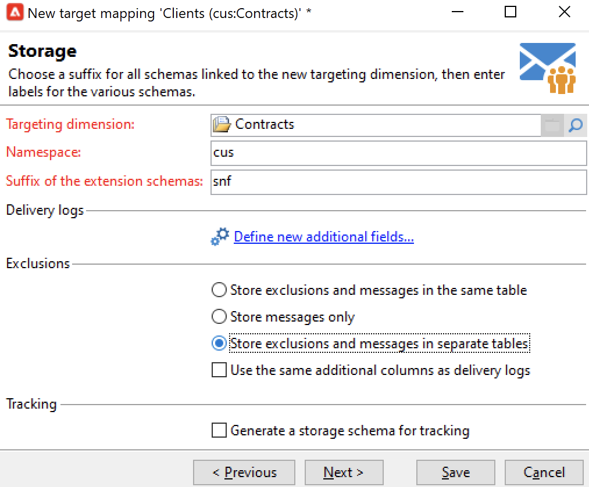
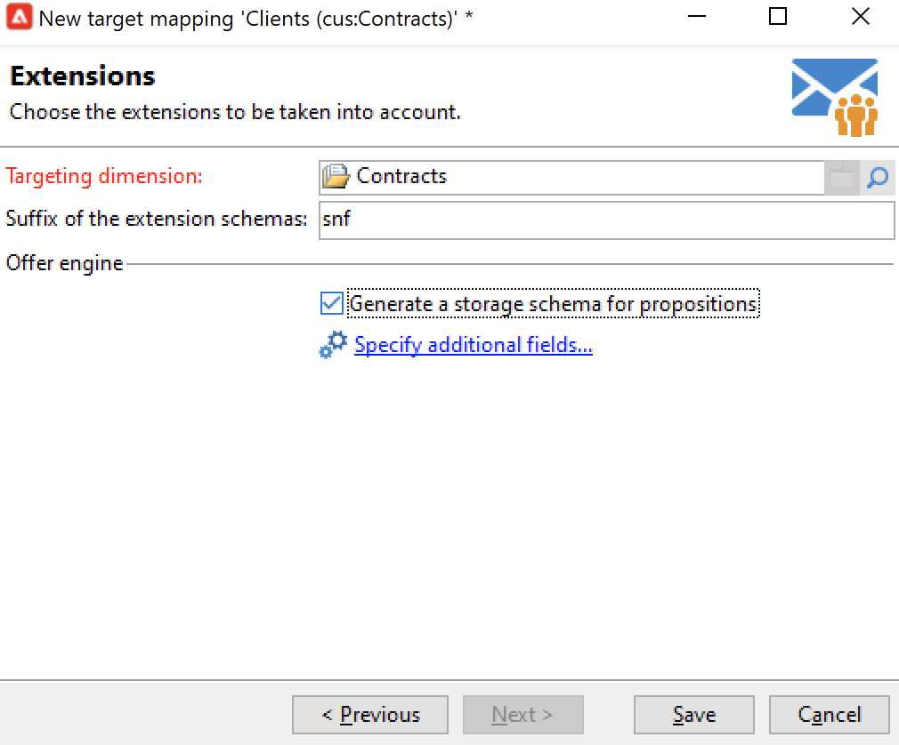

# Trabalhar com target mappings{#gs-target-mappings}

Por padrão, os modelos de entrega de email e SMS têm como alvo **[!UICONTROL Recipients]**. O target mapping, portanto, usa os campos da tabela **nms:recipient**.

Para notificações por push, o target mapping padrão é **Aplicativos do assinante (nms:appSubscriptionRcp)**, que está vinculado à tabela de destinatários.

Você pode usar outros target mappings para seus deliveries ou criar um novo.

## Mapeamentos de destino incorporados {#ootb-mappings}

O Adobe Campaign vem com os seguintes target mappings incorporados:

| Nome | Use para | Esquema |
|---|---|---|
| Destinatários | Entregar aos destinatários (tabela de destinatários integrada) | nms:recipient |
| Visitantes | Enviar delivery aos visitantes cujos perfis foram coletados por meio de referência (marketing viral), por exemplo. | mns:visitor |
| Subscrições | Entregar aos destinatários que assinam um serviço de informações, como um boletim informativo | nms:subscription |
| Assinaturas do visitante | Entregar aos visitantes que são inscritos em um serviço de informações | nms:visitorSub |
| Operadores | Entregar aos operadores do Adobe Campaign | nms:operator |
| Arquivo externo | Entregar por meio de um arquivo que contenha todas as informações necessárias para a entrega | Nenhum esquema vinculado, nenhum target inserido |
| Aplicativos de assinante | Enviar delivery aos recipients que assinaram um aplicativo | nms:appSubscriptionRcp |

## Criar um target mapping {#new-mapping}

Você também pode criar um target mapping. Talvez seja necessário adicionar um target mapping personalizado, por exemplo, se:

* usar uma tabela de recipient personalizada,
* configure uma dimensão de filtro diferente da targeting dimension integrada na tela target mapping.

Saiba mais sobre tabelas de destinatários personalizadas em [esta página](../dev/custom-recipient.md).

O assistente de criação de target mapping do Adobe Campaign ajuda a criar todos os esquemas necessários para usar seu target mapping personalizado.

1. Navegue até **[!UICONTROL Administration]** `>` **[!UICONTROL Campaign Management]** `>` **[!UICONTROL Target mappings]** no Adobe Campaign Explorer.

1. Crie um novo target mapping e selecione seu esquema personalizado como o targeting dimension.

   

1. Indique os campos onde as informações do perfil são armazenadas: sobrenome, nome, email, endereço, etc.

   

1. Especifique os parâmetros para armazenamento de informações, incluindo o sufixo dos schemas de extensão para que sejam facilmente identificáveis.

   

   Você pode escolher se deseja armazenar exclusões (**excludelog**), com mensagens (**broadlog**) ou em uma tabela separada.

   Você também pode escolher se deseja gerenciar o rastreamento para esse mapeamento de entrega (**trackinglog**).

1. Em seguida, selecione as extensões a serem consideradas. O tipo de extensão depende das configurações e dos complementos do Campaign.

   

   Clique no botão **[!UICONTROL Save]** para iniciar a criação de mapeamento de entrega: todas as tabelas vinculadas são criadas automaticamente com base nos parâmetros selecionados.
