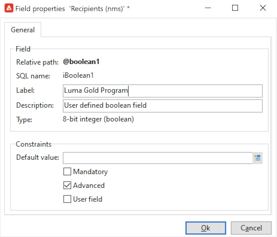

# Visualizar perfis existentes{#view-profiles}

Navegue até **[!UICONTROL Profiles and targets]** para acessar destinatários armazenados no banco de dados do Adobe Campaign.

Nessa página, é possível [criar novo destinatário](create-profiles.md), edite um recipient existente e acesse os detalhes do perfil.

Para manipulações de perfil mais avançadas, acesse a árvore do Campaign no **[!UICONTROL Explorer]** link na página inicial do Adobe Campaign.

>[!CAUTION]
>
>A tela Recipient integrada é definida por meio de um esquema XML e seu formulário associado. O esquema XML é armazenado na variável **[!UICONTROL Administration > Configuration > Data schemas]** nó da árvore do explorador do Adobe Campaign. Somente usuários especialistas podem fazer alterações nesses esquemas.

## Editar um perfil{#edit-a-profiles}

Selecione um perfil para exibir detalhes em uma nova guia.

Os dados relativos aos perfis são agrupados em guias. Essas guias e seu conteúdo dependem das configurações específicas e dos pacotes instalados.

Para um recipient integrado típico, você pode acessar as seguintes guias:

* **[!UICONTROL General]**, para todos os dados de perfil gerais. Em particular, ele contém o sobrenome, o nome, o endereço de email, o formato do email, etc.

   Essa guia também armazena o **opt out** sinalizador para o perfil: quando a variável **[!UICONTROL No longer contact (by any channel)]** estiver selecionada, o perfil está em lista de bloqueios. Essas informações são adicionadas aos dados do contato se o recipient clicou em um link de unsubscription em um boletim informativo, por exemplo. Esse recipient não será mais direcionado para qualquer canal (email, mala direta etc.). Para obter mais informações, consulte [esta página](../send/quarantines.md).

* **Informações de contato**, que contém o endereço de correspondência direta do perfil selecionado.

   Você pode verificar nesta tela o índice de qualidade do endereço e quantos erros o endereço contém. Essas informações são usadas diretamente pelo provedor de correspondência direta, com base no número de erros encontrados durante deliveries anteriores, e não podem ser alteradas manualmente.

* **Outras**, para campos específicos que podem ser personalizados e preenchidos dependendo de suas necessidades.

   Use o **[!UICONTROL Field properties…]** menu contextual para alterar os nomes dos campos e definir seu formato.

   

   Insira as novas configurações conforme abaixo:

   

   Verifique a atualização na interface do usuário do :

   

   >[!CAUTION]
   >As alterações se aplicam a todos os recipients.

* **Subscrições**, para todas as subscrições ativas de serviços. Use o **Histórico** para acessar detalhes de subscrições e unsibscriptions para este contato.

   

   Saiba mais sobre assinaturas [nesta seção](../start/subscriptions.md).

* **Deliveries**, para todos os logs de delivery do perfil selecionado. Use esta guia para acessar o histórico de marketing do contato: rótulos, datas e status de todas as ações de delivery endereçadas ao perfil por todos os canais.

* **Rastreamento**, para todos os logs de rastreamento do perfil selecionado. Essas informações são usadas para rastrear o comportamento do perfil após as entregas. Esta guia mostra o total cumulativo de todas as URLs rastreadas nas entregas. A lista é configurável e normalmente contém: a URL clicada, a data e hora do clique e o documento que continha a URL

   Saiba mais sobre rastreamento [nesta seção](../start/tracking.md).

## Perfis ativos {#active-profiles}

Os perfis ativos são aqueles que são contados para fins de faturamento.

A cobrança só afeta perfis que estão **ativos**. Um perfil é considerado ativo quando ele é visado ou recebe comunicação nos últimos 12 meses por meio de qualquer canal.

Um perfil que se tornou alvo de vários deliveries é contado apenas uma vez.

A contagem de perfis ativos está disponível somente para **Instâncias de marketing**. Não está disponível para Instâncias de execução, ou seja, instâncias de MID (mid-sourcing) e RT (Centro de mensagens/Mensagens em tempo real).

>[!NOTE]
>
>Você também pode monitorar o número de perfis ativos em sua instância diretamente do Painel de controle do Campaign. Para obter mais informações, consulte a [documentação do Painel de controle do Campaign](https://experienceleague.adobe.com/docs/control-panel/using/performance-monitoring/active-profiles-monitoring.html?lang=pt-BR).
