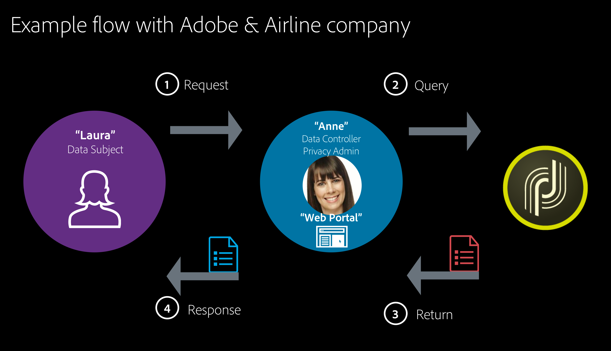

# Práticas recomendadas de segurança do Campaign {#ac-security}

Na Adobe, levamos a segurança da sua experiência digital muito a sério. As práticas de segurança estão profundamente enraizadas em nossos processos e ferramentas internos de desenvolvimento e operações de software e são rigorosamente seguidas por nossas equipes multifuncionais para evitar, detectar e responder a incidentes de maneira adequada.

Além disso, nosso trabalho colaborativo com parceiros, pesquisadores líderes, instituições de pesquisa de segurança e outras organizações do setor nos ajuda a nos manter atualizados com as mais recentes ameaças e vulnerabilidades e regularmente incorporamos técnicas avançadas de segurança aos produtos e serviços que oferecemos.

>[!NOTE]
>
>**Serviços gerenciados de nuvem do Campaign v8:** A infraestrutura (rede, servidor, TLS, patches) é gerenciada pela Adobe. Esta página se concentra na configuração no nível do locatário e do aplicativo que você controla: gerenciamento de acesso, autenticação, configurações de instância, proteção de dados, codificação e práticas operacionais.


## Lista de verificação de segurança {#security-checklist}

Use esta lista de verificação para alinhar sua configuração com os padrões seguros recomendados:

* [Gerenciamento de acesso](#access-management): criar grupos de segurança, atribuir direitos apropriados, limitar o uso do administrador, um operador por usuário, revisar periodicamente
* [Autenticação e sessão](#authentication-and-session): usar o Adobe IMS, política de identidade forte, tempo limite de sessão
* [Segurança de instância e rede](#instance-and-network-security): incluo na lista de permissões IP, permissões de URL, chaves GPG via Painel de Controle
* [Proteção de dados e PII](#data-and-pii-protection): HTTPS, restrição de visualização de PII, restrição de senhas, proteção de páginas confidenciais
* [Diretrizes de codificação](#coding-guidelines): sem segredos codificados, validação de entrada, SQL com parâmetros, captchas
* [Restrição de dados](#data-restriction): restringir o acesso aos campos de senha e segredo em contas externas
* [Operacional e de conformidade](#operational-and-compliance): compare com esta linha de base periodicamente, use a trilha de auditoria

### Onde encontrar esta orientação {#public-guidance}

Esta orientação de configuração segura recomendada é publicada publicamente no Experience League. Você pode usá-lo e compartilhá-lo sem restrição:

* **Esta página** - [Práticas recomendadas de segurança do Campaign](#ac-security) (lista de verificação e seções detalhadas)
* **[Complemento de segurança aprimorado](enhanced-security.md)** - Integração CMK segura e encapsulamento VPN seguro
* **[Introdução a permissões](../start/gs-permissions.md)** - Perfis de acesso e de produto
* **[Restringir exibição de PII](../dev/restrict-pi-view.md)** - Restringindo o acesso a campos confidenciais
* **[Diretrizes de implementação](../start/implement.md)** - Segurança e privacidade antes de começar

## Privacidade

Para gerenciar corretamente a privacidade e os dados pessoais, trabalhe dentro das legislações aplicáveis às regiões onde você opera. Os recursos da Adobe Campaign ajudam você a cumprir os regulamentos listados em [esta página](../start/privacy.md)

### Privacidade da Adobe Experience Cloud {#experience-cloud-privacy}

O Adobe Campaign faz parte das soluções da Adobe Experience Cloud. A maneira como a privacidade é tratada no Campaign obedece aos princípios gerais da Experience Cloud, como os seguintes:

* **Quais informações são coletadas ao usar a Adobe Experience Cloud**

  Como empresa usando as soluções da Adobe Experience Cloud, você escolhe quais informações coletar e enviar para sua conta da Adobe Experience Cloud. Exemplos dos tipos de informações que podem ser coletadas incluem atividade de navegação na web, endereços IP, informações de localização de dispositivos móveis, taxas de sucesso de campanha, itens comprados ou colocados no carrinho de compras, etc.

  >[!NOTE]
  >
  >Quanto a todos os produtos da Adobe, o Campaign coleta informações sobre os usuários do aplicativo e do site. Para obter mais informações, consulte a [Política de privacidade da Adobe](https://www.adobe.com/br/privacy/policy.html).

* **Como a Adobe Experience Cloud é usada para coletar informações**

   * As soluções da Adobe Experience Cloud usam cookies e tecnologias semelhantes, como web beacons (também conhecidos como tags ou pixels), para permitir que você colete informações. Para obter mais informações sobre cookies e recursos de rastreamento com o Adobe Campaign, consulte [esta seção](#tracking-capabilities).
   * Você também pode usar as tecnologias da Adobe Experience Cloud em seus aplicativos móveis. Para obter mais informações sobre como enviar entregas móveis com o Campaign, consulte [canal SMS](../send/sms/sms-channel.md) e canal de aplicativo móvel.

* **As opções de privacidade dos usuários sobre o uso da Adobe Experience Cloud**

  A Adobe solicita que você forneça aos seus clientes políticas de privacidade descrevendo:

   * Suas práticas de privacidade em conexão com a Adobe Experience Cloud
   * Como os usuários podem definir suas preferências para a coleção ou usar suas informações em conexão com a Adobe Experience Cloud

  >[!NOTE]
  >
  >Quanto a todos os produtos da Adobe, os usuários do Campaign podem recusar o compartilhamento das informações coletadas sobre eles por meio de aplicativos e sites. Para obter mais informações, consulte as [Perguntas frequentes sobre o uso de informações com a Adobe Experience Cloud](https://www.adobe.com/br/privacy/experience-cloud-usage-info-faq.html).

Para obter mais detalhes sobre a privacidade da Adobe Experience Cloud, consulte [esta página](https://www.adobe.com/br/privacy/marketing-cloud.html).

## Dados pessoais e Personas {#personal-data}

Ao gerenciar a privacidade, é importante definir quais dados devem ser tratados com cuidado e por quem.
* **Dados pessoais** são informações que podem identificar direta ou indiretamente um indivíduo vivo.
* **Dados confidenciais pessoais** são informações relacionadas à raça, opiniões políticas, crenças religiosas, antecedentes criminais, informações genéticas, dados de saúde, preferência sexual e informações biométricas de uma pessoa física, bem como sua filiação sindical.

Ao integrar o Campaign a outras soluções da Experience Cloud, onde os públicos-alvo podem ser transferidos de um sistema para outro, como o [Adobe Analytics](../connect/ac-aa.md), o [Experience Cloud Audiences](../start/shared-audiences.md), o Campaign Standard ou outras soluções por meio do [Conector de CRM](../../automation/workflow/crm-connector.md), é necessário ter cuidado extra com a proteção de dados pessoais.

As [principais legislações](#privacy-regulations) referem-se às diferentes entidades que gerenciam os dados da seguinte forma:

* Um **Controlador de dados** é a autoridade que determina os meios e a finalidade de coleta, utilização e compartilhamento de dados pessoais.

* Um **Processador de dados** é qualquer pessoa física ou parte que coleta, utiliza ou compartilha dados pessoais, conforme determinado pelo Controlador de dados.

* Um **Titular de dados** é qualquer pessoa viva cujos dados pessoais estejam sendo coletados, utilizados ou compartilhados, e que possa ser identificada, direta ou indiretamente, por referência a esses dados pessoais.

Portanto, como uma empresa que coleta e compartilha dados pessoais, você é o Controlador de dados, seus clientes são os Titulares dos dados e o Adobe Campaign atua como um Processador de dados ao tratar os dados pessoais indicados por você. Observe que é sua responsabilidade como Controlador de dados, tratar a relação com os Titulares dos dados, como ao gerenciar [solicitações de privacidade](#privacy-requests).

### Cenário de caso de uso {#use-case-scenario}

Para ilustrar como as diferentes personalidades estão interagindo, veja um exemplo de um caso de uso de experiência de um cliente de RGPD de alto nível.

Neste exemplo, uma companhia aérea é o cliente do Adobe Campaign. Esta empresa é o **controlador de dados** e todos os clientes da companhia aérea são **titulares dos dados**. Laura, neste caso particular, é cliente da companhia aérea.

Aqui estão as diferentes personalidades usadas neste exemplo:

* **Laura** é a **titular dos dados**. Ela é o destinatário que recebe mensagens da companhia aérea. Laura pode ser uma passageira frequente, mas pode decidir a certa altura que não quer receber mensagens personalizadas com propaganda ou marketing da companhia aérea. Ela pedirá à companhia aérea (com base em seu processo) que exclua seu número de passageiro frequente.

* **Ana** é a **controladora de dados** da companhia aérea. Ela recebe a solicitação de Laura, recupera as IDs úteis solicitadas para identificar o titular dos dados e envia a solicitação no Adobe Campaign.

* O **Adobe Campaign** é o **operador de dados**.



Este é o fluxo geral para este caso de uso:

1. A **titular dos dados** (Laura) envia uma solicitação de RGPD para o **controlador de dados**, por email, via atendimento ao cliente ou um portal da web.

1. A **controladora de dados** (Ana) envia a solicitação de RGPD para o Campaign através da interface ou usando uma API.

1. Depois que o **operador de dados** (Adobe Campaign) receber as informações, executará então a solicitação do RGPD e enviará uma resposta ou uma confirmação à **controladora de dados** (Ana).

1. Em seguida, a **controlador de dados** (Ana) revisa as informações e as envia de volta para a **titular dos dados** (Laura).

## Aquisição de dados {#data-acquisition}

O Adobe Campaign permite coletar dados, inclusive informações pessoais e confidenciais. Portanto, é essencial que você receba e monitore o consentimento de seus destinatários.

* Tenha sempre o consentimento do destinatário para o recebimento de comunicações. Para fazer isso, continue atendendo às solicitações de recusa o mais rápido possível e verifique o consentimento por meio de um duplo processo de aceitação. Para obter mais informações, consulte [Criar um formulário de inscrição com dupla aceitação](https://experienceleague.adobe.com/en/docs/campaign-classic/using/designing-content/web-forms/use-cases-web-forms){target=_blank}.
* Não importe listas fraudulentas e utilize seed addresses para verificar se o arquivo do cliente não está sendo usado de forma fraudulenta. Para obter mais informações, consulte [Sobre seed addresses](https://experienceleague.adobe.com/en/docs/campaign-classic/using/sending-messages/using-seed-addresses/about-seed-addresses){target=_blank}.
* Por meio do gerenciamento de consentimento e direitos, você pode rastrear as preferências dos destinatários, bem como gerenciar quem em sua organização pode acessar quais dados. Para obter mais informações, consulte [esta seção](#consent).
* Facilite e gerencie solicitações de privacidade de seus destinatários. Para obter mais informações, consulte [esta seção](#privacy-requests).

## Gerenciamento de privacidade {#privacy-management}

O gerenciamento de privacidade está relacionado a todos os processos e ferramentas que podem ajudar você a cumprir as regras de privacidade (RGPD, CCPA etc.).

O Adobe Campaign oferece vários conjuntos de recursos dedicados ao gerenciamento de privacidade:
* Gerenciamento de consentimento, retenção de dados e funções de usuário. Consulte [esta seção](#consent).
* Solicitações de privacidade (Direito de acesso e Direito de ser esquecido). Consulte [esta seção](#privacy-requests).
* Recusar a venda de informações pessoais (específico para CCPA).

Os principais recursos de privacidade do Campaign e um exemplo das personalidades envolvidas são apresentados nesta [seção](https://helpx.adobe.com/br/campaign/kb/campaign-privacy-more.html#gdprpersonasandflow).

### Consentimento, retenção e funções {#consent}

Originalmente, o Adobe Campaign oferece recursos importantes que são essenciais à privacidade:

* **Gerenciamento de consentimento**: por meio do processo de gerenciamento de assinaturas, você pode gerenciar suas preferências de destinatário e rastrear quais destinatários aceitaram e que tipo de assinatura. Para obter mais informações, consulte [Sobre assinaturas](../../automation/workflow/subscription-services.md).
* **Retenção de dados**: todas as tabelas de registro padrão integradas têm períodos de retenção predefinidos, geralmente limitando seu armazenamento de dados a 6 meses ou menos. Períodos de retenção adicionais podem ser configurados com fluxos de trabalho. Para obter mais informações, entre em contato com os consultores ou administradores técnicos da Adobe.
* **Gerenciamento de direitos**: o Adobe Campaign oferece a capacidade de gerenciar os direitos atribuídos aos vários operadores do Campaign por meio de diferentes funções pré-concebidas ou personalizadas. Isso permite gerenciar quem em sua empresa pode acessar, modificar ou exportar diferentes tipos de dados. Para obter mais informações, consulte [Sobre o gerenciamento de acesso](https://experienceleague.adobe.com/en/docs/campaign-classic/using/installing-campaign-classic/security-privacy/access-management){target=_blank}.

### Solicitações de privacidade {#privacy-requests}

O Adobe Campaign fornece recursos adicionais para ajudar você se tornar um Controlador de dados para determinadas Solicitações de privacidade:

* O **Direito de acesso** é o Direito do titular de dados de obter a confirmação do Controlador de dados, caso os dados relativos a ele estejam sendo processados, onde e com que finalidade.

* O **Direito ao esquecimento** (solicitação de exclusão) permite que o Titular dos dados tenha seus dados pessoais apagados pelo Controlador de dados.

As solicitações de **Acesso** e **Exclusão** são apresentadas [nesta seção](../start/privacy.md).

As etapas de implementação para criar essas solicitações estão detalhadas nesta [seção](../start/privacy.md).

## Recursos de rastreamento {#tracking-capabilities}

### Cookies {#cookies}

Graças às suas funcionalidades de rastreamento, o Adobe Campaign permite rastrear a navegação de destinatários de entrega usando três tipos de cookies: um cookie de sessão e dois cookies permanentes.

* Um cookie de **sessão**: o cookie **nlid** contém o identificador do email enviado ao contato (**broadlogId**) e ao identificador do modelo de mensagem (**deliveryId**). Ele é adicionado quando o contato clica em um URL incluído em um email enviado pelo Adobe Campaign e permite que você acompanhe seu comportamento na Web. Esse cookie de sessão é apagado automaticamente quando o navegador é fechado. O contato pode configurar o navegador para recusar cookies.

* Dois cookies **permanentes**:
   * O cookie **UUID** (Universal Unique IDentifier) é compartilhado entre as soluções da Adobe Experience Cloud. É definido uma vez até que desapareça do navegador do cliente quando um novo valor é gerado. Este cookie identifica os usuários que interagem com as soluções da Experience Cloud quando visitam um site. Ele pode ser depositado por uma página de destino (para associar atividades desconhecidas do cliente a um destinatário) ou por uma entrega. A descrição deste cookie está disponível [nesta página](https://experienceleague.adobe.com/docs/core-services/interface/ec-cookies/cookies-mc.html?lang=pt-BR#ec-cookies).
   * O cookie **nllastdelid** (introduzido no Campaign Classic 20.3) é um cookie permanente que contém o **deliveryId** da última entrega do qual o usuário clicou no link. Esse cookie é usado quando o cookie da sessão está ausente, para identificar a tabela de rastreamento que será usada.

Regulamentos como o Regulamento Geral sobre a Proteção de Dados (RGPD) afirmam que as empresas exigem o acordo dos usuários do site antes da instalação de qualquer cookie.

* As janelas pop-up devem ser evitadas, pois geralmente são bloqueadas pelos navegadores.

### Rastreamento de mensagens {#message-tracking}

O Adobe Campaign permite rastrear os emails enviados e o comportamento dos destinatário da entrega: abrir, clicar em links, cancelamento de assinatura, etc. Para obter mais informações, consulte [Sobre mensagens](../start/gs-message.md).

Para fazer isso, adicione links rastreados às suas mensagens para medir o impacto do comportamento do delivery e do recipient na guia Rastreamento do painel do delivery. Os dados de rastreamento são interpretados no relatório de Indicadores de rastreamento. Para saber mais sobre rastreamento, consulte [esta página](../send/tracking.md).

### Rastreamento web {#web-tracking}

>[!AVAILABILITY]
>
>O rastreamento web não está disponível no Campaign v8. Saiba mais sobre recursos indisponíveis em [esta página](../start/v7-to-v8.md#gs-unavailable-features).

## Proteção de dados e PII {#data-and-pii-protection}

A configuração e a proteção da privacidade são um elemento essencial da otimização da segurança. Siga estas práticas recomendadas:

* **Usar HTTPS para todos os pontos de extremidade** - Verifique se todos os pontos de extremidade usados pelo Campaign (rastreamento, mirror page, aplicativos da Web, APIs) estão distribuídos por HTTPS.
* **Restringir a exibição de PII** - Use a [restrição de exibição de PII](../dev/restrict-pi-view.md) para que somente operadores autorizados possam ver campos confidenciais (por exemplo, email, telefone) em esquemas e telas.
* **Restringir o acesso a senhas criptografadas** - Restringir o acesso a campos de senha e segredo em contas externas e outros esquemas para que somente administradores ou um conjunto mínimo de operadores possam exibi-los. Consulte [Restrição de dados](#data-restriction) abaixo.
* **Proteger páginas confidenciais** - Restringir o acesso a mirror pages, aplicativos web e páginas de aterrissagem que exibem ou coletam PII; usar permissões de operador e pasta e, quando relevante, captchas e consentimento.

>[!NOTE]
>
>Como usuário do Managed Cloud Services, a Adobe trabalhará com você para implementar essas configurações no seu ambiente.

## Gerenciamento de acesso {#access-management}

O gerenciamento de acesso é uma parte importante do fortalecimento da segurança. Estas são as principais práticas recomendadas do:

* **Criar grupos de segurança suficientes** - Defina grupos de operadores que correspondam a funções e atribua apenas os direitos necessários a cada função.
* **Verifique se cada operador tem os direitos de acesso apropriados** - Aplique o princípio do privilégio mínimo; evite conceder ADMINISTRATION ou outros direitos amplos por padrão.
* **Evite usar o operador administrador e evite ter muitos operadores no grupo de administradores** - Não compartilhe a conta de administrador interna; crie um operador por usuário físico para responsabilidade e auditoria.
* **Um operador por usuário físico** - Não compartilhar contas. Crie um operador do Campaign (Adobe ID) por pessoa para que as trilhas de auditoria e os logs sejam atribuíveis.
* **Limitar direitos nomeados de alto privilégio** - Conceder **ADMINISTRATION**, **PROGRAM EXECUTION** (createProcess) e **SQL** somente a um pequeno número de operadores confiáveis; documente quem os tem e por quê.
* **Revisar acesso periodicamente** - Revisar operadores, grupos de operadores e permissões de pastas periodicamente; remover ou reduzir o acesso quando as funções forem alteradas ou as pessoas saírem.
* **Usar perfis de produtos consistentemente** - prefira atribuir usuários a perfis de produtos (grupos de operadores) no Admin Console; mantenha a nomenclatura consistente (por exemplo, `campaign - <instance> - <group>`). Consulte [Introdução a permissões](../start/gs-permissions.md).
* **Acesso ao Painel de Controle** - No Campaign v8, perfis de produto ou direitos nomeados cujo nome contenha &quot;admin&quot; podem conceder acesso ao Painel de Controle do Campaign. Evite usar &quot;admin&quot; nos nomes de perfil ou grupo, a menos que esses usuários tenham acesso ao Painel de controle do Campaign.

Saiba mais sobre permissões [nesta seção](../start/gs-permissions.md).

## Autenticação e sessão {#authentication-and-session}

* **Usar o Adobe IMS** - Todos os usuários devem entrar com seu Adobe ID (IMS); não dependa de logon/senha herdados para operadores diários.
* **Conte com uma política de identidade e senha forte** - Use a Admin Console ou seu provedor de identidade para MFA e política de senha; verifique se apenas usuários autorizados são atribuídos aos perfis de produto do Campaign.
* **Configurar tempo limite de sessão** - Quando configurável (por exemplo, console do cliente), defina um tempo limite de sessão razoável e bloqueie a tela ao sair da estação de trabalho.

## Segurança da instância e da rede {#instance-and-network-security}

Como administrador de produto do Campaign v8, use o [Painel de Controle do Campaign](https://experienceleague.adobe.com/docs/control-panel/using/control-panel-home.html?lang=pt-BR){target="_blank"} para gerenciar a segurança no nível da instância:

* **incluo na lista de permissões de IP** - Gerencie o incluo na lista de permissões de IP para obter acesso à instância; restrinja-se a redes conhecidas (por exemplo, Office, VPN) e evite intervalos muito amplos sempre que possível.
* **Permissões de URL** - Restrinja as permissões de URL aos domínios que sua instância precisa chamar (APIs, rastreamento, serviços externos) para reduzir o risco de abuso de solicitações do lado do servidor.
* **Chaves GPG** - Se você usar criptografia para transferências de arquivos ou outros casos de uso, gerencie chaves GPG por meio do Painel de Controle e gire-as de acordo com sua política de segurança.

## Diretrizes de codificação {#coding-guidelines}

Ao desenvolver no Adobe Campaign (workflows, Javascript, JSSP etc.), sempre siga estas diretrizes:

* **Script** - Tente evitar SQL bruto; use funções parametrizadas em vez de concatenação de cadeia de caracteres. Evite a injeção de SQL adicionando somente as funções SQL necessárias à lista de permissões.
* **Proteger o modelo de dados** - Use direitos nomeados para limitar ações do operador e adicionar filtros do sistema (sysFilter).
* **Adicionar captchas em aplicativos da Web** - Adicione captchas a páginas de aterrissagem e páginas de assinatura públicas.
* **Não codificar segredos** - Não codificar senhas, chaves de API ou tokens em fluxos de trabalho, JavaScript ou JSSP; use contas externas ou configuração segura.
* **Validar e limpar entrada** - Valide e limpe a entrada do usuário em aplicativos Web e parâmetros de fluxo de trabalho para reduzir os riscos de injeção e XSS.
* **Usar a lista de permissões para SQL** - Quando a execução de SQL ou script for necessária, use a lista de permissões para funções SQL permitidas e evite criar consultas a partir da entrada do usuário através da concatenação de cadeias de caracteres.

Saiba mais na [documentação do Adobe Campaign Classic v7](https://experienceleague.adobe.com/docs/campaign-classic/using/installing-campaign-classic/security-privacy/scripting-coding-guidelines.html#installing-campaign-classic){target="_blank"}.


## Personalização

Ao adicionar links personalizados ao seu conteúdo, sempre evite qualquer personalização na parte do nome do host do URL para evitar possíveis brechas de segurança. Os exemplos a seguir nunca devem ser usados em todos os atributos de URL &lt;`a href="">` ou ``:

* `<%= url >`
* `https://<%= url >`
* `https://<%= domain >/path`
* `https://<%= sub-domain >.domain.tld/path`
* `https://sub.domain<%= main domain %>/path`

## Restrição de dados {#data-restriction}

Você precisa ter certeza que as senhas criptografadas não estarão acessíveis a um usuário autenticado de baixo privilégio. Para fazer isso, há duas formas principais: restringir o acesso aos campos de senha somente ou à entidade inteira.

Essa restrição permite remover campos de senhas, mas deixa a conta externa acessível a partir da interface para todos os usuários. Saiba mais [nesta página](../dev/restrict-pi-view.md).

1. Vá em **[!UICONTROL Administration]** > **[!UICONTROL Configuration]** > **[!UICONTROL Data schemas]**.

1. Criar um novo **[!UICONTROL Extension of a schema]**.

1. Escolha **[!UICONTROL External Account]** (extAccount).

1. Na última tela, você pode editar o novo srcSchema para restringir o acesso a todos os campos de senha:

   Você pode substituir o elemento principal (`<element name="extAccount" ... >`) por:

   ```
   <element name="extAccount">
       <attribute accessibleIf="$(loginId) = 0 or $(login) = 'admin'" name="password"/>
       <attribute accessibleIf="$(loginId) = 0 or $(login) = 'admin'" name="clientSecret"/>
   
       <element name="s3Account">
           <attribute accessibleIf="$(loginId) = 0 or $(login) = 'admin'" name="awsSecret"/>
       </element>
       <element name="wapPush">
           <attribute accessibleIf="$(loginId) = 0 or $(login) = 'admin'" name="password"/>
           <attribute accessibleIf="$(loginId) = 0 or $(login) = 'admin'" name="clientSecret"/>
       </element>
       <element name="mms">
           <attribute accessibleIf="$(loginId) = 0 or $(login) = 'admin'" name="password"/>
           <attribute accessibleIf="$(loginId) = 0 or $(login) = 'admin'" name="clientSecret"/>
       </element>
   </element>
   ```

   Então, seu srcSchema estendido pode se parecer com:

   ```
   <...>
       <element name="extAccount">
           <attribute accessibleIf="$(loginId) = 0 or $(login) = 'admin'" name="password"/>
           <attribute accessibleIf="$(loginId) = 0 or $(login) = 'admin'" name="clientSecret"/>
   
           <element name="s3Account">
               <attribute accessibleIf="$(loginId) = 0 or $(login) = 'admin'" name="awsSecret"/>
           </element>
           <element name="wapPush">
               <attribute accessibleIf="$(loginId) = 0 or $(login) = 'admin'" name="password"/>
               <attribute accessibleIf="$(loginId) = 0 or $(login) = 'admin'" name="clientSecret"/>
           </element>
           <element name="mms">
               <attribute accessibleIf="$(loginId) = 0 or $(login) = 'admin'" name="password"/>
               <attribute accessibleIf="$(loginId) = 0 or $(login) = 'admin'" name="clientSecret"/>
           </element>
       </element>
   <...> 
   ```

   >[!NOTE]
   >
   >Você pode substituir `$(loginId) = 0 or $(login) = 'admin'` por `hasNamedRight('admin')` para permitir que todos os usuários com direito de administrador vejam essas senhas.

## Operacional e de conformidade {#operational-and-compliance}

* **Comparar com linha de base segura** - Compare periodicamente seus grupos de operadores, direitos nomeados e permissões de pastas com as recomendações desta página (e, quando aplicável, o [complemento de segurança aprimorada](enhanced-security.md)) para alinhar-se aos padrões seguros recomendados.
* **Usar a trilha de auditoria** - Conte com a trilha de auditoria do Campaign para fazer alterações importantes (por exemplo, fluxos de trabalho, entregas, configuração de chaves); retenha e revise logs conforme exigido pela sua política de conformidade e retenção.
