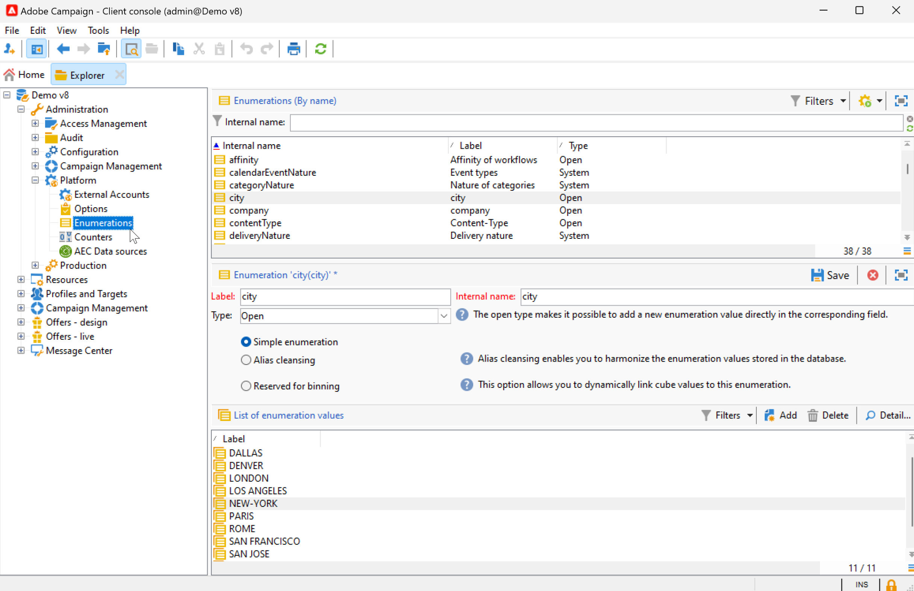

# Configurações da interface do usuário do Campaign {#ui-settings}

## Unidades padrão {#default-units}

No Adobe Campaign, para campos que expressam uma duração (por exemplo, período de validade dos recursos, prazo de aprovação para uma tarefa, etc.), os valores podem ser expressos no seguinte **unidades**:

* **[!UICONTROL s]** para segundos
* **[!UICONTROL mn]** para minutos
* **[!UICONTROL h]** para horas
* **[!UICONTROL d]** para dias

## Personalizar o explorador do Campaign{#customize-explorer}

Você pode adicionar pastas ao explorador do Campaign, criar visualizações e atribuir permissões.

Saiba como gerenciar pastas e visualizações no [esta página](../audiences/folders-and-views.md)

## Gerenciar e personalizar listas{#customize-lists}

No Console do cliente do Campaign, os dados são exibidos em listas. Você pode adaptar essas listas às suas necessidades. Por exemplo, você pode adicionar colunas, filtrar dados, contar registros, salvar e compartilhar suas configurações.

Além disso, é possível criar e salvar filtros.  Saiba mais sobre filtros em [esta página](../audiences/create-filters.md).

### Número de registros {#number-of-records}

Por padrão, o Adobe Campaign carrega os 200 primeiros registros de uma lista. Isso significa que a exibição não mostra necessariamente todos os registros da tabela que você está visualizando. Você pode executar uma contagem do número de registros na lista e carregar mais registros.

Na parte inferior direita da tela da lista, um **contador** mostra quantos registros foram carregados e o número total de registros no banco de dados (após a aplicação de filtros):

Se um ponto de interrogação aparecer em vez do número à direita, como `240/?`, clique no contador para iniciar o cálculo.

Para carregar e exibir registros adicionais, clique em **[!UICONTROL Continue loading]**. Por padrão, 200 registros são carregados. Para alterar o número padrão de registros a serem carregados, use o **[!UICONTROL Configure list]** no canto inferior direito da lista. Na janela de configuração da lista, clique em **[!UICONTROL Advanced parameters]** (canto inferior esquerdo) e altere o número de linhas que serão recuperadas.

Para carregar todos os registros, clique com o botão direito do mouse na lista e selecione **[!UICONTROL Load all]**.

>[!CAUTION]
>
>Quando uma lista contém um alto volume de registros, o carregamento completo pode levar algum tempo.

### Adicionar e remover colunas {#add-columns}

Para cada lista, a configuração de coluna interna pode ser adaptada para exibir mais informações ou ocultar colunas não usadas.

Quando os dados estiverem visíveis nos detalhes de um registro, clique com o botão direito do mouse e selecione **[!UICONTROL Add in the list]**.

A coluna é adicionada à direita das colunas existentes.

Você também pode usar a tela de configuração da lista para adicionar e remover colunas:

1. Em uma lista de registros, clique em **[!UICONTROL Configure list]** ícone na seção inferior direita.
1. Clique duas vezes nos campos a serem adicionados na **[!UICONTROL Available fields]** lista: elas são adicionadas à **[!UICONTROL Output columns]** lista.

   

   >[!NOTE]
   >
   >Por padrão, campos avançados não são exibidos. Para exibi-los, clique no link **Exibir campos avançados** na seção inferior direita da lista de campos disponíveis.
   >
   >Os campos são identificados por ícones específicos: SQL fields, linked tables, calculated fields, etc. Para cada campo selecionado, a descrição é exibida abaixo da lista de campos disponíveis.

1. Use as setas para cima/para baixo para modificar a **ordem de exibição**.

1. Clique em **[!UICONTROL OK]** para confirmar a configuração e exibir o resultado.

Se precisar remover uma coluna, selecione-a e clique no link **Lixeira** ícone.

Você pode usar o **[!UICONTROL Distribution of values]** ícone para exibir a repartição de valores para o campo selecionado na pasta atual.

### Criar uma nova coluna {#create-a-new-column}

É possível criar novas colunas para exibir campos adicionais na lista.

Para criar uma coluna, siga estas etapas:

1. Em uma lista de registros, clique em **[!UICONTROL Configure list]** ícone na seção inferior direita.
1. Clique em **[!UICONTROL Add]** para exibir um novo campo na lista.
1. Configure o campo a ser adicionado na coluna.

### Exibir dados em subpastas {#display-sub-folders-records}

As listas podem exibir:

* Todos os registros contidos na pasta selecionada (padrão)
* Todos os registros contidos na pasta selecionada e em suas subpastas

Para alternar de um modo de exibição para outro, clique em **[!UICONTROL Display sub-levels]** na barra de ferramentas do Campaign.

### Salvar uma configuração de lista {#saving-a-list-configuration}

As configurações de lista são definidas localmente para cada usuário. Quando o cache local é limpo, as configurações locais são desabilitadas.

Por padrão, a configuração de parâmetros se aplica a todas as listas com o tipo de pasta correspondente. Quando você modifica como a lista de destinatários é exibida de uma pasta, essa configuração é aplicada a todas as outras pastas do destinatário.

É possível salvar mais de uma configuração a ser aplicada a pastas diferentes do mesmo tipo. A configuração é salva com as propriedades da pasta contendo os dados e pode ser aplicada novamente.

Para salvar uma configuração de lista de modo que ela possa ser reutilizada, siga as etapas abaixo:

1. No Explorer, clique com o botão direito do mouse na pasta que contém os dados exibidos.
1. Selecione **[!UICONTROL Properties]**.
1. Clique em **[!UICONTROL Advanced settings]** e especifique um nome no campo **[!UICONTROL Configuration]**.
1. Clique em **[!UICONTROL OK]** e em **[!UICONTROL Save]**.

É possível aplicar essa configuração a qualquer outra pasta do mesmo tipo. Saiba mais sobre pastas em [esta página](../audiences/folders-and-views.md).

### Exportar uma lista {#exporting-a-list}

Para exportar dados de uma lista, você deve usar um assistente de exportação. Para acessá-lo, selecione os elementos a serem exportados da lista, clique com o botão direito do mouse e selecione **[!UICONTROL Export...]**.

<!--The use of the import and export functions is explained in [Generic imports and exports](../../platform/using/about-generic-imports-exports.md).-->

>[!CAUTION]
>
>Os elementos de uma lista não devem ser exportados usando a função Copiar/Colar.

### Classificar uma lista {#sorting-a-list}

As listas podem conter uma grande quantidade de dados. Você pode classificar esses dados ou aplicar filtros simples ou avançados. A classificação permite exibir dados em ordem crescente ou decrescente. Os filtros permitem definir e combinar critérios para exibir apenas os dados selecionados.

Clique no cabeçalho da coluna para aplicar uma classificação crescente ou decrescente ou para cancelar a classificação de dados. O status da classificação ativa e a ordem de classificação são indicados por uma seta azul antes do rótulo da coluna. Um traço vermelho antes do rótulo da coluna significa que a classificação é aplicada aos dados indexados do banco de dados. Esse método é usado para otimizar tarefas de classificação.

Você também pode configurar a classificação ou combinar critérios de classificação. Para fazer isso, siga as etapas abaixo:

1. **[!UICONTROL Configure list]** abaixo e à direita da lista.
1. Na janela de configuração da lista, clique na guia **[!UICONTROL Sorting]**.
1. Selecione os campos a serem classificados e a direção da classificação (crescente ou decrescente).
1. A prioridade é definida pela ordem das colunas de classificação. Para alterar a prioridade, use os ícones apropriados para alterar a ordem das colunas.

   A prioridade de classificação não afeta a exibição das colunas na lista.

1. Clique em **[!UICONTROL Ok]** para confirmar essa configuração e exibir o resultado na lista.

## Trabalhar com enumerações {#enumerations}

Uma enumeração (também conhecida como &quot;lista discriminada&quot;) é uma lista de valores sugeridos pelo sistema para preencher campos. Use enumerações para padronizar os valores desses campos, ajuda com a entrada de dados ou uso em queries.

A lista de valores aparece como uma lista suspensa na qual você pode selecionar o valor a ser inserido no campo. A lista suspensa também permite entrada preditiva: insira as primeiras letras e o aplicativo preencherá o restante.

Os valores desse tipo de campo são definidos e a administração geral desses campos (adição/exclusão de um valor) é realizada por meio do nó **[!UICONTROL Administration > Platform > Enumerations]** da árvore.

### Tipos de enumerações {#types-of-enum}

As enumerações são armazenadas no **[!UICONTROL Administration > Platform > Enumerations]** pasta do explorador.

Eles podem ser: Aberto, Sistema, Emoticon ou Fechado.

* Um **Abertura** a lista discriminada permite que os usuários adicionem novos valores diretamente nos campos com base nessa lista discriminada.
* A **Fechado** lista discriminada tem uma lista fixa de valores que só podem ser modificados **[!UICONTROL Administration > Platform > Enumerations]** pasta do explorador.
* Um **Emoticon** a lista discriminada é usada para atualizar a lista de emoticons. Saiba mais
* A **Sistema** a lista discriminada está associada aos campos do sistema e vem com um nome Interno.

Para **Abertura** e **Fechado** enumerações, opções específicas estão disponíveis:

* **Lista discriminada simples** é o tipo padrão padrão.
* **Limpeza de alias** enumeração é usada para harmonizar os valores de enumeração armazenados no banco de dados. [Saiba mais](#alias-cleansing)
* **Reservado para compartimentalização** é uma opção que permite vincular valores de cubo a essa enumeração. [Saiba mais](../reporting/gs-cubes.md)

### Limpeza de alias {#alias-cleansing}

Nos campos de enumeração, é possível selecionar um valor ou inserir um valor personalizado que não está disponível na lista suspensa. Os valores personalizados podem ser adicionados aos valores de enumerações existentes, como um novo - nesse caso, o **[!UICONTROL Open]** deve ser selecionada. Esses valores personalizados podem ser limpos usando recursos de limpeza de alias. Por exemplo, se um usuário digitar `Adob` em vez de `Adobe`, o processo de limpeza de alias pode substituí-lo automaticamente pelo termo correto.

>[!CAUTION]
>
>Limpeza de dados é um processo crítico que afeta os dados no banco de dados. O Adobe Campaign realiza atualizações de dados em massa, que podem levar à exclusão de alguns valores. Portanto, essa operação é reservada para usuários especialistas.

Ativar o **[!UICONTROL Alias cleansing]** opção para usar recursos de limpeza de dados para uma enumeração. Quando essa opção é selecionada, a guia **[!UICONTROL Alias]** é exibida na parte inferior da janela.

Quando um usuário insere um valor que não existe em uma lista discriminada Alias cleansing, ele é adicionado à **Valores** lista. Você pode [criar aliases a partir desses valores](#convert-to-alias)ou [criar novos aliases do zero](#create-alias).

#### Criar um alias{#create-alias}

Para criar um alias, siga estas etapas:

1. Clique em **[!UICONTROL Add]** botão do **[!UICONTROL Alias]** guia.
1. Insira o alias que você deseja converter e selecione o valor a ser aplicado na lista suspensa.

   

1. Clique em **[!UICONTROL Ok]** e confirme.

1. Salve as alterações. A substituição de valores é executada pela variável **Limpeza de alias** fluxo de trabalho que é executado todas as noites. Consulte [Executar limpeza de dados](#running-data-cleansing).

Para todos os campos baseados nesta enumeração, quando um usuário insere o valor **Adobe** em um campo &quot;company&quot; (no console do cliente do Adobe Campaign, em um formulário web), ele é substituído automaticamente pelo valor **Adobe**.

#### Converter um valor incorreto em um alias{#convert-to-alias}

Você também pode converter um valor de enumeração existente em um alias. Para fazer isso:

1. Na lista de valores de uma enumeração, clique com o botão direito do mouse e navegue até **[!UICONTROL Actions... > Convert values into aliases...]**.

   

1. Selecione os valores a serem convertidos em aliases e clique em **[!UICONTROL Next]**.
1. Clique em **[!UICONTROL Start]** para executar a conversão.

   Quando a execução for concluída, os aliases serão adicionados à lista, no **Alias** guia. Você pode associar um valor correto para substituir entradas incorretas. Para fazer isso:

1. Selecione um valor a ser limpo.
1. Clique em **Detalhe...** botão.
1. Selecione o novo valor na lista suspensa.

   

>[!NOTE]
>
>É possível rastrear as ocorrências de um alias no **[!UICONTROL Hits]** na **[!UICONTROL Alias]** subguia. Ele pode exibir o número de vezes que esse valor foi inserido.  [Saiba mais](#calculate-entry-occurrences).

#### Executar limpeza de dados {#running-data-cleansing}

A limpeza de dados é realizada pelo workflow técnico **[!UICONTROL Alias cleansing]**. É executado diariamente por padrão.

A limpeza também pode ser acionada por meio da **[!UICONTROL Cleanse values...]** link.

O link **[!UICONTROL Advanced parameters...]** permite definir a data a partir da qual os valores coletados são considerados.

Clique no botão **[!UICONTROL Start]** para executar a limpeza de dados.

##### Monitorar ocorrências {#calculate-entry-occurrences}

A variável **[!UICONTROL Alias]** subguia de uma enumeração pode exibir o número de ocorrências de um alias entre todos os valores inseridos. Essas informações são uma estimativa e serão exibidas na coluna **[!UICONTROL Hits]**.

>[!CAUTION]
>
>O cálculo das ocorrências de entrada de alias pode demorar muito.

Você pode executar o cálculo de ocorrências manualmente pelo link **[!UICONTROL Cleanse values...]**. Para fazer isso, clique no link **[!UICONTROL Advanced parameters...]** vincule e selecione opções.

* **[!UICONTROL Update the number of alias hits]**: permite atualizar as ocorrências já calculadas, com base na data inserida.
* **[!UICONTROL Recalculate the number of alias hits from the start]**: permite que você execute o cálculo em toda a plataforma do Adobe Campaign.

Você também pode criar um workflow dedicado para que o cálculo seja executado automaticamente em determinado período, uma vez por semana por exemplo.

Para fazer isso, crie uma cópia do workflow **[!UICONTROL Alias cleansing]**, altere o scheduler e use as seguintes configurações na atividade **[!UICONTROL Enumeration value cleansing]**:

* **-updateHits** para atualizar o número de ocorrências de alias,
* **-updateHits:full** para recalcular todas as ocorrências de alias.
