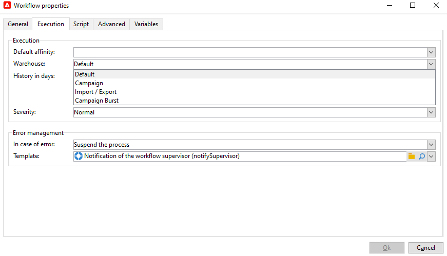

# Introdução aos fluxos de trabalho{#gs-with-workflows}

Configure o Campaign para aproveitar os poderosos recursos de automação de campanha de marketing.

Você pode configurar:

* Fluxos de trabalho
* Campanhas recorrentes
* Ciclo de validação completo
* Alertas
* Envio automático de relatório
* Eventos acionados

>[!NOTE]
>
>A interface do usuário da Web do Adobe Campaign vem com uma tela recriada para fluxos de trabalho, permitindo criar jornadas do cliente mais dinâmicas e personalizadas. Para saber mais sobre os fluxos de trabalho da interface do usuário da Web, consulte a [documentação da interface do usuário da Web do Adobe Campaign](https://experienceleague.adobe.com/en/docs/campaign-web/v8/wf/gs-workflows){target=_blank}.

## Projetar e usar fluxos de trabalho {#gs-ac-wf}

Use os workflows do Adobe Campaign para melhorar a velocidade e a escala de cada aspecto de suas campanhas de marketing, desde a criação de segmentos e a preparação de mensagens até a entrega.

Saiba mais sobre a interface e a execução do usuário de workflows nestas páginas:

* [Introdução a fluxos de trabalho](https://experienceleague.adobe.com/docs/campaign/automation/workflows/introduction/about-workflows.html?lang=pt-BR){target="_blank"}

* [Práticas recomendadas para fluxo de trabalho](https://experienceleague.adobe.com/docs/campaign/automation/workflows/introduction/workflow-best-practices.html){target="_blank"}

* [Fluxos de trabalho técnicos internos](https://experienceleague.adobe.com/docs/campaign/automation/workflows/introduction/wf-type/technical-workflows.html){target="_blank"}

* [Monitorar execução de fluxos de trabalho](https://experienceleague.adobe.com/docs/campaign/automation/workflows/monitoring-workflows/monitor-workflow-execution.html){target="_blank"}

* [Criar uma audiência em um fluxo de trabalho de campanha de marketing](https://experienceleague.adobe.com/docs/campaign/automation/campaign-orchestration/marketing-campaign-target.html?lang=pt-BR){target="_blank"}

## Atividades de fluxos de trabalho {#wf-activities}

Saiba mais sobre as atividades de fluxo de trabalho disponíveis em [esta seção](https://experienceleague.adobe.com/docs/campaign/automation/workflows/wf-activities/activities.html?lang=pt-BR){target="_blank"}

As atividades do fluxo de trabalho são agrupadas por categoria. As quatro categorias de atividade estão disponíveis:

* [Atividades de direcionamento](https://experienceleague.adobe.com/docs/campaign/automation/workflows/wf-activities/targeting-activities/targeting-activities.html){target="_blank"}: Consulta, Lista de leitura, Enriquecimento, União e muito mais
* [Atividades de controle de fluxo](https://experienceleague.adobe.com/docs/campaign/automation/workflows/wf-activities/flow-control-activities/flow-control-activities.html){target="_blank"}: Scheduler, Fork, Alert, External signal e muito mais
* [Atividades de ação](https://experienceleague.adobe.com/docs/campaign/automation/workflows/wf-activities/action-activities/action-activities.html){target="_blank"}: entregas entre canais, código Javascript, atividades CRM, Atualização de agregação e muito mais
* [Atividades de evento](https://experienceleague.adobe.com/docs/campaign/automation/workflows/wf-activities/event-activities/event-activities.html){target="_blank"}: transferência de arquivos, download da Web e muito mais

<!--
### Change data source activity {#change-data-source-activity}

The **[!UICONTROL Change data source]** activity allows you to change the data source of a workflow **[!UICONTROL Working table]**. This provides more flexibility to manage data across different data sources such as FDA, FFDA and local database.

The **[!UICONTROL Working table]** allows Adobe Campaign workflow to handle data and share data with the workflow activities.
By default, the **[!UICONTROL Working table]** is created in the same database as the source of the data we query on.

For example, when querying the **[!UICONTROL Profiles]** table, stored on the Cloud database, you will create a **[!UICONTROL Working table]** on the same Cloud database.
To change this, you can add the **[!UICONTROL Change Data Source]** activity to choose a different data source for your **[!UICONTROL Working table]**.

Note that when using the **[!UICONTROL Change Data Source]** activity, you will need to switch back to the Cloud database to continue the workflow execution.

To use the **[!UICONTROL Change Data Source]** activity:

1. Create a workflow.

1. Query your targeted recipients with a **[!UICONTROL Query]** activity. 

    For more information on the **[!UICONTROL Query]** activity, refer to [this page](https://experienceleague.adobe.com/docs/campaign/automation/workflows/wf-activities/targeting-activities/query.html){target="_blank"}.

1. From the **[!UICONTROL Targeting]** tab, add a **[!UICONTROL Change data source]** activity and double-click it to select **[!UICONTROL Default data source]**.
    
    The working table, which contains the result of your query, is then moved to the default PostgreSQL database.

1. From the **[!UICONTROL Actions]** tab, drag and drop a **[!UICONTROL JavaScript code]** activity to perform unitary operations on the working table.

    For more information on the **[!UICONTROL JavaScript code]** activity, refer to [this page](https://experienceleague.adobe.com/docs/campaign/automation/workflows/wf-activities/action-activities/sql-code-and-javascript-code.html){target="_blank"}.

1. Add another **[!UICONTROL Change data source]** activity to switch back to the Cloud database. 
    
    Double-click your activity and select **[!UICONTROL Active FDA external account]** then the corresponding external account.

1. You can now start your workflow.
-->

## Gerenciar depósitos virtuais {#warehouse}

Depois de criar o fluxo de trabalho, você pode acessar opções adicionais com o botão **[!UICONTROL Properties]** para configuração adicional.

Saiba mais sobre **Propriedades do fluxo de trabalho** em [esta página](https://experienceleague.adobe.com/docs/campaign/automation/workflows/advanced-management/workflow-properties.html){target="_blank"}.

Na guia **[!UICONTROL Execution]** do **[!UICONTROL Properties]** do fluxo de trabalho, você pode vincular o fluxo de trabalho a depósitos diferentes e otimizar o gerenciamento da carga de trabalho. Para obter mais informações sobre **Warehouses**, consulte a [documentação do Snowflake](https://docs.snowflake.com/en/user-guide/warehouses-overview.html){target="_blank"}.

Dependendo da finalidade do seu fluxo de trabalho, você pode escolher entre os três depósitos a seguir no menu suspenso **[!UICONTROL Warehouse]**:

* **[!UICONTROL Default]** / **[!UICONTROL Campaign]**: definido por padrão ao criar um novo fluxo de trabalho.

* **[!UICONTROL Import / Export]**: deve ser definido com fluxos de trabalho de importação ou exportação para otimizar o desempenho de suas atividades.

* **[!UICONTROL Campaign Burst]**: deve ser definido com workflows de campanha ou entregas para otimizar o tempo de processamento das entregas.

>[!NOTE]
>
>O warehouse **[!UICONTROL System]** é definido apenas para fluxos de trabalho internos.

## Configurar campanhas recorrentes

Crie um fluxo de trabalho recorrente e crie uma nova instância de delivery sempre que o fluxo de trabalho for executado. Por exemplo, se o fluxo de trabalho for projetado para ser executado uma vez por semana, o resultado será 52 deliveries em um ano. Isso também significa que os logs serão separados por cada instância do delivery.

Saiba como criar uma campanha recorrente em [esta página](https://experienceleague.adobe.com/docs/campaign/automation/campaign-orchestration/recurring-periodic-campaigns.html?lang=pt-BR){target="_blank"}.

## Aproveitar eventos de acionador

Usar mensagens transacionais do Campaign para automatizar mensagens geradas por eventos acionados de sistemas de informações. Essas mensagens transacionais podem ser fatura, confirmação de pedido, confirmação de remessa, alteração de senha, notificação de indisponibilidade de produto, extrato de conta ou criação de conta de site, por exemplo. Essas mensagens podem ser enviadas individualmente ou em lote por email, SMS ou notificações por push.

Saiba mais sobre os recursos de mensagens transacionais no [esta seção](../send/transactional.md).

Conecte o Adobe Campaign e o Adobe Analytics para recuperar ações do usuário e enviar mensagens personalizadas quase em tempo real.

Saiba como integrar o Campaign a outras soluções na [esta seção](../start/connect.md)

## Casos de uso completos de fluxos de trabalho{#end-to-end-uc}

Saiba mais sobre casos de uso que utilizam os recursos de fluxos de trabalho do Campaign [nesta seção](../../automation/workflow/workflow-use-cases.md).
