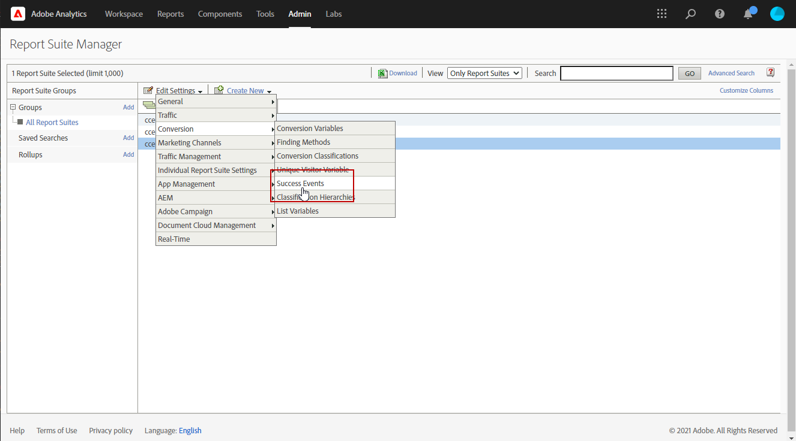
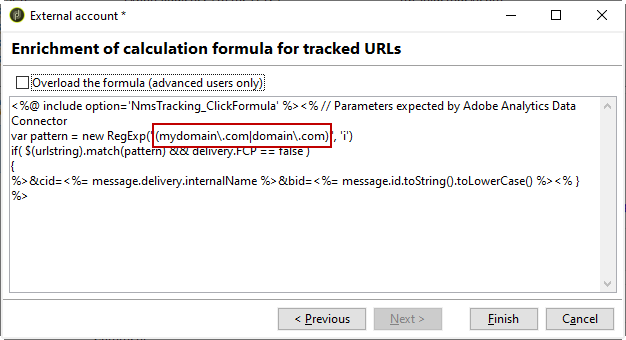

# Trabalhar com o Campaign e o Adobe Analytics {#ac-aa}

Você pode configurar o Adobe Analytics para integrar o Campaign e o Analytics.

Essa integração permite que o Adobe Campaign e o Adobe Analytics interajam por meio da **Conectores do Web Analytics** complementar. Essa integração envia indicadores e atributos de campanhas de email entregues pelo Adobe Campaign à Adobe Analytics.

  Como usuário do Managed Cloud Service, [Adobe de contato](../start/campaign-faq.md#support) para conectar o Campaign com serviços e soluções da Adobe Experience Cloud. O complemento do conector do Web Analytics deve ser instalado em seu ambiente, por meio do pacote dedicado.

Usando o Adobe Analytics Connector, o Adobe Campaign tem uma forma de medir o público-alvo da Internet (Web Analytics). As ferramentas do Web Analytics permitem que o Adobe Campaign encaminhe indicadores e atributos de campanha para o Analytics.

O perímetro de ação de cada ferramenta é o seguinte:

* **Adobe Analytics** marca as campanhas de email iniciadas com o Adobe Campaign

* **Adobe Campaign** envia os indicadores e os atributos da campanha para o conector, que, por sua vez, os encaminha para a ferramenta Web Analytics

>[!CAUTION]
>
>O Adobe Analytics Connector não é compatível com as mensagens transacionais (Centro de mensagens).

Para configurar a conexão do Campaign com o Analytics, você deve executar as seguintes operações:

1. [Criar conjunto de relatórios no Adobe Analytics](#report-suite-analytics)
1. [Configurar as variáveis de conversão e os eventos bem-sucedidos](#configure-conversion-success)
1. [Configurar a conta externa no Adobe Campaign](#external-account-ac)

## Criar conjunto de relatórios do Analytics {#report-suite-analytics}

Para criar o **[!UICONTROL Report suite]** in [!DNL Adobe Analytics], siga as etapas abaixo:

1. No [!DNL Adobe Analytics], selecione a **[!UICONTROL Admin tab]** e clique em **[!UICONTROL All admin]**.

   

1. Clique em **[!UICONTROL Report suites]**.

   

1. Na página **[!UICONTROL Report suite manager]**, clique em **[!UICONTROL Create new]** e depois em **[!UICONTROL Report suite]**.

   Para obter o procedimento detalhado sobre a criação de **[!UICONTROL Report suite]**, consulte esta [seção](https://experienceleague.adobe.com/docs/analytics/admin/manage-report-suites/new-report-suite/t-create-a-report-suite.html#prerequisites).

   

1. Selecione um modelo.

1. Configure seu novo conjunto de relatórios com as seguintes informações:

   * **[!UICONTROL Report Suite ID]**
   * **[!UICONTROL Site Title]**
   * **[!UICONTROL Time Zone]**
   * **[!UICONTROL Go Live Date]**
   * **[!UICONTROL Estimated Page Views Per Day]**

   

1. Quando configurado, clique em **[!UICONTROL Create report suite]**.

## Configurar as variáveis de conversão e os eventos bem-sucedidos {#configure-conversion-success}

Depois de criar o **[!UICONTROL Report suite]**, você precisa configurar as **[!UICONTROL Conversion variables]** e **[!UICONTROL Success events]** da seguinte maneira:

1. Selecione o **[!UICONTROL Report suite]** configurado anteriormente.

1. No botão **[!UICONTROL Edit settings]**, selecione **[!UICONTROL Conversion]** >  **[!UICONTROL Conversion variables]**.

   

1. Clique em **[!UICONTROL Add new]** para criar os identificadores necessários para medir o impacto da campanha de email, ou seja, o nome da campanha interna (cid) e o ID da tabela iNmsBroadlog (lance).

   Para saber como editar as **[!UICONTROL Conversion variables]**, consulte esta [seção](https://experienceleague.adobe.com/docs/analytics/admin/admin-tools/conversion-variables/t-conversion-variables-admin.html?lang=pt-BR#admin-tools).

   

1. Clique em **[!UICONTROL Save]** ao concluir.

1. Em seguida, para criar **[!UICONTROL Success events]**, selecione **[!UICONTROL Conversion]** > **[!UICONTROL Success events]** no botão **[!UICONTROL Edit settings]**.

   

1. Clique em **[!UICONTROL Add new]** para configurar o seguinte **[!UICONTROL Success events]**:

   * **[!UICONTROL Clicked]**
   * **[!UICONTROL Opened]**
   * **[!UICONTROL Person clicks]**
   * **[!UICONTROL Processed]**
   * **[!UICONTROL Scheduled]**
   * **[!UICONTROL Sent]**
   * **[!UICONTROL Total bounces]**
   * **[!UICONTROL Unique Clicks]**
   * **[!UICONTROL Unique Opens]**
   * **[!UICONTROL Unsubscribed]**

   Para saber como configurar **[!UICONTROL Success events]**, consulte esta [seção](https://experienceleague.adobe.com/docs/analytics/admin/admin-tools/success-events/t-success-events.html?lang=pt-BR#admin-tools)

   

1. Clique em **[!UICONTROL Save]** ao concluir.

Quando o conjunto de relatórios é configurado, é necessário configurar **[!UICONTROL External accounts]** no Adobe Campaign.

## Configurar a conta externa do Campaign {#external-account-ac}

Agora é necessário configurar a conta externa do **[!UICONTROL Web Analytics]** no Adobe Campaign para habilitar a sincronização entre as duas soluções.

Observe que se um dos **[!UICONTROL Report suite]**, **[!UICONTROL Conversion variables]** ou **[!UICONTROL Success events]** não estiver visível ao configurar a conta externa, significa que você não tem uma permissão para esse componente recém-criado no **[!UICONTROL Product profile]** associado ao usuário.

Para obter mais informações, consulte a página [Perfis de produto do Adobe Analytics](https://experienceleague.adobe.com/docs/analytics/admin/admin-console/permissions/product-profile.html?lang=pt-BR#product-profile-admins).

1. Vá até a pasta **[!UICONTROL Administration]** > **[!UICONTROL Platform]** > **[!UICONTROL External accounts]** da árvore do Adobe Campaign e clique em **[!UICONTROL New]**.

   

1. Use a lista suspensa para selecionar o tipo **[!UICONTROL Web Analytics]** e **[!UICONTROL Adobe Analytics]** no menu suspenso **[!UICONTROL Integration]**.

   

1. Clique em **[!UICONTROL Configure]** próximo ao menu suspenso **[!UICONTROL Integration]**.

1. Na janela **[!UICONTROL Configure Analytics integration]**, mapeie a conta externa com seu conjunto de relatórios criado anteriormente fornecendo as seguintes informações:

   * **[!UICONTROL E-Mail]**
   * **[!UICONTROL IMS Org]**
   * **[!UICONTROL Analytics Company]**
   * **[!UICONTROL Report Suite]**

1. Na categoria **[!UICONTROL eVars]**, mapeie os dois **[!UICONTROL Conversion variables]** configurados em [!DNL Adobe Analytics].

   

1. Na categoria **[!UICONTROL Events]** , mapeie os dez **[!UICONTROL Success events]** configurados no [!DNL Adobe Analytics].

1. Clique em **[!UICONTROL Submit]** ao concluir. O Adobe Campaign criará uma **[!UICONTROL Data source]**, **[!UICONTROL Calculated metrics]**, **[!UICONTROL Remarketing segments]** e **[!UICONTROL Classifications]** no **[!UICONTROL Report Suite]** do Analytics mapeado.

   Quando essa sincronização entre [!DNL Adobe Analytics] e o Adobe Campaign for concluída, você poderá fechar a janela.

1. As configurações podem ser exibidas na guia **[!UICONTROL Data Settings]** da janela **[!UICONTROL Configure Analytics integration]**.

   O botão **[!UICONTROL Sync]**, [!DNL Adobe Campaign] sincronizará as alterações de nome feitas no [!DNL Adobe Analytics]. Se o componente for excluído no [!DNL Adobe Analytics], o componente será tachado no [!DNL Adobe Campaign] ou exibido com uma mensagem **não encontrada**.

   

   >[!NOTE]
   >
   > Não é possível adicionar ou remover segmentos nesta versão do Campaign v8.

1. Na **[!UICONTROL External account]**, clique no link **[!UICONTROL Enrich the formula...]** para alterar a fórmula de cálculo de URL para especificar as informações de integração da ferramenta de análise da Web (IDs de campanha) e os domínios dos sites cuja atividade deve ser rastreada.

   

1. Especifique o(s) nome(s) de domínio dos sites.

   

1. Clique em **[!UICONTROL Next]** e verifique se os nomes de domínio foram salvos.

   

1. Se necessário, você deve sobrecarregar a fórmula de cálculo. Para fazer isso, marque a caixa e edite a fórmula diretamente na janela.

   >[!IMPORTANT]
   >
   >Esse modo de configuração está reservado para usuários especialistas: qualquer erro nessa fórmula pode resultar na interrupção das entregas de email.

1. A guia **[!UICONTROL Advanced]** permite configurar ou modificar mais configurações técnicas.

   * **[!UICONTROL Lifespan]**: permite especificar o atraso (em dias_ após os eventos da Web recuperados no Adobe Campaign por workflows técnicos. Padrão: 180 dias.
   * **[!UICONTROL Persistence]**: permite o período durante o qual todos os eventos da Web (uma compra, por exemplo) podem ser atribuídos a uma campanha de re-marketing. Padrão: 7 dias.

>[!NOTE]
>
>Se estiver usando várias ferramentas de medição de público, você pode selecionar **[!UICONTROL Other]** na lista suspensa **[!UICONTROL Partners]** ao criar a conta externa. Você só pode fazer referência a uma conta externa nas propriedades de entrega: será necessário adaptar a fórmula de URLs rastreadas adicionando os parâmetros esperados pela Adobe e todas as outras ferramentas de medição usadas.

## Fluxo de trabalho técnico de processos de análise da web {#technical-workflows-of-web-analytics-processes}

A troca de dados entre o Adobe Campaign e o Adobe Analytics é realizada por um workflow técnico que é executado como uma tarefa em segundo plano.

Esse fluxo de trabalho está disponível na árvore do Campaign Explorer, no **[!UICONTROL Administration]** > **[!UICONTROL Production]** > **[!UICONTROL Technical workflows]** > **[!UICONTROL Web analytics process]** pasta.

A variável **[!UICONTROL Sending of indicators and campaign attributes]** O fluxo de trabalho permite enviar indicadores de campanha de email via Adobe Campaign para a Adobe Experience Cloud usando o Adobe Analytics Connector. Esse workflow é acionado às 4:00 AM todos os dias e pode levar 24 horas para que os dados sejam enviados ao Analytics.

Observe que esse workflow não deve ser reiniciado ou todos os dados anteriores podem distorcer os resultados do Analytics.

Os indicadores envolvidos são:

* **[!UICONTROL Messages to deliver]** (@toDeliver)
* **[!UICONTROL Processed]** (@processed)
* **[!UICONTROL Success]** (@success)
* **[!UICONTROL Total count of opens]** (@totalRecipientOpen)
* **[!UICONTROL Recipients who have opened]** (@recipientOpen)
* **[!UICONTROL Total number of recipients who clicked]** (@totalRecipientClick)
* **[!UICONTROL People who clicked]** (@personClick)
* **[!UICONTROL Number of distinct clicks]** (@recipientClick)
* **[!UICONTROL Opt-Out]** (@optOut)
* **[!UICONTROL Errors]** (@error)

>[!NOTE]
>
>Os dados enviados são o delta baseado no último instantâneo que pode levar ao valor negativo nos dados de métrica.

Os atributos enviados são os seguintes:

* **[!UICONTROL Internal name]** (@internalName)
* **[!UICONTROL Label]** (@label)
* **[!UICONTROL Label]**(operation/@label): somente se o pacote do **Campaign** estiver instalado
* **[!UICONTROL Nature]**(operation/@nature): somente se o pacote do **Campaign** estiver instalado
* **[!UICONTROL Tag 1]** (webAnalytics/@tag1)
* **[!UICONTROL Tag 2]** (webAnalytics/@tag2)
* **[!UICONTROL Tag 3]** (webAnalytics/@tag3)
* **[!UICONTROL Contact date]** (scheduling/@contactDate)

## Rastrear entregas {#tracking-deliveries-in-adobe-campaign}

Para que a Adobe Experience Cloud possa rastrear a atividade nos sites, depois que o Adobe Campaign enviou a entrega, é necessário fazer referência ao conector correspondente nas propriedades de entrega. Para fazer isso, siga as etapas abaixo:

1. Abra a entrega da campanha a ser rastreada.

   

1. Abra as propriedades da entrega.
1. Acesse a guia **[!UICONTROL Web Analytics]** e selecione a conta externa criada anteriormente. Consulte [Configurar a conta externa no Adobe Campaign](#external-account-ac).

   

1. Agora você pode enviar a entrega e acessar o respectivo relatório no Adobe Analytics.

**Tópicos relacionados**

* [Campaign - Integração de acionadores Experience Cloud](ac-triggers.md)
