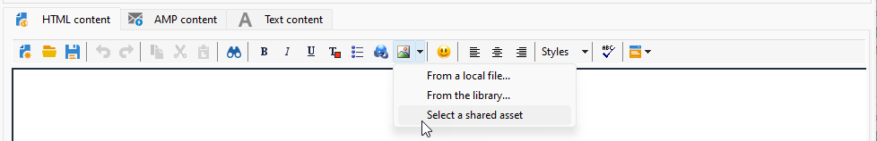

# Trabalhar com o Campaign e o Adobe Experience Manager {#ac-aem}

A integração entre o Adobe Campaign e o Adobe Experience Manager permite gerenciar o conteúdo dos deliveries de email, bem como seus formulários diretamente no Adobe Experience Manager. Você tem a opção de importar seu **Adobe Experience Manager** conteúdo no Campaign ou conecte seu **Adobe Experience Manager as a Cloud Service** conta, permitindo editar o conteúdo diretamente na interface da Web.

 [Saiba como editar o conteúdo do Adobe Experience Manager as Cloud Service na interface da Web do Campaign](https://experienceleague.adobe.com/docs/campaign-web/v8/msg/email/content/integrations/aem-content.html?lang=en)

 [Saiba mais sobre o Adobe Experience Manager neste documento](https://experienceleague.adobe.com/docs/experience-manager-65/administering/integration/campaignonpremise.html#aem-and-adobe-campaign-integration-workflow)

## Criação com o Adobe Experience Manager {#integrating-with-aem}

  Como usuário do Managed Cloud Service, [Adobe de contato](../start/campaign-faq.md#support) para integrar o Adobe Experience Manager ao Campaign.

Essa integração pode ser usada para criar um boletim informativo no Adobe Experience Manager que será usado no Adobe Campaign como parte de uma campanha de email.

**No Adobe Experience Manager:**

1. Navegue até o [!DNL Adobe Experience Manager] instância do autor e clique em Experiência Adobe no canto superior esquerdo da página. Escolher **[!UICONTROL Sites]** no menu.

   

1. Access **[!UICONTROL Campaigns > Name of your brand (here we.Shopping) > Main Area > Email]**.

1. Clique em **[!UICONTROL Create]** e selecione **[!UICONTROL Page]** no menu suspenso.

   

1. Selecione o modelo **[!UICONTROL Adobe Campaign Email]** e nomeie o informativo.

1. Depois de criar a página, acesse o **[!UICONTROL Page information]** e clique em **[!UICONTROL Open Properties]**.

   

1. Personalize seu conteúdo de email adicionando componentes, como campos de personalização do Adobe Campaign. [Saiba mais](https://experienceleague.adobe.com/docs/experience-manager-65/content/sites/authoring/aem-adobe-campaign/campaign.html?lang=en#editing-email-content)

1. Quando o email estiver pronto, navegue até o **[!UICONTROL Page information]** e clique em **[!UICONTROL Start workflow]**.

   

1. Na primeira lista suspensa, selecione **[!UICONTROL Approve Adobe Campaign]** como modelo de workflow e clique em **[!UICONTROL Start workflow]**.

   

1. Um aviso de isenção de responsabilidade será exibido na parte superior da página informando: `This page is subject to the workflow Approve for Adobe Campaign`. Clique em **[!UICONTROL Complete]** ao lado do aviso para confirmar a revisão e clique em **[!UICONTROL Ok]**.

1. Clique em **[!UICONTROL Complete]** novamente e selecione **[!UICONTROL Newsletter approval]** no **[!UICONTROL Next Step]** menu suspenso.

   

Seu boletim informativo agora está pronto e sincronizado no Adobe Campaign.

**No Adobe Campaign:**

1. Na guia **[!UICONTROL Campaigns]**, clique em **[!UICONTROL Deliveries]** e em **[!UICONTROL Create]**.

1. Escolha o **[!UICONTROL Email delivery with AEM content (mailAEMContent)]** modelo do **[!UICONTROL Delivery template]** menu suspenso.

   

1. Adicione um **[!UICONTROL Label]** à entrega e clique em **[!UICONTROL Continue]**.

1. Clique em **[!UICONTROL Synchronize]** para acessar seus deliveries de AEM.

   Se o botão não estiver visível na interface, navegue até a **[!UICONTROL Properties]** e acesse o botão **[!UICONTROL Advanced]** guia. Certifique-se de que o **[!UICONTROL Content editing mode]** O campo está configurado para **[!UICONTROL AEM]** e insira os detalhes da instância do AEM no campo **[!UICONTROL AEM account]** campo.

   

1. Selecione o delivery de AEM criado anteriormente no [!DNL Adobe Experience Manager] e confirme clicando em **[!UICONTROL Ok]**.

1. Clique no link **[!UICONTROL Refresh content]** sempre que modificações forem feitas no delivery de AEM.

O email agora está pronto para ser enviado ao seu público-alvo.

## Importar ativos da biblioteca do Adobe Experience Manager Assets {#assets-library}

Você também pode inserir ativos diretamente da sua [!DNL Adobe Experience Manager Assets Library] ao editar um email ou uma landing page no Adobe Campaign. Essa funcionalidade é detalhada em [Documentação do Adobe Experience Manager Assets](https://experienceleague.adobe.com/docs/experience-manager-65/content/assets/managing/manage-assets.html?lang=en).

1. Faça upload dos seus ativos no **Biblioteca da Adobe Experience Manager Assets**. [Saiba mais](https://experienceleague.adobe.com/docs/experience-manager-65/content/assets/managing/manage-assets.html?lang=en#uploading-assets)

1. No Adobe Campaign, crie um novo delivery navegando até o **Campanhas** clique em **Entregas** e clique no link **Criar** acima da lista de deliveries existentes.

1. Selecione um **Modelo de entrega**, nomeie o delivery.

1. Defina e personalize o conteúdo da mensagem. [Saiba mais](../send/email.md)

1. Para usar o **Biblioteca do Adobe Experience Manager Assets**, acesse o **[!UICONTROL Properties]** do seu delivery de AEM e selecione o **[!UICONTROL Advanced]** guia. Ativar o **[!UICONTROL Use above AEM instance as shared asset library]** opção.

   

1. No **Imagem** ícone, acesse o **[!UICONTROL Select a shared asset]** menu.

   

1. Na janela de seleção, selecione uma imagem da sua **Biblioteca do Adobe Experience Manager Assets**, depois confirme.

Sua entrega de email está pronta. Agora você pode especificar o público-alvo, confirmar o delivery e continuar com o envio.
