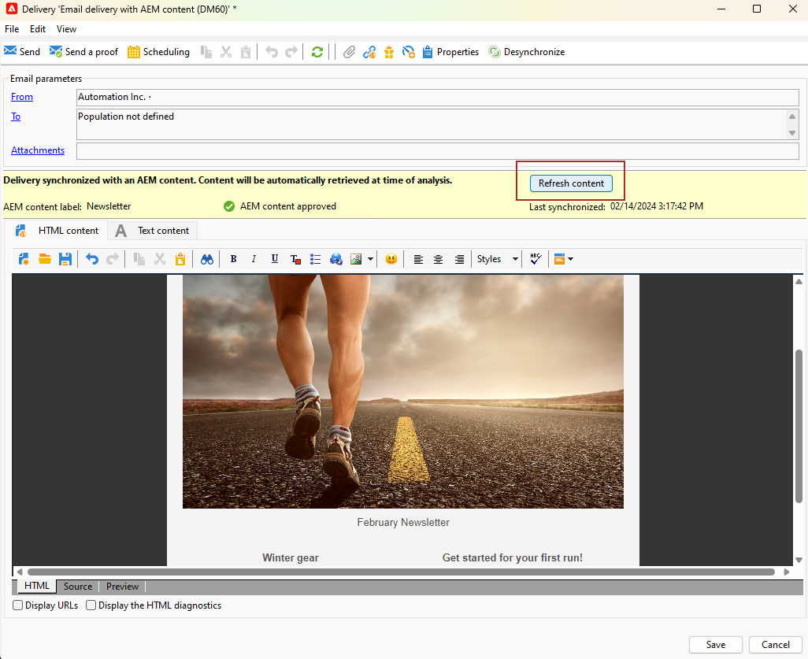

# Trabalhar com o Campaign e o Adobe Experience Manager {#ac-aem}

A integração entre o Adobe Campaign e o Adobe Experience Manager (AEM) permite gerenciar o conteúdo das entregas de email, bem como seus formulários diretamente no Adobe Experience Manager.

[Saiba como editar o conteúdo do Adobe Experience Manager as Cloud Service na Interface da Web do Campaign](https://experienceleague.adobe.com/docs/campaign-web/v8/integrations/aem-content.html?lang=pt-BR){target="_blank"}.

[Saiba mais sobre o Adobe Experience Manager neste documento](https://experienceleague.adobe.com/docs/experience-manager-65/administering/integration/campaignonpremise.html?lang=pt-BR#aem-and-adobe-campaign-integration-workflow){target="_blank"}.

>[!NOTE]
>
>Como usuário do Managed Cloud Services, [contate a Adobe](../start/campaign-faq.md#support) para integrar o Adobe Experience Manager ao Campaign.

## Importar conteúdo do Adobe Experience Manager {#integrating-with-aem}

Essa integração pode ser usada para criar um boletim informativo no Adobe Experience Manager que será usado no Adobe Campaign como parte de uma campanha de email.

**No Adobe Experience Manager:**

1. Navegue até a instância do autor [!DNL Adobe Experience Manager] e clique em Adobe Experience no canto superior esquerdo da página. Escolha **[!UICONTROL Sites]** no menu.

   

1. Acessar **[!UICONTROL Campaigns > Name of your brand (here we.Shopping) > Main Area > Email]**.

1. Clique em **[!UICONTROL Create]** e selecione **[!UICONTROL Page]** no menu suspenso.

   

1. Selecione o modelo **[!UICONTROL Adobe Campaign Email]** e nomeie o informativo.

1. Depois de criar sua página, acesse o menu **[!UICONTROL Page information]** e clique em **[!UICONTROL Open Properties]**.

   

1. Personalize seu conteúdo de email adicionando componentes, como campos de personalização do Adobe Campaign. Saiba mais em [documentação do Adobe Experience Manager](https://experienceleague.adobe.com/docs/experience-manager-65/content/sites/authoring/aem-adobe-campaign/campaign.html?lang=pt-BR#editing-email-content){target="_blank"}.

1. Quando o email estiver pronto, navegue até o menu **[!UICONTROL Page information]** e clique em **[!UICONTROL Start workflow]**.

   

1. Na primeira lista suspensa, selecione **[!UICONTROL Approve Adobe Campaign]** como modelo de workflow e clique em **[!UICONTROL Start workflow]**.

   

1. Um aviso de isenção de responsabilidade será exibido na parte superior da página informando, `This page is subject to the workflow Approve for Adobe Campaign`. Clique em **[!UICONTROL Complete]** ao lado do aviso de isenção de responsabilidade para confirmar a revisão e clique em **[!UICONTROL Ok]**.

1. Clique novamente em **[!UICONTROL Complete]** e selecione **[!UICONTROL Newsletter approval]** no menu suspenso **[!UICONTROL Next Step]**.

   

Seu boletim informativo agora está pronto e sincronizado no Adobe Campaign.

**No Adobe Campaign:**

1. Na guia **[!UICONTROL Campaigns]**, clique em **[!UICONTROL Deliveries]** e em **[!UICONTROL Create]**.

1. Escolha o modelo **[!UICONTROL Email delivery with AEM content (mailAEMContent)]** no menu suspenso **[!UICONTROL Delivery template]**.

   

1. Adicione um **[!UICONTROL Label]** à entrega e clique em **[!UICONTROL Continue]**.

1. Clique em **[!UICONTROL Synchronize]** para acessar suas entregas do AEM.

   Se o botão não estiver visível na interface, navegue até o botão **[!UICONTROL Properties]** e acesse a guia **[!UICONTROL Advanced]**. Verifique se o campo **[!UICONTROL Content editing mode]** está configurado para **[!UICONTROL AEM]** e insira os detalhes da instância do AEM no campo **[!UICONTROL AEM account]**.

   

1. Selecione a entrega do AEM criada anteriormente em [!DNL Adobe Experience Manager] e confirme clicando em **[!UICONTROL Ok]**.

   

1. Certifique-se de clicar no botão **[!UICONTROL Refresh content]** sempre que forem feitas modificações na entrega do AEM.

   

1. Para remover a vinculação entre o Experience Manager e o Campaign, clique em **[!UICONTROL Desynchronize]**.

O email agora está pronto para ser enviado ao seu público-alvo.

## Importar ativos da biblioteca do Adobe Experience Manager Assets {#assets-library}

Você também pode inserir ativos diretamente do [!DNL Adobe Experience Manager Assets Library] ao editar um email ou uma página de aterrissagem no Adobe Campaign. Esta funcionalidade é detalhada na [documentação do Adobe Experience Manager Assets](https://experienceleague.adobe.com/docs/experience-manager-65/content/assets/managing/manage-assets.html?lang=pt-BR){target="_blank"}.

**No Adobe Experience Manager:**

1. Navegue até a instância do autor [!DNL Adobe Experience Manager] e clique em Adobe Experience no canto superior esquerdo da página. Escolha **[!UICONTROL Assets]** `>` **[!UICONTROL Files]** no menu.

   

1. Clique em **Criar** e depois em **Arquivos** para importar seu ativo para a **Biblioteca da Adobe Experience Manager Assets**. Saiba mais em [documentação do Adobe Experience Manager](https://experienceleague.adobe.com/docs/experience-manager-65/content/assets/managing/manage-assets.html?lang=pt-BR#uploading-assets){target="_blank"}.

   

1. Renomeie o ativo, se necessário, e selecione **Carregar**.

Seu ativo foi carregado para sua **Biblioteca da Adobe Experience Manager Assets**.

**No Adobe Campaign:**

1. No Adobe Campaign, crie uma nova entrega navegando até a guia **Campanhas**, clique em **Entregas** e no botão **Criar** acima da lista de entregas existentes.

   

1. Selecione um **Modelo de entrega** e nomeie a entrega.

1. Defina e personalize o conteúdo da mensagem. [Saiba mais](../send/email.md)

1. Para usar sua **biblioteca Adobe Experience Manager Assets**, acesse o **[!UICONTROL Properties]** da entrega do AEM e selecione a guia **[!UICONTROL Advanced]**.

   Escolha sua **conta do AEM** e habilite a opção **[!UICONTROL Use above AEM instance as shared asset library]**.

   

1. No ícone **Imagem**, acesse o menu **[!UICONTROL Select a shared asset]**.

   

1. Na janela de seleção, selecione uma imagem da sua **biblioteca Adobe Experience Manager Assets** e **Selecione**.

   

Seu ativo agora é carregado para o delivery de email. Agora você pode especificar o público-alvo, confirmar o delivery e continuar com o envio.
