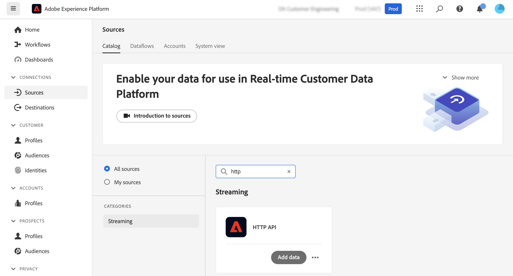

# Atualizar perfis do Adobe Experience Platform a partir de páginas de aterrissagem do Adobe Campaign {#ac-aep-lp}

A integração entre o Adobe Campaign e o Adobe Experience Platform permite sincronizar facilmente os dados do perfil entre as páginas de aterrissagem do Adobe Campaign e o Adobe Experience Platform. Com essa integração, você pode:

* Recupere atributos de perfil do Adobe Experience Platform para exibir informações atualizadas nas páginas de aterrissagem do Adobe Campaign,
* Envie de volta os atributos de perfil atualizados para o Adobe Experience Platform para atualizar os atributos correspondentes com base no que foi preenchido e enviado nas landing pages.

As principais etapas para configurar essa integração são as seguintes:

<table>
<tr>
<td><p><a href="#oauth">Configurar uma conexão OAuth</a></p></td>
<td><p><a href="#source">Criar uma conexão HTTP API Source</a></p></td>
<td><p><a href="#xtk">Adicionar opções de autenticação no Campaign</a></p></td>
<td><p><a href="#javascript">Adicionar códigos JavaScript no Campaign</a></p></td>
<td><p><a href="#script">Configurar o fluxo de trabalho da landing page</a></p></td>
</table>

## Configurar uma conexão Oauth {#oauth}

As APIs do Adobe Cloud Platform usam o protocolo OAuth 2.0 para autenticação e autorização. Para conectar o Adobe Experience Platform ao Adobe Campaign usando chamadas de API, é necessário gerar um token de acesso usando a Integração OAuth criada no Adobe Developer Console.

Para fazer isso, siga estes passos:

1. Acesse o Adobe Developer Console.
1. Crie uma nova conexão de API usando o produto Adobe Experience Platform API. As etapas detalhadas sobre como obter um token de acesso OAuth 2.0 estão disponíveis na [documentação do Adobe Developer Console](https://developer.adobe.com/developer-console/docs/guides/authentication/Tools/OAuthPlayground/).
1. Depois que a conexão for criada, navegue até o menu **[!UICONTROL OAuth Server-to-Server]** e copie os detalhes abaixo, que são necessários no Campaign para autenticação:

   * `CLIENT ID`
   * `CLIENT SECRET`
   * `ORGANIZATION ID`

   {width="70%"}

Agora que sua conexão Oauth está configurada, crie e configure uma nova conexão do Source **[!UICONTROL HTTP API]** para vincular o Adobe Campaign ao Adobe Experience Platform.

## Criar uma conexão HTTP API Source {#source}

Com a conexão OAuth estabelecida, a próxima etapa é criar uma conexão do Source **[!UICONTROL HTTP API]** no Adobe Experience Platform. Essa conexão permite transmitir dados para o Adobe Experience Platform usando APIs. Siga estas etapas:

1. Navegue até Adobe Experience Platform **[!UICONTROL Sources]**, pesquise a origem **[!UICONTROL HTTP API]** e clique em **[!UICONTROL Add data]**.

   {width="70%"}

1. Configure a conexão de acordo com suas necessidades. Informações detalhadas sobre como configurar uma conexão HTTP API estão disponíveis na [documentação de origens do Adobe Experience Platform](https://experienceleague.adobe.com/docs/experience-platform/sources/ui-tutorials/create/streaming/http.html){target="_blank"}.

   Na etapa **[!UICONTROL Authentication]**, alterne a opção **[!UICONTROL Enable authentication]** para autenticar usando o token de acesso gerado anteriormente pela integração OAuth.

   {width="70%"}

1. Depois que a conexão de origem é configurada, o endpoint de transmissão é exibido. Esse endpoint é necessário para assimilar dados na Adobe Experience Platform.

   {width="70%"}

   Você também pode acessar uma amostra do formato de dados assimilado na Adobe Experience Platform abrindo o fluxo de dados recém-criado na guia **[!UICONTROL Dataflows]**.

   {width="70%"}

Agora que a conexão HTTP API Source está configurada, é necessário adicionar opções específicas no Adobe Campaign para habilitar a conexão com o Adobe Experience Platform.

## Adicionar opções de autenticação no Adobe Campaign {#xtk}

Depois que a conexão HTTP API Source é configurada, é necessário adicionar opções específicas no Adobe Campaign para habilitar a conexão com o Adobe Experience Platform. Isso pode ser feito no menu Administração do Campaign ou ao executar o fluxo de trabalho da página de aterrissagem adicionando uma atividade **[!UICONTROL JavaScript code]** específica.

Navegue pelas guias abaixo para descobrir os dois métodos:

>[!BEGINTABS]

>[!TAB Adicionar opções do menu Administração]

1. Navegue até o menu **[!UICONTROL Administration]** > **[!UICONTROL Platform]** > **[!UICONTROL Options]**.
1. Adicione as seguintes opções com os valores correspondentes do Adobe Developer Console:

   * IMS_CLIENT_ID = cryptString(CLIENT ID)
   * IMS_CLIENT_SECRET = cryptString(CLIENT SECRET)
   * IMS_ORG_ID = ID DA ORGANIZAÇÃO
   * IMS_CLIENT_API_KEY = cryptString(CLIENT ID)

   {width="70%"}

   >[!NOTE]
   >
   >A função cryptString() é usada para criptografar os dados de autenticação.

>[!TAB Adicionar opções usando uma atividade de código JavaScript]

Para configurar essas opções automaticamente na execução do fluxo de trabalho de páginas de aterrissagem, adicione uma atividade **[!UICONTROL JavaScript code]** ao fluxo de trabalho com o código abaixo. [Saiba como configurar uma atividade de código JavaScript](https://experienceleague.adobe.com/docs/campaign/automation/workflows/wf-activities/action-activities/sql-code-and-JavaScript-code.html#JavaScript-code){target="_blank"}.

Na execução do workflow, as opções são criadas automaticamente no console do Campaign com os valores fornecidos.

```javascript
loadLibrary("xtk:shared/nl.js");
loadLibrary("xtk:shared/xtk.js");
loadLibrary("xtk:shared/json2.js");
loadLibrary("xtk:common.js");

function setAuthCredentials()
{
setOption("IMS_CLIENT_ID", cryptString('CLIENT ID'));
setOption("IMS_CLIENT_SECRET", cryptString('CLIENT SECRET'));
setOption("IMS_ORG_ID", cryptString('ORGANIZATION ID'));
setOption("IMS_CLIENT_API_KEY", cryptString('CLIENT ID'));
}
```

>[!ENDTABS]

Agora que as opções de autenticação estão configuradas no Campaign, é necessário criar códigos JavaScript personalizados para permitir a sincronização de dados entre o Campaign e o Adobe Experience Platform a partir da página de destino.

## Adicionar opções na execução do fluxo de trabalho {#javacript}

Para permitir a sincronização de dados entre landing pages e o Adobe Experience Platform, códigos personalizados do JavaScript devem ser adicionados ao Adobe Campaign. Siga estas etapas:

1. Navegue até o menu **[!UICONTROL Administration]** > **[!UICONTROL Configuration]** > **[!UICONTROL JavaScript codes]**.
1. Crie novos códigos JavaScript e copie e cole os trechos abaixo.

   >[!NOTE]
   >
   >O token de acesso e os dados de autenticação são recuperados automaticamente das opções configuradas anteriormente.

   {width="70%"}

+++  Script 1 - Carregar atributos de perfil do Experience Platform

   Esse código verifica se o perfil existe no Adobe Experience Platform antes de carregar a landing page. Ele recupera os atributos do perfil e os exibe nos campos correspondentes da landing page.

   ```javascript
   // API implementation to read profile from AEP
   function getProfileInfo(email)
   {
   var accessToken = getAccessToken();
   var request = new HttpClientRequest(('https://platform-stage.adobe.io/data/core/ups/access/entities?schema.name=_xdm.context.profile&entityId=' + email + '&entityIdNS=email&fields=identities,consents.marketing'));
   request.method = 'GET';
   request.header["Content-Type"] = "application/json";
   request.header["sandbox-name"] = "prod";
   request.header["x-gw-ims-org-id"] = getOption('IMS_ORG_ID');
   request.header["x-api-key"] = getOption('IMS_CLIENT_API_KEY');
   request.header["Authorization"] = "Bearer " + accessToken;
   request.execute();
   return request.response;
   }
   ```

+++

+++ Script 2 - Atualizar atributos de perfil de Experience Platform

   Esse código atualiza os atributos de perfil no Adobe Experience Platform com os valores enviados na landing page.

   ```javascript
   // API implementation to update profile in AEP
   loadLibrary("xtk:shared/nl.js");
   loadLibrary("xtk:shared/xtk.js");
   loadLibrary("xtk:shared/json2.js");
   loadLibrary("xtk:common.js");
   
   function updateProfileInAEP(profileUpdatePayload)
   {
   var accessToken = getAccessToken();
   var request = new HttpClientRequest('https://dcs-stg.adobedc.net/collection/64a300b84d61c0bcea4f0cd4ecaaa224a19477026d14f7e08b5408ffaf5e6162?syncValidation=false');
   request.method = 'POST';
   request.header["Content-Type"] = "application/json";
   request.header["sandbox-name"] = "prod";
   request.header["Authorization"] = "Bearer " + accessToken;
   var body = '{"header":{"schemaRef":{"id":"https://ns.adobe.com/campdev/schemas/35d8e567772e1a1093ed6cf9e41d2c1fec22eeb3a89583e1","contentType":"application/vnd.adobe.xed-full+json;version=1.0"},"imsOrgId":"A1F66F0D5C47D1950A494133@AdobeOrg","datasetId":"63c7fa2a20cce11b98cccb41","source":{"name":"testHTTPSourcesVinay - 03/06/2023 5:43 PM"}},"body":{"xdmMeta":{"schemaRef":{"id":"https://ns.adobe.com/campdev/schemas/35d8e567772e1a1093ed6cf9e41d2c1fec22eeb3a89583e1","contentType":"application/vnd.adobe.xed-full+json;version=1.0"}},"xdmEntity":' + profileUpdatePayload +'}}';
   request.body = body;
   request.execute();
   return request.response;
   }
   
   
   // Get Access token from OAuth-Server-to-server API call
   function getAccessToken() {
   var clientId = decryptString(getOption('IMS_CLIENT_ID'));
   var clientSecret = decryptString(getOption('IMS_CLIENT_SECRET'));
   var request = new HttpClientRequest(('https://ims-na1-stg1.adobelogin.com/ims/token/v2?grant_type=client_credentials' + '&client_id=' + clientId + '&client_secret=' + clientSecret + '&scope=openid,session,AdobeID,read_organizations,additional_info.projectedProductContext'));
   request.method = 'POST';
   request.execute();
   var response = request.response;
   if(response.code != 200){
   logError('GetAccessToken failed,', response.code, response.body);
   return;
   }
   var body = ''+response.body;
   var parsedResponse = JSON.parse(body);
   var accessToken = parsedResponse.access_token;
   logInfo("Access token generated successfully");
   return accessToken;
   }
   ```

+++

Agora que os códigos personalizados do JavaScript são criados no Adobe Campaign, você pode configurar o fluxo de trabalho que contém sua página de aterrissagem para usar esses códigos JavaScript para sincronização de dados.

## Configurar o fluxo de trabalho da landing page {#script}

Com os códigos JavaScript adicionados ao Adobe Campaign, você pode aproveitá-los no fluxo de trabalho da página de aterrissagem usando **[!UICONTROL JavaScript code]** atividades:

* Para carregar dados do Experience Platform antes de carregar a landing page, adicione uma atividade **[!UICONTROL JavaScript code]** antes da atividade da landing page e copie e cole o Script 1.

+++ Script 1 - Carregar atributos de perfil do Experience Platform

  ```javascript
  // Script code to read profile from AEP.
  
  logInfo("Loading profile from AEP");
  loadLibrary("cus:aepAPI");
  var recipient=ctx.recipient;
  var email = recipient.@email;
  var response = getProfileInfo(email);
  ctx.isAEPProfileExists = 1;
  
  if(response.code == 404){
  ctx.isAEPProfileExists = 0
  logInfo("Profile with email" + email + " not found in AEP, ignoring the update activity");
  }
  else if(response.code == 200){
  var body = ''+response.body;
  var parsedResponse = JSON.parse(body);
  for (var key in parsedResponse) {
      var value =  parsedResponse[key];
      var marketing = value.entity.consents.marketing;
      logInfo("User Consent Details : " + JSON.stringify(marketing));   
      if(marketing.hasOwnProperty('email')&&marketing.email.hasOwnProperty('val')&&marketing.email.val=='n'){
      ctx.recipient.@blackListEmail = 1;
      }
      if(marketing.hasOwnProperty('sms')&&marketing.sms.hasOwnProperty('val')&&marketing.sms.val=='n'){
      ctx.recipient.@blackListMobile = 1;
      }
      if(marketing.hasOwnProperty('push')&&marketing.push.hasOwnProperty('val')&&marketing.push.val=='n'){
      ctx.recipient.@blackListPostalMail = 1;
      }
  } 
  }
  ```

+++

* Para atualizar atributos de perfil de Experience Platform com os dados enviados na página de aterrissagem, adicione uma atividade **[!UICONTROL JavaScript code]** após a atividade de página de aterrissagem e copie e cole o Script 2.

+++ Script 2 - Atualizar atributos de perfil de Experience Platform

  ```javascript
  // Script code to update profile in AEP and ACC.
  
  logInfo("Executing script to update AEP profile.");
  
  // Loading aepAPI library JS code
  loadLibrary("cus:aepAPI");
  
  var recipient=ctx.recipient
  
  // Update profile only if it exists in AEP
  if(ctx.isAEPProfileExists==1){
  
  var email = recipient.@email
  logInfo(email);
  logInfo(recipient.@blackListEmail);
  logInfo(recipient.@blackListMobile);
  logInfo(recipient.@blackListPostalMail);
  
  var optOutPayload = new Array();
  
  if(recipient.@blackListEmail==1){
      optOutPayload.push('"email":{"val":"n"}');
  }
  else
      optOutPayload.push('"email":{"val":"y"}');
  
  if(recipient.@blackListMobile==1){
      optOutPayload.push('"sms":{"val":"n"}');
  }
  else
      optOutPayload.push('"sms":{"val":"y"}');
  
  if(recipient.@blackListPostalMail==1){
      optOutPayload.push('"push":{"val":"n"}');
  }
  else
      optOutPayload.push('"push":{"val":"y"}');
  
  var profileUpdatePayload = '{'+ '"personalEmail":{"address":' + '\"' + email + '\"' + '},' +'"consents":{"marketing":{' + optOutPayload.toString() + '}}}';
  
  var response = updateProfileInAEP(profileUpdatePayload);
  if(response.code == 200){
  var body = '' + response.body;
  logInfo("AEP Profile Updated successfully, Response " + body);
  // Update ACC profile 
  recipient.@xtkschema = "nms:recipient";
  recipient.@_operation = "update";
  recipient.@_key="@id";
  xtk.session.Write(recipient);
  logInfo("ACC Profile Updated successfully");
  }
  else{
      logError('Server Error: ', response.code, response.body);
  } 
  }
  else {
  logInfo("Ignoring AEP profile update as profile doesn't exists.");
  
  // Update ACC profile   
  recipient.@xtkschema = "nms:recipient";
  recipient.@_operation = "update";
  recipient.@_key="@id";  
  xtk.session.Write(recipient);
  logInfo("ACC Profile Updated successfully");
  }
  ```

+++

>[!CAUTION]
>
>Certifique-se de personalizar a carga em cada script com base em suas necessidades específicas.
>
>Se você não adicionar nenhum script antes da atividade de landing page, nenhuma verificação de existência de perfil será executada no Adobe Experience Platform. Quando a landing page for enviada e o perfil não existir, ela será criada no Adobe Experience Platform com os atributos da landing page.

Este é um exemplo de fluxo de trabalho usando as atividades de código JavaScript antes e depois de uma página de aterrissagem:

{width="70%"}

Este é um exemplo de uma página de aterrissagem e uma atividade de código JavaScript configuradas para atualizar atributos de perfil no Adobe Experience Platform:

{width="70%"}

{width="70%" zoomable="yes"}

### Mais informações

* [Configurar uma atividade de código JavaScript](../../automation/workflow/sql-code-and-javascript-code.md#javascript-code)
* [Criar uma página de aterrissagem](https://experienceleague.adobe.com/docs/campaign-classic/using/designing-content/editing-html-content/creating-a-landing-page.html){target="_blank"}
* [Gerenciar assinaturas e cancelamentos de assinaturas](../start/subscriptions.md)
