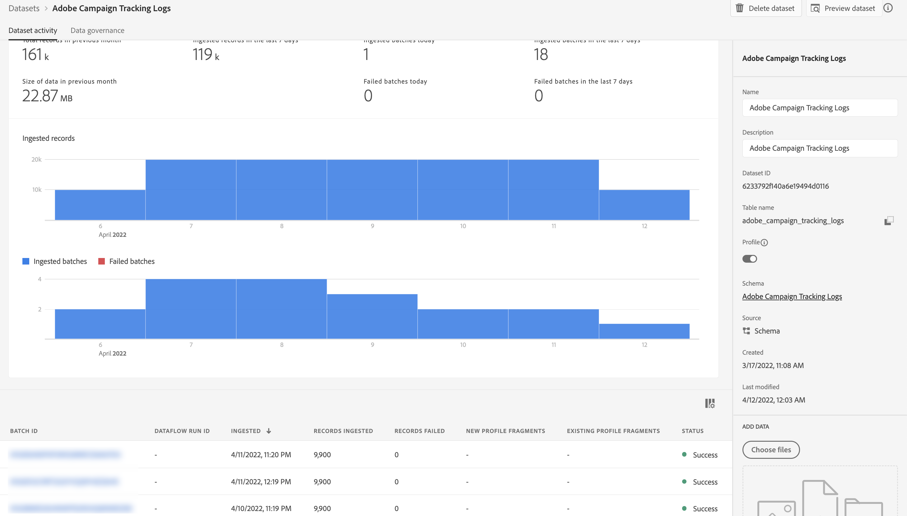

# Compartilhar e sincronizar públicos-alvo com a Adobe Experience Platform {#gs-ac-aep}

Os conectores Adobe Campaign Managed Cloud Service Destination e Source permitem uma integração perfeita entre o Adobe Campaign e o Adobe Experience Platform. Com essa integração, você pode:

* Envie públicos-alvo da Adobe Experience Platform para a Adobe Campaign e envie de volta os logs de entrega e rastreamento para a Adobe Experience Platform para fins de análise,
* Traga atributos de perfil do Adobe Experience Platform para o Adobe Campaign e tenha um processo de sincronização em vigor para que eles possam ser atualizados regularmente.

## Enviar públicos da Adobe Experience Platform para o Campaign {#audiences}

As principais etapas para enviar públicos-alvo da Adobe Experience Platform para o Adobe Campaign e enviar de volta logs de delivery e rastreamento são as seguintes:

* Use uma **Conexão de destino** do Adobe Campaign Managed Cloud Services para enviar segmentos Experience Platform para a Adobe Campaign:

   1. Acesse o catálogo de Destinos do Adobe Experience Platform e crie uma nova conexão **[!UICONTROL Adobe Campaign Managed Cloud Services]**.
   1. Forneça detalhes sobre a instância do Campaign a ser usada e escolha **[!UICONTROL Audience sync]** como o tipo de sincronização.

      {width="800" align="center"}

   1. Selecione os segmentos a serem enviados para o Adobe Campaign.
   1. Configure os atributos que deseja exportar para o público-alvo.
   1. Após a configuração do fluxo, os públicos-alvo selecionados estarão disponíveis para ativação no Adobe Campaign.

      {width="800" align="center"}

  Informações detalhadas sobre como configurar o destino estão disponíveis na [documentação de conexão do Adobe Campaign Managed Cloud Services](https://www.adobe.com/go/destinations-adobe-campaign-managed-cloud-services-en){target="_blank"}

* Use uma **conexão Source** do Adobe Campaign Managed Cloud Services para enviar a entrega do Adobe Campaign e os logs de rastreamento para o Adobe Experience Platform:

  Para fazer isso, configure uma nova **conexão Source** do Adobe Campaign Managed Cloud Services para assimilar eventos do Campaign na Adobe Experience Platform. Forneça detalhes sobre a instância do Campaign e o esquema a ser usado, selecione um conjunto de dados onde os dados devem ser assimilados e configure os campos a serem recuperados. [Saiba como criar uma conexão de origem do Adobe Campaign Managed Cloud Services](https://www.adobe.com/go/sources-campaign-ui-en)

  {width="800" align="center"}

## Sincronizar atributos de perfil entre o Adobe Experience Platform e o Adobe Campaign {#profile}

Ao conectar o Adobe Campaign com o Adobe Experience Platform, você pode trazer atributos de perfil adicionais, que estão vinculados a um perfil no Adobe Experience Platform e têm um processo de sincronização em vigor para que sejam atualizados no banco de dados do Adobe Campaign.

Por exemplo, digamos que você esteja capturando valores de aceitação e recusa no Adobe Experience Platform. Com essa conexão, você pode trazer esses valores para o Adobe Campaign e ter um processo de sincronização em vigor para que eles sejam atualizados regularmente.

>[!NOTE]
>
>A sincronização de atributos de perfil está disponível para perfis que já estão presentes no banco de dados do Adobe Campaign.

As principais etapas para sincronizar atributos de perfil do Adobe Experience Platform com o Adobe Campaign são as seguintes:

1. Acesse o catálogo de Destinos do Adobe Experience Platform e crie uma nova conexão **[!UICONTROL Adobe Campaign Managed Cloud Services]**.
1. Forneça detalhes sobre a instância do Campaign a ser usada e escolha **[!UICONTROL Profile sync (Update only)]** como o tipo de sincronização.

   {width="800" align="center"}

1. Selecione os segmentos direcionados aos perfis que serão atualizados no banco de dados do Adobe Campaign.
1. Configure os atributos de perfil que deseja atualizar para o Adobe Campaign.
1. Depois que o fluxo for configurado, os atributos de perfil selecionados serão sincronizados com o Adobe Campaign e atualizados para todos os perfis direcionados pelos segmentos configurados no destino.

Informações detalhadas sobre como configurar o destino estão disponíveis na [documentação de conexão do Adobe Campaign Managed Cloud Services](https://www.adobe.com/go/destinations-adobe-campaign-managed-cloud-services-en){target="_blank"}