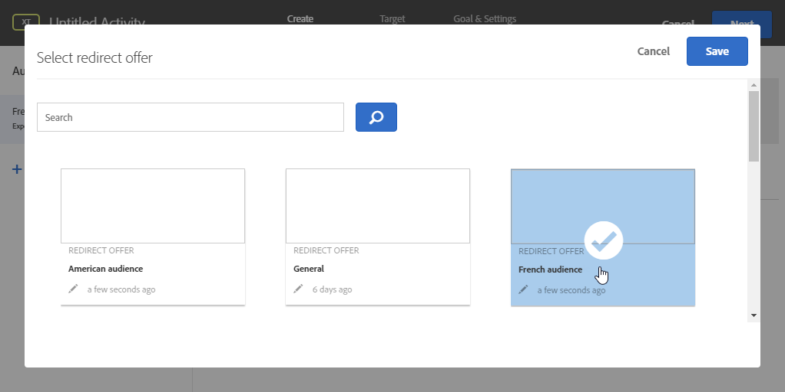

# Trabalhar com o Campaign e o Adobe Target

Conecte o Campaign e o Target para incluir uma oferta do Adobe Target em um delivery de email do Adobe Campaign.

Essa integração ajuda a implementar casos de uso da seguinte maneira: quando um recipient abre um email enviado pelo Adobe Campaign, uma chamada para o Adobe Target permite exibir uma versão dinâmica do conteúdo. Essa versão dinâmica é calculada, dependendo das regras especificadas anteriormente ao criar o email.

>[!NOTE]
>A integração só oferece suporte a imagens estáticas. Os outros tipos de conteúdo não podem ser personalizados.

?? Como um usuário do Managed Cloud Services, [entre em contato com o Adobe](../start/campaign-faq.md#support) para implementar acionadores de Experience Cloud com o Campaign.

Os seguintes tipos de dados podem ser usados pelo Adobe Target:

* Dados do banco de dados do Adobe Campaign
* Segmentos vinculados à ID de visitante no Adobe Target, somente se os dados usados não estiverem sujeitos a limitações legais
* Dados do Adobe Target: agente do usuário, endereço IP, dados de geolocalização

## Inserir um conteúdo dinâmico

No exemplo abaixo, você aprenderá a integrar **uma oferta dinâmica** do Adobe Target em um email do Adobe Campaign.

Queremos criar uma mensagem com uma imagem que será alterada dinamicamente de acordo com o país do recipient. Os dados são enviados com cada solicitação mbox e dependem do endereço IP do visitante.

Neste e-mail, queremos que uma das imagens varie dinamicamente de acordo com as seguintes experiências do usuário:

* O e-mail é aberto na França.
* O e-mail é aberto nos Estados Unidos.
* Se nenhuma dessas condições se aplicar, uma imagem padrão será exibida.

As etapas a seguir precisam ser realizadas no Adobe Campaign e no Adobe Target:

1. [Insira a oferta dinâmica em um email](#inserting-dynamic-offer)
1. [Criar ofertas de redirecionamento](#create-redirect-offers)
1. [Criar públicos](#audiences-target)
1. [Criar uma atividade de direcionamento de experiência](#creating-targeting-activity)
1. [Visualizar e enviar a mensagem](#preview-send-email)

### Insira a oferta dinâmica em um email {#inserting-dynamic-offer}

No Adobe Campaign, defina o público-alvo e o conteúdo do seu email. Você pode inserir uma imagem dinâmica do Adobe Target.

Para fazer isso, especifique o URL da imagem padrão, o nome do local e os campos que deseja transferir para o Adobe Target.

No Adobe Campaign, há duas maneiras de inserir uma imagem dinâmica do Target em um email:

* Se o editor de conteúdo digital estiver em uso, escolha uma imagem existente e selecione **[!UICONTROL Insert]** > **[!UICONTROL Dynamic image served by Adobe Target]** na barra de ferramentas.

   

* Se o editor padrão estiver em uso, coloque o cursor onde deseja inserir a imagem e selecione **[!UICONTROL Include]** > **[!UICONTROL Dynamic image served by Adobe Target...]** no menu suspenso de personalização.

   

Você pode definir os parâmetros da imagem:

* O URL de **[!UICONTROL Default image]** é a imagem que será exibida quando nenhuma das condições for satisfeita. Você também pode selecionar uma imagem da biblioteca de recursos.
* O **[!UICONTROL Target location]** é o nome da localização da oferta dinâmica. Será necessário selecionar esse local na atividade do Adobe Target.
* O **[!UICONTROL Landing Page]** permite redirecionar a imagem padrão para uma página de aterrissagem padrão. Esse URL se aplica somente quando a imagem padrão é exibida no email final. É opcional.
* O **[!UICONTROL Additional decision parameters]** define o mapeamento entre os campos definidos nos segmentos do Adobe Target e os campos do Adobe Campaign. Os campos do Adobe Campaign usados devem ter sido especificados no rawbox. No nosso exemplo, adicionamos o campo País.

Se você usar permissões do Enterprise em suas configurações no Adobe Target, adicione a propriedade correspondente nesse campo. Saiba mais sobre as permissões do Target Enterprise [nesta página](https://experienceleague.adobe.com/docs/target/using/administer/manage-users/enterprise/properties-overview.html?lang=en#administer).

### Criar ofertas de redirecionamento {#create-redirect-offers}

No Adobe Target, você pode criar diferentes versões da oferta. Dependendo da experiência de cada usuário, uma oferta de redirecionamento pode ser criada e você pode especificar a imagem que será exibida.

Em nosso caso, precisamos de duas ofertas de redirecionamento, a terceira (a padrão) deve ser definida no Adobe Campaign.

1. Para criar uma nova oferta de redirecionamento no Target Standard, na guia **[!UICONTROL Content]**, clique em **[!UICONTROL Code offers]**.

1. Clique em **[!UICONTROL Create]** e em **[!UICONTROL Redirect Offer]**.

   

1. Insira um nome para a oferta e o URL da imagem.

   

1. Siga o mesmo procedimento para a oferta de redirecionamento restante. Para obter mais informações, consulte esta [página](https://experienceleague.adobe.com/docs/target/using/experiences/offers/offer-redirect.html?lang=en#experiences).

### Criar públicos {#audiences-target}

No Adobe Target, é necessário criar os dois públicos nos quais as pessoas que visitam sua oferta serão categorizadas para os diferentes conteúdos a serem entregues. Para cada público, adicione uma regra para definir quem poderá ver a oferta.

1. Para criar um novo público no Target, na guia **[!UICONTROL Audiences]**, clique em **[!UICONTROL Create Audience]**.

   

1. Adicione um nome ao público.

   

1. Clique **[!UICONTROL Add a rule]** e selecione uma categoria. A regra usa critérios específicos para direcionar os visitantes. É possível refinar as regras adicionando condições ou criando novas regras em outras categorias.

1. Siga o mesmo procedimento para os públicos restantes.

### Criar uma atividade de direcionamento de experiência {#creating-targeting-activity}

No Adobe Target, precisamos criar uma atividade de Direcionamento de experiência, definir as diferentes experiências e associá-las às ofertas correspondentes.

Primeiro, é necessário definir o público-alvo:

1. Para criar uma atividade de Direcionamento de Experiência, na guia **[!UICONTROL Activities]**, clique em **[!UICONTROL Create Activity]** e em **[!UICONTROL Experience Targeting]**

   

1. Selecione **[!UICONTROL Form]** como **[!UICONTROL Experience Composer]**.

1. Escolha um público ao clicar no botão **[!UICONTROL Change audience]**.

   

1. Selecione o público criado nas etapas anteriores.

   

1. Crie outra experiência ao clicar em **[!UICONTROL Add Experience Targeting]**.

Em seguida, adicione um conteúdo para cada público-alvo:

1. Selecione o nome do local escolhido ao inserir a oferta dinâmica no Adobe Campaign.

   

1. Clique no botão suspenso e selecione **[!UICONTROL Change Redirect Offer]**.

   

1. Selecione a oferta de redirecionamento que você criou anteriormente.

   

1. Siga o mesmo procedimento para a segunda experiência.

A janela **[!UICONTROL Target]** resume a atividade. Se necessário, você pode adicionar outras experiências.

A janela **[!UICONTROL Goal & Settings]** permite a personalização da atividade ao definir uma prioridade, um objetivo ou uma duração.

A seção **[!UICONTROL Reporting Settings]** permite selecionar uma ação e editar os parâmetros que devem determinar quando sua meta será atingida.

## Visualizar e enviar a mensagem {#preview-send-email}

No Adobe Campaign, agora você pode visualizar seu e-mail e testar sua renderização em diferentes recipients.

Você notará que a imagem muda de acordo com as diferentes experiências criadas.

Agora você está pronto para enviar seu email, incluindo uma oferta dinâmica do Target.

