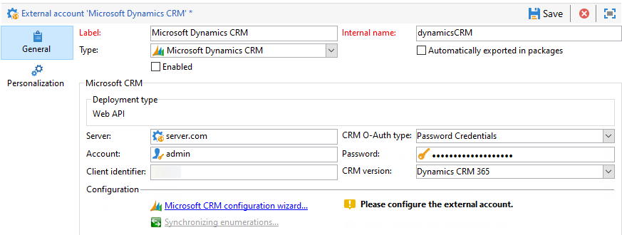

# Trabalhar com o Campaign e o Microsoft Dynamics 365{#crm-ms-dynamics}

Ative seus dados do CRM na comunicação entre canais: saiba como transmitir contatos do **Microsoft Dynamics 365** para o Adobe Campaign e compartilhar dados de desempenho da campanha (envios, aberturas, cliques e rejeições) do Adobe Campaign para o Microsoft Dynamics 365.

Quando a configuração for concluída, a sincronização de dados entre sistemas será realizada por meio de uma atividade dedicada de fluxo de trabalho. [Saiba mais](crm-data-sync.md).

>[!NOTE]
>
>As versões do Microsoft Dynamics com suporte estão detalhadas na [Matriz de compatibilidade](../start/compatibility-matrix.md) do Campaign.

Siga as etapas abaixo para configurar uma conta externa dedicada para importar e exportar dados do Microsoft Dynamics 365 para o Adobe Campaign.

Para cada sistema, essas etapas precisam ser executadas por um administrador.

>[!CAUTION]
> As etapas desta documentação guiarão você pela criação de integrações/registros que envolvem a atribuição de permissões e/ou acesso de administrador. É sua responsabilidade garantir que essas etapas estejam em conformidade com as políticas de sua empresa antes de executar o, e executá-las com cuidado.

## Configurar o Microsoft Dynamics 365 {#config-crm-microsoft}

Para conectar o Microsoft Dynamics 365 para trabalhar com o Adobe Campaign via **API da Web**, faça logon no [Microsoft Azure Diretory](https://portal.azure.com) usando uma credencial de **Administrador global** e siga as etapas abaixo:

1. Obtenha sua ID de Aplicativo (cliente) do Dynamics 365. [Saiba mais](#get-client-id-microsoft)
1. Gerar o identificador de chave de certificado e a ID de chave do Microsoft Dynamics. [Saiba mais](#config-certificate-key-id)
1. Configurar permissões. [Saiba mais](#config-permissions-microsoft)
1. Crie um usuário do aplicativo. [Saiba mais](#create-app-user-microsoft)
1. Codifique a chave privada. [Saiba mais](#configure-acc-for-microsoftt)


### Obter ID do cliente do Dynamics 365 {#get-client-id-microsoft}

Para obter a ID do aplicativo (cliente), é necessário registrar um aplicativo no Azure Ative Diretory.

1. Navegue até **Azure Ative Diretory > Registros de Aplicativo** e selecione **Novo Registro**.
1. Insira um nome exclusivo que possa ajudar a identificar uma instância, como **adobecampaign`<instance identifier>`**.

Depois de salvar, o Microsoft Azure Diretory atribui uma **ID do aplicativo (cliente)** exclusiva ao seu aplicativo. Essa ID será necessária posteriormente na configuração do Dynamics 365 no Adobe Campaign.

Saiba mais na [documentação do Microsoft Dynamics 365](https://docs.microsoft.com/powerapps/developer/common-data-service/walkthrough-register-app-azure-active-directory){target="_blank"}.

### Gerar o identificador de chave de certificado e a ID de chave do Microsoft Dynamics {#config-certificate-key-id}

Para obter o **Identificador de chave de certificado (customKeyIdentifier)** e a **ID de chave (keyId)**, carregue um certificado. Os certificados podem ser usados como segredos para provar a identidade do aplicativo ao solicitar um token. Também podem ser chamadas de chaves públicas.

Siga as etapas abaixo:

1. Navegue até **Azure Ative Diretory > Registros de Aplicativo** e selecione o Aplicativo que foi criado anteriormente.
1. Selecione em **Certificados e Segredo**.
1. Na guia **Certificados**, clique em **Carregar certificado**
1. Faça upload do seu certificado público.
1. Navegue até o link **Manifesto** para obter o **Identificador de chave de certificado (customKeyIdentifier)** e a **ID de chave (keyId)**.

O **Identificador de chave de certificado (customKeyIdentifier)** e a **ID de chave (keyId)** são necessários no Campaign para configurar a conta externa do Microsoft Dynamics 365 CRM usando o Certificado **[!UICONTROL CRM O-Auth type]**.

+++ Como gerar o certificado público

Para gerar o certificado, é possível usar o openssl.

Por exemplo:

```
- openssl req -x509 -sha256 -nodes -days 365 -newkey rsa:2048 -keyout '<'private key name'>' -out '<'public certificate name'>
```

>[!NOTE]
>
>Você pode alterar o número de dias, aqui `-days 365`, na amostra de código para um período de validade de certificado mais longo.

Você deve então codificar o certificado em base64. Para fazer isso, você pode usar a ajuda de um codificador Base64 ou usar a linha de comando `base64 -w0 private.key` para Linux.

+++

### Configurar permissões {#config-permissions-microsoft}

**Etapa 1**: Configurar as **Permissões necessárias** para o aplicativo criado.

1. Navegue até **Azure Active Directory > Registros de aplicativo** e selecione o Aplicativo que foi criado anteriormente.
1. Clique em **Configurações** no canto superior esquerdo.
1. Em **Permissões necessárias**, clique em **Adicionar** e **Selecionar uma API > Dynamics CRM Online**.
1. Clique em **Selecionar**, ative **Access Dynamics 365 como usuários da organização** e clique em **Selecionar**.
1. Em seguida, no aplicativo, selecione o **Manifesto** no menu **Gerenciar**.
1. No editor **Manifesto**, defina a propriedade `allowPublicClient` de `null` para `true` e clique em **Salvar**.

**Etapa 2**: Dar consentimento administrativo

1. Navegue até **Azure Ative Diretory > Aplicativos empresariais**.
1. Selecione o aplicativo para o qual deseja conceder o consentimento administrativo do locatário.
1. No menu do painel esquerdo, selecione **Permissões** em **Segurança**.
1. Clique em **Dar consentimento administrativo**.

Para obter mais informações, consulte a [documentação do Azure](https://docs.microsoft.com/azure/active-directory/manage-apps/grant-admin-consent#grant-admin-consent-from-the-azure-portal).

### Criar um usuário do aplicativo {#create-app-user-microsoft}

>[!NOTE]
>
> Esta etapa é opcional com autenticação **[!UICONTROL Password credentials]**.

O usuário do aplicativo é o usuário que o aplicativo registrado acima usará. Todas as alterações feitas no Microsoft Dynamics usando o aplicativo registrado acima serão feitas por meio desse usuário.

**Etapa 1**: criar um usuário não interativo no Azure Active Directory

1. Clique em **Azure Ative Directory > Usuários** e clique em **Novo usuário**.
1. Dê um nome adequado que você deseja usar, e o nome de usuário deve ser um formato do email.
1. Escolha **Administrador do Dynamics 365** na **Função de diretório**.

**Etapa 2**: atribuir uma licença adequada ao usuário criado

1. No [Microsoft Azure](https://portal.azure.com), clique em **Aplicativo admin**.
1. Vá para **Usuários > Usuários ativos** e clique no usuário recém-criado.
1. Clique em **Editar licenças de produto** e selecione o **Plano de Engajamento do Cliente do Dynamics 365**.
1. Clique em **Fechar**.

**Etapa 3**: criar um usuário do aplicativo no Dynamics CRM

1. No [Microsoft Azure](https://portal.azure.com), navegue até **Configurações > Segurança > Usuários**.
1. Clique na lista suspensa, selecione **Usuários do aplicativo** e clique em **Novo**.
1. Use o mesmo nome de usuário que o usuário criado no ative diretory acima.
1. Atribua o **ID da aplicação** para [o aplicativo criado anteriormente](#get-client-id-microsoft).
1. Clique em **Gerenciar funções** e escolha a função **Administrador do sistema** para o usuário.

## Configurar o Campaign {#configure-acc-for-microsoft}

### Criar a conexão{#new-ms-dyn-external-account}

Primeiro, você deve criar a conta externa do Microsoft Dynamics 365.

1. Navegue pelo nó **[!UICONTROL Administration > Platform > External accounts]** do explorador do Campaign e crie uma conta externa.
1. Selecione a conta externa **[!UICONTROL Microsoft Dynamics CRM]** na seção **Type**.
1. Selecione o método de autenticação na lista suspensa **[!UICONTROL CRM O-Auth type]**.

   

   1. Para configurar a conta externa do Microsoft Dynamics CRM para se conectar com o Adobe Campaign com **Credenciais de Senha**, forneça os seguintes detalhes:

      * **Servidor**: a URL do servidor Microsoft CRM. Para localizar a URL do Servidor do Microsoft CRM, acesse sua conta do Microsoft Dynamics CRM, clique em Dynamics 365 e selecione seu aplicativo. Você pode então encontrar o URL do servidor na barra de endereços do navegador, por exemplo, https://myserver.crm.dynamics.com/.
      * **Conta**: conta usada para entrar no Microsoft CRM.
      * **Senha**: conta usada para entrar no Microsoft CRM.
      * **Identificador do cliente**: a ID do aplicativo (cliente) que pode ser encontrada no portal de gerenciamento do Microsoft Azure na categoria Update your code, no campo Client ID
      * **Versão do CRM**: escolha a versão do Dynamics CRM 365 CRM.

   1. Para configurar a conta externa do Microsoft Dynamics CRM para se conectar ao Adobe Campaign com um **Certificado**, forneça os seguintes detalhes:

      * **Servidor**: a URL do servidor Microsoft CRM. Para localizar a URL do Servidor do Microsoft CRM, acesse sua conta do Microsoft Dynamics CRM, clique em Dynamics 365 e selecione seu aplicativo. Você pode então encontrar o URL do servidor na barra de endereços do navegador, por exemplo, https://myserver.crm.dynamics.com/.
      * **Chave privada**: copie/cole a chave privada, codificada em base64 conforme explicado em [esta seção](#config-certificate-key-id).
      * **Key ID**: chave disponível na guia **Manifest** do seu aplicativo, conforme explicado em [esta seção](#config-certificate-key-id).
      * **Identificador de Chave Personalizada**: Identificador disponível na guia **Manifesto** do seu aplicativo, conforme explicado em [esta seção](#config-certificate-key-id).
      * **Identificador do cliente**: a ID do aplicativo (cliente) que pode ser encontrada no portal de gerenciamento do Microsoft Azure como explicado em [esta seção](#get-client-id-microsoft).
      * **Versão do CRM**: escolha a versão do Dynamics CRM 365 CRM.

1. Selecione a opção **Habilitar** para ativar a conta no Campaign.

>[!NOTE]
>
>Para aprovar a configuração, faça logoff e logon novamente no Console do cliente do Adobe Campaign.

### Selecionar tabelas para sincronizar{#ms-dyn-create-tables}

Agora você pode configurar tabelas para sincronizar.

1. Clique no **[!UICONTROL Microsoft CRM configuration wizard...]**.
1. Selecione as tabelas para sincronizar e iniciar o processo.
1. Verifique o esquema gerado no Adobe Campaign no nó **[!UICONTROL Administration > Configuration > Data schemas]**.

>[!NOTE]
>
>Certifique-se de adicionar ao incluo na lista de permissões duas URLs: a URL do servidor e `login.microsoftonline.com`. Para fazer isso, entre em contato com o representante da Adobe.

## Sincronize as enumerações{#sfdc-enum-sync}

Depois que o esquema for criado, você poderá sincronizar enumerações automaticamente do Dynamics 365 para o Adobe Campaign.

1. Abra o assistente no link **[!UICONTROL Synchronizing enumerations...]**.
1. Selecione a enumeração do Adobe Campaign que corresponde à enumeração do Dynamics 365.
É possível substituir todos os valores de uma enumeração do Adobe Campaign pelos valores do CRM: para fazer isso, selecione **[!UICONTROL Yes]** na coluna **[!UICONTROL Replace]**.
1. Clique em **[!UICONTROL Next]** e depois em **[!UICONTROL Start]** para começar a importar as listas discriminadas.
1. Navegue pelo nó **[!UICONTROL Administration > Platform > Enumerations]** para verificar os valores importados.

O Adobe Campaign e o Microsoft Dynamics 365 agora estão conectados. Você pode configurar a sincronização de dados entre os dois sistemas.

Para sincronizar dados entre o Adobe Campaign e o Microsoft CRM, crie um fluxo de trabalho e use a atividade **[!UICONTROL CRM connector]**.

Saiba mais sobre a sincronização de dados [nesta página](crm-data-sync.md).

Saiba mais sobre o gerenciamento de enumeração no Campaign [nesta página](../config/enumerations.md).

### Tipos de dados de campo compatíveis {#ms-dyn-supported-types}

Os tipos de atributos suportados/não suportados do Microsoft Dynamics 365 estão listados abaixo:


| Tipo de atributo | Suportado |
| --------------------------------------------------------------------------------- | --------- |
| Tipos básicos: booleano, datetime, decimal, float, double, integer, bigint , string | Sim |
| Dinheiro (como duplo) | Sim |
| memo, entityname, primarykey, uniqueidentifier (como strings) | Sim |
| Status, lista de opções (armazenamos os valores possíveis nas enumerações), estado (string) | Sim |
| proprietário (como string) | Sim |
| Pesquisa (somente pesquisas de referência de entidade única) | Sim |
| cliente | Não |
| Sobre | Não |
| PartyList | Não |
| ManagedProperty | Não |
