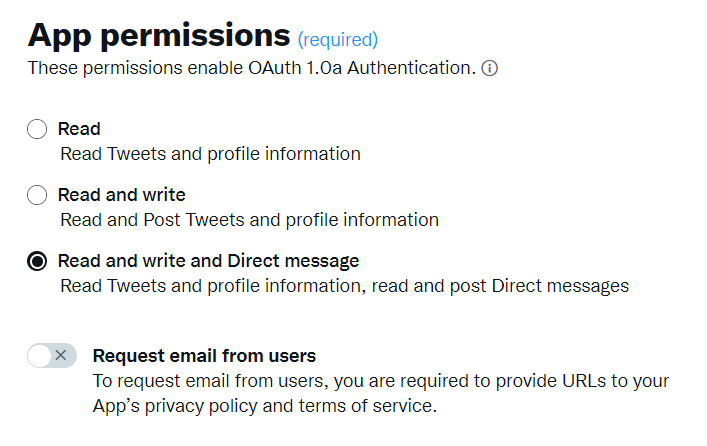

# Trabalhar com o Campaign e o X (Twitter) {#tw-ac-ovv}

O módulo **Managing social networks (Social Marketing)** permite interagir com seus clientes via X (anteriormente conhecido como Twitter). Use esse recurso para:

* Postar mensagens e enviar DMs - Use o Adobe Campaign Social Marketing para postar mensagens no X. Você também pode enviar mensagens diretas a todos os seus seguidores.

* Coletar novos contatos - O Adobe Campaign Social Marketing também facilita a aquisição de novos contatos: entre em contato com os usuários e pergunte se desejam compartilhar suas informações de perfil. Se eles aceitarem, o Adobe Campaign recuperará automaticamente os dados, o que permite realizar campanhas de direcionamento e, quando possível, implementar estratégias entre canais.

>[!NOTE]
>
>Como usuário do Managed Cloud Service, [entre em contato com o Adobe](../start/campaign-faq.md#support) para conectar o Campaign com o X. O complemento **Gerenciamento de redes sociais (Marketing Social)** deve ser instalado em seu ambiente por meio do pacote dedicado e a Conta Externa do Twitter deve ser configurada.

Para configurar o Adobe Campaign para publicar tweets em suas contas do X, delegue acesso de gravação ao Adobe Campaign para essas contas. Para fazer isso, você deve:

1. Crie uma conta do X e cadastre-se em uma conta de desenvolvedor. [Saiba mais](#dev-account)
1. (opcional) Crie uma conta de teste X para enviar provas. [Saiba mais](#tw-test-account)
1. Crie um aplicativo X (um aplicativo por conta X). [Saiba mais](#create-an-app-on-twitter)
1. Crie um novo serviço para **[!UICONTROL Twitter]** (um serviço por conta X). [Saiba mais](#create-tw-service)
1. Sincronize sua conta X com o Campaign. [Saiba mais](#synchro-tw-accounts)

## X conta do desenvolvedor {#dev-account}

Para começar com esta integração, você deve se inscrever em uma [X conta de desenvolvedor](https://developer.twitter.com){target="_blank"}.

O Campaign usa a versão 1.1 da API X. Para usá-lo, você precisa solicitar acesso elevado por meio do Portal do desenvolvedor. Saiba mais sobre o X Elevated Access [nesta página](https://developer.twitter.com/en/portal/products/elevated){target="_blank"}.

## Criar um aplicativo no X {#create-an-app-on-twitter}

Depois de ter sido aprovado com Acesso elevado, crie um aplicativo X para permitir que o Adobe Campaign crie publicações em sua conta X. Para fazer isso, siga as etapas abaixo:

1. Faça logon em sua conta X.
1. Conecte-se ao [X portal do desenvolvedor](https://developer.twitter.com/en/apps){target="_blank"}.
1. Selecione **Criar um aplicativo**.
1. Deixe o X assistant orientá-lo pelo processo.
1. Para permitir que o Adobe Campaign crie publicações em sua conta, edite em **Permissões do aplicativo** na seção Configuração de autenticação de usuário do seu aplicativo. Selecione **Mensagens de Leitura, Gravação e Diretas**.

   

1. Na seção **Tipo de aplicativo**, selecione **Aplicativo Web, Aplicativo Automatizado ou Bot**. Você pode deixar o campo **URL de retorno** vazio e salvar sua configuração.

   

1. De volta ao painel do aplicativo, selecione seu aplicativo e navegue até a guia **Chaves e tokens**. Em **Token de Acesso e Segredo**, se a permissão **Ler, Gravar e Mensagens Diretas** não for mencionada, você deverá regenerar o token e o segredo do seu aplicativo. Observe que todas as chaves e tokens devem ser salvas após a criação. Você precisará deles para configurar o serviço do Campaign Twitter.

   

>[!NOTE]
>
>Você precisa de um aplicativo por conta X. Como consequência, você deve criar outra aplicação de teste para enviar provas para sua conta de teste.
>

## Criar um serviço do Twitter no Campaign {#create-tw-service}

Para vincular a instância do Campaign à conta X, crie um serviço **Twitter** e delegue acesso de gravação ao Campaign.

>[!CAUTION]
>
>Criar um serviço **Twitter** por conta X. Como consequência, você deve criar outro serviço de teste para enviar provas para sua [conta de teste](#tw-test-account).
>
>Cada serviço **Twitter** também deve ser criado por Adobe na instância MID. Entre em contato com o representante da Adobe para configurar seu ambiente.
>

Para inserir as configurações, você deve acessar o console do cliente do Adobe Campaign e as permissões do aplicativo X.

1. No **Adobe Campaign**, navegue até a guia **[!UICONTROL Profiles and targets]** e selecione o link **[!UICONTROL Services and Subscriptions]**
1. Crie um novo serviço.
1. Selecione o tipo **[!UICONTROL Twitter]**.
1. Insira o rótulo e o nome interno do serviço.

   >[!CAUTION]
   >
   >O **[!UICONTROL Internal name]** do serviço deve ser exatamente o mesmo nome da sua conta X.
   >

1. Por padrão, os seguidores são salvos na pasta **[!UICONTROL Visitors]**. Você pode selecionar outro local no campo **[!UICONTROL Visitor folder]**. [Saiba mais](../send/twitter.md#direct-tw-messages)

   

   >[!NOTE]
   >
   >A opção **[!UICONTROL Synchronize subscriptions]** está habilitada por padrão: essa opção recupera automaticamente a lista de X seguidores para que você possa [enviar mensagens diretas a eles](../send/twitter.md#direct-tw-messages). A sincronização é executada por um [fluxo de trabalho técnico dedicado](#synchro-tw-accounts).

1. No aplicativo X, copie o conteúdo dos campos **Chave da API** e **[Segredo da Chave da API]** e cole-os nos campos **[!UICONTROL Consumer key]** e **[!UICONTROL Consumer secret]** do serviço **Twitter** do Campaign.

1. No aplicativo X, copie o conteúdo dos campos **Token de acesso** e **Segredo do token de acesso** e cole-os nos campos **[!UICONTROL Access token]** e **[!UICONTROL Access token secret]** do serviço **Twitter** do Campaign.

1. No console do cliente do Campaign, clique em **[!UICONTROL Save]**. Agora você delegou acesso de gravação ao Adobe Campaign.

Para verificar as configurações, é possível:

* Edite o serviço **Twitter** que acabou de criar.
* Navegue pela guia **[!UICONTROL Twitter page]**: a conta do Twitter deve ser exibida.
  

## Sincronizar a conta do X {#synchro-tw-accounts}

A sincronização entre o Campaign e o X é gerenciada por meio de workflows técnicos dedicados. Esses fluxos de trabalho são armazenados na pasta **[!UICONTROL Administration > Production > Technical workflows > Managing social networks]**.

Elas são interrompidas por padrão: você deve iniciá-las manualmente quando começar a usar o módulo **Marketing Social**.

O fluxo de trabalho técnico do **[!UICONTROL Synchronization of Twitter accounts]** sincroniza as contas X no Adobe Campaign. Esse workflow recupera a lista de seguidores X para que você possa enviar mensagens diretas a eles. [Saiba mais](../send/twitter.md#direct-tw-messages)

Por padrão, esse workflow é acionado todas as quintas-feiras às 7h30. Você pode usar a opção **[!UICONTROL Execute pending task(s) now]** para iniciar o fluxo de trabalho a qualquer momento enquanto implementa essa integração.  Também é possível editar o scheduler para alterar a frequência de acionamento do workflow. Saiba mais [nesta página](../../automation/workflow/scheduler.md).

>[!CAUTION]
>
>Para recuperar a lista de assinantes X, a opção **[!UICONTROL Twitter account synchronization]** deve ser marcada para o serviço vinculado à conta. [Saiba mais](#create-tw-service)

Os seguidores são armazenados em uma tabela específica: a tabela de visitantes. Para exibir a lista de X seguidores, navegue até **[!UICONTROL Profiles and Targets > Visitors]**.

Para cada seguidor, o Adobe Campaign armazena as seguintes informações:

* **[!UICONTROL Origin]**: Twitter
* **[!UICONTROL External ID]**: identificador do usuário
* **[!UICONTROL Username]**: nome da conta do usuário
* **[!UICONTROL Full name]**: nome do usuário
* **[!UICONTROL Number of friends]**: número de seguidores
* **[!UICONTROL Checked]**: este campo indica se o usuário tem uma conta verificada do Twitter

Quando essa configuração estiver concluída, você poderá criar publicações em suas contas X e enviar mensagens diretas aos seus seguidores. [Saiba mais](../send/twitter.md)

## Criar uma conta de teste em X {#tw-test-account}

Além da conta X, crie uma conta X privada que possa ser usada para enviar [provas de tweet](../send/twitter.md#send-tw-proofs). Para fazer isso, siga as etapas abaixo:

1. Crie uma nova conta X.
1. Acesse as **Configurações** da conta.
1. Navegue até **Privacidade e Segurança** e **Público-alvo e Marcação** e verifique a opção **Protect suas postagens**. Suas publicações e outras informações da conta só estarão visíveis para as pessoas que seguem você.

Configure seu aplicativo X e o serviço do Campaign para funcionar com essa conta de teste, conforme descrito acima.
