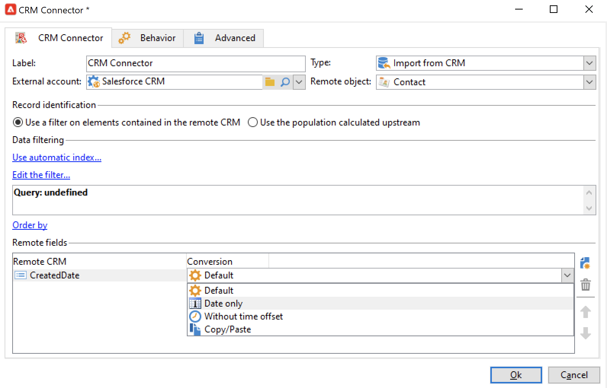

# Sincronizar dados entre o Campaign e o CRM {#data-synchronization}

A sincronização de dados entre o Adobe Campaign e o CRM é gerenciada pelo **Conector CRM** atividade de workflow.

Por exemplo, para importar os dados do Microsoft Dynamics para o Adobe Campaign, crie o seguinte tipo de fluxo de trabalho:

Esse fluxo de trabalho importa contatos por meio do Microsoft Dynamics, sincroniza com os dados existentes do Adobe Campaign, exclui os contatos duplicados e atualiza o banco de dados do Adobe Campaign.

A atividade **[!UICONTROL CRM Connector]** precisa ser configurada para sincronizar dados.

Com essa atividade, você pode:

* Importar do CRM - [Saiba mais](#importing-from-the-crm)
* Exportar para o CRM - [Saiba mais](#exporting-to-the-crm)
* Importar objetos excluídos no CRM - [Saiba mais](#importing-objects-deleted-in-the-crm)
* Excluir objetos no CRM - [Saiba mais](#deleting-objects-in-the-crm)

Selecione a conta externa que corresponde ao CRM que você deseja configurar a sincronização, e depois selecione o objeto a ser sincronizado: contas, oportunidades, clientes potencias, contatos, etc.

A configuração dessa atividade depende do processo a ser executado. Várias configurações são detalhadas abaixo.

## Importar do CRM {#importing-from-the-crm}

Para importar dados por meio do CRM no Adobe Campaign, você precisa criar o seguinte tipo de fluxo de trabalho:

1. Selecione uma operação **[!UICONTROL Import from the CRM]**.
1. No **[!UICONTROL Remote object]** selecione o objeto a ser importado. Esse objeto corresponde a uma das tabelas criadas no Adobe Campaign durante a configuração do conector.
1. No **[!UICONTROL Remote fields]** insira os campos que serão importados.

   Para adicionar um campo, clique no botão **[!UICONTROL Add]** na barra de ferramentas e, em seguida, clique no ícone **[!UICONTROL Edit expression]**.

   Se necessário, altere o formato dos dados usando a lista suspensa do **[!UICONTROL Conversion]** colunas. Os possíveis tipos de conversão são detalhados em [nesta seção](#data-format).

   >[!CAUTION]
   >
   >O identificador do registro no CRM é obrigatório para vincular objetos no CRM e no Adobe Campaign. Ele é adicionado automaticamente quando a caixa é aprovada.
   >
   >A última data de modificação no lado do CRM também é obrigatória para importações de dados incrementais.

1. Você pode filtrar os dados a serem importados com base nas suas necessidades. Para fazer isso, clique em **[!UICONTROL Edit the filter...]**.

   No exemplo a seguir, o Adobe Campaign só importará contatos nos quais algumas atividades foram registradas desde 1º de novembro de 2021.

   

   >[!CAUTION]
   >
   >As limitações relacionadas aos modos do filtro de dados são detalhadas em [nesta seção](#filtering-data).

1. Selecione o **[!UICONTROL Use automatic index...]** opção para gerenciar automaticamente a sincronização de objetos incrementais entre seu CRM e o Adobe Campaign, dependendo da data e da última modificação.

   Para obter mais informações, consulte [esta seção](#variable-management).

### Gerenciar variáveis {#variable-management}

Ativar o **[!UICONTROL Automatic index]** opção para coletar apenas objetos modificados desde a última importação.

A data da última sincronização é armazenada em uma opção especificada na janela de configuração, por padrão: **LASTIMPORT_&lt;%=instance.internalName%>_&lt;%=activityName%>**.

>[!NOTE]
>
>Essa nota se aplica somente à atividade genérica **[!UICONTROL CRM Connector]**. Para outras atividades do CRM, o processo é automático.
>
>Essa opção deve ser criada e preenchida manualmente em **[!UICONTROL Administration]** > **[!UICONTROL Platform]** > **[!UICONTROL Options]**. Deve ser uma opção de texto e seu valor precisa corresponder ao seguinte formato: **`yyyy/MM/dd hh:mm:ss`**.
> 
>Você precisa atualizar essa opção manualmente para qualquer outra importação.

É possível especificar o campo do CRM remoto que será levado em consideração para identificar as alterações mais recentes.

Por padrão, os seguintes campos são usados (na ordem especificada):

* Para o Microsoft Dynamics: **modifiedon**,
* Para o Salesforce.com: **LastModifiedDate**, **SystemModstamp**.

A ativação da opção **[!UICONTROL Automatic index]** gera três variáveis que podem ser usadas no fluxo de trabalho de sincronização por meio de uma atividade do tipo **[!UICONTROL JavaScript code]**. Essas atividades são:

* **vars.crmOptionName**: nome da opção que contém a data da última importação.
* **vars.crmStartImport**: data de início (incluída) da última importação de dados.
* **vars.crmEndDate**: data final (excluída) da última importação de dados.

  >[!NOTE]
  >
  >Essas datas são exibidas no seguinte formato: **`yyyy/MM/dd hh:mm:ss`**.

### Filtrar dados {#filtering-data}

Para garantir uma operação eficiente com os vários CRMs, os filtros precisam ser criados com as seguintes regras:

* Cada nível de filtragem só pode usar um tipo de operador.
* O operador AND NOT não é suportado.
* Comparações podem dizer respeito somente a valores nulos (tipo &quot;está vazio&quot;/&quot;não está vazio&quot;) ou números. Isso significa que o valor (coluna à direita) é avaliado e o resultado dessa avaliação deve ser um número. Portanto, as comparações do tipo JOIN não são compatíveis.
* O valor contido na coluna à direita é avaliado em JavaScript.
* Não há suporte para comparações JOIN.
* A expressão na coluna à esquerda deve ser um campo. Ele não pode ser uma combinação de várias expressões, um número, etc.

### Ordenar por {#order-by}

No Microsoft Dynamics e no Salesforce.com, você pode classificar os campos remotos a serem importados em ordem crescente ou decrescente.

Para fazer isso, clique no link **[!UICONTROL Order by]** e adicione as colunas à lista.

A ordem das colunas na lista é a ordem de classificação:

### Identificação de registro {#record-identification}

Em vez de importar elementos incluídos (e possivelmente filtrados) no CRM, você pode usar uma população calculada anteriormente no workflow.

Para fazer isso, selecione a opção **[!UICONTROL Use the population calculated upstream]** e especifique o campo que contém o identificador remoto.

Em seguida, selecione os campos da população de entrada que deseja importar, conforme mostrado abaixo:

## Exportar para o CRM {#exporting-to-the-crm}

Exporte dados do Adobe Campaign para seu CRM para copiar todo o conteúdo para o banco de dados do CRM.

Para exportar dados para seu CRM, crie o seguinte tipo de fluxo de trabalho:

1. Selecione uma operação **[!UICONTROL Export to CRM]**.
1. Vá para a **[!UICONTROL Remote object]** e selecione o objeto a ser exportado. Esse objeto corresponde a uma das tabelas criadas no Adobe Campaign durante a configuração do conector.

   >[!CAUTION]
   >
   >A função de exportação do **[!UICONTROL CRM Connector]** A atividade pode inserir ou atualizar campos no seu CRM. Para habilitar atualizações de campo no CRM, especifique a chave primária da tabela remota. Se a chave estiver ausente, os dados serão inseridos, em vez de serem atualizados.

1. Se precisar realizar exportações mais rápidas, marque a caixa de seleção  **[!UICONTROL Export in Batches]** opção.

   

1. No **[!UICONTROL Mapping]** clique em **[!UICONTROL New]** para especificar os campos que serão exportados e o mapeamento deles no CRM.

   Para adicionar um campo, clique no botão **[!UICONTROL Add]** na barra de ferramentas e, em seguida, clique no ícone **[!UICONTROL Edit expression]**.

   >[!NOTE]
   >
   >Se nenhuma correspondência for definida para um campo, os valores não poderão ser atualizados: eles são inseridos diretamente no CRM.

   Se necessário, altere o formato dos dados usando a lista suspensa do **[!UICONTROL Conversion]** colunas. Os possíveis tipos de conversão são detalhados em [nesta seção](#data-format).

   >[!NOTE]
   >
   >A lista de registros a serem exportados e o resultado da exportação são salvas em um arquivo temporário que permanece acessível até que o workflow seja concluído ou reiniciado. Isso permite que você inicie o processo com segurança em caso de erros.

## Configurações adicionais {#additional-configurations}

### Formato dos dados {#data-format}

É possível converter o formato dos dados de forma instantânea ao importá-los para ou do seu CRM.

Para fazer isso, selecione a conversão a ser aplicada na coluna correspondente.

O modo **[!UICONTROL Default]** aplica conversão automática de dados, que na maioria dos casos é igual a copiar/colar os dados. No entanto, o gerenciamento de fuso horário é aplicado.

Outras conversões possíveis são:

* **[!UICONTROL Date only]**: exclui os campos do tipo Data + Hora.
* **[!UICONTROL Without time offset]**: cancela o gerenciamento de fuso horário aplicado no modo padrão.
* **[!UICONTROL Copy/Paste]**: usa dados brutos como cadeias de caracteres (sem conversão).

### Processamento de erros {#error-processing}

Dentro da estrutura de importações ou exportações de dados, é possível aplicar um processo específico a erros e rejeições. Para fazer isso, selecione as opções **[!UICONTROL Keep the rejections in a file]** e **[!UICONTROL Process errors]** na guia **[!UICONTROL Behavior]**.

Essas opções adicionam as transições de saída relacionadas.

Em seguida, insira as atividades relevantes para processar dados. Por exemplo, adicione um **Aguardar** atividade e novas tentativas de agendamento para erros.

A transição **[!UICONTROL Reject]** de saída permite que você acesse o schema de saída que contém as colunas específicas relevantes para mensagens e códigos de erro. Para o Salesforce.com, essa coluna é **errorSymbol** (símbolo de erro, diferente do código de erro), **errorMessage** (descrição do contexto de erro).

## Importar objetos excluídos no CRM {#importing-objects-deleted-in-the-crm}

Você pode importar objetos excluídos do seu CRM para o Adobe Campaign.

1. Selecione uma operação **[!UICONTROL Import objects deleted in the CRM]**.
1. Vá até a lista suspensa **[!UICONTROL Remote object]** e selecione o objeto relacionado ao processo. Esse objeto corresponde a uma das tabelas criadas no Adobe Campaign durante a configuração do conector.
1. Especifique o período de exclusão que será considerado no **[!UICONTROL Start date]** e a variável **[!UICONTROL End date]** (as datas estão incluídas).

   >[!CAUTION]
   >
   >O período de exclusão deve coincidir com as limitações específicas do CRM. Por exemplo, para Salesforce.com, elementos excluídos há mais de 30 dias não podem ser recuperados.

## Excluir objetos no CRM {#deleting-objects-in-the-crm}

Para excluir objetos no seu CRM, especifique a chave primária dos elementos remotos a serem excluídos.

A guia **[!UICONTROL Behavior]** permite habilitar o processamento de rejeições. Essa opção gera uma segunda transição de saída para a atividade **[!UICONTROL CRM connector]**. Para obter mais informações, consulte [Processamento de erros](#error-processing).
