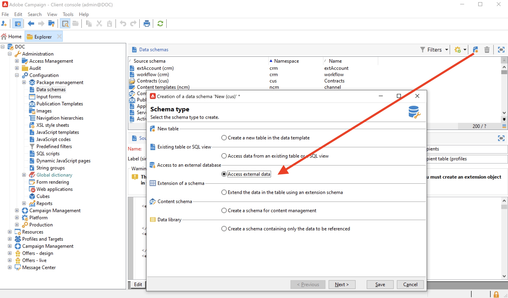

# Federated Data Access (FDA){#gs-fda}

Use o Conector FDA (Federated Data Access) para conectar o Campaign a um ou mais **bancos de dados externos** e processar as informações armazenadas neles sem afetar os dados do banco de dados da Campaign Cloud. Em seguida, você pode acessar dados externos sem alterar a estrutura dos dados do Adobe Campaign.

>[!NOTE]
>
>Bancos de dados compatíveis com o FDA estão listados na [Matriz de compatibilidade](../start/compatibility-matrix.md).

A opção FDA do Campaign permite estender o modelo de dados em um banco de dados de terceiros. Ele detectará automaticamente a estrutura das tabelas direcionadas e usará os dados das fontes SQL.

**permissões** específicas são necessárias em [!DNL Adobe Campaign] e no banco de dados externo para interagir. Saiba mais [nesta seção](#fda-permissions).

## Práticas recomendadas e limitações

* **Otimizar a personalização de email com dados externos**

   Você pode pré-processar a personalização de mensagens em um workflow dedicado. Para fazer isso, use a opção **[!UICONTROL Prepare the personalization data with a workflow]**, disponível na guia **[!UICONTROL Analysis]** das propriedades de delivery.

   Durante a análise de delivery, essa opção cria e executa automaticamente um workflow que armazena todos os dados vinculados ao target em uma tabela temporária, incluindo dados de tabelas vinculadas em um banco de dados externo.

   Essa opção melhora significativamente o desempenho ao executar a etapa de personalização.

* **Limitações do FDA**

   A opção FDA é feita para manipular os dados em bancos de dados externos em modo de lote em workflows. Para evitar problemas de desempenho, não é recomendável usar o módulo FDA no contexto de operações unitárias, como: personalização, interação, mensagens em tempo real etc.

   Evite o máximo possível as operações que precisam usar o banco de dados tanto do Adobe Campaign quanto externo. Para fazer isso, é possível:

   * Exportar o banco de dados do Adobe Campaign para o banco de dados externo e executar as operações somente do banco de dados externo antes de importar novamente os resultados para o Adobe Campaign.

   * Coletar os dados do banco de dados externo do Adobe Campaign e executar as operações no local.

   Se você quiser realizar a personalização de deliveries usando dados do banco de dados externo, colete os dados para usar em um workflow para torná-lo disponível em uma tabela temporária. Em seguida, use os dados da tabela temporária para personalizar seu delivery.

   A opção FDA está sujeita às limitações do sistema de banco de dados externo que você usa.

## Etapas de configuração{#fda-configuration-steps}

Para configurar o acesso a um banco de dados externo com o FDA, as etapas de configuração são:

1. Como usuário do Adobe Managed Services, entre em contato com o Adobe para instalar os drivers na instância do Campaign.
1. Depois que os drivers forem instalados, configure a conta externa que corresponde ao banco de dados no servidor do Adobe Campaign e teste a conta externa. [Saiba mais](#fda-external-account)
1. Criar o schema do banco de dados externo no Adobe Campaign. Isso permite identificar a estrutura de dados do banco de dados externo. [Saiba mais](#create-data-schema)
1. Se necessário, crie um novo target mapping do schema criado anteriormente. Isso é necessário se os recipients de seus deliveries vierem do banco de dados externo. Essa implementação vem com limitações relacionadas à personalização de mensagens. [Saiba mais](#define-data-mapping)

## Conta externa do banco de dados externo{#fda-external-account}

Você precisa criar uma conta externa específica para conectar a instância do Campaign ao banco de dados externo.

Para fazer isso, siga as etapas abaixo:

1. No Campaign **[!UICONTROL Explorer]**, navegue até **[!UICONTROL Administration]** `>` **[!UICONTROL Platform]** `>` **[!UICONTROL External accounts]**.

1. Clique em **[!UICONTROL New]**.

   >[!NOTE]
   >
   > Para estar ativa, a opção **[!UICONTROL Enabled]** deve ser marcada. Se necessário, desmarque essa opção para desabilitar o acesso a esse banco de dados sem excluir sua configuração.

1. Selecione **[!UICONTROL External database]** como sua conta externa **[!UICONTROL Type]**.

1. Escolha o banco de dados externo na lista suspensa e configure a conta externa . Você deve especificar:

   * **[!UICONTROL Server]**: URL do servidor 

   * **[!UICONTROL Account]**: Nome do usuário

   * **[!UICONTROL Password]**: Senha da conta do usuário

   * **[!UICONTROL Database]**: Nome do banco de dados

      

1. Clique na guia **[!UICONTROL Parameters]** e depois no botão **[!UICONTROL Deploy functions]** para criar as funções.

1. Quando os parâmetros forem inseridos, clique no botão **[!UICONTROL Test the connection]** para aprová-los.

1. Para permitir que o Adobe Campaign acesse esse banco de dados, você deve implantar as funções SQL. Clique na guia **[!UICONTROL Parameters]** e depois no botão **[!UICONTROL Deploy functions]**.

Você pode definir espaços de tabela de trabalho específicos para as tabelas e para o índice na guia **[!UICONTROL Parameters]**.

Para [!DNL Snowflake], o conector suporta as seguintes opções:

| Opção | Descrição |
|---|---|
| schema de trabalho | schema de banco de dados que deve ser usado para tabelas de trabalho |
| depósito | Nome do depósito padrão que deve ser usado. Ele substituirá o padrão do usuário. |
| TimeZoneName | É vazio por padrão, o que significa que o fuso horário do sistema do servidor de aplicativos Campaign Classic é usado. A opção pode ser usada para forçar o parâmetro da sessão TIMEZONE.  [Para obter mais informações, consulte esta página](https://docs.snowflake.net/manuals/sql-reference/parameters.html#timezone). |
| WeekStart | Parâmetro de sessão WEEK_START. Por padrão, defina como 0.  [Para obter mais informações, consulte esta página](https://docs.snowflake.com/br/sql-reference/parameters.html#week-start). |
| UseCachedResult | Parâmetro de sessão USE_CACHED_RESULTS. Por padrão, defina como TRUE. Esta opção pode ser usada para desativar os resultados em cache do Snowflake.  Para obter mais informações, consulte esta [página](https://docs.snowflake.net/manuals/user-guide/querying-persisted-results.html). |

## Criar o esquema de dados{#create-data-schema}

Para criar o schema do banco de dados externo no Adobe Campaign, siga as etapas abaixo:

1. Clique no botão **[!UICONTROL New]** acima da lista dos schemas de dados e escolha **[!UICONTROL Access external data]**.

   

1. Insira um nome e uma descrição para o schema e selecione a conta externa que habilitará a conexão com o banco de dados. Isso permite o acesso à lista de tabelas disponíveis na base externa. Escolha a tabela que contém os dados a serem coletados.

   

1. Clique em **[!UICONTROL OK]** para confirmar. O Adobe Campaign detecta automaticamente a estrutura da tabela selecionada e gera o schema lógico. Observe que o Adobe Campaign não gera links.

1. Clique em **[!UICONTROL Save]** para confirmar a criação.

## Definir o target mapping{#define-data-mapping}

Você pode definir um mapeamento nos dados em uma tabela externa.

Para fazer isso, após a criação do schema da tabela externa, é possível criar um novo mapeamento de delivery para usar os dados nessa tabela como um Delivery Target.

Para fazer isso, siga estes passos:

1. Navegue até **[!UICONTROL Administration]** `>` **[!UICONTROL Campaign Management]** `>` **[!UICONTROL Target mappings]** a partir do Adobe Campaign Explorer.

1. Crie um novo target mapping e selecione o schema que acabou de criar como o targeting dimension.

   

1. Indique os campos onde as informações de delivery são armazenadas (sobrenome, nome, e-mail, endereço, etc.).

   

1. Especifique os parâmetros para armazenamento de informações, incluindo o sufixo dos schemas de extensão para que sejam facilmente identificáveis.

   

   Você pode escolher se deseja armazenar exclusões (**excludelog**), com mensagens (**broadlog**) ou em uma tabela separada.

   Você também pode escolher se deseja gerenciar o rastreamento para esse mapeamento de delivery (**trackinglog**).

1. Em seguida, selecione as extensões a serem consideradas. O tipo de extensão depende dos parâmetros e opções da sua plataforma (visualizar seu contrato de licença).

   

   Clique no botão **[!UICONTROL Save]** para iniciar a criação de mapeamento de delivery: todas as tabelas vinculadas são criadas automaticamente com base nos parâmetros selecionados.

## Permissões{#fda-permissions}

**permissões** específicas são necessárias em [!DNL Adobe Campaign] e no banco de dados externo para interagir.

Primeiro, para que o usuário possa realizar operações em um banco de dados externo por meio do FDA, o operador deve ter um direito nomeado específico em [!DNL Adobe Campaign].

1. Selecione o nó **[!UICONTROL Administration > Access Management > Named Rights]** no Adobe Campaign Explorer.
1. Crie um novo direito especificando o rótulo escolhido.
1. Insira o nome do direito nomeado no seguinte formato **user:base@server**, onde:

   * **** usuário é o nome do usuário no banco de dados externo
   * **** base é o nome do banco de dados externo
   * **** server é o nome do servidor de banco de dados externo

1. Salve o direito Nomeado e o vincule ao operador escolhido a partir do nó **[!UICONTROL Administration > Access Management > Operators]** do explorador do Adobe Campaign.

Em seguida, para processar os dados contidos em um banco de dados externo, o operador do Adobe Campaign deve ter pelo menos permissões &quot;Write&quot; no banco de dados para poder criar worktables. Essas tabelas são excluídas automaticamente pelo Adobe Campaign.

As seguintes permissões são necessárias:

* **CONNECT**: conexão ao banco de dados remoto
* **READ Data**: acesso somente leitura a tabelas com dados do cliente
* **READ &#39;MetaData&#39;**: acesso aos catálogos de dados do servidor para obter a estrutura da tabela
* **LOAD**: carregamento em massa em tabelas de trabalho (necessário ao trabalhar em coleções e associações)
* **CREATE/DROP** para **TABLE/INDEX/PROCEDURE/FUNCTION** (apenas para tabelas de trabalho geradas pelo Adobe Campaign)
* **EXPLAIN**  (recomendado): para monitorar desempenhos em caso de problema
* **WRITE Data** (dependendo do cenário de integração)

O administrador do banco de dados precisa combinar esses direitos com os direitos específicos de cada mecanismo de banco de dados, conforme detalhado abaixo.

|   | Snowflake | Amazon Redshift |
|:-:|:-:|:-:|
| **Conexão com o banco de dados remoto** | Privilégios de USAGE ON WAREHOUSE, USAGE ON DATABASE e USAGE ON SCHEMA | Criar um usuário vinculado à conta AWS |
| **Criar tabelas** | Privilégio CRIAR TABELA NO SCHEMA | Privilégio CRIAR |
| **Criar índices** | N/D | Privilégio CRIAR |
| **Criar funções** | Privilégio CRIAR FUNÇÃO NO SCHEMA | Privilégio plpythonu USO EM IDIOMA para poder chamar scripts python externos |
| **Criar procedimentos** | N/D | Privilégio python USO EM IDIOMA para poder chamar scripts python externos |
| **Remover objetos (tabelas, índices, funções, procedimentos)** | Propriedade do objeto | Ter o objeto ou ser um superusuário |
| **Monitoramento de execuções** | Privilégio MONITORAR no objeto necessário | Não é necessário nenhum privilégio para usar o comando EXPLICAR |
| **Gravação de dados** | Privilégios INSERIR e/ou ATUALIZAR (que depende da operação de gravação) | Privilégios INSERIR e ATUALIZAR |
| **Carregamento de dados em tabelas** | Privilégios CRIAR ETAPA NO SCHEMA, SELECIONAR e INSERIR na tabela do direcionamento | Privilégios SELECIONAR e INSERIR |
| **Acesso aos dados do cliente** | Privilégio(s) SELECIONAR em (FUTURO) TABELA(S) ou VISUALIZAÇÃO(es) | Privilégio SELECIONAR |
| **Acesso aos metadados** | Privilégio SELECIONAR no ESQUEMA de INFORMATION_SCHEMA | Privilégio SELECIONAR |

## Usar dados externos em um workflow

Após a criação do schema de dados, é possível processar os dados nos workflows do Adobe Campaign.

Várias atividades permitem interagir com dados de um banco de dados externo:

* **Filtrar dados externos**  - A  **[!UICONTROL Query]** atividade permite adicionar dados externos e usá-los nas configurações de filtro definidas.

* **Criar subconjuntos**  - A  **[!UICONTROL Split]** atividade permite criar subconjuntos. Você pode usar dados externos para definir os critérios de filtragem a serem usados.

* **Carregar banco de dados externo**  - Você pode usar os dados externos na  **[!UICONTROL Data loading (RDBMS)]** atividade .

* **Adição de informações e links**  - A  **[!UICONTROL Enrichment]** atividade permite adicionar dados à tabela de trabalho do workflow e criar links para uma tabela externa. Nesse contexto, é possível usar dados de um banco de dados externo.

Você também pode definir diretamente uma conexão com um banco de dados externo a partir dessas atividades de workflow, para um uso temporário. Nesse caso, ele estará em um banco de dados externo local, reservado para ser usado em um workflow atual, ou seja, não será salvo nas contas externas.

>[!CAUTION]
>
>Esse tipo de configuração deve ser usado apenas temporariamente para coletar dados. A configuração da conta externa deve ser preferida para qualquer outro uso.

Por exemplo, na atividade **[!UICONTROL Query]** , é possível definir uma conexão temporária para um banco de dados externo da seguinte maneira:

1. Abra a atividade e clique no **[!UICONTROL Add data...]**
1. Selecione as opções **[!UICONTROL External data]**
1. Selecione a opção **[!UICONTROL Locally defining the data source]**
1. Selecione o mecanismo de banco de dados do Target na lista suspensa. Digite o nome do servidor e forneça os parâmetros de autenticação. Especifique também o nome do banco de dados externo.
1. Selecione a tabela onde os dados estão armazenados. Você pode inserir o nome da tabela diretamente no campo correspondente ou clicar no ícone edição para acessar a lista das tabelas do banco de dados.
1. Clique no botão **[!UICONTROL Add]** para definir um ou vários campos de reconciliação entre os dados do banco de dados externo e os do banco de dados do Adobe Campaign. Os ícones **[!UICONTROL Edit expression]** do **[!UICONTROL Remote field]** e **[!UICONTROL Local field]** fornecem acesso à lista de campos de cada uma das tabelas.
1. Se necessário, especifique uma condição de filtragem e o modo de classificação de dados.
1. Selecione os dados adicionais a serem coletados no banco de dados externo. Para fazer isso, clique duas vezes nos campos que deseja adicionar para exibi-los nas **[!UICONTROL Output columns]**.
1. Clique em **[!UICONTROL Finish]** para confirmar essa configuração.
