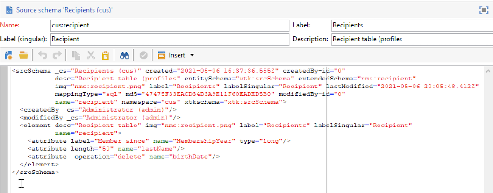

# Estender um esquema{#extend-schemas}

Como um usuário técnico, você pode personalizar o datamodel do Campaign para atender às necessidades de sua implementação: adicionar elementos a um schema existente, modificar um elemento em um schema ou excluir elementos.

As principais etapas para personalizar o datamodel do Campaign são:

1. Criar um esquema de extensão
1. Atualizar o banco de dados do Campaign
1. Adapte o formulário de entrada

>[!CAUTION]
>O esquema incorporado não deve ser modificado diretamente. Se precisar adaptar um schema incorporado, é necessário estendê-lo.

 Para obter uma melhor compreensão das tabelas integradas do Campaign e sua interação, consulte [esta página](datamodel.md). Consulte também recomendações ao criar um novo schema em [esta página](create-schema.md).

Para estender um schema, siga as etapas abaixo:

1. Navegue até o **[!UICONTROL Administration > Configuration > Data schemas]** no Explorer.
1. Clique no botão **Novo** e selecione **[!UICONTROL Extend the data in a table using an extension schema]**.

   

1. Identifique o schema incorporado a ser estendido e selecione-o.

   

   Por convenção, nomeie o schema de extensão como o schema incorporado e use um namespace personalizado.  Observe que alguns namespaces são somente internos. [Saiba mais](schemas.md#reserved-namespaces)

   

1. No editor de esquema, adicione os elementos necessários usando o menu contextual e salve.

   

   No exemplo abaixo, adicionamos a variável **MembershipYear** , coloque um limite de comprimento para sobrenome (esse limite substituirá o padrão) e remova a data de nascimento do schema incorporado.

   

   ```
   <srcSchema created="YYYY-MM-DD" desc="Recipient table" extendedSchema="nms:recipient"
           img="nms:recipient.png" label="Recipients" labelSingular="Recipient" lastModified="YYYY-MM-DD"
           mappingType="sql" name="recipient" namespace="cus" xtkschema="xtk:srcSchema">
    <element desc="Recipient table" img="nms:recipient.png" label="Recipients" labelSingular="Recipient" name="recipient">
       <attribute label="Member since" name="MembershipYear" type="long"/>
       <attribute length="50" name="lastName"/>
       <attribute _operation="delete" name="birthDate"/>
   </element>
   </srcSchema>
   ```

1. Desconecte e reconecte ao Campaign para verificar a atualização da estrutura do schema no **[!UICONTROL Structure]** guia .

   

1. Atualize a estrutura do banco de dados para aplicar as alterações. [Saiba mais](update-database-structure.md)

1. Depois que as alterações forem implementadas no banco de dados, você poderá adaptar o formulário de entrada do recipient para tornar suas alterações visíveis. [Saiba mais](forms.md)
