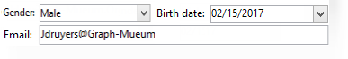
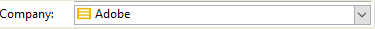

# Introdução aos formulários de entrada{#gs-ac-forms}

Ao criar ou estender um esquema, é necessário criar ou modificar os formulários de entrada associados para tornar essas alterações visíveis para os usuários finais.

Um formulário de entrada permite editar uma instância associada a um schema de dados do console do cliente do Adobe Campaign. O formulário é identificado por seu nome e namespace.

A chave de identificação de um formulário é uma cadeia de caracteres formada pelo namespace e pelo nome separados por dois pontos, por exemplo: &quot;cus:contact&quot;.

## Editar formulários de entrada

Crie e configure formulários de entrada do **[!UICONTROL Administration]> [!UICONTROL Configuration] >[!UICONTROL Input forms]** pasta do console do cliente:


A zona de edição permite inserir o conteúdo XML do formulário de entrada:


A pré-visualização gera uma exibição do formulário de entrada:


## Estrutura do formulário

A descrição de um formulário é um documento XML estruturado que está de acordo com a gramática do esquema de formulário **xtk:form**.

O documento XML do formulário de entrada deve conter a `<form>` elemento raiz com o  **name** e  **namespace** atributos para preencher o nome e o namespace do formulário.

```
<form name="form_name" namespace="name_space">
...
</form>
```

Por padrão, um formulário é associado ao schema de dados com o mesmo nome e namespace. Para associar um formulário a um nome diferente, defina o **entity-schema** atributo de `<form>` elemento ao nome da chave do schema. Para ilustrar a estrutura de um formulário de entrada, descrevamos uma interface usando o schema de exemplo &quot;cus:recipient&quot;:

```
<srcSchema name="recipient" namespace="cus">
  <enumeration name="gender" basetype="byte">    
    <value name="unknown" label="Not specified" value="0"/>    
    <value name="male" label="Male" value="1"/>   
    <value name="female" label="Female" value="2"/>   
  </enumeration>

  <element name="recipient">
    <attribute name="email" type="string" length="80" label="Email" desc="E-mail address of recipient"/>
    <attribute name="birthDate" type="datetime" label="Date"/>
    <attribute name="gender" type="byte" label="Gender" enum="gender"/>
  </element>
</srcSchema>
```

O formulário de entrada com base no schema de exemplo:


```
<form name="recipient" namespace="cus">
  <input xpath="@gender"/>
  <input xpath="@birthDate"/>
  <input xpath="@email"/>
</form>
```

A descrição dos controles de edição começa no `<form>` elemento raiz. Um controle de edição é inserido em um elemento **`<input>`** com o atributo **xpath** contendo o caminho do campo do schema.

O controle de edição se adapta automaticamente ao tipo de dados correspondente e usa o rótulo definido no schema.

>[!NOTE]
>
>É possível substituir o rótulo definido no schema de dados adicionando o **rótulo** atributo para o `<input>` elemento:\
>`<input label="E-mail address" xpath="@name" />`

Por padrão, cada campo é exibido em uma única linha e ocupa todo o espaço disponível, dependendo do tipo de dados.

 Todos os atributos de formulário estão listados em [Documentação do Campaign Classic v7](https://experienceleague.adobe.com/developer/campaign-api/api/control-Button.html){target="_blank"}.

## Formatação {#formatting}

O layout dos controles se parece com o layout usado em tabelas de HTML, com a possibilidade de dividir um controle em várias colunas, entrelaçar elementos ou especificar a ocupação do espaço disponível. No entanto, lembre-se de que a formatação só permite dividir a área por proporções; não é possível especificar dimensões fixas para um objeto.

Para exibir os controles do exemplo acima em duas colunas:


```
<form name="recipient" namespace="cus">
  <container colcount="2">
    <input xpath="@gender"/>
    <input xpath="@birthDate"/>
    <input xpath="@email"/>
  </container>
</form>
```

A variável **`<container>`** elemento com o **colcount** attribute permite forçar a exibição de controles filho em duas colunas.

A variável **colspan** atributo em um controle estende o controle pelo número de colunas inseridas em seu valor:



```
<form name="recipient" namespace="cus">
  <container colcount="2">
    <input xpath="@gender"/>
    <input xpath="@birthDate"/>
    <input xpath="@email" colspan="2"/>
  </container>
</form> 
```

Ao preencher o **type=&quot;frame&quot;** atributo, o contêiner adiciona um quadro ao redor dos controles filho com o rótulo contido no **rótulo** atributo:


```
<form name="recipient" namespace="cus">
  <container colcount="2" type="frame" label="General">
    <input xpath="@gender"/>
    <input xpath="@birthDate"/>
    <input xpath="@email" colspan="2"/>
  </container>
</form>
```

A **`<static>`** O elemento pode ser usado para formatar o formulário de entrada:


```
<form name="recipient" namespace="cus">
  <static type="separator" colspan="2" label="General"/>
  <input xpath="@gender"/>
  <input xpath="@birthDate"/>
  <input xpath="@email" colspan="2"/>
  <static type="help" label="General information about recipient with date of birth, gender, and e-mail address." colspan="2"/>
</form>
```

A variável **`<static>`** com a tag **separador** type permite adicionar uma barra separadora com um rótulo contido na variável **rótulo** atributo.

Um texto de ajuda foi adicionado usando o `<static>` com tipo de ajuda. O conteúdo do texto é inserido no campo **rótulo** atributo.

## Usar contêineres {#containers}

Uso **contêineres** para agrupar um conjunto de controles. Eles são representados pela **`<container>`** elemento. Eles foram usados acima para formatar controles em várias colunas.

A variável **xpath** atributo em um `<container>` permite simplificar a referência de controles filho. A referência dos controles é então relativa ao pai `<container>` pai.

Exemplo de um contêiner sem &quot;xpath&quot;:

```
<container colcount="2">
  <input xpath="location/@zipCode"/>
  <input xpath="location/@city"/>
</container>
```

Exemplo com a adição de &quot;xpath&quot; ao elemento chamado &quot;location&quot;:

```
<container colcount="2" xpath="location">
  <input xpath="@zipCode"/>
  <input xpath="@city"/>
</container>
```

Os containers são usados para construir controles complexos usando um conjunto de campos formatados em páginas.

### Adicionar guias (bloco de anotações) {#tab-container}

Use um **notebook** container para formatar dados em páginas que podem ser acessadas a partir de guias.


```
<container type="notebook">
  <container colcount="2" label="General">
    <input xpath="@gender"/>
    <input xpath="@birthDate"/>
    <input xpath="@email" colspan="2"/>
  </container>
  <container colcount="2" label="Location">
    ...
  </container>
</container>
```

O container principal é definido pela variável **type=&quot;notebook&quot;** atributo. As guias são declaradas nos contêineres filhos e o rótulo das guias é preenchido nas **rótulo** atributo.

Adicione o **style=&quot;down&quot;** para forçar o posicionamento vertical dos rótulos de tabulação abaixo do controle. Este atributo é opcional. O valor padrão é **&quot;para cima&quot;**.


`<container style="down" type="notebook">  ... </container>`

### Adicionar ícones (caixa de ícones) {#icon-list}

Use este contêiner para exibir uma barra de ícones vertical que permite selecionar as páginas a serem exibidas.


```
<container type="iconbox">
  <container colcount="2" label="General" img="xtk:properties.png">
    <input xpath="@gender"/>
    <input xpath="@birthDate"/>
    <input xpath="@email" colspan="2"/>
  </container>
  <container colcount="2" label="Location" img="nms:msgfolder.png">
    ...
  </container>
</container>
```

O container principal é definido pela variável **type=&quot;iconbox&quot;** atributo. As páginas associadas aos ícones são declaradas nos contêineres filho. O rótulo dos ícones é preenchido com o **rótulo** atributo.

O ícone de uma página é preenchido a partir de `img="<image>"` atributo, onde `<image>` é o nome da imagem correspondente à sua chave, composto pelo nome e pelo namespace (por exemplo, &quot;xtk:properties.png&quot;).

As imagens estão disponíveis no **[!UICONTROL Administration > Configuration > Images]** nó.

### Ocultar contêineres (visibleGroup) {#visibility-container}

Você pode ocultar um conjunto de controles por meio de uma condição dinâmica.

Este exemplo ilustra a visibilidade dos controles no valor do campo &quot;Gênero&quot;:

```
<container type="visibleGroup" visibleIf="@gender=1">
  ...
</container>
<container type="visibleGroup" visibleIf="@gender=2">
  ...
</container>
```

Um container de visibilidade é definido pelo atributo **type=&quot;visibleGroup&quot;**. A variável **visibleIf** O atributo contém a condição de visibilidade.

Exemplos de sintaxe de condição:

* **visibleIf=&quot;@email=&#39;peter.martinezATneeolane.net&#39;&quot;**: testa a igualdade nos dados do tipo string. O valor de comparação deve estar entre aspas.
* **visibleIf=&quot;@gender >= 1 e @gender != 2&quot;**: condição em um valor numérico.
* **visibleIf=&quot;@boolean1=true ou @boolean2=false&quot;**: teste em campos booleanos.

### Exibição condicional (enabledGroup) {#enabling-container}

Esse container permite ativar ou desativar um conjunto de dados de uma condição dinâmica. Desabilitar um controle impede que ele seja editado. O exemplo a seguir ilustra a ativação de controles a partir do valor do campo &quot;Gênero&quot;:

```
<container type="enabledGroup" enabledIf="@gender=1">
  ...
</container>
<container type="enabledGroup" enabledIf="@gender=2">
  ...
</container>
```

Um contêiner de ativação é definido pelo **type=&quot;enabledGroup&quot;** atributo. A variável **enabledIf** o atributo contém a condição de ativação.

## Editar um link {#editing-a-link}

Lembre-se de que um link é declarado no schema de dados da seguinte maneira:

```
<element label="Company" name="company" target="cus:company" type="link"/>
```

O controle de edição do link em seu formulário de entrada é o seguinte:



```
<input xpath="company"/>
```

A seleção de público-alvo pode ser acessada por meio do campo de edição. A entrada é assistida pelo tipo antecipado, para que um elemento de destino possa ser facilmente encontrado a partir dos primeiros caracteres inseridos. A pesquisa é então baseada no **String de cálculo** definido no schema de target. Se o schema não existir após a validação no controle, uma mensagem de confirmação da criação do target em tempo real será exibida. A confirmação cria um novo registro na tabela de target e o associa ao link.

Uma lista suspensa é usada para selecionar um elemento target na lista de registros já criados.

A variável **[!UICONTROL Modify the link]** (pasta) ícone inicia um formulário de seleção com a lista de elementos direcionados e uma zona de filtro.

A variável **[!UICONTROL Edit link]** (lente de aumento) inicia o formulário de edição do elemento vinculado. O formulário usado é deduzido por padrão na chave do schema direcionado. A variável **formulário** attribute permite forçar o nome do formulário de edição (por exemplo, &quot;cus:company2&quot;).

Você pode restringir a escolha de elementos de target adicionando a variável **`<sysfilter>`** elemento da definição do link no formulário de entrada:

```
<input xpath="company">
  <sysFilter>
    <condition expr="[location/@city] =  'Newton"/>
  </sysFilter>
</input>
```

Também é possível classificar a lista com a variável **`<orderby>`** elemento:

```
<input xpath="company">
  <orderBy>
    <node expr="[location/@zipCode]"/>
  </orderBy>
</input>
```

## Propriedades de controle {#control-properties}

* **noAutoComplete**: desativa a digitação antecipada (com o valor &quot;true&quot;)
* **createMode**: cria o link em tempo real, se ele não existir. Os valores possíveis são:

   * **nenhum**: desativa a criação. Uma mensagem de erro será exibida se o link não existir
   * **em linha**: cria o link com o conteúdo no campo de edição
   * **edição**: exibe o formulário de edição no link. Quando o formulário for validado, os dados serão salvos (modo padrão)

* **noZoom**: nenhum formulário de edição no link (com o valor &quot;true&quot;)
* **formulário**: sobrecarrega o formulário de edição do elemento direcionado

## Adicionar uma lista de links (não vinculados) {#list-of-links}

Um link inserido no schema de dados como um elemento de coleção (unbound=&quot;true&quot;) deve passar por uma lista para exibir todos os elementos associados a ele.

O princípio consiste em exibir a lista de elementos vinculados com carregamento de dados otimizado (download por lote de dados, execução da lista somente se estiver visível).

Exemplo de um link de coleção em um esquema:

```
<element label="Events" name="rcpEvent" target="cus:event" type="link" unbound="true">
...
</element>
```

A lista em seu formulário de entrada:

```
 <input xpath="rcpEvent" type="linklist">
  <input xpath="@label"/>
  <input xpath="@date"/>
</input>
```

O controle de lista é definido pelo **type=&quot;linklist&quot;** atributo. O caminho da lista deve fazer referência ao link da coleção.

As colunas são declaradas por meio da variável **`<input>`** elementos da lista. A variável **xpath** atributo refere-se ao caminho do campo no schema de público-alvo.

Uma barra de ferramentas com um rótulo (definido no link no schema) é colocada automaticamente acima da lista.

A lista pode ser filtrada por meio do **[!UICONTROL Filters]** e configurado para adicionar e classificar as colunas.

A variável **[!UICONTROL Add]** e **[!UICONTROL Delete]** Os botões permitem adicionar e excluir elementos de coleção no link. Por padrão, adicionar um elemento inicia o formulário de edição do schema de destino.

A variável **[!UICONTROL Detail]** é adicionado automaticamente quando a variável **zoom=&quot;true&quot;** o atributo é concluído em **`<input>`** tag da lista: permite iniciar o formulário de edição da linha selecionada.

A filtragem e a classificação podem ser aplicadas quando a lista está sendo carregada:

```
 <input xpath="rcpEvent" type="linklist">
  <input xpath="@label"/>
  <input xpath="@date"/>
  <sysFilter>
    <condition expr="@type = 1"/>
  </sysFilter>
  <orderBy>
    <node expr="@date" sortDesc="true"/>
  </orderBy>
</input>
```

## Definir uma tabela de relacionamento {#relationship-table}

Uma tabela de relação permite vincular duas tabelas com cardinalidade N-N. A tabela de relacionamento contém apenas os links para as duas tabelas.

A adição de um elemento à lista deve, portanto, permitir que você complete uma lista de um dos dois links na tabela de relacionamento.

Exemplo de uma tabela de relação em um esquema:

```
<srcSchema name="subscription" namespace="cus">
  <element name="recipient" type="link" target="cus:recipient" label="Recipient"/>
  <element name="service" type="link" target="cus:service" label="Subscription service"/>
</srcSchema>
```

Para nosso exemplo, começamos com o formulário de entrada do schema &quot;cus:recipient&quot;. A lista deve exibir as associações com assinaturas para serviços e permitir que você adicione uma assinatura selecionando um serviço existente.


```
<input type="linklist" xpath="subscription" xpathChoiceTarget="service" xpathEditTarget="service" zoom="true">
  <input xpath="recipient"/>
  <input xpath="service"/>
</input>
```

A variável **xpathChoiceTarget** attribute permite iniciar um formulário de seleção no link inserido. A criação do registro da tabela de relacionamento atualizará automaticamente o link para o recipient atual e o serviço selecionado.

>[!NOTE]
>
>A variável **xpathEditTarget** attribute permite forçar a edição da linha selecionada no link inserido.

### Propriedades da lista {#list-properties}

* **noToolbar**: oculta a barra de ferramentas (com o valor &quot;true&quot;)
* **toolbarCaption**: sobrecarrega o rótulo da barra de ferramentas
* **barraDeFerramentasAlinhar**: modifica a geometria vertical ou horizontal da barra de ferramentas (valores possíveis: &quot;vertical&quot;|&quot;horizontal&quot;)
* **img**: exibe a imagem associada à lista
* **formulário**: sobrecarrega o formulário de edição do elemento direcionado
* **zoom**: adiciona o **[!UICONTROL Zoom]** botão para editar o elemento direcionado
* **xpathEditTarget**: define a edição no link inserido
* **xpathChoiceTarget**: para adição, inicia o formulário de seleção no link inserido

## Adicionar controles de lista de memória {#memory-list-controls}

As listas de memória permitem editar os elementos de coleção usando o pré-carregamento de dados de lista. Esta lista não pode ser filtrada nem configurada.

Essas listas são usadas em elementos de coleção mapeados XML ou em links de baixo volume.

## Adicionar uma lista de colunas {#column-list}

Este controle exibe uma lista de colunas editável com uma barra de ferramentas contendo os botões Adicionar e Excluir.

```
<input xpath="rcpEvent" type="list">
  <input xpath="@label"/>
  <input xpath="@date"/>
</input>
```

O controle de lista deve ser preenchido com o atributo **type=&quot;list&quot;** e o caminho da lista deve se referir ao elemento de coleção.

As colunas são declaradas no filho **`<input>`** da lista. O rótulo e o tamanho da coluna podem ser forçados com o **rótulo** e **colSize** atributos.

>[!NOTE]
>
>As setas de ordem de classificação são adicionadas automaticamente quando a variável **ordered=&quot;true&quot;** O atributo é adicionado ao elemento de coleção no schema de dados.

Os botões da barra de ferramentas podem ser alinhados horizontalmente:

```
<input nolabel="true" toolbarCaption="List of events" type="list" xpath="rcpEvent" zoom="true">
  <input xpath="@label"/>
  <input xpath="@date"/>
</input>
```

A variável **toolbarCaption** attribute força o alinhamento horizontal da barra de ferramentas e insere o título acima da lista.

### Ativar o zoom em uma lista {#zoom-in-a-list}

A inserção e a edição de dados em uma lista podem ser inseridas em um formulário de edição separado.

```
<input nolabel="true" toolbarCaption="List of events" type="list" xpath="rcpEvent" zoom="true" zoomOnAdd="true">
  <input xpath="@label"/>
  <input xpath="@date"/>

  <form colcount="2" label="Event">
    <input xpath="@label"/>
    <input xpath="@date"/>
  </form>
</input>
```

O formulário de edição é preenchido no `<form>`  elemento na definição da lista. Sua estrutura é idêntica à de um formulário de entrada. A variável **[!UICONTROL Detail]** é adicionado automaticamente quando a variável **zoom=&quot;true&quot;** o atributo é concluído em **`<input>`** da lista. Este atributo permite iniciar o formulário de edição da linha selecionada.

>[!NOTE]
>
>Adicionar o **zoomOnAdd=&quot;true&quot;** attribute força o formulário de edição a ser chamado quando um elemento list for inserido.

### Propriedades da lista {#list-properties-1}

* **noToolbar**: oculta a barra de ferramentas (com o valor &quot;true&quot;)
* **toolbarCaption**: sobrecarrega o rótulo da barra de ferramentas
* **barraDeFerramentasAlinhar**: modifica o posicionamento da barra de ferramentas (valores possíveis: &quot;vertical&quot;|&quot;horizontal&quot;)
* **img**: exibe a imagem associada à lista
* **formulário**: sobrecarrega o formulário de edição do elemento direcionado
* **zoom**: adiciona o **[!UICONTROL Zoom]** botão para editar o elemento direcionado
* **zoomOnAdd**: inicia o formulário de edição na adição
* **xpathChoiceTarget**: para adição, inicia o formulário de seleção no link inserido

## Adicionar campos não editáveis {#non-editable-fields}

Para exibir um campo e evitar que ele seja editado, use o **`<value>`** ou preencha o **readOnly=&quot;true&quot;** atributo no **`<input>`** tag.

Exemplo no campo &quot;Sexo&quot;:


```
<value value="@gender"/>
<input xpath="@gender" readOnly="true"/>
```

## Adicionar botão de opção {#radio-button}

Um botão de opção permite escolher entre várias opções. A variável **`<input>`** tags são usadas para listar as opções possíveis e as **checkedValue** attribute especifica o valor associado à escolha.

Exemplo no campo &quot;Sexo&quot;:

```
<input type="RadioButton" xpath="@gender" checkedValue="0" label="Choice 1"/>
<input type="RadioButton" xpath="@gender" checkedValue="1" label="Choice 2"/>
<input type="RadioButton" xpath="@gender" checkedValue="2" label="Choice 3"/>
```


## Adicionar uma caixa de seleção {#checkbox}

Uma caixa de seleção reflete um estado booleano (selecionado ou não). Por padrão, esse controle é usado por campos &quot;Booleano&quot; (true/false). Uma variável que assume um valor padrão de 0 ou 1 pode ser associada a esse botão. Esse valor pode ser sobrecarregado por meio da variável **checkValue** atributos.

```
<input xpath="@boolean1"/>
<input xpath="@field1" type="checkbox" checkedValue="Y"/>
```


## Editar hierarquia de navegação {#navigation-hierarchy-edit}

Este controle cria uma árvore em um conjunto de campos a serem editados.

Os controles a serem editados são agrupados em um **`<container>`** inscrito sob o **`<input>`** tag do controle de árvore:

```
<input nolabel="true" type="treeEdit">
  <container label="Text fields">
    <input xpath="@text1"/>
    <input xpath="@text2"/>
  </container>
  <container label="Boolean fields">
    <input xpath="@boolean1"/>
    <input xpath="@boolean2"/>
  </container>
</input>
```


## Adicionar um campo de expressão {#expression-field}

Um campo de expressão atualiza dinamicamente um campo a partir de uma expressão; a variável **`<input>`** é usada com um **xpath** atributo para inserir o caminho do campo a ser atualizado e uma **expr** atributo que contém a expressão de atualização.

```
<!-- Example: updating the boolean1 field from the value contained in the field with path /tmp/@flag -->
<input expr="Iif([/tmp/@flag]=='On', true, false)" type="expr" xpath="@boolean1"/>
<input expr="[/ignored/@action] == 'FCP'" type="expr" xpath="@launchFCP"/>
```

## Contexto de formulários {#context-of-forms}

A execução de um formulário de entrada inicializa um documento XML contendo os dados da entidade que está sendo editada. Este documento representa o contexto do formulário e pode ser usado como um espaço de trabalho.

### Atualizar o contexto {#updating-the-context}

Para modificar o contexto do formulário, use o `<set expr="<value>" xpath="<field>"/>` tag, onde `<field>` é o campo de destino e `<value>` é a expressão ou o valor de atualização.

Exemplos de uso do `<set>` tag:

* **`<set expr="'Test'" xpath="/tmp/@test" />`**: posiciona o valor &#39;Test&#39; no local temporário /tmp/@test1
* **`<set expr="'Test'" xpath="@lastName" />`**: atualiza a entidade no atributo &quot;lastName&quot; com o valor &quot;Test&quot;
* **`<set expr="true" xpath="@boolean1" />`**: define o valor do campo &quot;boolean1&quot; como &quot;true&quot;
* **`<set expr="@lastName" xpath="/tmp/@test" />`**: atualizações com o conteúdo do atributo &quot;lastName&quot;

O contexto do formulário pode ser atualizado ao inicializar e fechar o formulário por meio do **`<enter>`** e **`<leave>`** específicos.

```
<form name="recipient" namespace="cus">
  <enter>
    <set...
  </enter>
  ...
  <leave>
    <set...
  </leave>
</form>
```

>[!NOTE]
>
>A variável `<enter>`  e  `<leave>`   tags podem ser usadas na variável `<container>` de páginas (tipos &quot;bloco de anotações&quot; e &quot;caixa de ícones&quot;).

### Linguagem de expressão {#expression-language-}

Uma linguagem macro pode ser usada na definição do formulário para executar testes condicionais.

A variável **`<if expr="<expression>" />`** A tag executa as instruções especificadas na tag se a expressão for verificada:

```
<if expr="([/tmp/@test] == 'Test' or @lastName != 'Doe') and @boolean2 == true">
  <set xpath="@boolean1" expr="true"/>
</if>
```

A variável **`<check expr="<condition>" />`** tag combinada com a tag **`<error>`** A tag impede a validação do formulário e exibe uma mensagem de erro se a condição não for atendida:

```
<leave>
  <check expr="/tmp/@test != ''">
    <error>You must populate the 'Test' field!</error> 
  </check>
</leave>
```

## Assistente (assistente) {#wizards}

Um assistente orienta você sobre um conjunto de etapas de entrada de dados no formato de páginas. Os dados inseridos são salvos quando você valida o formulário.

Para adicionar um assistente, use o seguinte tipo de estrutura:

```
<form type="wizard" name="example" namespace="cus" img="nms:rcpgroup32.png" label="Wizard example" entity-schema="nms:recipient">
  <container title="Title of page 1" desc="Long description of page 1">
    <input xpath="@lastName"/>
    <input xpath="comment"/>
  </container>
  <container title="Title of page 2" desc="Long description of page 2">
    ...
  </container>
  ...
</form>
```

A presença da **type=&quot;wizard&quot;** atributo no `<form>` element permite definir o modo do assistente na construção do formulário. As páginas são concluídas em `<container>` elementos, que são filhos de `<form>` elemento. A variável `<container>` O elemento de uma página é preenchido com os atributos de título do título e desc para exibir a descrição sob o título da página. A variável **[!UICONTROL Previous]** e **[!UICONTROL Next]** Os botões são adicionados automaticamente para permitir a navegação entre páginas.

A variável **[!UICONTROL Finish]** salva os dados inseridos e fecha o formulário.

### Métodos SOAP {#soap-methods}

A execução do método SOAP pode ser iniciada a partir de um **`<leave>`** no final de uma página.

A variável **`<soapcall>`** A tag contém a chamada para o método com os seguintes parâmetros de entrada:

```
<soapCall name="<name>" service="<schema>">
  <param type="<type>" exprIn="<xpath>"/>  
  ...
</soapCall>
```

O nome do serviço e seu schema de implementação são inseridos por meio do **name** e **serviço** atributos de **`<soapcall>`** tag.

Os parâmetros de entrada são descritos na **`<param>`** elementos sob o **`<soapcall>`** tag.

O tipo de parâmetro deve ser especificado por meio de **type** atributo. Os tipos possíveis são os seguintes:

* **string**: cadeia de caracteres
* **booleano**: Booleano
* **byte**: inteiro de 8 bits
* **curto**: inteiro de 16 bits
* **long**: inteiro de 32 bits
* **curto**: inteiro de 16 bits
* **duplo**: número de ponto flutuante de precisão dupla
* **DOMElement**: nó do tipo elemento

A variável **exprIn** O atributo contém a localização dos dados que serão transmitidos como parâmetro.

**Exemplo**:

```
<leave>
  <soapCall name="RegisterGroup" service="nms:recipient">         
    <param type="DOMElement" exprIn="/tmp/entityList"/>         
    <param type="DOMElement" exprIn="/tmp/choiceList"/>         
    <param type="boolean"    exprIn="true"/>       
  </soapCall>
</leave>
```
