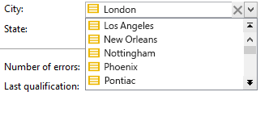
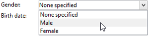

# Estrutura de schema{#schema-structure}

A estrutura básica de um `<srcschema>` é a seguinte:

```
<srcSchema>
    <enumeration>
        ...          //definition of enumerations
    </enumeration>
   
    <element>         //definition of the root <element>    (mandatory)

        <compute-string/>  //definition of a compute-string
        <key>
            ...        //definition of keys
        </key>
        <sysFilter>
            ...           //definition of filters
        </sysFilter>
        <attribute>
            ...             //definition of fields
        </attribute>
    
            <element>           //definition of sub-<element> 
                  <attribute>           //(collection, links or XML)
                  ...                         //and additional fields
                  </attribute>
                ...
            </element>
      
    </element> 

        <methods>                 //definition of SOAP methods
            <method>
                ...
            </method>
            ...
    </methods>  
          
</srcSchema>
```

O documento XML de um schema de dados deve conter o **`<srcschema>`** elemento raiz com os atributos **name** e **namespace** para preencher o nome e o namespace do schema.

```
<srcSchema name="schema_name" namespace="namespace">
...
</srcSchema>
```

Vamos usar o seguinte conteúdo XML para ilustrar a estrutura de um schema de dados:

```
<recipient email="John.doe@aol.com" created="AAAA/DD/MM" gender="1"> 
  <location city="London"/>
</recipient>
```

Com o schema de dados correspondente:

```
<srcSchema name="recipient" namespace="cus">
  <element name="recipient">
    <attribute name="email"/>
    <attribute name="created"/>
    <attribute name="gender"/>
    <element name="location">
      <attribute name="city"/>
   </element>
  </element>
</srcSchema>
```

## Descrição {#description}

O ponto de entrada do schema é seu elemento principal. É fácil identificar porque ele tem o mesmo nome do schema e deve se originar do elemento raiz. A descrição do conteúdo começa com esse elemento.

No nosso exemplo, o elemento principal é representado pela seguinte linha:

```
<element name="recipient">
```

Os elementos **`<attribute>`** e **`<element>`** que seguem o elemento principal permitem definir os locais e nomes dos itens de dados na estrutura XML.

Em nosso schema de amostra, eles são:

```
<attribute name="email"/>
<attribute name="created"/>
<attribute name="gender"/>
<element name="location">
  <attribute name="city"/>
</element>
```

Devem ser respeitadas as seguintes regras:

* Cada **`<element>`** e **`<attribute>`** devem ser identificadas por nome por meio do atributo **name**.

   >[!CAUTION]
   >
   >O nome do elemento deve ser conciso, de preferência em inglês, e incluir somente caracteres autorizados de acordo com as regras de nomenclatura XML.

* Somente elementos **`<element>`** podem conter elementos **`<attribute>`** e elementos **`<element>`** na estrutura XML.
* Um elemento **`<attribute>`** deve ter um nome exclusivo em um **`<element>`**.
* Recomenda-se o uso de **`<elements>`** em sequências de dados de várias linhas.

## Tipos de dados {#data-types}

O tipo de dados é inserido por meio do atributo **type** nos elementos **`<attribute>`** e **`<element>`**.

Uma lista detalhada está disponível em [Campaign Classic documentation](https://experienceleague.adobe.com/docs/campaign-classic/using/configuring-campaign-classic/schema-reference/elements-attributes/schema-introduction.html?lang=en#configuring-campaign-classic).

Quando esse atributo não é preenchido, **string** é o tipo de dados padrão, a menos que o elemento contenha elementos filho. Se isso acontecer, ele será usado apenas para estruturar os elementos hierarquicamente (**`<location>`** elemento em nosso exemplo).

Os seguintes tipos de dados são aceitos em schemas:

* **string**: sequência de caracteres. Exemplos: um nome, uma cidade etc.

   O tamanho pode ser especificado por meio do atributo **length** (opcional, valor padrão &quot;255&quot;).

* **booleano**: Campo booleano. Exemplo de valores possíveis: true/false, 0/1, sim/não, etc.
* **byte**,  **curto**,  **longo**: inteiros (1 byte, 2 bytes, 4 bytes). Exemplos: uma idade, um número de conta, um número de pontos, etc.
* **double**: número de ponto flutuante de precisão dupla. Exemplos: um preço, uma taxa, etc.
* **data**,  **data e hora**: datas e datas + horas. Exemplos: uma data de nascimento, uma data de compra etc.
* **datetimenotz**: data + hora sem dados de fuso horário.
* **intervalo de tempo**: durações. Exemplo: senioridade.
* **memorando**: campos de texto longos (várias linhas). Exemplos: uma descrição, um comentário etc.
* **uuid**: campos &quot;uniqueidentifier&quot;

   >[!NOTE]
   >
   >Para conter um campo **uuid**, a função &quot;newuuid()&quot; deve ser adicionada e concluída com seu valor padrão.

Este é o nosso schema de exemplo com os tipos inseridos:

```
<srcSchema name="recipient" namespace="cus">
  <element name="recipient">
    <attribute name="email" type="string" length="80"/>
    <attribute name="created" type="datetime"/>
    <attribute name="gender" type="byte"/>
    <element name="location">
      <attribute name="city" type="string" length="50"/>
   </element>
  </element>
</srcSchema>
```

## Propriedades {#properties}

Os elementos **`<elements>`** e **`<attributes>`** do schema de dados podem ser enriquecidos com várias propriedades. Você pode preencher um rótulo para descrever o elemento atual.

### Rótulos e descrições {#labels-and-descriptions}

* A propriedade **label** permite inserir uma breve descrição.

   >[!NOTE]
   >
   >O rótulo está associado ao idioma atual da instância.

   **Exemplo**:

   ```
   <attribute name="email" type="string" length="80" label="Email"/>
   ```

   O rótulo pode ser visto no formulário de entrada do console do cliente do Adobe Campaign:

   

* A propriedade **desc** permite inserir uma descrição longa.

   A descrição pode ser vista no formulário de entrada na barra de status da janela principal do console do cliente do Adobe Campaign.

   >[!NOTE]
   >
   >A descrição está associada ao idioma atual da instância.

   **Exemplo**:

   ```
   <attribute name="email" type="string" length="80" label="Email" desc="Email of recipient"/>
   ```

### Valores padrão {#default-values}

A propriedade **default** permite definir uma expressão que retorna um valor padrão na criação de conteúdo.

O valor deve ser uma expressão compatível com a linguagem XPath. Para obter mais informações, consulte [esta seção](#reference-with-xpath).

**Exemplo**:

* Data atual: **default=&quot;GetDate()&quot;**
* Contador: **default=&quot;&#39;FRM&#39;+CounterValue(&#39;myCounter&#39;)&quot;**

   Neste exemplo, o valor padrão é construído usando a concatenação de uma string e chamando a função **CounterValue** com um nome de contador gratuito. O número retornado é incrementado em um em cada inserção.

   >[!NOTE]
   >
   >No console do cliente Adobe Campaign, o nó **[!UICONTROL Administration>Counters]** é usado para gerenciar contadores.

Para vincular um valor padrão a um campo, é possível usar o `<default>  or  <sqldefault>   field.  </sqldefault> </default>`

`<default>` : permite preencher previamente o campo com um valor padrão ao criar entidades. O valor não será um valor SQL padrão.

`<sqldefault>` : permite ter um valor adicionado ao criar um campo. Esse valor aparece como um resultado SQL. Durante uma atualização do schema, somente os novos registros serão afetados por esse valor.

### Enumerações {#enumerations}

#### Enumeração livre {#free-enumeration}

A propriedade **userEnum** permite definir uma enumeração livre para memorizar e exibir os valores inseridos por meio desse campo. A sintaxe é a seguinte:

**userEnum=&quot;nome da enumeração&quot;**

O nome dado à enumeração pode ser escolhido livremente e compartilhado com outros campos.

Esses valores são mostrados em uma lista suspensa do formulário de entrada:



>[!NOTE]
>
>No console do cliente Adobe Campaign, o nó **[!UICONTROL Administration > Enumerations]** é usado para gerenciar enumerações.

#### Definir enumeração {#set-enumeration}

A propriedade **enum** permite definir uma enumeração fixa usada quando a lista de valores possíveis é conhecida antecipadamente.

O atributo **enum** refere-se à definição de uma classe de enumeração preenchida no schema fora do elemento principal.

Enumerações permitem que o usuário selecione um valor em uma lista suspensa em vez de inserir o valor em um campo de entrada regular:



Exemplo de uma declaração de enumeração no schema de dados:

```
<enumeration name="gender" basetype="byte" default="0">    
  <value name="unknown" label="Not specified" value="0"/>    
  <value name="male" label="male" value="1"/>   
  <value name="female" label="female" value="2"/>   
</enumeration>
```

Uma enumeração é declarada fora do elemento principal por meio do elemento **`<enumeration>`** .

As propriedades de enumeração são as seguintes:

* **baseType**: tipo de dados associados aos valores,
* **rótulo**: descrição da enumeração,
* **name**: nome da enumeração,
* **padrão**: valor padrão da enumeração.

Os valores de enumeração são declarados no elemento **`<value>`** com os seguintes atributos:

* **name**: nome do valor armazenado internamente,
* **rótulo**: rótulo exibido por meio da interface gráfica.

#### enumeração dbenum {#dbenum-enumeration}

* A propriedade **dbenum** permite definir uma enumeração cujas propriedades são semelhantes às da propriedade **enum**.

   No entanto, o atributo **name** não armazena o valor internamente, armazena um código que permite estender as tabelas relacionadas sem modificar o schema.

   Os valores são definidos por meio do nó **[!UICONTROL Administration>Enumerations]** .

   Essa enumeração é usada para especificar a natureza das campanhas, por exemplo.

   

### Exemplo {#example}

Este é o nosso exemplo de schema com as propriedades preenchidas:

```
<srcSchema name="recipient" namespace="cus">
  <enumeration name="gender" basetype="byte">    
    <value name="unknown" label="Not specified" value="0"/>    
    <value name="male" label="male" value="1"/>   
    <value name="female" label="female" value="2"/>   
  </enumeration>

  <element name="recipient">
    <attribute name="email" type="string" length="80" label="Email" desc="Email of recipient"/>
    <attribute name="created" type="datetime" label="Date of creation" default="GetDate()"/>
    <attribute name="gender" type="byte" label="gender" enum="gender"/>
    <element name="location" label="Location">
      <attribute name="city" type="string" length="50" label="City" userEnum="city"/>
   </element>
  </element>
</srcSchema>
```

## Coleções {#collections}

Uma coleção é uma lista de elementos com o mesmo nome e o mesmo nível hierárquico.

O atributo **unbound** com o valor &quot;true&quot; permite preencher um elemento de coleção.

**Exemplo**: definição do elemento de  **`<group>`** coleção no schema.

```
<element name="group" unbound="true" label="List of groups">
  <attribute name="label" type="string" label="Label"/>
</element>
```

Com projeção do conteúdo XML:

```
<group label="Group1"/>
<group label="Group2"/>
```

## Referência com XPath {#reference-with-xpath}

A linguagem XPath é usada no Adobe Campaign para referenciar um elemento ou atributo que pertence a um schema de dados.

XPath é uma sintaxe que permite localizar um nó na árvore de um documento XML.

Os elementos são designados pelo nome e os atributos são designados pelo nome precedido pelo caractere &quot;@&quot;.

**Exemplo**:

* **@email**: seleciona o email,
* **location/@city**: seleciona o atributo &quot;cidade&quot; no  **`<location>`** elemento
* **../@email**: seleciona o endereço de email do elemento pai do elemento atual
* **grupo`[1]/@label`**: seleciona o atributo &quot;label&quot; que é filho do primeiro elemento de  **`<group>`** coleção
* **grupo`[@label='test1']`**: seleciona o atributo &quot;label&quot; que é o filho do  **`<group>`** elemento e contém o valor &quot;test1&quot;

>[!NOTE]
>
>Uma restrição adicional é adicionada quando o caminho cruza um subelemento. Nesse caso, a seguinte expressão deve ser colocada entre colchetes:
>
>* **location/@** city não é válido; use  **`[location/@city]`**
>* **`[@email]`** e  **@** emailare equivalente

>


Também é possível definir expressões complexas, como as seguintes operações aritméticas:

* **@gender+1**: adiciona 1 ao conteúdo do atributo  **** gender,
* **@email + &#39;(&#39;+@created+&#39;)**: constrói uma cadeia de caracteres considerando o valor do endereço de email adicionado à data de criação entre parênteses (para o tipo string , coloque a constante entre aspas).

Funções de alto nível foram adicionadas às expressões para enriquecer o potencial desse idioma.

Você pode acessar a lista de funções disponíveis por meio de qualquer editor de expressão no console do cliente do Adobe Campaign:


**Exemplo**:

* **GetDate()**: retorna a data atual
* **Year(@created)**: retorna o ano da data contida no atributo &quot;criado&quot;.
* **GetEmailDomain(@email)**: retorna o domínio do endereço de email.

## Criação de uma cadeia de caracteres por meio da cadeia de caracteres de computação {#building-a-string-via-the-compute-string}

Um **Compute string** é uma expressão XPath usada para criar uma string representando um registro em uma tabela associada ao schema. **A** cadeia de caracteres de computação é usada principalmente na interface gráfica para exibir o rótulo de um registro selecionado.

O **Compute string** é definido por meio do elemento **`<compute-string>`** no elemento principal do schema de dados. Um atributo **expr** contém uma expressão XPath para calcular a exibição.

**Exemplo**: compute a cadeia de caracteres da tabela de recipient.

```
<srcSchema name="recipient" namespace="nms">  
  <element name="recipient">
    <compute-string expr="@lastName + ' ' + @firstName +' (' + @email + ')' "/>
    ...
  </element>
</srcSchema>
```

Resultado da cadeia de caracteres calculada para um recipient: **Doe John (john.doe@aol.com)**

>[!NOTE]
>
>Se o schema não contiver um Cálculo de cadeia de caracteres, um Cálculo de cadeia de caracteres será preenchido por padrão com os valores da chave primária do schema.
